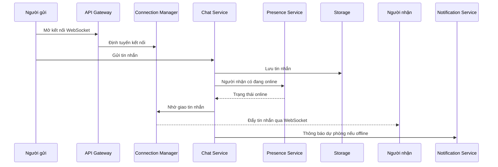

# 🏗️ Chat app — Bước 3: High-level design với các service chuyên trách

> Nguồn: `085-High-Level-Design-Services-APIs-Communication.txt` · [Udemy](https://ua.udemy.com/course/mastering-system-design-from-basics-to-cracking-interviews/learn/lecture/49824341)

Bước 3 là lúc chúng ta chuyển những thách thức đã nhận diện thành **kiến trúc cụ thể**. Một cách tư duy rất hữu ích: **mỗi service tồn tại để giải một bài toán riêng**, thay vì cố nhồi mọi thứ vào một chỗ.

Trong bài này, mình và các bạn sẽ đi qua các service chính, cách **Connection Manager** vận hành ở quy mô lớn, data model cho chat, luồng gửi tin nhắn, và cuối cùng là thiết kế API. Cùng bắt đầu nhé.

---

### 🧩 Các service chính — mỗi thành phần một trách nhiệm

Kiến trúc của chúng ta gồm những service sau, mỗi service giải quyết một vấn đề rõ ràng:

| Service | Trách nhiệm chính |
|---|---|
| **Connection Manager** | Giao tiếp real-time: duy trì hàng triệu kết nối WebSocket, theo dõi user/device đang kết nối, là điểm vào cho instant delivery |
| **Chat Service** | Logic nhắn tin cốt lõi: validate request, lưu tin nhắn, quản lý delivery status, điều phối việc giao tin đến người nhận — đây chính là trái tim của ứng dụng |
| **Presence Service** | Theo dõi ai online, ai offline, ai đang gõ; tối ưu cho đồng bộ real-time nhanh thay vì lưu trữ dài hạn |
| **Notification Service** | Fallback khi real-time không khả thi: người nhận không kết nối hoặc websocket delivery thất bại thì gửi thông báo đẩy |
| **Media Service** | Xử lý ảnh, video, tài liệu — những file lớn hơn text — để scale file storage độc lập, không ảnh hưởng messaging pipeline |
| **Auth & User Service** | Danh tính: xác thực người dùng, quản lý profile, theo dõi thiết bị nào thuộc về người dùng nào |
| **Storage Layer** | Lưu messages, delivery receipts, presence information và media metadata; tối ưu cho khối lượng ghi cao liên tục |
| **Group Service** | Quản lý mọi thứ liên quan đến nhóm: tạo nhóm, duy trì membership — nhờ đó thao tác nhóm không làm phức tạp logic nhắn tin cốt lõi |

Để ý một điều: mỗi thành phần có **trách nhiệm rõ ràng**. Và sự tách bạch này **không chỉ để tổ chức code cho gọn** — nó cho phép **mỗi service scale độc lập theo workload của riêng nó**. Đây là nguyên lý nền tảng mà các bạn sẽ gặp lặp đi lặp lại trong các hệ phân tán quy mô production.

---

### 🔌 Real-time Connection Manager — cửa ngõ của hệ thống chat

**Connection Manager** là **cổng nối giữa người dùng và phần còn lại của hệ thống**. Trách nhiệm chính của nó là **giữ người dùng luôn kết nối** để tin nhắn được giao ngay khi vừa đến.

* Khác với ứng dụng web truyền thống chỉ xử lý request HTTP ngắn, service này duy trì **kết nối WebSocket dài hạn cho mỗi người dùng và mỗi thiết bị đã đăng nhập**. Chỉ cần kết nối còn sống, server có thể **đẩy tin nhắn mới tức thì** mà không cần client hỏi liên tục.
* Khi ai đó gửi tin nhắn, Connection Manager **không phán xét tin nhắn có hợp lệ hay đã được lưu vĩnh viễn chưa** — phần đó thuộc về Chat Service. Nó tập trung vào việc **định tuyến tin nhắn đến đúng kết nối của người nhận nhanh nhất có thể**, phối hợp với **Presence Service** (ai và thiết bị nào đang online) và **Chat Service** (trạng thái nhắn tin).
* Việc mở rộng service này là một thách thức riêng: **một server chỉ giữ được số kết nối WebSocket hữu hạn**, nên phải phân tán người dùng ra nhiều server. Kỹ thuật như **sticky session (giữ phiên cố định trên một server)** giúp giữ kết nối của người dùng trên cùng một máy, còn **Redis cùng PubSub hoặc message queue** cho phép các server khác nhau **giao tiếp và định tuyến tin nhắn trong toàn cluster**.
* Cuối cùng, giao tin **không kết thúc khi tin được gửi đi**: Connection Manager còn **theo dõi delivery acknowledgement, thử gửi lại khi có lỗi tạm thời, và ghi nhận trạng thái giao tin cho từng thiết bị đang kết nối**. Đó là thứ cho phép người dùng chuyển thiết bị mượt mà mà cuộc trò chuyện vẫn nhất quán.

Ý chính ở đây: **service này được tối ưu cho quản lý kết nối và giao tin real-time, không phải cho business logic**. Nhờ tách bạch trách nhiệm, chúng ta có thể scale độc lập hạ tầng giữ hàng triệu kết nối, trong khi logic nhắn tin vẫn gọn gàng và tập trung.

---

### 🗄️ Data model cho direct chat và group chat

Mục tiêu của schema là **lưu hội thoại hiệu quả**, đồng thời hỗ trợ **truy xuất nhanh** và **theo dõi trạng thái tin nhắn đáng tin cậy**. Với direct messaging (nhắn tin 1-1), trung tâm là bảng **direct messages**: mỗi bản ghi là một tin nhắn giữa hai người, gồm **sender ID** (ai gửi), **receiver ID** (người nhận dự định), **message content** (nội dung), **status** (trạng thái `sent`, `delivered` hay `read`) và **timestamp** (bảo toàn thứ tự tạo tin nhắn).

**Group chat** tạo ra một mối quan hệ khác: không chỉ hai người tham gia, mà cần quản lý **bản thân nhóm, các thành viên và tin nhắn trong nhóm**:

| Bảng | Lưu gì | Trường chính |
|---|---|---|
| **Direct messages** | Một tin nhắn trao đổi giữa hai người | Sender ID, receiver ID, content, status, timestamp |
| **Group chat** | Thông tin mỗi nhóm | Tên nhóm, người tạo nhóm |
| **Group members** | Thành viên của nhóm | Cho biết nhanh ai sẽ nhận được tin nhắn |
| **Group messages** | Từng tin nhắn trong nhóm | Group ID xác định cuộc trò chuyện, sender ID xác định người đăng |

Dù direct chat và group chat phục vụ hai use case khác nhau, các bạn sẽ thấy **cấu trúc tin nhắn của chúng cố tình rất giống nhau**: cả hai đều cần lưu **người gửi, nội dung, timestamp và trạng thái giao tin**. Giữ schema nhất quán như vậy giúp **logic ứng dụng đơn giản hơn**, mà vẫn cho phép mỗi loại hội thoại **scale độc lập**.

Bài học quan trọng nhất: **schema phản ánh quan hệ trong business domain**. Direct message nối **một người gửi với một người nhận**, còn group message nối **một người gửi với nhiều người nhận thông qua membership**. Thiết kế data model dựa trên những quan hệ này giúp truy vấn hội thoại, theo dõi trạng thái và bảo toàn thứ tự tin nhắn hiệu quả hơn nhiều.

---

### 🔁 Luồng gửi tin nhắn — direct chat, group chat và sequence diagram

Dù direct chat và group chat trông giống nhau từ góc nhìn người dùng, **logic định tuyến của chúng hơi khác nhau**. Chúng ta bắt đầu với direct chat:

1. Khi người gửi bấm **send**, tin nhắn đến **Chat Service** kèm **user ID của người nhận**. Chat Service chạy business logic rồi **giao tin nhắn cho Connection Manager** để đi giao.
2. Connection Manager trả lời một câu hỏi rất quan trọng: **người nhận hiện đang kết nối ở đâu?** Nó tra **phiên WebSocket đang hoạt động** của người nhận, xác định server đang giữ kết nối đó, và chuyển tin nhắn tới đó.
3. Vì người nhận đã có **kết nối WebSocket mở sẵn**, tin nhắn được **đẩy tức thì** mà không cần chờ thêm request nào. Đó chính là thứ tạo ra trải nghiệm real-time.

**Group chat** đi theo cùng khuôn mẫu nhưng ở quy mô lớn hơn nhiều: người gửi gửi tin nhắn đến **group chat service** kèm **group ID**. Thay vì tra một người nhận duy nhất, service **xác định ai thuộc nhóm đó**, rồi Connection Manager **tìm các kết nối đang hoạt động của tất cả thành viên đang online** và **fan out (tỏa tin) đến mọi kết nối active** — để tất cả người tham gia nhận được gần như ngay lập tức và đồng thời. Khác biệt then chốt: Connection Manager lúc này **định tuyến một tin nhắn đến nhiều người nhận** thay vì chỉ một.

Sequence diagram này gom tất cả service chúng ta đã bàn lại với nhau, cho thấy một tin nhắn đi xuyên hệ thống từ lúc bấm **send** đến lúc tới người nhận. Có hai nhánh đáng chú ý:

* **Fast path (đường nhanh)** — nếu người nhận đang có kết nối WebSocket active, Chat Service phối hợp với Connection Manager để **đẩy tin nhắn ngay qua kết nối sẵn có**. Đây là con đường mang lại trải nghiệm instant messaging.
* **Fallback path (đường dự phòng)** — nếu người nhận **không kết nối**, tin nhắn vẫn được **lưu an toàn**, và **Notification Service** sẽ gửi **push notification** để người dùng biết đang có tin nhắn mới chờ mình.
* Nếu tin nhắn chứa **ảnh, video hay tài liệu**, **Media Service** xử lý những file lớn đó **riêng biệt**: nó quản lý upload và truy xuất, còn hệ thống chat chỉ trao đổi **metadata và tham chiếu cần thiết**.

Điểm quan trọng nhất cần ghi nhớ: **không service nào cố làm mọi thứ**. Chat Service quản lý logic nhắn tin, Connection Manager chuyên giao tin real-time, Presence Service theo dõi trạng thái người dùng, Notification Service lo người dùng offline, Media Service quản lý tệp đính kèm, Group Service điều phối hội thoại nhóm. Cùng nhau, các service chuyên trách này tạo nên một nền tảng nhắn tin **nhanh nhạy, dễ mở rộng và có khả năng chịu lỗi**.

---

### 🛰️ API design — WebSocket cho real-time, REST cho phần còn lại

Một ứng dụng chat hiện đại thường phơi ra **hai mô hình giao tiếp khác nhau**, vì không phải thao tác nào cũng có cùng yêu cầu: có tương tác cần xảy ra tức thì, có tương tác chỉ cần request-response truyền thống.

**Với giao tiếp real-time, chúng ta dùng WebSocket:**

* Cuộc trò chuyện bắt đầu bằng thao tác **Connect** — client thiết lập kết nối thường trực và **xác thực bằng access token**. Sau đó, server có thể **đẩy event về client bất cứ lúc nào** mà không cần chờ request mới.
* Thao tác phổ biến nhất là **Send Message**, nơi client gửi một **payload có cấu trúc** gồm: người nhận, nội dung tin nhắn, timestamp và loại tin nhắn. Vì kết nối đã mở sẵn, các tin nhắn được trao đổi với **độ trễ rất thấp**.
* Cùng kênh đó cũng dùng cho các **event real-time nhẹ** như **message acknowledgment** và **typing indicator** — những event nhỏ, tần suất cao và mang tính tương tác cao.

**Nhưng không phải mọi thứ đều thuộc về kết nối thường trực.** Lấy hội thoại cũ, upload media hay tra cứu thông tin presence **không cần real-time**, nên phù hợp hơn với **REST API** vì chỉ là request-response và xảy ra ít thường xuyên: tin nhắn lịch sử có thể hỗ trợ **pagination (phân trang)** và lọc, upload media có thể **trả về URL** sau khi file được lưu, còn thông tin presence có thể được **truy vấn khi cần**. Tách hai loại workload như vậy giữ cho kết nối WebSocket **tập trung vào việc giao các event real-time**, còn REST xử lý mọi thứ khác hiệu quả.

Cuối cùng, dù dùng giao thức nào, **bảo mật vẫn nhất quán**: mọi request — mở kết nối WebSocket hay gọi REST endpoint — đều phải được **xác thực bằng JWT**. Trên nền authentication đó, **role-based authorization (phân quyền theo vai trò)** đảm bảo người dùng và quản trị viên chỉ truy cập được những thao tác mà họ được phép.

Điểm mấu chốt: **chúng ta không chọn giữa WebSocket và REST, mà dùng mỗi thứ ở nơi nó phù hợp nhất**. WebSocket cung cấp giao tiếp low-latency, hướng sự kiện cho hội thoại trực tiếp; REST API xử lý các thao tác hỗ trợ — cùng nhau tạo nên thiết kế API sạch sẽ và dễ mở rộng cho một ứng dụng chat cấp production.

---

Vậy là chúng ta đã có bản thiết kế high-level: **các service chuyên trách, data model phản ánh đúng quan hệ, luồng gửi tin rõ ràng, và API tách đúng vai WebSocket — REST**. Điều đáng nhớ nhất không phải tên từng service, mà là **nguyên tắc tách bạch trách nhiệm** để mỗi phần có thể phát triển và mở rộng độc lập.

Ở bài tiếp theo, chúng ta sẽ cùng **chọn công nghệ và hạ tầng** đứng sau kiến trúc này — từ message broker, database cho đến cách scale và giám sát hệ thống. Hẹn gặp lại các bạn! 🚀