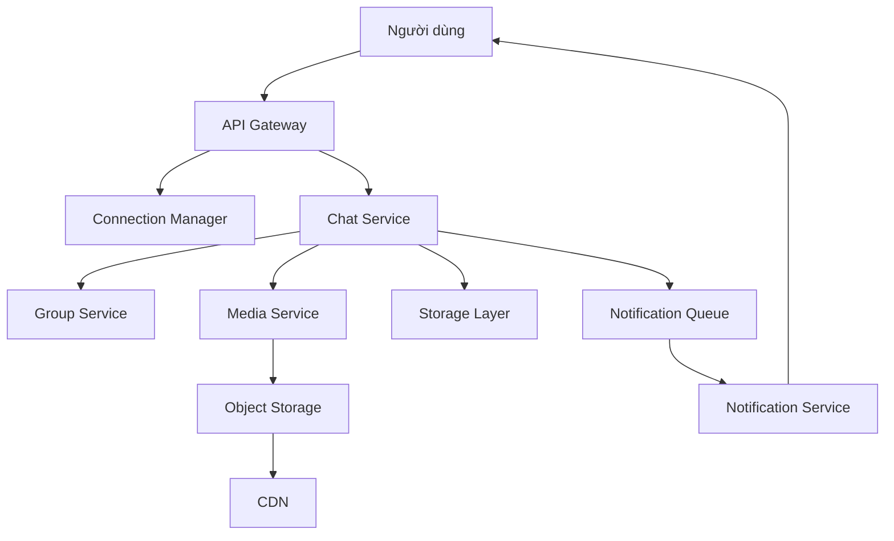

# 🏁 Chat app — Bước 5: Kiến trúc hoàn chỉnh và hành trình end-to-end

> Nguồn: `087-The-Final-Design---Chat-Application.txt` · [Udemy](https://ua.udemy.com/course/mastering-system-design-from-basics-to-cracking-interviews/learn/lecture/49824345)

Chúng ta đã đến kiến trúc cuối cùng của case study. Thay vì nhìn nó như một tập hợp các service rời rạc, hãy xem đây là **một hệ thống hoàn chỉnh**, nơi mỗi thành phần có trách nhiệm rõ ràng và **phối hợp với nhau để mang lại trải nghiệm chat nhanh, đáng tin cậy và dễ mở rộng**.

Mình và các bạn sẽ đi theo hành trình của một tin nhắn — từ lúc người dùng bấm gửi cho đến lúc nó đến đích — rồi điểm qua các thành phần hỗ trợ và tầng lưu trữ phía sau.

---

### 🚪 Hành trình của một tin nhắn — từ client đến người nhận

Hành trình bắt đầu khi người dùng gửi tin nhắn. Tin nhắn đi vào hệ thống qua **API gateway** — **cánh cửa chính cho mọi request từ client**. Ngoài việc **định tuyến traffic đến service phù hợp**, gateway còn **thực thi authentication, rate limiting và load balancing** trước khi chuyển request đi tiếp.

Với giao tiếp real-time, **Connection Manager duy trì kết nối WebSocket thường trực cho mỗi người dùng và mỗi thiết bị**. Điều này cho phép server **đẩy tin nhắn tức thì** thay vì chờ client hỏi lại liên tục. Ở quy mô mục tiêu, **quản lý hàng triệu kết nối đồng thời hiệu quả là một trong những trách nhiệm quan trọng nhất của toàn bộ kiến trúc**.

Tiếp theo, **Chat Service nắm quyền xử lý workflow nhắn tin**: validate tin nhắn đến, lưu chúng vào message store, quản lý trạng thái giao tin và **điều phối xem tin nhắn nên được giao như thế nào**. Nếu là hội thoại nhóm, nó phối hợp với **Group Service** — service duy trì membership và **xác định danh sách người nhận** cho từng tin nhắn.

---

### 🧩 Các thành phần hỗ trợ đằng sau

Song hành cùng các service cốt lõi là những thành phần chuyên trách:

* **Presence Service** liên tục theo dõi **ai đang online, ai offline, ai đang gõ** — tạo nên trải nghiệm tương tác sống động hơn.
* **User Service** quản lý **authentication, profile người dùng và đăng ký thiết bị**, để mọi request luôn gắn với đúng danh tính.
* Khi người dùng trao đổi **hình ảnh, video hay tài liệu**, **Media Service** lưu những file lớn vào **object storage**, nhờ đó **messaging pipeline vẫn nhẹ nhàng**. Media ít được truy cập có thể được phục vụ qua **CDN**, giúp **giảm độ trễ và cải thiện tốc độ tải** cho người dùng ở các khu vực địa lý khác nhau.
* Không phải người nhận nào cũng luôn online. Nếu **không thể giao qua WebSocket real-time**, **Notification Service** sẽ vào cuộc: nó **tiêu thụ event từ notification queue** và gửi **push notification** để người dùng biết có tin nhắn mới đang chờ, **kể cả khi ứng dụng không hoạt động**. Đây cũng chính là phần xử lý **offline message** trong hệ thống.

---

### 🗄️ Tầng lưu trữ chuyên biệt và khả năng chịu lỗi

Phía sau hậu trường, **tầng lưu trữ được tối ưu cho từng loại workload khác nhau**:

* **Relational database** quản lý dữ liệu ứng dụng có cấu trúc.
* **Redis** cung cấp truy cập cực nhanh cho **thông tin tạm thời (transient)** như active session và presence.
* **Object storage** xử lý các file media lớn.

Điểm đáng chú ý: **mỗi công nghệ lưu trữ được chọn dựa trên loại dữ liệu nó quản lý**, thay vì cố ép mọi thứ vào một database duy nhất.

Toàn bộ kiến trúc cũng được thiết kế cho **khả năng chịu lỗi và mở rộng**. **Load balancer phân tán traffic** ra nhiều instance của mỗi service, cho phép từng thành phần **scale theo chiều ngang** khi nhu cầu tăng. Nếu một instance gặp sự cố, **traffic tự động được chuyển hướng sang các instance khỏe mạnh**, giúp nền tảng **vẫn sẵn sàng ngay cả khi có lỗi xảy ra**.

---

### 🎯 Tự kiểm tra nhanh

**Câu 1:** API gateway đảm nhiệm những gì trước khi chuyển request đi tiếp?

<b>Xem đáp án</b>

**Đáp án:** Định tuyến traffic, authentication, rate limiting và load balancing.

Giải thích: Gateway là cánh cửa chính cho mọi request từ client vào hệ thống.

Tham chiếu: Mục Hành trình của một tin nhắn — từ client đến người nhận.

**Câu 2:** Vì sao Connection Manager là một trong những thành phần quan trọng nhất của kiến trúc?

<b>Xem đáp án</b>

**Đáp án:** Vì nó duy trì kết nối WebSocket thường trực cho mọi người dùng và thiết bị, cho phép đẩy tin tức thì.

Giải thích: Ở quy mô mục tiêu, quản lý hàng triệu kết nối đồng thời hiệu quả là trách nhiệm then chốt.

Tham chiếu: Mục Hành trình của một tin nhắn — từ client đến người nhận.

**Câu 3:** Notification Service hoạt động dựa trên cơ chế nào?

<b>Xem đáp án</b>

**Đáp án:** Tiêu thụ event từ notification queue và gửi push notification khi không thể giao real-time.

Giải thích: Người dùng vẫn biết có tin nhắn mới ngay cả khi ứng dụng không hoạt động.

Tham chiếu: Mục Các thành phần hỗ trợ đằng sau.

**Câu 4:** Vì sao media được đưa lên object storage và phục vụ qua CDN?

<b>Xem đáp án</b>

**Đáp án:** Để giữ messaging pipeline nhẹ, giảm độ trễ và tăng tốc tải cho người dùng ở các vùng khác nhau.

Giải thích: Media là file lớn, không nên đi qua luồng tin nhắn thông thường.

Tham chiếu: Mục Các thành phần hỗ trợ đằng sau.

**Câu 5:** Bài học cốt lõi của case study này là gì?

<b>Xem đáp án</b>

**Đáp án:** Phân rã bài toán lớn thành các trách nhiệm rõ ràng để mỗi service giải một bài toán tốt và cộng tác cùng nhau.

Giải thích: Điểm mấu chốt không nằm ở việc chọn một database hay công nghệ nhắn tin cụ thể.

Tham chiếu: Mục Tầng lưu trữ chuyên biệt và khả năng chịu lỗi.

---

Vậy là chúng ta đã đi trọn case study chat application: từ **hiểu bài toán, ước lượng quy mô, thiết kế service, luồng giao tin, chọn công nghệ**, cho đến **kiến trúc hoàn chỉnh end-to-end**. Bài học lớn nhất vẫn là bài học xuyên suốt khóa học: **hiếm khi có thiết kế hoàn hảo — mọi quyết định kiến trúc đều là trade-off**, và giá trị thật nằm ở khả năng phân rã vấn đề thành những trách nhiệm rõ ràng.

Cùng cách tư duy này sẽ được áp dụng cho một bài toán thực tế mới ở section tiếp theo — **thiết kế nền tảng đấu giá trực tuyến**. Hẹn gặp lại các bạn! 🚀
