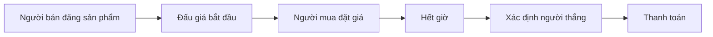

# 🔨 Thiết kế nền tảng đấu giá kiểu eBay — Bước 1: Hiểu bài toán và chốt scope

> Nguồn: `088-Understanding-the-Problem-Defining-the-Scope.txt` · [Udemy](https://ua.udemy.com/course/mastering-system-design-from-basics-to-cracking-interviews/learn/lecture/49837029)

Case study tiếp theo của chúng ta là một bài toán rất thú vị: **thiết kế nền tảng đấu giá trực tuyến quy mô lớn kiểu eBay**. Ở đây, các bạn sẽ thấy những thách thức mà một hệ thống thương mại điện tử thông thường không có: **đấu giá trực tiếp, xử lý đồng thời (concurrency), tính công bằng và độ sẵn sàng cao**.

Giống như mọi case study, chúng ta bắt đầu bằng bước 1: **hiểu thật rõ bài toán và định nghĩa scope** trước khi chạm đến database, API hay scalability. Cùng đi nhé.

---

### 🎯 Nền tảng đấu giá là gì?

Khi nghĩ về nền tảng đấu giá, chúng ta dễ chỉ tập trung vào **hành vi đặt giá**. Nhưng thực tế, nền tảng phải **quản lý toàn bộ quy trình kinh doanh từ đầu đến cuối**: người bán đăng sản phẩm → người mua tìm thấy và đặt giá → hệ thống theo dõi giá cao nhất → cập nhật cho người tham gia theo thời gian thực → đóng phiên đấu giá đúng thời điểm → xác định người thắng công bằng → khởi tạo thanh toán.

Khác với website thương mại điện tử thông thường — nơi giá là cố định — nền tảng đấu giá **để giá biến động theo thời gian** khi nhiều người cùng cạnh tranh cho một món hàng. Chính **sự cạnh tranh đó, kết hợp với thời điểm đóng cố định**, tạo ra **tính cấp bách (urgency)** và thúc đẩy người dùng trả giá cao hơn.

Đằng sau trải nghiệm tưởng chừng đơn giản ấy là một hệ thống phải phối hợp nhiều trách nhiệm quan trọng: quản lý danh sách sản phẩm, tiếp nhận và kiểm tra giá đặt, theo dõi giá cao nhất, cập nhật người tham gia real-time, đóng phiên đấu giá đúng lúc hết giờ, xác định người thắng công bằng và khởi tạo thanh toán.

Thách thức lớn nhất nằm ở chỗ: **mọi thứ diễn ra trong khi rất nhiều người có thể đang đặt giá cùng lúc**. Nền tảng phải đảm bảo **mọi giá hợp lệ đều được ghi nhận chính xác**, **mọi người thấy tiến trình đấu giá nhất quán**, và **giá hợp lệ cao nhất tại thời điểm đóng là người thắng**. Ở đây, **tính công bằng quan trọng không kém tốc độ**.

Mục tiêu tổng thể của nền tảng vì vậy không chỉ là "cho phép đặt giá", mà là **mang lại trải nghiệm đấu giá real-time an toàn, công bằng và dễ mở rộng**, quản lý trọn vẹn vòng đời phiên đấu giá từ lúc đăng bán đến lúc chọn người thắng và xử lý thanh toán. Chính trách nhiệm end-to-end này khiến nền tảng đấu giá trở thành một case study system design tuyệt vời.

---

### ✅ Yêu cầu chức năng

Trước khi nghĩ đến database, API hay khả năng mở rộng, chúng ta cần định nghĩa rõ hệ thống phải làm được gì:

1. **Đăng ký và xác thực người dùng** — cho phép người mua và người bán tạo tài khoản an toàn và truy cập nền tảng.
2. **Tạo phiên đấu giá** — người bán định nghĩa các thông tin như **thời gian bắt đầu, thời gian kết thúc và reserve price (giá tối thiểu)**. Những tham số này quyết định cách phiên đấu giá vận hành và khi nào người dùng được tham gia.
3. **Đặt giá real-time** — người mua cần đặt giá và **biết ngay** liệu mình đang là người trả cao nhất hay đã bị người khác vượt giá. Vì đấu giá mang tính tương tác cao, **cập nhật kịp thời là yếu tố sống còn của trải nghiệm**.
4. **Quản lý vòng đời phiên đấu giá** — mỗi phiên đi qua các trạng thái rõ ràng: **scheduled (đã lên lịch) → active (đang diễn ra) → ended (đã kết thúc)**. Các chuyển trạng thái **diễn ra tự động theo thời gian**, đảm bảo chỉ được đặt giá trong đúng khung thời gian cho phép.
5. **Xử lý thanh toán** — sau khi phiên đấu giá đóng, hệ thống khởi tạo thanh toán qua các nhà cung cấp như **Stripe hoặc PayPal** để giao dịch được hoàn tất an toàn.
6. **Thông báo chủ động** — người dùng không phải liên tục tải lại ứng dụng để biết chuyện gì đang xảy ra. Nền tảng phải **chủ động thông báo khi họ bị vượt giá, khi thắng đấu giá, hoặc khi thanh toán đang chờ hay đã hoàn tất**.

---

### 👥 Các tác nhân chính và use case điển hình

Trước khi thiết kế kiến trúc, việc xác định **những tác nhân (actor) tương tác với nền tảng cùng trách nhiệm của từng người** là rất hữu ích:

| Tác nhân | Vai trò | Kỳ vọng |
|---|---|---|
| **Seller (người bán)** | Tạo danh sách đấu giá, định nghĩa luật chơi: thời lượng, tham số giá | Đăng bán được món hàng cho người trả giá hợp lệ cao nhất |
| **Bidder (người đặt giá)** | Tham gia các phiên đấu giá trực tiếp | Phản hồi tức thì khi bị vượt giá; trải nghiệm nhanh và nhạy |
| **System (hệ thống)** | Thực thi luật đấu giá: xác định thời điểm bắt đầu/kết thúc, kiểm tra giá, theo dõi giá cao nhất, xử lý thanh toán | Toàn bộ quá trình công bằng và nhất quán |
| **Administrator (quản trị viên)** | Vai trò vận hành, không phải giao dịch: giám sát hoạt động, điều tra hành vi đáng ngờ, xử lý gian lận hoặc tranh chấp | Giữ cho marketplace đáng tin cậy |

Hãy cùng đi qua một phiên đấu giá điển hình để thấy các tác nhân phối hợp ra sao: **người bán đăng một chiếc máy chơi game với phiên đấu giá kéo dài 3 ngày**. Khi phiên đấu giá bắt đầu hoạt động, **nhiều người đặt giá cạnh tranh nhau**. Hệ thống **liên tục kiểm tra các mức giá, ghi nhận mức cao nhất và cập nhật cho người tham gia theo thời gian thực**. Khi phiên đấu giá kết thúc, **người trả giá cao nhất được tuyên bố thắng**. Thanh toán được xử lý, và **một khi thanh toán được xác nhận, người bán được thông báo để tiến hành giao hàng**.

Luồng đơn giản này nắm bắt tương tác cốt lõi mà kiến trúc của chúng ta phải hỗ trợ. Khi thiết kế hệ thống, **mỗi thành phần được thêm vào đều phải tồn tại để phục vụ hiệu quả một hoặc nhiều use case trên**.

---

### ⚡ Từ yêu cầu phi chức năng đến thách thức kỹ thuật

Nếu yêu cầu chức năng cho biết hệ thống **làm gì**, thì yêu cầu phi chức năng quyết định **làm tốt đến đâu** — và trong hệ thống quy mô lớn, chúng thường ảnh hưởng đến kiến trúc cuối cùng **mạnh hơn cả yêu cầu chức năng**:

* **Performance (hiệu năng)** — đấu giá cực kỳ nhạy cảm về thời gian. Chúng ta hướng tới **độ trễ dưới một giây (sub-second latency)**, không chỉ khi tiếp nhận giá đặt mà cả khi **broadcast cập nhật**, để mọi người tham gia thấy trạng thái mới nhất mà không có độ trễ đáng chú ý.
* **Scalability (khả năng mở rộng)** — nền tảng phải tiếp tục hoạt động tốt khi **hàng nghìn phiên đấu giá diễn ra đồng thời** và rất nhiều người dùng đang tích cực đặt giá; xử lý traffic tăng lên **mà không làm giảm trải nghiệm**.
* **Security (bảo mật)** — xác thực người dùng an toàn, **bảo vệ thông tin thanh toán nhạy cảm**, và **chống lại bot tự động** — những kẻ có thể thao túng phiên đấu giá hoặc giành lợi thế không công bằng.
* **Availability (độ sẵn sàng)** — hoạt động đấu giá thường **tăng vọt gần thời điểm đóng phiên**. Bất kỳ khoảng downtime nào trong những thời khắc then chốt đều có thể khiến người dùng không đặt được giá hoặc không hoàn tất thanh toán. Hệ thống phải **luôn sẵn sàng kể cả dưới tải đỉnh**.
* **Observability (khả năng quan sát)** — mọi sự kiện quan trọng như giá được đặt, phiên đấu giá kết thúc, thanh toán được xử lý **đều phải được ghi log**. Kết hợp với **giám sát real-time**, đội vận hành mới có thể phát hiện lỗi, điều tra sự cố và giữ nền tảng khỏe mạnh.

Từ những yêu cầu đó, các thách thức kỹ thuật cụ thể hiện ra:

1. **Áp lực real-time** — một số mức giá quan trọng nhất lại đến vào **những giây cuối cùng của phiên đấu giá**. Hệ thống phải xác định chính xác **mức giá nào đến trước**, kể cả khi chúng chỉ cách nhau **vài mili giây**. Xác định sai có thể dẫn đến **tuyên sai người thắng**, ảnh hưởng trực tiếp đến niềm tin của người dùng.
2. **Concurrency (xử lý đồng thời)** — nhiều người có thể đặt giá **gần như cùng thời điểm**, tất cả đều muốn trở thành người trả cao nhất. Nền tảng phải xử lý mà **không có race condition (điều kiện tranh chấp), không xử lý trùng lặp, không cập nhật xung đột** — mọi giá hợp lệ phải được xử lý đúng như mong đợi.
3. **Cập nhật trực tiếp (live updates)** — một phiên đấu giá có thể có **hàng trăm hoặc hàng nghìn người theo dõi**. Mỗi khi giá cao nhất thay đổi, **tất cả mọi người cần thấy gần như ngay lập tức**. Cần một cơ chế hiệu quả để **đẩy sự kiện real-time**, thay vì chỉ dựa vào việc người dùng tải lại trang liên tục.
4. **Thanh toán** — thắng đấu giá chỉ là một phần. Hệ thống còn phải xử lý **thanh toán thất bại, network timeout, retry và gian lận tiềm ẩn**, trong khi vẫn đảm bảo giao dịch đáng tin cậy.
5. **Công bằng và niềm tin** — người dùng chỉ tham gia đấu giá khi tin rằng **các luật chơi được áp dụng nhất quán**. Nền tảng phải chống bot tự động, thực thi đúng luật đấu giá và **xác định người thắng một cách minh bạch**, để mọi người tham gia đều có niềm tin vào kết quả.

Những ràng buộc này định hình gần như mọi quyết định kiến trúc ở các bước sau. Mục tiêu của chúng ta không chỉ là một hệ thống "chạy được", mà là một hệ thống **nhanh, đáng tin cậy và công bằng — ngay cả dưới áp lực dữ dội của các phiên đấu giá thực tế**.

---

### 🎯 Tự kiểm tra nhanh

**Câu 1:** Người bán định nghĩa những tham số nào khi tạo một phiên đấu giá?

<b>Xem đáp án</b>

**Đáp án:** Thời gian bắt đầu, thời gian kết thúc và reserve price (giá tối thiểu).

Giải thích: Các tham số này quyết định phiên đấu giá vận hành thế nào và khi nào người dùng được tham gia.

Tham chiếu: Mục Yêu cầu chức năng.

**Câu 2:** Vì sao tính công bằng quan trọng không kém tốc độ trong nền tảng đấu giá?

<b>Xem đáp án</b>

**Đáp án:** Vì mọi giá hợp lệ phải được ghi nhận chính xác và giá hợp lệ cao nhất tại thời điểm đóng phải thắng.

Giải thích: Người dùng chỉ tin tưởng tham gia khi các luật chơi được áp dụng nhất quán.

Tham chiếu: Mục Nền tảng đấu giá là gì.

**Câu 3:** Vì sao những mức giá ở giây cuối lại là thách thức lớn?

<b>Xem đáp án</b>

**Đáp án:** Vì chúng có thể chỉ cách nhau vài mili giây, hệ thống phải xác định chính xác mức nào đến trước.

Giải thích: Xác định sai sẽ tuyên sai người thắng và ảnh hưởng trực tiếp đến niềm tin người dùng.

Tham chiếu: Mục Từ yêu cầu phi chức năng đến thách thức kỹ thuật.

**Câu 4:** Khi nhiều người đặt giá gần như cùng lúc, hệ thống phải tránh những gì?

<b>Xem đáp án</b>

**Đáp án:** Race condition, xử lý trùng lặp và cập nhật xung đột.

Giải thích: Mọi giá hợp lệ phải được xử lý đúng như mong đợi.

Tham chiếu: Mục Từ yêu cầu phi chức năng đến thách thức kỹ thuật.

**Câu 5:** Vì sao độ sẵn sàng là yêu cầu đặc biệt quan trọng với nền tảng đấu giá?

<b>Xem đáp án</b>

**Đáp án:** Vì hoạt động tăng vọt gần thời điểm đóng phiên; downtime có thể chặn đặt giá hoặc thanh toán.

Giải thích: Hệ thống phải duy trì độ sẵn sàng cao ngay cả dưới tải đỉnh.

Tham chiếu: Mục Từ yêu cầu phi chức năng đến thách thức kỹ thuật.

---

Vậy là chúng ta đã nắm rõ bài toán đấu giá: **quản lý trọn vòng đời phiên đấu giá, đặt giá real-time, xử lý đồng thời, thanh toán và công bằng** — cùng 4 tác nhân chính và 5 thách thức kỹ thuật.

Ở bài tiếp theo, chúng ta sẽ **ước lượng quy mô** của nền tảng: bao nhiêu người dùng, bao nhiêu phiên đấu giá, bao nhiêu lượt đặt giá mỗi ngày, và đâu là những điểm nóng cần chuẩn bị. Hẹn gặp lại các bạn! 🚀
