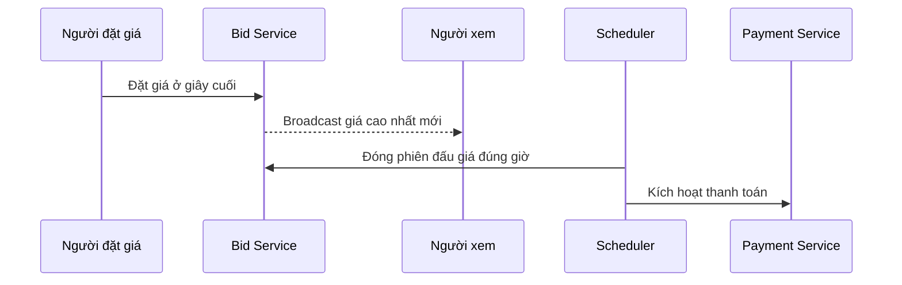

# 📐 Nền tảng đấu giá — Bước 2: Ước lượng quy mô và nhận diện điểm nghẽn

> Nguồn: `089-Estimating-Scale-Identifying-Bottlenecks.txt` · [Udemy](https://ua.udemy.com/course/mastering-system-design-from-basics-to-cracking-interviews/learn/lecture/49837031)

Trước khi bắt tay vào thiết kế kiến trúc, chúng ta cần **ước lượng quy mô mà hệ thống phải phục vụ**. Và đây là một câu mình muốn các bạn ghi nhớ: **thiết kế hệ thống được dẫn dắt bởi con số, chứ không phải bởi giả định** — vì chính những con số này ảnh hưởng đến gần như mọi quyết định kiến trúc phía sau.

Cùng đi qua các ước lượng cho nền tảng đấu giá, rồi từ đó nhận diện những nơi hệ thống dễ gặp áp lực nhất.

---

### 📊 Ước lượng quy mô — những con số định hình thiết kế

Giả sử nền tảng của chúng ta có khoảng **5 triệu người dùng đã đăng ký**, với xấp xỉ **500.000 người dùng active mỗi ngày**. Không phải ai cũng online cùng lúc, nhưng con số này cho chúng ta cảm giác về **tổng lượng người dùng mà hệ thống phải hỗ trợ**.

Ở bất kỳ thời điểm nào, chúng ta kỳ vọng có khoảng **1 triệu danh sách đấu giá đang hoạt động**. Mỗi phiên đấu giá có **vòng đời, người tham gia và hoạt động đặt giá riêng** — nghĩa là nền tảng đang phải **quản lý đồng thời một số lượng lớn các sự kiện real-time độc lập**.

| Chỉ số | Con số ước lượng | Hàm ý cho kiến trúc |
|---|---|---|
| Người dùng đã đăng ký | ~5 triệu | — |
| Người dùng active mỗi ngày | ~500.000 | Nền tảng phải chịu tải hàng ngày ổn định |
| Danh sách đấu giá đang hoạt động | ~1 triệu | Quản lý nhiều sự kiện real-time độc lập cùng lúc |
| Lượt đặt giá mỗi ngày | ~10 triệu | Mỗi bid phải được kiểm tra, ghi nhận và phản ánh với độ trễ rất thấp |
| Người xem một phiên đấu giá hot | ~10.000 | Đỉnh tải đột ngột cho cả request vào lẫn cập nhật real-time ra |
| Phiên đấu giá hoàn tất mỗi ngày | ~100.000 | Tương ứng ~100.000 giao dịch thanh toán, tuy ít hơn nhưng trọng yếu |

Về khối lượng đặt giá: nếu mỗi phiên đấu giá nhận trung bình **10 lượt đặt giá**, thì mỗi ngày có khoảng **10 triệu lượt bid**. Mỗi lượt đều phải được **kiểm tra, ghi nhận và phản ánh đến người dùng với độ trễ rất thấp**.

Thách thức thật sự xuất hiện vào **thời điểm cao điểm**: một phiên đấu giá đặc biệt hấp dẫn có thể thu hút khoảng **10.000 người vừa theo dõi vừa đặt giá cùng lúc**. Điều này tạo ra **cú tăng vọt đột ngột cả ở request đi vào lẫn cập nhật real-time đi ra** — một trong những kịch bản khắt khe nhất mà hệ thống phải xử lý.

Cuối cùng, nếu khoảng **100.000 phiên đấu giá hoàn tất mỗi ngày**, nền tảng cũng cần xử lý **khoảng 100.000 giao dịch thanh toán**. Lưu lượng thanh toán thấp hơn nhiều so với lưu lượng đặt giá, nhưng đây là phần **trọng yếu về mặt kinh doanh** — vì mọi phiên đấu giá thành công cuối cùng đều phụ thuộc vào một giao dịch thanh toán thành công.

Những ước lượng này **không cần chính xác tuyệt đối**. Mục đích của chúng là cho chúng ta **cơ sở để lý luận về khả năng mở rộng, năng lực hạ tầng và giao tiếp real-time** trong suốt quá trình thiết kế.

---

### 🔍 Mẫu traffic — đọc rất nhiều, ghi ít nhưng ghi mới là phần khó

Biết khối lượng traffic là chưa đủ; chúng ta còn cần hiểu **đặc tính của từng loại traffic**, vì không phải request nào cũng có yêu cầu giống nhau.

Phần lớn khối lượng công việc trên nền tảng đấu giá là **read-heavy (đọc nhiều)**. Người dùng dành nhiều thời gian để **duyệt danh sách đấu giá, xem chi tiết sản phẩm, tìm kiếm và theo dõi các phiên đang diễn ra** hơn là đặt giá. Thêm nữa, **mỗi mức giá cao nhất mới đều phải được gửi đến tất cả những người đang theo dõi phiên đấu giá đó**. Vào giai đoạn cao điểm, các thao tác đọc này có thể dễ dàng đạt **hàng triệu request mỗi phút**.

Ngược lại, **các thao tác ghi ít thường xuyên hơn nhưng đòi hỏi khắt khe hơn nhiều**. Đặt giá **không phải là một thao tác ghi database bình thường** — nó **ảnh hưởng trực tiếp đến việc ai đang thắng phiên đấu giá**. Những request này phải được xử lý với **độ trễ rất thấp và tính đúng đắn cao**, đặc biệt khi phiên đấu giá tiến gần thời điểm đóng. Việc đăng bán sản phẩm và chốt phiên đấu giá cũng là thao tác ghi, nhưng xảy ra **ít hơn nhiều** so với đặt giá.

Khu vực khó nhất là **vùng áp lực real-time**: trong những giây cuối của một phiên đấu giá hot, **hàng nghìn người có thể cố đặt giá gần như đồng thời**. Cùng lúc đó, **mỗi mức giá được chấp nhận phải được đẩy tới hàng nghìn người xem đang kết nối với độ trễ tối thiểu**. Khi phiên đấu giá chạm mốc thời gian kết thúc, nền tảng phải **đóng nó chính xác**, **không nhận thêm giá nào**, và **ngay lập tức kích hoạt quy trình thanh toán** — quy trình này còn phụ thuộc vào **nhà cung cấp thanh toán bên ngoài**.

Từ đây rút ra một insight kiến trúc quan trọng: **lượt đọc chiếm ưu thế về tổng lưu lượng**, nên hệ thống phải **scale hiệu quả để phục vụ số lượng lớn người dùng**. Nhưng **hoạt động kinh doanh lại phụ thuộc vào việc các thao tác ghi phải đúng**. Một thao tác tìm kiếm chậm chỉ gây bất tiện, nhưng **tuyên sai người thắng hoặc bỏ lỡ thời điểm đóng phiên là điều hoàn toàn không thể chấp nhận**. Vì vậy kiến trúc phải tối ưu cho **cả hai**: khả năng mở rộng đọc khổng lồ, và **ghi nhanh, nhất quán trong những khoảnh khắc quan trọng nhất**.

---

### 🧩 Năm nguyên tắc xử lý điểm nghẽn

Sau khi ước lượng quy mô, bước tiếp theo là **nhận diện nơi hệ thống dễ gặp khó khăn nhất**. Thiết kế hệ thống tốt thường là **lường trước điểm nghẽn trước khi chúng trở thành sự cố production**:

1. **Ước lượng tải theo từng service, không chỉ nhìn toàn nền tảng** — các service có mẫu traffic rất khác nhau. Ví dụ **bidding service** có thể hứng **cơn bùng nổ dữ dội gần thời điểm đóng phiên**, trong khi **payment service** bận rộn nhất **ngay sau khi phiên đấu giá kết thúc**. Hiểu rõ khác biệt này giúp **scale từng thành phần cho phù hợp**.
2. **Cô lập các thành phần real-time** — những tính năng như **xử lý đặt giá và cập nhật trực tiếp** có yêu cầu độ trễ nghiêm ngặt, nên **không được cạnh tranh tài nguyên với các workload ít nhạy cảm thời gian**. Tách chúng ra giúp **scale độc lập khi nhu cầu tăng**.
3. **Đưa việc không cần tức thời sang xử lý bất đồng bộ** — những tác vụ như **gửi email hay tạo biên nhận thanh toán** không ảnh hưởng trực tiếp đến việc người dùng đặt giá hay hoàn tất phiên đấu giá. Đây là ứng viên sáng giá cho **xử lý bất đồng bộ**, giúp hệ thống **phản hồi nhanh** trong khi công việc phụ được xử lý nền.
4. **Scale theo chiều ngang khi dữ liệu lớn lên** — các service lưu **lượt đặt giá và danh sách đấu giá** phải được thiết kế để **phân tán tải ra nhiều server hoặc nhiều partition**, thay vì phụ thuộc vào một máy chủ duy nhất.
5. **Lên kế hoạch cho traffic lệch (skewed traffic)** — hầu hết phiên đấu giá chỉ có hoạt động vừa phải, nhưng **một vài phiên hot có thể thu hút hàng nghìn người vừa đặt giá vừa theo dõi cùng lúc**. Những **phiên đấu giá hot tạo ra các đỉnh cục bộ** có thể làm quá tải một phần hệ thống **ngay cả khi toàn nền tảng trông vẫn khỏe mạnh**. Chuẩn bị cho những điểm nóng này quan trọng không kém thiết kế cho traffic trung bình.

Điểm mấu chốt: **điểm nghẽn hiếm khi xuất hiện ở mọi nơi cùng lúc — chúng xuất hiện ở nơi nhu cầu không đồng đều**. Bằng cách ước lượng tải theo từng service, cô lập các thành phần nhạy cảm độ trễ, dùng xử lý bất đồng bộ ở nơi hợp lý, scale theo chiều ngang và lường trước các phiên đấu giá hot, chúng ta có thể xây một kiến trúc **tiếp tục vận hành đáng tin cậy khi nền tảng lớn lên**.

---

### 🎯 Tự kiểm tra nhanh

**Câu 1:** Với ~1 triệu phiên đấu giá đang hoạt động và mỗi phiên trung bình 10 lượt đặt giá, mỗi ngày nền tảng xử lý khoảng bao nhiêu lượt bid?

<b>Xem đáp án</b>

**Đáp án:** Khoảng 10 triệu lượt đặt giá mỗi ngày.

Giải thích: Mỗi lượt đều phải được kiểm tra, ghi nhận và phản ánh đến người dùng với độ trễ rất thấp.

Tham chiếu: Mục Ước lượng quy mô — những con số định hình thiết kế.

**Câu 2:** Vì sao thao tác ghi trên nền tảng đấu giá khó hơn thao tác đọc, dù ít xảy ra hơn?

<b>Xem đáp án</b>

**Đáp án:** Vì đặt giá ảnh hưởng trực tiếp đến việc ai đang thắng, nên cần độ trễ rất thấp và tính đúng đắn cao.

Giải thích: Tìm kiếm chậm chỉ gây bất tiện, nhưng tuyên sai người thắng là điều không thể chấp nhận.

Tham chiếu: Mục Mẫu traffic — đọc rất nhiều, ghi ít nhưng ghi mới là phần khó.

**Câu 3:** Vì sao cần ước lượng tải theo từng service thay vì nhìn toàn nền tảng?

<b>Xem đáp án</b>

**Đáp án:** Vì mỗi service có mẫu traffic khác nhau — bidding service bùng nổ gần giờ đóng, payment service bận sau khi phiên kết thúc.

Giải thích: Hiểu khác biệt này giúp scale từng thành phần phù hợp.

Tham chiếu: Mục Năm nguyên tắc xử lý điểm nghẽn.

**Câu 4:** Vì sao xử lý real-time cần được cô lập khỏi các workload khác?

<b>Xem đáp án</b>

**Đáp án:** Để chúng không cạnh tranh tài nguyên với các workload ít nhạy cảm thời gian, nhờ đó scale độc lập.

Giải thích: Xử lý đặt giá và cập nhật trực tiếp có yêu cầu độ trễ rất nghiêm ngặt.

Tham chiếu: Mục Năm nguyên tắc xử lý điểm nghẽn.

**Câu 5:** Vì sao phiên đấu giá hot lại nguy hiểm dù số lượng ít?

<b>Xem đáp án</b>

**Đáp án:** Vì chúng tạo đỉnh tải cục bộ có thể làm quá tải một phần hệ thống ngay cả khi toàn nền tảng trông khỏe mạnh.

Giải thích: Điểm nghẽn xuất hiện ở nơi nhu cầu không đồng đều, nên phải lường trước các hotspot.

Tham chiếu: Mục Năm nguyên tắc xử lý điểm nghẽn.

---

Vậy là chúng ta đã lượng hóa được quy mô nền tảng đấu giá: **5 triệu người dùng đăng ký, 500.000 người active mỗi ngày, 1 triệu phiên đấu giá đang hoạt động, 10 triệu lượt bid mỗi ngày và 100.000 giao dịch thanh toán** — cùng 5 nguyên tắc xử lý điểm nghẽn.

Ở bài tiếp theo, chúng ta sẽ bước vào **high-level design**: chia nền tảng thành các service, thiết kế API, chọn cách giao tiếp sync/async và xử lý giao bid real-time. Hẹn gặp lại các bạn! 🚀
