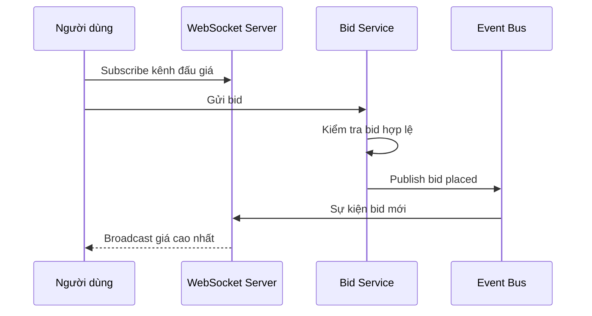

# 🏗️ Nền tảng đấu giá — Bước 3: High-level design với các service chuyên trách

> Nguồn: `090-High-Level-Design-Services-APIs-Communication.txt` · [Udemy](https://ua.udemy.com/course/mastering-system-design-from-basics-to-cracking-interviews/learn/lecture/49837033)

Sau khi đã hiểu yêu cầu và thách thức, chúng ta bắt đầu **lắp ghép kiến trúc high-level** cho nền tảng đấu giá. Thay vì xây một ứng dụng khổng lồ, chúng ta sẽ **chia nền tảng thành các service, mỗi service sở hữu một trách nhiệm kinh doanh cụ thể**. Cách tách bạch này giúp hệ thống **dễ scale, dễ bảo trì và dễ tiến hóa theo thời gian**.

Trong bài này, mình và các bạn sẽ đi qua các service chính, thiết kế API, cách các service giao tiếp, cách giao bid real-time, và cuối cùng là data model cùng bộ máy quản lý thời gian.

---

### 🧩 Các service chính — mỗi service một trách nhiệm kinh doanh

Mọi request đều đi vào qua **API gateway** — **cánh cửa chính của nền tảng**. Nó **định tuyến request đến service phù hợp**, đồng thời cung cấp các năng lực như **request routing và rate limiting**. Phía sau gateway:

| Service | Trách nhiệm chính |
|---|---|
| **User Service** | Xác thực, profile người dùng và vai trò; đảm bảo chỉ người dùng được phép mới tạo được đấu giá và đặt giá |
| **Auction Service** | Quản lý vòng đời phiên đấu giá: khi nào scheduled, active hay completed; thực thi các luật đấu giá cốt lõi |
| **Listing Service** | Quản lý sản phẩm được đấu giá: chi tiết mặt hàng, hình ảnh, danh mục — giúp người dùng khám phá và duyệt |
| **Bid Service** | Phần quan trọng bậc nhất: xử lý bid real-time, kiểm tra bid, quản lý đặt giá đồng thời, đảm bảo luôn phản ánh **giá cao nhất đúng** |
| **Payment Service** | Sau khi phiên kết thúc: khởi tạo quy trình thanh toán và theo dõi tiến trình đến khi giao dịch hoàn tất |
| **Notification Service** | Gửi các sự kiện quan trọng: cảnh báo bị vượt giá, kết quả đấu giá, cập nhật thanh toán |
| **Scheduler Service** | Các thao tác theo thời gian: đảm bảo phiên đấu giá bắt đầu và kết thúc đúng thời điểm để phần còn lại của hệ thống phản ứng |
| **Analytics & Logging** | Thu thập dữ liệu vận hành, theo dõi hoạt động người dùng và xu hướng đấu giá; giúp giám sát sức khỏe hệ thống và xử lý sự cố |

Ở giai đoạn này, các bạn **đừng lo về cách các service giao tiếp hay dùng công nghệ gì**. Mục tiêu của bước này chỉ là **xác định những khối xây dựng chính và tách bạch trách nhiệm thật rõ**. Ở các phần sau, chúng ta sẽ dần đi sâu vào từng service và cách chúng phối hợp để tạo nên nền tảng đấu giá real-time dễ mở rộng.

---

### 🔌 API design — hợp đồng giữa client và backend

Các endpoint API thể hiện **hợp đồng giữa client với các backend service**. Dù client là web hay mobile, gần như mọi tương tác với nền tảng đều diễn ra qua những API này:

| Nhóm API | Endpoint chính | Mục đích |
|---|---|---|
| **User API** | Sign-up, login, profile | Người dùng mới đăng ký, người cũ đăng nhập và lấy thông tin hồ sơ |
| **Auction API** | Create Auction, Auction Details, Bid, Bid History, danh sách phiên đang hoạt động | Workflow kinh doanh chính: tạo phiên đấu giá, xem trạng thái và thông tin sản phẩm, đặt giá, xem lại lịch sử bid, khám phá các phiên đang diễn ra |
| **Payment API** | Initiate Payment, Track Payment Status | Khởi tạo quy trình thanh toán sau khi phiên kết thúc và theo dõi tiến trình đến khi hoàn tất |

Không phải mọi tương tác đều do người dùng khởi xướng. Một số sự kiện **xuất phát từ bên trong hệ thống**: khi phiên đấu giá kết thúc, nền tảng **tự động thông báo cho người thắng**; khi một mức giá cao nhất mới được chấp nhận, **người đang giữ giá cao nhất trước đó được thông báo là đã bị vượt**. Đây là những **tương tác nội bộ, hướng sự kiện (event-driven)** — không phải API dành cho client.

Một điều quan trọng cần nhớ: **các endpoint này là giao diện bên ngoài của hệ thống, không phải implementation bên trong**. Một request API đơn lẻ có thể kéo theo **nhiều backend service phối hợp với nhau** phía sau. Ở các phần tiếp theo, chúng ta sẽ thấy những API này ánh xạ thế nào vào các service đã xác định và chúng cộng tác ra sao để hoàn thành từng request.

---

### 🔄 Giao tiếp giữa các service — sync hay async?

Trong hệ phân tán, **chọn đúng mẫu giao tiếp quan trọng không kém chọn đúng service**. Nhìn chung chúng ta dùng hai mẫu: **giao tiếp đồng bộ (synchronous)** cho các thao tác cần phản hồi ngay, và **giao tiếp bất đồng bộ (asynchronous)** cho công việc diễn ra độc lập ở hậu trường.

**Giao tiếp đồng bộ dùng các công nghệ như REST hoặc gRPC.** Nó phù hợp khi **một service không thể tiếp tục cho đến khi nhận được phản hồi từ service khác**: ví dụ xác thực người dùng hay lấy chi tiết danh sách đấu giá — đều cần kết quả ngay trước khi request có thể đi tiếp. Đây là những tương tác **request-response** điển hình.

Nhưng không phải workflow nào cũng cần mức độ tức thời đó. Rất nhiều thao tác **mang bản chất hướng sự kiện**, phù hợp hơn với **pub-sub system hoặc event bus**:

* Khi một mức giá mới được đặt thành công, **nhiều phần của hệ thống cần phản ứng**: người dùng đang kết nối cần nhận cập nhật trực tiếp, analytics cần ghi nhận sự kiện, các service hạ nguồn có thể xử lý thêm. Thay vì để **bid service gọi trực tiếp từng service một**, nó chỉ cần **publish một sự kiện `bid placed`** và để các service quan tâm tự phản ứng độc lập.
* Khi **phiên đấu giá kết thúc**, thay vì gắn chặt auction service với notification và payment, nó **publish sự kiện `auction ended`**. Notification service thông báo cho người thắng, còn payment service bắt đầu quy trình thanh toán.
* Tương tự, nếu **thanh toán thất bại**, một sự kiện **`payment failed`** có thể kích hoạt retry hoặc cảnh báo vận hành **mà không chặn các phần khác của hệ thống**.

Các sự kiện này thường được tổ chức thành các **topic** như `auction ended`, `bid placed`, `payment failed`, `user registered` — giúp nhiều service dễ dàng **subscribe đúng những sự kiện mình quan tâm**.

Lợi ích lớn nhất của cách tiếp cận này là **loose coupling (liên kết lỏng)**: các service **không cần biết về implementation bên trong của nhau**, chỉ cần publish hoặc consume sự kiện. Nhờ đó hệ thống **dễ scale hơn, tăng khả năng chịu lỗi, hỗ trợ retry**, và **sự cố ở một service ít ảnh hưởng đến phần còn lại**. Nguyên tắc chung: **dùng giao tiếp đồng bộ khi bên gọi cần câu trả lời ngay, và dùng bất đồng bộ khi bạn đang thông báo cho phần còn lại của hệ thống rằng một điều gì đó đã xảy ra**. Sự cân bằng này giúp hệ phân tán vừa **phản hồi nhanh** vừa **dễ mở rộng**.

---

### 📡 Real-time bid delivery — đưa giá mới đến mọi người trong tích tắc

Một đặc trưng định hình nền tảng đấu giá là **người dùng kỳ vọng thấy giá mới gần như ngay lập tức**. Nếu ai đó đặt mức giá cao hơn, **mọi người tham gia đều phải biết ngay** — và đây chính là bài toán mà **WebSocket** được sinh ra để giải.

Khác với HTTP truyền thống — nơi client liên tục hỏi server xem có gì mới — WebSocket **thiết lập một kết nối hai chiều thường trực giữa client và server**. Một khi kết nối được thiết lập, **server có thể đẩy cập nhật bất cứ khi nào có thay đổi**, loại bỏ độ trễ và chi phí của việc polling liên tục.

Luồng tổng thể diễn ra như sau:

1. Khi người dùng mở một phiên đấu giá, ứng dụng của họ **subscribe vào WebSocket channel của phiên đấu giá đó** — báo cho hệ thống biết họ muốn nhận cập nhật trực tiếp cho phiên cụ thể này.
2. Khi một người dùng khác đặt giá, **bid service kiểm tra request trước**, và nếu bid được chấp nhận, **publish một bid event**.
3. **WebSocket server nhận sự kiện đó và broadcast thông tin giá mới ngay lập tức** đến mọi client đang subscribe kênh của phiên đấu giá.
4. Kết quả: **tất cả người tham gia thấy mức giá cao nhất mới gần như cùng lúc**, tạo nên trải nghiệm real-time mà người dùng kỳ vọng.

Thách thức lớn nhất **không nằm ở việc thiết lập kết nối WebSocket, mà ở việc scale cơ chế này**. Một phiên đấu giá hot có thể có **hàng nghìn người dùng đang kết nối**, tất cả đều kỳ vọng cập nhật trong độ trễ tối thiểu. **Một WebSocket server đơn lẻ nhanh chóng trở thành điểm nghẽn**, nên kiến trúc phải hỗ trợ **scale theo chiều ngang** — cho phép **nhiều WebSocket server cùng phối hợp để giao cùng một sự kiện đến mọi client đang kết nối**.

Điểm mấu chốt: **WebSocket không được dùng chỉ vì nó là công nghệ hiện đại**, mà vì nền tảng đấu giá **vốn dĩ hướng sự kiện**. Thay vì client liên tục hỏi "có gì thay đổi chưa", server **chủ động đẩy cập nhật ngay khi bid mới được chấp nhận** — giúp trải nghiệm đấu giá nhanh, tương tác và dễ mở rộng.

---

### 🗄️ Data model và bộ máy quản lý thời gian

Data model của chúng ta **cố tình đơn giản** — chưa cần thiết kế từng cột database, mà chỉ cần **xác định các thực thể kinh doanh cốt lõi và quan hệ giữa chúng**:

* **User** — lưu thông tin mọi người dùng nền tảng, dù họ là người mua, người bán hay cả hai. **Gần như mọi phần khác của hệ thống đều gắn với user theo một cách nào đó**.
* **Listing** — đại diện cho **món hàng được rao bán**, chứa thông tin người mua cần để đánh giá: mô tả, hình ảnh, danh mục.
* **Auction** — **sự kiện bán hàng thực tế** cho một listing: thời điểm bắt đầu đặt giá, thời điểm kết thúc và trạng thái hiện tại. Tách auction khỏi listing giúp **thông tin món hàng độc lập với chính quá trình đấu giá**.
* **Bid** — mỗi lượt đặt giá được ghi lại, gắn với **cả một user lẫn một auction**, tạo thành **lịch sử đặt giá đầy đủ**. Lịch sử này thiết yếu để **xác định bid thắng và duy trì tính minh bạch**.
* **Payment** — sau khi phiên đấu giá kết thúc, theo dõi giao dịch của người thắng và **ghi nhận tiến trình cho đến khi hoàn tất**.

Các thực thể này nối với nhau bằng những quan hệ đơn giản: **một user có thể đặt nhiều bid và thực hiện nhiều giao dịch thanh toán**; **một auction thuộc về một listing**, và **mỗi auction có thể nhận nhiều bid trước khi đóng**; khi phiên hoàn tất, nó **gắn với payment tương ứng**. Năm thực thể này là **nền móng của toàn bộ nền tảng** — sau này khi tinh chỉnh kiến trúc, chúng ta có thể mở rộng thêm thuộc tính và bảng phụ trợ.

Song song đó, một trong những trách nhiệm then chốt nhất là **quản lý thời gian**. Mọi phiên đấu giá đều có thời điểm bắt đầu và kết thúc rõ ràng, và hệ thống phải **thực thi các chuyển trạng thái chính xác mà không cần can thiệp thủ công**. **Scheduler** đảm nhận ba việc: **kích hoạt** phiên đấu giá khi đến giờ bắt đầu, **đóng** đúng thời điểm kết thúc, và sau khi đóng thì **xác định người thắng, thông báo cho người tham gia và khởi tạo quy trình thanh toán**.

Có nhiều cách hiện thực năng lực này:

1. Một **scheduler service chuyên trách** liên tục theo dõi các phiên đấu giá sắp tới và thực thi sự kiện vòng đời đúng thời điểm.
2. Dùng **delayed jobs trong message queue**, nơi một tác vụ được lên lịch chạy khi phiên đấu giá đến giờ đóng.
3. Lưu **timer trong một in-memory store nhanh như Redis** và kích hoạt hành động bằng cơ chế **polling hoặc expiration**.

Cách nào cũng có thể hoạt động — **lựa chọn đúng phụ thuộc vào quy mô nền tảng và hạ tầng sẵn có**. Nhưng bất kể hiện thực theo cách nào, **độ tin cậy quan trọng hơn hẳn bản thân cơ chế lập lịch**. Hãy tưởng tượng một phiên đấu giá lẽ ra phải đóng nhưng vẫn mở thêm một phút: người dùng có thể tiếp tục đặt giá, dẫn đến **người thắng sai và mất niềm tin vào nền tảng**.

Vì vậy scheduler phải được thiết kế để **chịu được lỗi**: nếu việc đóng phiên không hoàn tất thành công, hệ thống phải **tự động retry**. Quan trọng hơn, **logic đóng phiên phải có tính idempotent (bất biến khi lặp)** — nghĩa là dù scheduler thực thi cùng một thao tác đóng phiên nhiều lần, **kết quả cuối cùng vẫn y hệt**: người thắng không đổi, **không gửi thông báo trùng**, và **thanh toán không bị khởi tạo hai lần**. Cuối cùng, **mọi thao tác lập lịch đều phải được ghi log và giám sát**; nếu một phiên đấu giá không bắt đầu hoặc không kết thúc đúng thời điểm, đội vận hành cần **được cảnh báo ngay lập tức** để xử lý trước khi ảnh hưởng đến người dùng thật.

Điểm mấu chốt: **scheduler trông như một thành phần nền, nhưng thực ra là một trong những phần trọng yếu nhất về mặt kinh doanh của toàn nền tảng**. Nếu nó thất bại, **tính toàn vẹn của phiên đấu giá bị phá vỡ**. Vì thế, **định thời chính xác, chịu lỗi và xử lý idempotent** là những yêu cầu nền tảng của mọi hệ thống đấu giá cấp production.

---

Vậy là chúng ta đã có bản thiết kế high-level cho nền tảng đấu giá: **các service chuyên trách, API rõ ràng, giao tiếp sync/async hợp lý, giao bid real-time qua WebSocket, data model năm thực thể và scheduler đáng tin cậy**. Điều đáng nhớ nhất vẫn là tinh thần xuyên suốt: **mỗi thành phần tồn tại để giải một bài toán cụ thể**, và mọi lựa chọn đều là trade-off.

Ở bài tiếp theo, chúng ta sẽ **chọn công nghệ và hạ tầng** cho nền tảng — từ frontend, backend, database cho đến bảo mật và tối ưu chi phí. Hẹn gặp lại các bạn! 🚀
