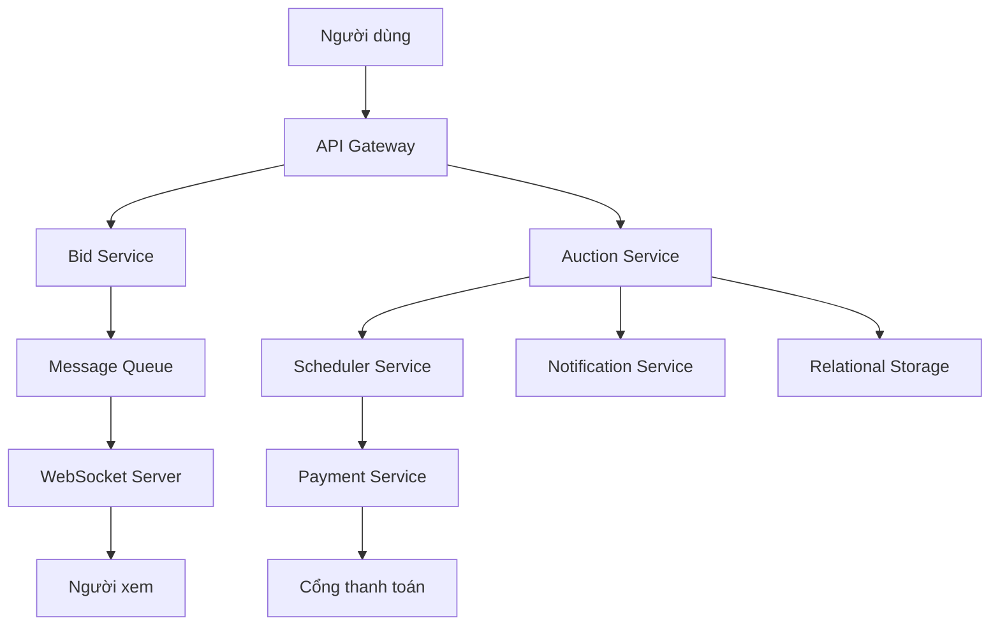

# 🏁 Nền tảng đấu giá — Bước 5: Kiến trúc hoàn chỉnh và góc nhìn end-to-end

> Nguồn: `092-The-Final-Design---Auction-Platform.txt` · [Udemy](https://ua.udemy.com/course/mastering-system-design-from-basics-to-cracking-interviews/learn/lecture/49837037)

Đã đến lúc gom tất cả lại thành **kiến trúc hoàn chỉnh**. Qua các bước trước, chúng ta đã bàn về yêu cầu, xác định các service cốt lõi, khám phá các mẫu giao tiếp và xử lý những thách thức scalability lớn nhất. Sơ đồ trong bài này cho thấy **tất cả các mảnh ghép khớp với nhau như thế nào** để tạo nên một nền tảng đấu giá sẵn sàng cho production.

Mình và các bạn sẽ đi theo dòng chảy của một request — từ người dùng, qua gateway, đến các service và tầng hạ tầng phía sau.

---

### 🚪 Kiến trúc tổng thể — từ người dùng đến các service

Hành trình bắt đầu từ **người dùng — dù là người mua hay người bán — truy cập nền tảng qua ứng dụng web hoặc mobile**. Mọi request đều đi vào **API gateway**, đóng vai trò **điểm vào duy nhất của hệ thống**. Gateway xử lý các trách nhiệm như **request routing, rate limiting và authentication** trước khi chuyển request đến backend service phù hợp.

Phía sau gateway, **mỗi service sở hữu một năng lực kinh doanh được định nghĩa rõ ràng**:

* **User Service** quản lý authentication và profile người dùng.
* **Listing Service** quản lý sản phẩm đấu giá cùng metadata của chúng.
* **Auction Service** kiểm soát vòng đời phiên đấu giá và **thực thi các luật kinh doanh**.
* **Bid Service** xử lý các lượt đặt giá đến và đảm bảo chúng **được xử lý chính xác, kể cả dưới mức đồng thời cao**.
* Khi phiên đấu giá hoàn tất, **Payment Service** đảm nhận quy trình thanh toán, còn **Notification Service** giữ người dùng được thông tin về những sự kiện quan trọng.
* Chạy song song với các service này là **Scheduler Service**, đảm bảo **các phiên đấu giá bắt đầu và kết thúc đúng thời điểm**.

---

### 🔗 Hạ tầng nâng đỡ các service kinh doanh

Bên dưới các service là tầng hạ tầng nền tảng:

* **Relational storage** duy trì **dữ liệu giao dịch** của nền tảng.
* **Redis** tăng tốc truy cập những thông tin được dùng thường xuyên.
* **WebSocket server** giao **cập nhật trực tiếp** đến người dùng đang kết nối.
* **Message queue** cho phép **giao tiếp bất đồng bộ** giữa các service.
* Và khi cần xử lý thanh toán, **Payment Service giao tiếp với nhà cung cấp thanh toán bên ngoài** để hoàn tất giao dịch tài chính.

Để ý rằng **không phải mọi tương tác đều đồng bộ**: một request hướng người dùng thường đi qua API gateway để có phản hồi ngay, trong khi **các hoạt động nền như thông báo, hoàn tất phiên đấu giá và xử lý thanh toán thường giao tiếp qua sự kiện**. Chính sự kết hợp giữa **API đồng bộ, messaging bất đồng bộ và giao tiếp real-time qua WebSocket** cho phép nền tảng **vừa phản hồi nhanh vừa scale hiệu quả**.

---

### 🧩 Mỗi thành phần giải một bài toán cụ thể

Điều quan trọng nhất cần thấy ở kiến trúc này: **mọi thành phần đều tồn tại để giải một bài toán mà chúng ta đã bàn xuyên suốt case study**.

* **API gateway** đơn giản hóa giao tiếp từ phía client.
* **Các service chuyên trách** tách bạch trách nhiệm kinh doanh.
* **WebSocket** hiện thực hóa đấu giá real-time.
* **Scheduler** tạo ra định thời chính xác cho phiên đấu giá.
* **Redis** cải thiện hiệu năng.
* **Message queue** tách rời (decouple) các service và nâng cao khả năng chịu lỗi.

Kết hợp lại, những quyết định này tạo nên một hệ thống **dễ mở rộng, đáng tin cậy, có khả năng hỗ trợ hàng nghìn phiên đấu giá đồng thời mà không đánh đổi tính đúng đắn hay trải nghiệm người dùng**.

---

### 💡 Lời nhắc cuối: không có kiến trúc duy nhất đúng

Một lưu ý rất quan trọng: **thiết kế cuối cùng này không phải là kiến trúc khả thi duy nhất**. Các tổ chức khác nhau có thể chọn công nghệ hoặc ranh giới service khác nhau, nhưng **nguyên tắc nền tảng vẫn giữ nguyên**: **bắt đầu từ yêu cầu kinh doanh, nhận diện những thách thức then chốt, và để chính những thách thức đó dẫn dắt các quyết định kiến trúc**.

Đó là **tư duy của một system designer giàu kinh nghiệm**, và nó **giá trị hơn hẳn việc ghi nhớ bất kỳ một sơ đồ kiến trúc cụ thể nào**.

---

### 🎯 Tự kiểm tra nhanh

**Câu 1:** API gateway xử lý những trách nhiệm nào trước khi chuyển request đi tiếp?

<b>Xem đáp án</b>

**Đáp án:** Request routing, rate limiting và authentication.

Giải thích: Gateway là điểm vào duy nhất cho mọi request vào hệ thống.

Tham chiếu: Mục Kiến trúc tổng thể — từ người dùng đến các service.

**Câu 2:** Bid Service đảm bảo điều gì?

<b>Xem đáp án</b>

**Đáp án:** Các lượt đặt giá được xử lý chính xác, kể cả dưới mức đồng thời cao.

Giải thích: Đây là service đảm bảo giá cao nhất luôn đúng trong phiên đấu giá.

Tham chiếu: Mục Kiến trúc tổng thể — từ người dùng đến các service.

**Câu 3:** Vai trò của Scheduler Service trong kiến trúc là gì?

<b>Xem đáp án</b>

**Đáp án:** Đảm bảo các phiên đấu giá bắt đầu và kết thúc đúng thời điểm.

Giải thích: Định thời chính xác là yêu cầu sống còn để giữ tính toàn vẹn của phiên đấu giá.

Tham chiếu: Mục Kiến trúc tổng thể — từ người dùng đến các service.

**Câu 4:** Vì sao message queue quan trọng trong kiến trúc này?

<b>Xem đáp án</b>

**Đáp án:** Nó cho phép giao tiếp bất đồng bộ giữa các service, giúp tách rời và tăng khả năng chịu lỗi.

Giải thích: Các hoạt động nền như thông báo, hoàn tất phiên đấu giá và thanh toán đi qua sự kiện.

Tham chiếu: Mục Mỗi thành phần giải một bài toán cụ thể.

**Câu 5:** Vì sao không nên xem thiết kế cuối cùng là kiến trúc duy nhất đúng?

<b>Xem đáp án</b>

**Đáp án:** Vì tổ chức khác nhau có thể chọn công nghệ hoặc ranh giới service khác nhau, miễn giữ nguyên nguyên tắc nền tảng.

Giải thích: Hãy bắt đầu từ yêu cầu kinh doanh, nhận diện thách thức và để chúng dẫn dắt quyết định kiến trúc.

Tham chiếu: Mục Lời nhắc cuối — không có kiến trúc duy nhất đúng.

---

Vậy là chúng ta đã hoàn thành case study thứ hai: **một nền tảng đấu giá real-time với API gateway, các service chuyên trách, WebSocket, scheduler, Redis và message queue** — cùng một lời nhắc quen thuộc: **hiếm khi có thiết kế hoàn hảo, mọi quyết định kiến trúc đều là trade-off**.

Ở section tiếp theo, chúng ta sẽ áp dụng cùng bộ blueprint system design này cho một bài toán thực tế mới. Hẹn gặp lại các bạn! 🚀
