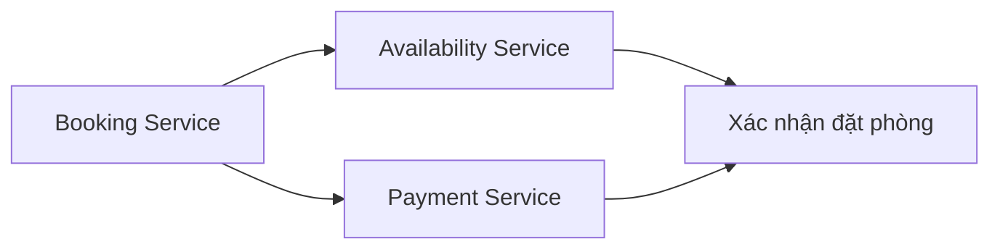

# 📊 Ước lượng quy mô & nhận diện điểm nghẽn nền tảng cho thuê nhà

> Nguồn: `094-Estimating-Scale-Identifying-Bottlenecks.txt` · [Udemy](https://ua.udemy.com/course/mastering-system-design-from-basics-to-cracking-interviews/learn/lecture/49841679)

Sang bước 2 của case study, chúng ta sẽ **ước lượng quy mô** của nền tảng cho thuê nhà. Những con số ở đây không cần chính xác tuyệt đối — mục tiêu là nắm được **bậc độ lớn (order of magnitude)** và hiểu bản chất workload. Chính từ đó, mình và các bạn sẽ nhận ra phần nào của hệ thống cần được chăm chút nhất.

---

### 📊 Ước lượng quy mô: những con số biết nói

Giả sử nền tảng phục vụ khoảng **5 triệu daily active users (người dùng hoạt động hằng ngày)**, với lưu lượng đỉnh chạm mức **100.000 người dùng đồng thời**. Con số này nói ngay rằng ta đang thiết kế cho một ứng dụng lưu lượng cao, phân tán toàn cầu — chứ không phải một dịch vụ nhỏ mang tính khu vực.

| Hạng mục | Ước lượng |
|---|---|
| Người dùng hoạt động hằng ngày | khoảng **5 triệu** |
| Người dùng đồng thời lúc cao điểm | khoảng **100.000** |
| Listing (tin đăng chỗ ở) | hơn **50 triệu**, tăng mỗi ngày |
| Tìm kiếm mỗi ngày | khoảng **42 triệu** |
| Booking mỗi ngày | khoảng **1 triệu** |
| Giao dịch thanh toán mỗi ngày | khoảng **1 triệu** |
| Media mỗi listing | trung bình **10 ảnh**, đôi khi có video |

Những con số này có giá trị không phải vì ta cần ghi nhớ chúng, mà vì chúng **hé lộ bản chất của workload**:

* **Đây là hệ thống read-heavy (đọc nhiều).** Tìm kiếm và xem chi tiết listing xảy ra thường xuyên hơn hẳn việc tạo booking. Kiến trúc phải được tối ưu để phục vụ lượng lớn read request thật nhanh và hiệu quả.
* **Ghi ít hơn về số lượng nhưng quan trọng hơn hẳn.** Mỗi booking đều cập nhật availability và phải được xử lý chính xác để tránh các lượt đặt xung đột. Nói cách khác, read chiếm ưu thế về khối lượng, còn write đòi hỏi **nhất quán và tin cậy mạnh hơn**.
* **Lượng media khổng lồ.** Listing kèm nhiều ảnh và video đòi hỏi một giải pháp lưu trữ scale độc lập và phân phối nội dung hiệu quả.
* **Availability phải đồng bộ** trong nội bộ nền tảng lẫn với lịch bên ngoài. Dù độ trễ lan truyền có thể chấp nhận ở vài nơi, quá trình booking luôn phải làm việc với dữ liệu availability chính xác.

Bài tập đơn giản này đã cho ta định hướng kiến trúc rất rõ: traffic nằm ở đâu, thao tác nào cần hiệu năng cao nhất, workflow nào cần đúng đắn tuyệt đối, và khi nào cần service chuyên biệt.

---

### 💾 Kích thước dữ liệu & nhu cầu lưu trữ

Ước lượng lưu trữ là bước tiếp theo sau khi ước lượng traffic. Mục tiêu vẫn không phải con số chính xác, mà là hiểu **quy mô dữ liệu** và biết phần nào cần tối ưu nhất.

| Dataset | Ước lượng | Hàm ý kiến trúc |
|---|---|---|
| Listing | 50 triệu × ~5 kilobytes → **vài trăm GB** | Lớn nhưng vẫn quản lý được với hệ database hiện đại |
| Booking | ~**1 tỷ** bản ghi mỗi năm → hơn **1 terabyte** dữ liệu mới mỗi năm | Dataset tăng liên tục, cần chiến lược cho tăng trưởng dài hạn |
| Media | **hàng trăm terabyte** | Dataset lớn nhất — phải tách khỏi dữ liệu ứng dụng có cấu trúc |
| User profile | Tương đối nhỏ | Không phải thách thức lưu trữ chính |

Rõ ràng **media là dataset lớn nhất** — 10 ảnh mỗi listing nhân với hàng chục triệu chỗ ở nhanh chóng vượt qua hàng trăm terabyte. Điều đó nói ngay rằng media phải được đối xử khác với dữ liệu ứng dụng có cấu trúc, với lưu trữ và phân phối được tối ưu độc lập.

Nhưng quan trọng hơn cả tổng dung lượng là **cách dữ liệu được truy cập**. Không phải loại dữ liệu nào cũng nhận lượng traffic như nhau.

---

### 🔥 Hot path & cold path: nhà kiến trúc không tối ưu mọi thứ như nhau

* **Tìm kiếm listing là một hot path kinh điển** — nhận lượng read request khổng lồ và phải trả kết quả thật nhanh.
* **Cập nhật availability cũng là hot path**, vì mỗi booking đều thay đổi thông tin lịch.
* **Xác nhận booking có lẽ là workflow quan trọng nhất**: nó kết hợp xử lý thanh toán, tạo booking và cập nhật availability trong một thao tác duy nhất — nơi **tính đúng đắn quan trọng hơn throughput thô**.

Ở phía ngược lại, có những thao tác ít xảy ra hơn hẳn:

* Đọc các review cũ.
* Cập nhật hồ sơ người dùng.
* Kiểm duyệt nội dung của admin.

Đây là những **cold path** — vẫn quan trọng, nhưng không cần mức tối ưu hiệu năng như luồng booking và tìm kiếm.

Bài học ở đây rất đáng nhớ: **kiến trúc sư không tối ưu mọi phần của hệ thống như nhau**. Họ nhận diện hot path chiếm ưu thế về traffic cùng giá trị nghiệp vụ của nó, tối ưu mạnh tay những phần đó, và giữ các đường ít dùng đơn giản hơn. Cách làm này cho hiệu năng tốt hơn mà vẫn tiết kiệm chi phí và dễ bảo trì.

---

### ⚠️ Điểm nghẽn & thách thức chính

Không phải thành phần nào cũng chịu áp lực như nhau. Kiến trúc sư giỏi tập trung vào những nơi dễ giới hạn scalability hoặc ảnh hưởng trải nghiệm người dùng nhất.

1. **Search service** — tìm kiếm là tính năng được dùng nhiều nhất, người dùng chờ kết quả gần như tức thì, đồng thời muốn lọc theo vị trí, giá, ngày, tiện nghi... Hỗ trợ tìm kiếm nhanh, dựa trên địa lý (geo-based) trên hàng triệu listing đòi hỏi kiến trúc index dữ liệu hiệu quả và phân tán được search request khi hệ thống lớn lên.
2. **Availability calendar** — mỗi booking thay đổi lịch trống, và các cập nhật có thể phải đồng bộ với lịch bên ngoài. Đây là thành phần **write-heavy** nơi tính đúng đắn quan trọng hơn throughput. Chỉ một sai lệch cũng có thể cho phép hai khách đặt cùng một chỗ ở.
3. **Booking system** — booking không phải một hành động đơn lẻ mà là **chuỗi thao tác phụ thuộc nhau**: kiểm tra availability, xử lý thanh toán, xác nhận đặt phòng. Lúc cao điểm, nhiều người có thể cùng đặt một chỗ ở gần như cùng lúc — kiến trúc phải **ngăn race condition (tranh chấp đồng thời)** mà vẫn giữ hiệu năng tốt.
4. **Media storage** — hàng triệu listing với nhiều ảnh mỗi chỗ ở nhanh chóng đẩy nhu cầu lưu trữ lên hàng trăm terabyte. Không chỉ lưu, nền tảng còn phải **phân phối media nhanh cho người dùng toàn cầu**, khiến object storage có khả năng mở rộng và phân phối nội dung hiệu quả trở thành phần thiết yếu.
5. **Payment integration** — vì thanh toán đi qua nhà cung cấp bên ngoài, hệ thống phụ thuộc vào dịch vụ nằm ngoài tầm kiểm soát. API bên ngoài có thể chậm, không sẵn sàng hoặc thỉnh thoảng lỗi — nền tảng cần xử lý khéo léo qua error handling, cơ chế retry, logging và tích hợp an toàn.

Điểm hay là các thách thức này **rất khác nhau về bản chất**:

| Thành phần | Loại vấn đề |
|---|---|
| Search | Scalability |
| Availability & booking | Consistency (nhất quán) |
| Media | Storage & bandwidth |
| Payment | Dependency & reliability |

Nhận diện sớm những điểm nghẽn với bản chất khác nhau này giúp ta đưa ra quyết định kiến trúc tốt hơn khi bước vào thiết kế high-level. Và như vậy, chúng ta khép lại bước 2 của case study.

---

### 🎯 Tự kiểm tra nhanh

**Câu 1:** Vì sao nói nền tảng này là hệ thống read-heavy?

<b>Xem đáp án</b>

**Đáp án:** Vì tìm kiếm và xem chi tiết listing xảy ra thường xuyên hơn hẳn việc tạo booking.

Giải thích: Read chiếm ưu thế về khối lượng, nên kiến trúc phải tối ưu phục vụ read nhanh và hiệu quả.

Tham chiếu: Mục Ước lượng quy mô.

**Câu 2:** Điều gì khiến media trở thành dataset lớn nhất của hệ thống?

<b>Xem đáp án</b>

**Đáp án:** Mỗi listing trung bình có khoảng 10 ảnh (đôi khi có video), nhân với hàng chục triệu listing → hàng trăm terabyte.

Giải thích: Media phải được tách khỏi dữ liệu có cấu trúc và tối ưu lưu trữ/phân phối độc lập.

Tham chiếu: Mục Kích thước dữ liệu & nhu cầu lưu trữ.

**Câu 3:** Hot path của nền tảng gồm những gì?

<b>Xem đáp án</b>

**Đáp án:** Tìm kiếm listing, cập nhật availability, và xác nhận booking.

Giải thích: Đây là những luồng nhận nhiều traffic hoặc có giá trị nghiệp vụ cao nhất.

Tham chiếu: Mục Hot path & cold path.

**Câu 4:** Vì sao xác nhận booking là workflow quan trọng nhất?

<b>Xem đáp án</b>

**Đáp án:** Vì nó kết hợp xử lý thanh toán, tạo booking và cập nhật availability trong một thao tác — nơi tính đúng đắn quan trọng hơn throughput.

Giải thích: Một sai sót ở đây có thể dẫn tới đặt trùng hoặc sai lệch tài chính.

Tham chiếu: Mục Hot path & cold path.

**Câu 5:** Search, availability, media và payment đối mặt với loại vấn đề nào?

<b>Xem đáp án</b>

**Đáp án:** Search là bài toán scalability; availability và booking là bài toán consistency; media là storage và bandwidth; payment mang lại thách thức về dependency và reliability.

Giải thích: Nhận diện đúng bản chất từng điểm nghẽn giúp chọn giải pháp kiến trúc phù hợp.

Tham chiếu: Mục Điểm nghẽn & thách thức chính.

---

Chúng ta đã có bức tranh quy mô và những điểm nghẽn cần tập trung. Ở bài tiếp theo, mình và các bạn sẽ bước vào **thiết kế high-level**: chia hệ thống thành các service với trách nhiệm rõ ràng, theo dõi luồng booking, chọn mẫu giao tiếp và vẽ nên chiến lược lưu trữ. Hẹn gặp lại các bạn! 🚀
