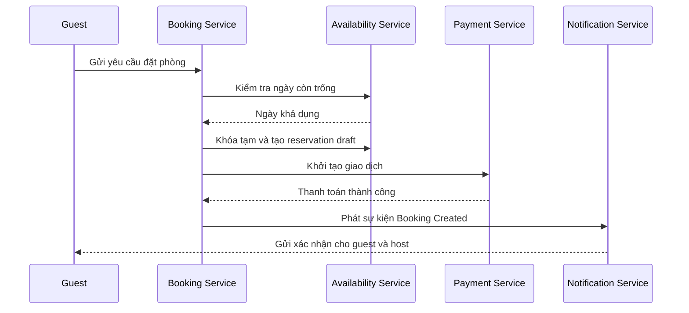

# 🏗️ High-Level Design nền tảng cho thuê nhà: Service, API & giao tiếp

> Nguồn: `095-High-Level-Design-Services-APIs-Communication.txt` · [Udemy](https://ua.udemy.com/course/mastering-system-design-from-basics-to-cracking-interviews/learn/lecture/49841683)

Chúng ta đã hiểu yêu cầu, ước lượng quy mô và nhận diện điểm nghẽn. Giờ là lúc bước vào **bước 3 — thiết kế high-level**. Ở giai đoạn này, mình chưa đi vào chi tiết triển khai, mà tập trung chia hệ thống thành những phần có **trách nhiệm rõ ràng**, rồi xem chúng phối hợp với nhau như thế nào trong luồng booking.

---

### 🏗️ Kiến trúc high-level: API gateway & các microservice

Người dùng tương tác với nền tảng qua ứng dụng **web và mobile**. Dù dùng client nào, mọi request đều đi qua **API gateway (cổng API)** trước tiên — điểm vào duy nhất của hệ thống, đảm nhận **xác thực, định tuyến request và rate limiting (giới hạn tần suất)**, rồi chuyển tiếp tới service phù hợp.

Phía sau gateway, nền tảng được tổ chức thành các **microservices (vi dịch vụ)** lõi, mỗi service phụ trách một năng lực nghiệp vụ:

* **User service** — tài khoản, xác thực, hồ sơ và tùy chọn người dùng.
* **Listing service** — thông tin chỗ ở: mô tả, tiện nghi và các chi tiết listing.
* **Search service** — tách riêng vì tìm kiếm có khối lượng lớn và yêu cầu hiệu năng rất khác, cần tối ưu độc lập cho tìm kiếm nhanh, có bộ lọc và theo địa lý.
* **Availability service** — duy trì lịch booking, theo dõi ngày nào còn có thể đặt.
* **Booking service** — quản lý vòng đời của một lượt đặt phòng.
* **Payment service** — tích hợp nhà cung cấp thanh toán bên ngoài và theo dõi trạng thái thanh toán.
* **Notification service** — thông báo các sự kiện quan trọng như xác nhận hay hủy booking.
* **Review & rating service** — quản lý phản hồi của người dùng sau kỳ lưu trú.
* **Media service (hỗ trợ)** — lưu trữ và phục vụ ảnh, video.
* **Calendar sync service (hỗ trợ)** — giữ availability đồng bộ với các nhà cung cấp lịch bên ngoài.
* **Analytics & logging service (hỗ trợ)** — thu thập dữ liệu vận hành để giám sát sức khỏe hệ thống và hiểu hành vi người dùng.

Nguyên tắc then chốt ở đây là **separation of responsibilities (tách biệt trách nhiệm)**: mỗi service sở hữu một phần nghiệp vụ riêng và có thể tiến hóa, scale, bảo trì độc lập. Ví dụ, search service có thể scale để xử lý hàng triệu truy vấn mà không ảnh hưởng booking service, còn media service lớn lên độc lập khi nhu cầu lưu trữ tăng. Chính sự tách biệt này là nền tảng của một kiến trúc có khả năng mở rộng.

---

### 🔁 Luồng booking: các service phối hợp như thế nào?

1. Request của guest đi tới **booking service**, nhưng trước khi tạo reservation, nó phải xác minh ngày đã chọn vẫn còn trống — việc của **availability service**.
2. Nếu ngày còn trống, booking service **khóa tạm (temporarily lock)** chúng và tạo **reservation draft**. Đây là bước rất quan trọng: nó ngăn người khác đặt cùng chỗ ở trong lúc giao dịch đang diễn ra.
3. Tiếp theo là thanh toán: booking service phối hợp với **payment service** để khởi tạo và xác minh giao dịch qua nhà cung cấp bên ngoài. Booking **chưa** được coi là hoàn tất — nó chỉ được xác nhận sau khi thanh toán thành công, lúc đó booking service chốt reservation, cập nhật trạng thái và biến nó thành chính thức.
4. Sau đó, **notification service** thông báo cho cả guest lẫn host qua email hoặc tin nhắn.

Một chi tiết kiến trúc đáng chú ý: **không phải mọi tương tác đều cần diễn ra đồng bộ**. Người dùng không cần ngồi chờ trong lúc email được gửi hay xử lý nền đang chạy. Những tác vụ đó có thể xử lý **bất đồng bộ qua message queue (hàng đợi thông điệp)** như RabbitMQ hoặc Kafka, giúp luồng booking luôn phản hồi nhanh, đồng thời cải thiện scalability và độ bền của hệ thống.

Điều đáng nhớ: mỗi service làm đúng một trách nhiệm, rồi cùng phối hợp để hoàn thành nghiệp vụ end-to-end. Cách tách biệt đó giúp hệ thống dễ scale, dễ bảo trì và dễ tiến hóa, thay vì biến mọi request thành một giao dịch lớn, gắn chặt vào nhau.

---

### 🔌 Mẫu giao tiếp, API & bảo mật

Không phải tương tác nào cũng có cùng yêu cầu, nên ta dùng **nhiều mẫu giao tiếp khác nhau** tùy bản chất công việc.

* **Giao tiếp đồng bộ (synchronous)** cho thao tác hướng người dùng: khách tìm kiếm, mở listing hay gửi yêu cầu đặt phòng đều mong phản hồi tức thì. Những request này thường là **REST API** expose qua API gateway; các lời gọi service-to-service cần hiệu năng cao có thể dùng **gRPC** khi phù hợp.
* **Giao tiếp bất đồng bộ (asynchronous)** cho việc chạy nền: khi một booking được tạo, hệ thống có thể phát sự kiện như **Booking Created**. Các service khác phản ứng độc lập — gửi thông báo, đồng bộ lịch ngoài, xử lý các tác vụ tiếp theo — mà không làm chậm phản hồi xác nhận của người dùng.
* **Webhooks** — nhà cung cấp thanh toán thường thông báo cho hệ thống qua webhook. Cơ chế này vốn bất đồng bộ và rất hợp với kiến trúc **event-driven (hướng sự kiện)**.
* Message queue hoặc event bus giúp **decouple (tách rời)** các service: thay vì service nào cũng gọi trực tiếp service khác, chúng giao tiếp qua sự kiện — nhờ đó hệ thống dễ mở rộng và chống chịu lỗi tốt hơn.

Về **bảo mật**, mọi request đi vào nền tảng phải được xác thực, thường dùng **OAuth2** và **JWT-based access token (token truy cập)**. Sau khi danh tính được xác minh, **authorization (phân quyền)** quyết định người dùng được làm gì: guest được tìm kiếm và đặt phòng; host được quản lý listing và availability; admin có thêm quyền kiểm duyệt nội dung và quản lý nền tảng. Ý chính là **chọn mẫu giao tiếp theo nhu cầu nghiệp vụ**: dùng đồng bộ khi người dùng đang chờ phản hồi ngay, dùng bất đồng bộ cho công việc nền không cần chặn request. Kết hợp cả hai cho ta hệ thống vừa phản hồi nhanh với người dùng, vừa mở rộng tốt khi traffic tăng.

---

### 🗄️ Lưu trữ, indexing & schema dữ liệu

Một trong những sai lầm lớn nhất trong system design là **cố giải mọi bài toán bằng một database duy nhất**. Thực tế, các loại dữ liệu có mẫu truy cập khác nhau, nên việc dùng nhiều công nghệ lưu trữ — mỗi thứ tối ưu cho một mục đích — là chuyện bình thường.

| Dữ liệu | Công nghệ | Vì sao |
|---|---|---|
| Người dùng, listing, booking... | **Postgres hoặc MySQL** | Cần nhất quán mạnh và giao dịch tin cậy |
| Snapshot, review người dùng | **MongoDB hoặc DynamoDB** | Mẫu truy cập khác, cần scale ngang, đọc ghi khối lượng lớn |
| Tìm kiếm | **Elasticsearch** | Tối ưu cho full-text và truy vấn theo địa lý, giữ DB giao dịch không bị quá tải |
| Dữ liệu truy cập thường xuyên | **Redis** | Phục vụ trực tiếp từ bộ nhớ, nhanh hơn hẳn truy vấn database lặp lại |
| Ảnh và tài sản tĩnh | **CDN** | Phục vụ từ edge location gần người dùng, giảm latency và giảm tải backend |

Thông tin listing vẫn nằm ở database chính; ta chỉ duy trì **search index** riêng trong Elasticsearch để trải nghiệm tìm kiếm luôn nhanh. Về schema, mục tiêu không phải thiết kế từng cột hay index, mà là xác định **các thực thể cốt lõi và quan hệ giữa chúng**:

* **users** — trung tâm cho danh tính, xác thực và hồ sơ; mọi guest, host, admin đều có bản ghi ở đây.
* **listing** — host sở hữu một hoặc nhiều listing, chứa tiêu đề, mô tả, giá, tiện nghi... Đây là "hàng hóa" mà guest duyệt và đặt.
* **availability** — lịch booking, theo dõi ngày nào còn đặt được. Vì thay đổi rất thường xuyên, tách thành thực thể riêng giúp cập nhật dễ hơn mà không đụng đến phần còn lại của listing.
* **bookings** — liên kết người dùng với listing trong một khoảng ngày, đại diện vòng đời booking từ tạo đến hoàn tất hoặc hủy.
* **payments** — tách khỏi bookings để theo dõi độc lập trạng thái giao dịch, lịch sử thanh toán và hoàn tiền.
* **notification & media** — notification lưu lịch sử thông báo đã gửi (xác nhận, nhắc nhở, hủy), hữu ích cho trải nghiệm lẫn xử lý sự cố; media lưu metadata ảnh/video, còn file thật nằm ở cloud object storage và database chỉ giữ tham chiếu.

Schema này bao phủ các workflow chính: khám phá chỗ ở, đặt phòng, thanh toán và quản lý trải nghiệm thuê. Khi hệ thống tiến hóa, các bảng và quan hệ mới sẽ được thêm vào một cách tự nhiên. Và như vậy, chúng ta kết thúc bước 3 của quy trình thiết kế.

---

### 🎯 Tự kiểm tra nhanh

**Câu 1:** API gateway đảm nhận những trách nhiệm gì?

<b>Xem đáp án</b>

**Đáp án:** Là điểm vào duy nhất, xử lý xác thực, định tuyến request và rate limiting.

Giải thích: Sau đó gateway chuyển request tới backend service phù hợp.

Tham chiếu: Mục Kiến trúc high-level.

**Câu 2:** Vì sao search service được tách riêng khỏi các service khác?

<b>Xem đáp án</b>

**Đáp án:** Vì tìm kiếm có khối lượng lớn và yêu cầu hiệu năng rất khác, cần tối ưu độc lập.

Giải thích: Nhờ tách biệt, search service scale được mà không ảnh hưởng booking service.

Tham chiếu: Mục Kiến trúc high-level.

**Câu 3:** Trong luồng booking, vì sao booking service khóa tạm các ngày đã chọn?

<b>Xem đáp án</b>

**Đáp án:** Để ngăn người dùng khác đặt cùng chỗ ở trong lúc giao dịch đang diễn ra.

Giải thích: Khóa tạm đi kèm reservation draft là bước chống đặt trùng.

Tham chiếu: Mục Luồng booking.

**Câu 4:** Khi nào một booking được coi là đã xác nhận?

<b>Xem đáp án</b>

**Đáp án:** Chỉ sau khi thanh toán thành công.

Giải thích: Trước đó booking vẫn chưa hoàn tất; sau đó hệ thống chốt reservation và cập nhật trạng thái.

Tham chiếu: Mục Luồng booking.

**Câu 5:** Vì sao dùng Elasticsearch thay vì tìm kiếm trực tiếp trên database giao dịch?

<b>Xem đáp án</b>

**Đáp án:** Elasticsearch tối ưu cho full-text và truy vấn theo địa lý, giúp tìm kiếm nhanh mà không làm quá tải database giao dịch.

Giải thích: Listing gốc vẫn nằm trong database chính; search index được duy trì riêng.

Tham chiếu: Mục Lưu trữ, indexing & schema dữ liệu.

---

Chúng ta đã có kiến trúc high-level, luồng booking, mẫu giao tiếp và chiến lược dữ liệu. Ở bài tiếp theo, mình và các bạn sẽ **biến những hiểu biết này thành các quyết định công nghệ & hạ tầng cụ thể** — bước 4 của quy trình thiết kế. Hẹn gặp lại các bạn! 🚀
