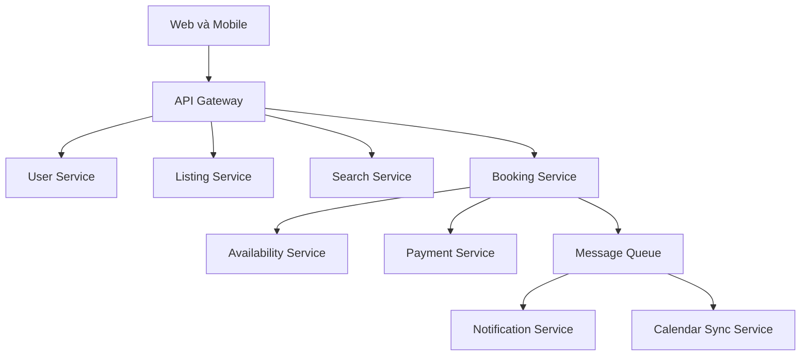

# 🗺️ Kiến trúc cuối cùng của nền tảng cho thuê nhà — nhìn từ trên cao

> Nguồn: `097-The-Final-Design---Online-Rental-Platform.txt` · [Udemy](https://ua.udemy.com/course/mastering-system-design-from-basics-to-cracking-interviews/learn/lecture/49841697)

Chúng ta đã tới **kiến trúc cuối cùng** của nền tảng cho thuê nhà. Thay vì soi từng service riêng lẻ, bài này mình và các bạn sẽ lùi lại một bước để thấy tất cả phối hợp với nhau như thế nào — từ request đầu tiên cho tới khi một booking hoàn tất.

---

### 🗺️ Nhìn toàn cảnh: request đi qua đâu?

Mọi thứ bắt đầu từ **ứng dụng web và mobile**. Mỗi request của client đều đi vào **API gateway** — điểm vào duy nhất của backend. Từ đó, request được định tuyến tới microservice phù hợp, còn **xác thực, phân quyền và rate limiting** đều được xử lý tập trung ngay tại gateway.

Các năng lực nghiệp vụ được chia cho những service chuyên trách:

* **User service** — danh tính và hồ sơ.
* **Listing service** — thông tin chỗ ở.
* **Search service** — khám phá listing nhanh, theo địa lý.
* **Availability service** — lịch đặt phòng.
* **Booking service** — quản lý reservation.
* **Payment service** — phối hợp với nhà cung cấp thanh toán bên ngoài.
* **Notification service** — liên lạc với người dùng.
* **Review & rating service** — phản hồi sau các kỳ lưu trú đã hoàn tất.

Hỗ trợ phía sau là **media service** (lưu và phân phối ảnh, video), **calendar sync service** (giữ lịch trống của host đồng bộ với lịch bên ngoài) và **analytics & logging service** (tầm nhìn vận hành để giám sát và xử lý sự cố).

Mỗi service **sở hữu database riêng**, nên có thể tiến hóa và scale độc lập. Tìm kiếm chạy trên **search index** chuyên dụng, dữ liệu truy cập thường xuyên được phục vụ từ **Redis**, còn media phân phối qua **CDN**. Nhờ vậy mỗi thành phần được tối ưu cho đúng workload của nó, thay vì bắt một công nghệ giải mọi bài toán.

---

### 🔁 Theo chân một hành trình booking

Các service giao tiếp theo cách khác nhau tùy nhu cầu nghiệp vụ:

* Request hướng người dùng — tìm kiếm, xem listing — xử lý **đồng bộ** để có phản hồi tức thì.
* Tác vụ nền — gửi thông báo, đồng bộ lịch, phản ứng với sự kiện thanh toán — xử lý **bất đồng bộ** qua message queue. Nhờ đó trải nghiệm booking luôn phản hồi nhanh, còn hệ thống vẫn scale bền vững dưới tải cao.

Nếu đi theo một hành trình đặt phòng điển hình, luồng trở nên rất rõ:

1. Guest tìm kiếm chỗ ở và xem chi tiết listing.
2. Guest kiểm tra availability và khởi tạo booking.
3. **Booking service** phối hợp với **availability service** để giữ ngày, làm việc với **payment service** để hoàn tất giao dịch, rồi chốt reservation.
4. Booking service phát sự kiện, kích hoạt thông báo và các tiến trình nền khác.

Xuyên suốt workflow, mỗi service chỉ tập trung vào trách nhiệm của mình, đồng thời cộng tác với những service khác để hoàn thành nghiệp vụ end-to-end.

---

### 🎓 Bài học lớn: yêu cầu dẫn dắt kiến trúc

Điều quan trọng nhất rút ra từ case study này **không phải** những công nghệ riêng lẻ đã chọn, mà là **tư duy kiến trúc đằng sau thiết kế**. Ta bắt đầu bằng việc hiểu bài toán, định nghĩa yêu cầu chức năng và phi chức năng, ước lượng quy mô, nhận diện điểm nghẽn — rồi để chính những điều đó định hình kiến trúc. Đó là cách các kiến trúc sư giàu kinh nghiệm tiếp cận system design:

**Yêu cầu dẫn dắt kiến trúc, và kiến trúc dẫn dắt lựa chọn công nghệ.**

Cùng một quy trình có cấu trúc như vậy áp dụng được cho gần như mọi hệ phân tán quy mô lớn: nền tảng cho thuê, sàn thương mại điện tử, ứng dụng gọi xe hay mạng xã hội. Khi đã quen suy nghĩ theo **yêu cầu, quy mô, trách nhiệm và trade-off**, thiết kế hệ thống phức tạp trở thành một quy trình kỹ thuật lặp lại được — chứ không còn là bài học vẹt kiến trúc.

Và như vậy, chúng ta khép lại case study này. Ở section tiếp theo, mình và các bạn sẽ áp dụng đúng quy trình đó cho một bài toán thực tế mới. Hẹn gặp lại các bạn! 🚀
