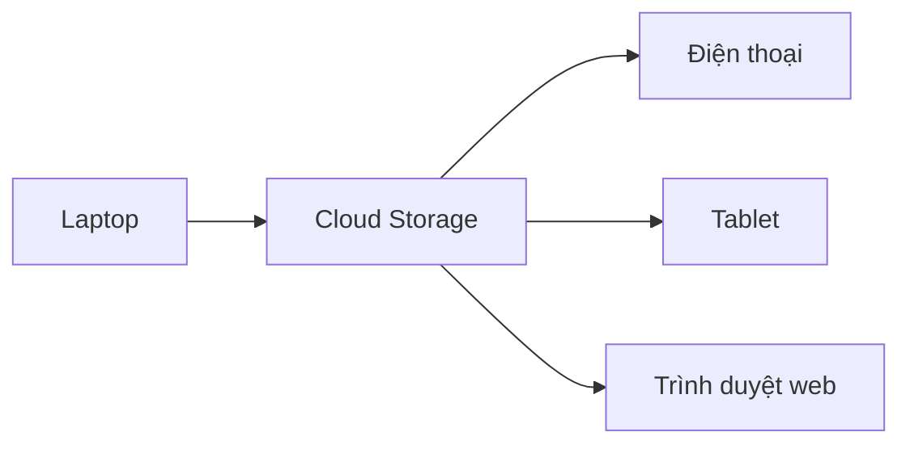

# ☁️ Design dịch vụ lưu trữ đám mây: Hiểu bài toán & xác định phạm vi

> Nguồn: `098-Understanding-the-Problem-Defining-the-Scope.txt` · [Udemy](https://ua.udemy.com/course/mastering-system-design-from-basics-to-cracking-interviews/learn/lecture/49872211)

Chúng ta bắt đầu case study mới: **thiết kế một dịch vụ lưu trữ đám mây** kiểu Google Drive hay Dropbox. Đây là bài toán lưu trữ, đồng bộ và chia sẻ **hàng tỷ file** — nên trước khi nói về kiến trúc, mình muốn các bạn cùng làm rõ bài toán, các yêu cầu và những ràng buộc sẽ dẫn dắt toàn bộ thiết kế phía sau.

---

### 🎯 Bài toán: không chỉ là nơi cất file

Mục tiêu là xây một hệ thống lưu trữ file trên cloud tương tự Google Drive hoặc Dropbox, nơi người dùng có thể **tải lên và tổ chức gần như mọi loại file** — từ tài liệu, hình ảnh đến video lớn — và truy cập chúng bất cứ khi nào cần.

Nhưng lưu trữ đơn thuần là chưa đủ. Một trong những kỳ vọng cốt lõi là **đồng bộ liền mạch (seamless synchronization) giữa các thiết bị**. Nếu người dùng tải lên hoặc chỉnh sửa một file trên laptop, thay đổi đó phải xuất hiện trên điện thoại, tablet và trình duyệt web mà không cần bất kỳ thao tác thủ công nào. Chính trải nghiệm nhất quán này làm nên giá trị thật sự của lưu trữ đám mây.

Nền tảng cũng phải giúp **cộng tác (collaboration)** trở nên đơn giản và an toàn. Người dùng cần chia sẻ file, thư mục với người khác, đồng thời kiểm soát ai được xem, ai được sửa. Bảo mật và kiểm soát truy cập quan trọng ngang với chính tính năng chia sẻ.

Một thách thức lớn nữa là **quy mô**. Một hệ thống production như thế này không phục vụ vài người dùng, mà **hàng triệu người dùng, hàng tỷ file và hàng petabyte dữ liệu**. Mọi quyết định thiết kế về sau đều phải tính đến mức tăng trưởng đó.

Cuối cùng, người dùng kỳ vọng dữ liệu của họ được an toàn: nếu file bị xóa hay chỉnh sửa nhầm, họ phải khôi phục được hoặc quay lại phiên bản trước. **Duy trì lịch sử phiên bản không chỉ là tiện ích — đó là phần thiết yếu của một nền tảng lưu trữ đáng tin cậy.**

Vậy mục tiêu của chúng ta không phải xây một nơi cất file đơn thuần, mà là một hệ thống lưu trữ **có khả năng mở rộng cao, đáng tin cậy và hỗ trợ cộng tác**, mang lại trải nghiệm liền mạch trên mọi thiết bị và bảo vệ dữ liệu người dùng.

---

### 🧩 Yêu cầu chức năng: người dùng mong đợi gì?

Đây là những năng lực mà người dùng kỳ vọng ở bất kỳ nền tảng lưu trữ hiện đại nào, và chúng sẽ dẫn dắt nhiều quyết định kiến trúc phía sau:

1. **Tải lên và tải xuống file mọi loại** — lưu dữ liệu an toàn và lấy lại bất cứ lúc nào, trên bất kỳ thiết bị nào.
2. **Đồng bộ đa thiết bị liền mạch** — file được tạo, cập nhật hay xóa trên một thiết bị phải nhanh chóng phản ánh sang các thiết bị còn lại. Đây là đặc trưng phân biệt lưu trữ đám mây với lưu trữ cục bộ truyền thống.

3. **Tổ chức nội dung** — khi người dùng tích lũy hàng nghìn file, hệ thống phải hỗ trợ thư mục, thư mục lồng nhau (nested directories) và gắn thẻ (tagging) để cấu trúc và tìm kiếm nội dung hiệu quả.
4. **Cộng tác** — chia sẻ file/thư mục bằng link công khai hoặc riêng tư, kèm quyền chỉ xem hoặc được chỉnh sửa. Chia sẻ giờ đây không còn là tính năng tùy chọn mà là kỳ vọng cốt lõi.
5. **Lịch sử phiên bản (versioning)** — hệ thống giữ lại các phiên bản trước để người dùng quay lui khi cần, mang lại cả linh hoạt lẫn an toàn dữ liệu.
6. **Thùng rác (trash/recycle bin)** — xóa file không nên là xóa vĩnh viễn ngay lập tức; file được chuyển vào thùng rác để người dùng có cơ hội khôi phục trước khi bị xóa thật.

Điểm đáng chú ý: mọi tính năng kể trên đều là thứ người dùng tương tác trực tiếp. Nhìn từ bên ngoài chúng có vẻ đơn giản, nhưng hỗ trợ chúng một cách tin cậy, hiệu quả ở quy mô hàng triệu người dùng lại mở ra những thách thức kiến trúc không nhỏ.

---

### ⚙️ Yêu cầu phi chức năng & những đánh đổi

Sau khi biết hệ thống **làm gì**, ta cần định nghĩa nó phải **làm tốt đến đâu** — và những yêu cầu này ảnh hưởng đến kiến trúc còn mạnh hơn từng tính năng riêng lẻ.

* **Scalability (khả năng mở rộng)** — chạy ổn định khi tăng từ vài nghìn lên hàng triệu người dùng, lưu hàng petabyte mà không phải thiết kế lại.
* **High availability & durability (sẵn sàng & bền vững dữ liệu)** — file vẫn truy cập được ngay cả khi từng thành phần gặp lỗi. Về durability, ta muốn xác suất mất file cực kỳ nhỏ, nên các nền tảng lưu trữ thường nhắm tới mức **"multiple nines"** (nhiều số 9).
* **Performance (hiệu năng)** — dù tải lên một tài liệu nhỏ hay tải xuống một video lớn, hệ thống đều phải phản hồi nhanh và mượt. Độ trễ thấp ảnh hưởng trực tiếp đến cảm giác "nhanh" của nền tảng.
* **Security (bảo mật)** — file phải được bảo vệ khỏi truy cập trái phép **cả khi truyền lẫn khi lưu trữ**. Kết hợp với chia sẻ an toàn và kiểm soát truy cập mạnh, người dùng luôn nắm quyền kiểm soát dữ liệu của mình.
* **Cost efficiency (hiệu quả chi phí)** — lưu khối lượng dữ liệu khổng lồ và phục vụ hàng tỷ lượt tải có thể cực kỳ tốn kém, nên kiến trúc phải dùng storage, bandwidth và hạ tầng một cách hiệu quả.
* **Observability (khả năng quan sát)** — cần nhìn thấy lỗi API, độ trễ đồng bộ, mức dùng storage và sức khỏe hệ thống để phát hiện, xử lý vấn đề trước khi chúng ảnh hưởng người dùng.

Một điều quan trọng cần nhớ: **những phẩm chất này thường cạnh tranh lẫn nhau**, và system design phần lớn là tìm điểm cân bằng giữa chúng.

| Khi ta muốn... | ...thì thường phải đánh đổi |
|---|---|
| Tăng durability | Chi phí lưu trữ tăng |
| Giảm latency | Cần thêm hạ tầng |
| Tăng cường bảo mật | Phát sinh overhead xử lý |

Những trade-off này sẽ xuất hiện xuyên suốt case study và định hình kiến trúc của chúng ta.

---

### 📦 Giả định & ràng buộc: nền móng của kiến trúc

Trước khi bắt tay thiết kế, ta cần thiết lập vài giả định và ràng buộc — chúng định nghĩa **ranh giới hệ thống** và ảnh hưởng mạnh đến mọi quyết định về sau.

**Giả định:**

* **Người dùng có thể tải lên file lớn tới 5 GB.** Điều này nói ngay rằng upload bằng một request đơn lẻ là không đủ — hệ thống phải chia nhỏ thành các chunk (khối) để truyền file lớn một cách tin cậy.
* **Người dùng truy cập file từ nhiều thiết bị** — đồng bộ vì thế không còn là tùy chọn mà trở thành yêu cầu nền tảng: mỗi khi file thay đổi, mọi thiết bị đang kết nối phải phản ánh thay đổi đó nhanh và nhất quán.
* **Nội dung file thật được lưu trong cloud object storage** — điều này dẫn tới việc tách **metadata của file** khỏi **nội dung file**, để mỗi phần được quản lý và scale độc lập.
* **Xác thực và danh tính người dùng do một service khác đảm nhiệm** — nhờ vậy case study tập trung vào chính nền tảng lưu trữ, trong khi quyền hạn vẫn được thực thi cho mọi thao tác.

**Ràng buộc:**

* **Upload phải có khả năng resume (tiếp tục)** — nếu kết nối mạng đứt giữa chừng khi đang truyền file lớn, người dùng tiếp tục từ chỗ dừng thay vì bắt đầu lại từ đầu.
* **Độ trễ đồng bộ mục tiêu dưới 5 giây** — cập nhật phải lan truyền nhanh giữa các thiết bị, điều này ảnh hưởng đến cách các thành phần giao tiếp với nhau.
* **Storage phải tiết kiệm chi phí** — ở quy mô này, những khoản kém hiệu quả nhỏ cũng có thể chuyển thành chi phí hạ tầng đáng kể, nên kiến trúc phải tối ưu cách dữ liệu được lưu theo thời gian.
* **Kiểm soát truy cập chi tiết (fine-grained)** — người dùng chia sẻ file/thư mục an toàn và kiểm soát chính xác ai được xem, ai được sửa.

Dù trông như chi tiết triển khai, những giả định và ràng buộc này chính là **nền móng của kiến trúc**: chúng xác định bài toán mà thiết kế phải giải và là tiêu chí để đánh giá mọi quyết định phía sau.

---

### 🎯 Tự kiểm tra nhanh

**Câu 1:** Vì sao upload một request đơn lẻ không đủ cho hệ thống này?

<b>Xem đáp án</b>

**Đáp án:** Vì người dùng có thể tải file tới 5 GB, cần chia nhỏ thành chunk để truyền tin cậy.

Giải thích: Chunking cũng là nền tảng cho upload có thể resume sau khi mất kết nối.

Tham chiếu: Mục Giả định & ràng buộc.

**Câu 2:** Mục tiêu độ trễ đồng bộ giữa các thiết bị là bao nhiêu?

<b>Xem đáp án</b>

**Đáp án:** Dưới 5 giây.

Giải thích: Đây là ràng buộc ảnh hưởng đến cách các thành phần giao tiếp với nhau.

Tham chiếu: Mục Giả định & ràng buộc.

**Câu 3:** Vì sao phải tách metadata khỏi nội dung file?

<b>Xem đáp án</b>

**Đáp án:** Nội dung file lưu ở object storage, metadata lưu riêng để mỗi phần được quản lý và scale độc lập.

Giải thích: Đây là hệ quả tự nhiên từ giả định dùng cloud object storage cho nội dung file.

Tham chiếu: Mục Giả định & ràng buộc.

**Câu 4:** Xóa file nên diễn ra như thế nào?

<b>Xem đáp án</b>

**Đáp án:** File được chuyển vào trash/recycle bin thay vì xóa vĩnh viễn ngay, để người dùng còn cơ hội khôi phục.

Giải thích: Đây là yêu cầu chức năng nhằm bảo vệ người dùng khỏi xóa nhầm.

Tham chiếu: Mục Yêu cầu chức năng.

**Câu 5:** Các yêu cầu phi chức năng liên hệ với nhau thế nào?

<b>Xem đáp án</b>

**Đáp án:** Chúng thường cạnh tranh nhau — tăng durability làm tăng chi phí, giảm latency cần thêm hạ tầng, tăng bảo mật thêm overhead.

Giải thích: System design phần lớn là tìm điểm cân bằng giữa các mục tiêu cạnh tranh này.

Tham chiếu: Mục Yêu cầu phi chức năng & những đánh đổi.

---

Vậy là chúng ta đã chốt xong bài toán, yêu cầu và ràng buộc cho dịch vụ lưu trữ đám mây. Ở bài tiếp theo, mình và các bạn sẽ **ước lượng quy mô** — 10 triệu người dùng, hàng tỷ file, hàng petabyte dữ liệu — và nhận diện những điểm nghẽn quan trọng nhất. Hẹn gặp lại các bạn! 🚀
