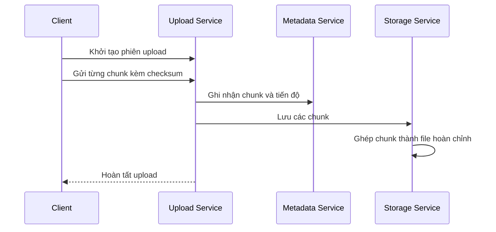

# 🧩 High-Level Design dịch vụ lưu trữ đám mây: service, API & giao tiếp

> Nguồn: `100-High-Level-Design-Services-APIs-Communication.txt` · [Udemy](https://ua.udemy.com/course/mastering-system-design-from-basics-to-cracking-interviews/learn/lecture/49872215)

Sau khi đã hiểu yêu cầu và các thách thức, chúng ta bước vào **bước 3 — thiết kế high-level** cho dịch vụ lưu trữ đám mây. Mục tiêu là chia hệ thống thành những thành phần lớn, mỗi service một trách nhiệm rõ ràng, rồi thiết kế API, cách giao tiếp và chiến lược dữ liệu cho chúng.

---

### 🧩 Các service chính & trách nhiệm

Mỗi service phụ trách một phần việc được định nghĩa rõ, giúp toàn hệ thống dễ scale, dễ bảo trì và dễ tiến hóa:

* **Upload service** — nhận file từ người dùng. Vì upload lớn có thể bị ngắt, nó xử lý **chunk transfer (truyền theo khối)** và **resumable upload session (phiên upload tiếp tục được)**, để file vẫn lên được an toàn kể cả trên kết nối chập chờn.
* **Metadata service** — quản lý mọi thứ về file **trừ nội dung file**: cây thư mục, quyền sở hữu, quyền truy cập và các metadata khác phục vụ duyệt, tìm kiếm.
* **Auth service** — trước mọi thao tác, xác minh người dùng có quyền cần thiết: upload, download hay truy cập thư mục chia sẻ. Ủy quyền được thực thi nhất quán trên toàn nền tảng.
* **Sync service** — phát hiện thay đổi và phân phối cập nhật gần như tức thời, để người dùng luôn thấy phiên bản mới nhất trên mọi thiết bị.
* **Storage service** — tương tác với hạ tầng **cloud object storage** nơi dữ liệu file thật nằm. Tách thao tác lưu trữ khỏi phần còn lại giúp scale lưu trữ độc lập với metadata và logic nghiệp vụ.
* **Deduplication service** — nhận diện các chunk giống hệt nhau và tránh lưu trùng dữ liệu, giúp giảm cả chi phí lưu trữ lẫn băng thông.
* **Versioning service** — giữ các phiên bản trước của file và hỗ trợ **soft deletion (xóa mềm)**, cho người dùng khôi phục file đã xóa hoặc quay lui phiên bản cũ khi cần.

Cách tách biệt trách nhiệm này không chỉ làm hệ thống dễ hiểu hơn, mà còn cho phép từng service scale độc lập theo workload của nó — nguyên tắc then chốt khi thiết kế hệ phân tán lớn.

---

### 🔌 Thiết kế API & cách các service giao tiếp

API mà client dùng để tương tác với nền tảng không chỉ để "mở" tính năng, mà còn phải hỗ trợ **độ tin cậy, khả năng mở rộng và trải nghiệm tốt**.

* **Upload API** — thay vì gửi cả file trong một request, quá trình chia thành nhiều bước: client **khởi tạo phiên upload**, **gửi file theo từng chunk**, và **hoàn tất** khi mọi chunk đã được truyền. Cách này khiến upload resume được và chống đứt kết nối tốt hơn hẳn.
* **Download API tách khỏi metadata API** — tải nội dung file và lấy thông tin như quyền, lịch sử phiên bản hay quyền sở hữu là hai thao tác có mẫu truy cập khác nhau; tách API giúp mỗi request gọn và hiệu quả.
* **Sharing API** — người dùng tạo link chia sẻ công khai hoặc riêng tư, người nhận truy cập nội dung qua link — cộng tác được mà không lộ cấu trúc lưu trữ nội bộ của hệ thống.
* **Sync API** — cho client phát hiện thay đổi và nhận cập nhật mỗi khi file/thư mục bị sửa, giúp mọi thiết bị bắt kịp với độ trễ tối thiểu.

Các API này được thiết kế theo đúng thực tế production: **được bảo mật, theo nguyên tắc RESTful, hỗ trợ idempotent (bất biến khi lặp) ở những chỗ phù hợp, và cho phép upload tiếp tục an toàn sau khi thất bại**. Metadata cũng được xử lý tách khỏi nội dung file để từng phần scale độc lập. *Khi xem các endpoint, đừng chỉ nhìn mẫu URL — hãy nghĩ tới workflow mà chúng mở ra.*

Về giao tiếp, hệ thống dùng **kết hợp nhiều mẫu** thay vì một cách duy nhất:

* **Đồng bộ (REST hoặc gRPC)** cho thao tác cần phản hồi ngay — ví dụ xác thực quyền hay lấy metadata. Bên gọi chờ phản hồi rồi mới đi tiếp.
* **Bất đồng bộ qua publish-subscribe hoặc message queue** cho công việc nền sau khi upload xong: kích hoạt sync, deduplication, versioning... Nhờ đó người dùng không phải chờ toàn bộ xử lý.
* **Sự kiện (events)** giữ vai trò quan trọng: một hành động như file được upload hay sửa có thể kích hoạt các tiến trình phía sau, giữ service **loosely coupled (liên kết lỏng)** và dễ mở rộng về sau.
* **WebSocket hoặc long polling** cho yêu cầu thời gian thực của đồng bộ — đẩy cập nhật tới client thay vì để client liên tục hỏi lại.

Không có mẫu giao tiếp nào là tối ưu cho mọi tình huống — chọn đúng cách cho từng tương tác là một phần quan trọng của thiết kế hệ phân tán.

---

### 📦 Chunking, versioning, lưu trữ & caching

**Chunking cho file lớn.** File lớn có thể mất hàng phút để tải lên, rất dễ gặp ngắt kết nối, timeout hay rớt mạng. Vì vậy hệ thống chia file thành các chunk nhỏ, ví dụ **5 MB mỗi chunk**. Mỗi chunk được upload độc lập — tuần tự hoặc song song để tăng tốc — và mang **checksum** riêng để hệ thống kiểm tra tính toàn vẹn trước khi nhận. Metadata service theo dõi chunk nào đã nhận, phiên upload và tiến độ tổng thể; khi mọi chunk đã lên đủ, storage service **ghép chúng thành file hoàn chỉnh**. Trước thời điểm đó, upload vẫn được coi là chưa hoàn tất.

Chunking khiến upload bền bỉ hơn hẳn: chunk nào lỗi thì chỉ chunk đó cần thử lại, và nếu mất mạng giữa chừng, client **tiếp tục từ chunk thành công cuối cùng** thay vì làm lại từ đầu — tiết kiệm cả thời gian lẫn băng thông.

**Versioning.** Nguyên tắc cơ bản: **không thay thế file cũ mỗi lần cập nhật**, mà giữ lại lịch sử để người dùng xem lại hoặc quay về trạng thái tốt đã biết. Metadata service lưu thông tin phiên bản gồm **version ID và timestamp**; mỗi lần file được cập nhật, hệ thống tạo **bản ghi phiên bản mới** thay vì ghi đè, và mỗi phiên bản có ID riêng để truy xuất hay khôi phục qua API. Câu hỏi quan trọng: **khi nào mới nên tạo phiên bản mới?** Hệ thống so sánh **hash của file hoặc từng chunk** để biết nội dung có thực sự đổi không; nếu không đổi, tạo thêm phiên bản chỉ tốn storage và phình metadata. Chỉ khi nội dung khác thật sự thì phiên bản mới mới được sinh ra — vừa có lịch sử đầy đủ của những thay đổi có nghĩa, vừa tiết kiệm tài nguyên.

**Chiến lược lưu trữ.** Nội dung file nằm trong **object storage** và được lưu dưới dạng chunk — khớp tự nhiên với chiến lược upload, hỗ trợ tải song song và đơn giản hóa khôi phục khi một phần upload lỗi. Object storage có **replication gắn sẵn** (duy trì nhiều bản sao), giúp tăng durability, availability và giữ file truy cập được khi từng node lưu trữ gặp lỗi. Metadata thì khác: thông tin như tên file, quyền sở hữu, quyền truy cập, quan hệ thư mục có cấu trúc cao và nhiều ràng buộc — rất phù hợp với **SQL database**. Trong khi đó, dữ liệu linh hoạt, tiến hóa theo thời gian như log hay thuộc tính động lại hợp với **NoSQL** hơn vì không cần schema cứng và scale nhanh được. Ta không chọn giữa SQL và NoSQL — ta dùng mỗi công nghệ ở nơi nó mang lại giá trị nhất.

**Caching.** Metadata như tên file, cấu trúc thư mục, quyền hạn được đọc thường xuyên hơn nhiều so với ghi, nên đưa vào **in-memory cache** giúp phục vụ phần lớn read request nhanh hơn và giảm truy vấn database. Nội dung file có mẫu truy cập khác: file lớn tốn nhiều băng thông, nhất là khi được tải lặp lại từ nhiều vùng — vì vậy ta cache file hay dùng tại **CDN edge location** gần người dùng. Cache kéo theo thách thức **nhất quán**: khi file hoặc metadata thay đổi, cache phải không được để dữ liệu cũ. Hệ thống dùng **sự kiện** để thông báo cho các thành phần, kích hoạt cập nhật hoặc **invalidation (vô hiệu hóa cache)**. Suy cho cùng, caching không chỉ để nhanh hơn — nó giảm tải backend trong khi vẫn mang dữ liệu mới đến người dùng.

---

### 🗄️ Schema dữ liệu: chọn database theo bản chất dữ liệu

Mục tiêu ở đây không phải thiết kế từng bảng, mà là hiểu **loại dữ liệu nào nên nằm ở đâu và vì sao**.

| Loại dữ liệu | Lựa chọn | Vì sao |
|---|---|---|
| Người dùng, tài khoản, quan hệ | SQL | Cần nhất quán mạnh, schema rõ ràng |
| Metadata file (tên, sở hữu, thư mục, quyền) | SQL | Dữ liệu có cấu trúc, nhiều quan hệ |
| Thuộc tính file linh hoạt, tiến hóa | NoSQL | Không hợp schema cứng |
| Theo dõi chunk (chunk tracking) | NoSQL | Khối lượng lớn, trạng thái theo dõi độc lập |
| Thông tin phiên bản | SQL — và NoSQL khi tăng scale | Quan hệ file - phiên bản mang tính cấu trúc |
| Quyền truy cập (permissions) | SQL | Mọi thao tác phụ thuộc ủy quyền chính xác |
| Audit logging | SQL và NoSQL | Log quản trị có cấu trúc; log truy cập khối lượng lớn cần scale |

* **User management** là ví dụ điển hình của dữ liệu có cấu trúc, cần nhất quán mạnh — SQL rất tự nhiên.
* **File metadata** phần lớn cũng có cấu trúc; một số thuộc tính động có thể đẩy sang NoSQL.
* **Chunk tracking** có yêu cầu rất khác: mỗi file lớn chia thành nhiều chunk và trạng thái upload của từng chunk phải được theo dõi độc lập — một NoSQL store scale tốt là lựa chọn phù hợp.
* **Version** có quan hệ file - phiên bản mang tính cấu trúc nên SQL hữu ích; khi số phiên bản tăng, NoSQL hỗ trợ scale tốt hơn.
* **Permissions** là nơi nhất quán cực kỳ quan trọng — thông tin kiểm soát truy cập được giữ trong SQL.
* **Audit logs** chia hai loại: thay đổi quyền hay thao tác quản trị có cấu trúc, hợp với SQL; còn sự kiện truy cập file khối lượng lớn tăng rất nhanh, NoSQL phù hợp hơn.

Không có database nào lý tưởng cho mọi workload. Thay vì ép mọi dữ liệu vào một công nghệ, ta chọn database khớp nhất với **độ nhất quán, khả năng mở rộng và mẫu truy cập** của từng loại dữ liệu. Và như vậy, chúng ta kết thúc bước 3 của case study.

---

### 🎯 Tự kiểm tra nhanh

**Câu 1:** Deduplication service giúp gì cho hệ thống?

<b>Xem đáp án</b>

**Đáp án:** Nhận diện các chunk giống hệt nhau, tránh lưu trùng, giảm chi phí lưu trữ và băng thông.

Giải thích: Đây là một trong các service hỗ trợ giúp tối ưu chi phí ở quy mô petabyte.

Tham chiếu: Mục Các service chính & trách nhiệm.

**Câu 2:** Vì sao upload được chia thành nhiều bước thay vì một request?

<b>Xem đáp án</b>

**Đáp án:** Để upload có thể resume và chống chịu ngắt kết nối tốt hơn.

Giải thích: Client khởi tạo phiên, gửi từng chunk, rồi hoàn tất khi mọi chunk đã lên đủ.

Tham chiếu: Mục Thiết kế API & cách các service giao tiếp.

**Câu 3:** Mỗi chunk mang theo gì để kiểm tra tính toàn vẹn?

<b>Xem đáp án</b>

**Đáp án:** Checksum riêng.

Giải thích: Hệ thống xác minh checksum trước khi chấp nhận chunk.

Tham chiếu: Mục Chunking, versioning, lưu trữ & caching.

**Câu 4:** Khi nào hệ thống tạo phiên bản mới cho một file?

<b>Xem đáp án</b>

**Đáp án:** Chỉ khi nội dung thực sự thay đổi, xác định bằng cách so sánh hash của file hoặc từng chunk.

Giải thích: Nếu nội dung không đổi, tạo phiên bản mới chỉ tốn storage và phình metadata.

Tham chiếu: Mục Chunking, versioning, lưu trữ & caching.

**Câu 5:** Vì sao metadata phù hợp với SQL còn chunk tracking phù hợp với NoSQL?

<b>Xem đáp án</b>

**Đáp án:** Metadata có cấu trúc cao và nhiều quan hệ, cần nhất quán mạnh; chunk tracking khối lượng lớn với trạng thái độc lập cần scale tốt.

Giải thích: Ta chọn database theo bản chất dữ liệu, không ép mọi thứ vào một công nghệ.

Tham chiếu: Mục Schema dữ liệu.

---

Chúng ta đã chia hệ thống thành các service, thiết kế API, chọn mẫu giao tiếp và đi sâu vào chunking, versioning, lưu trữ, caching lẫn schema dữ liệu. Ở bài tiếp theo, mình và các bạn sẽ chốt các **quyết định công nghệ & hạ tầng** cho dịch vụ lưu trữ đám mây — bước 4 của quy trình thiết kế. Hẹn gặp lại các bạn! 🚀
