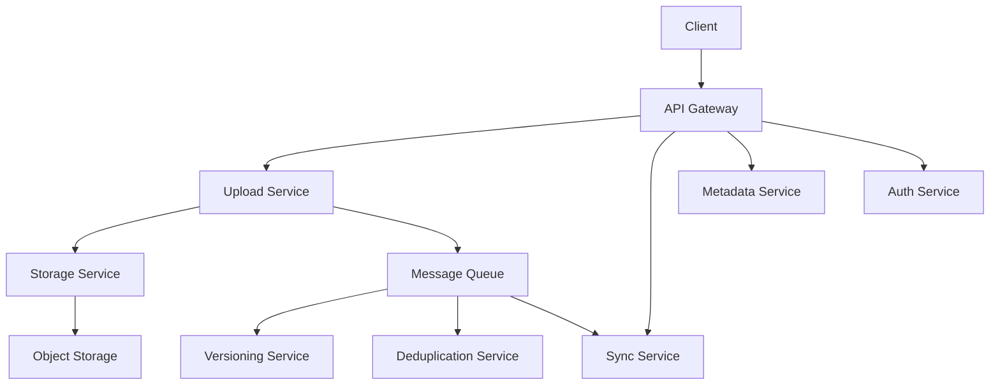

# 🗺️ Kiến trúc cuối cùng của dịch vụ lưu trữ đám mây — nhìn từ trên cao

> Nguồn: `102-The-Final-Design---Cloud-Storage-System.txt` · [Udemy](https://ua.udemy.com/course/mastering-system-design-from-basics-to-cracking-interviews/learn/lecture/49872219)

Chúng ta đã tới **kiến trúc cuối cùng**, nơi mọi quyết định thiết kế xuyên suốt case study hội tụ thành một hệ thống lưu trữ đám mây hoàn chỉnh. Bài này mình và các bạn sẽ nhìn toàn cảnh một lần, rồi theo chân một lần upload từ đầu đến cuối.

---

### 🗺️ Kiến trúc hoàn chỉnh: request đi qua đâu?

Người dùng bắt đầu bằng việc tương tác với hệ thống qua **API gateway** — điểm vào duy nhất. Từ đó, request được định tuyến tới các service chuyên trách theo thao tác đang diễn ra:

* **Upload request** → upload service.
* **Đồng bộ** → sync service.
* **Thao tác metadata** → metadata service.
* Và **mọi request** đều đi qua **auth service** để đảm bảo người dùng có quyền cần thiết.

Khi người dùng upload file, upload service **không truyền nguyên một khối lớn**, mà chia file thành các **chunk** và tải lên an toàn — nhờ đó upload bị ngắt có thể tiếp tục mà không phải làm lại từ đầu. Các chunk thật được lưu vào **object storage** thông qua storage service, trong khi metadata service ghi lại thông tin như quyền sở hữu, cấu trúc thư mục và quyền truy cập.

Phía sau, những service hỗ trợ đảm nhận các tính năng bổ trợ:

* **Versioning service** giữ các phiên bản trước của file để người dùng khôi phục khi cần; **deduplication service** nhận diện các chunk giống hệt nhau, tránh lưu dữ liệu trùng và nhờ đó giảm chi phí lưu trữ.
* Để hiệu năng tốt, metadata truy cập thường xuyên được phục vụ từ **in-memory cache**, còn file được tải phổ biến phân phối qua **CDN** — giảm latency và giảm tải cho tầng lưu trữ.

Một chi tiết đáng chú ý: **không phải mọi thứ diễn ra đồng bộ**. Khi upload hoàn tất, các tác vụ nền như đồng bộ, deduplication và versioning đều xử lý qua **message queue**. Nhờ vậy upload phía người dùng vẫn nhanh, còn công việc bổ sung diễn ra bất đồng bộ và scale độc lập.

---

### 🔁 Theo chân một lần upload end-to-end

Ghép tất cả lại, một quy trình upload điển hình diễn ra như sau:

1. **Client khởi tạo phiên upload** qua API gateway.
2. **Upload service nhận các chunk** và lưu chúng vào object storage.
3. Cùng lúc, **metadata service ghi thông tin file**, còn **versioning service tạo metadata phiên bản** khi phù hợp.
4. **Cập nhật và sự kiện được phát đi**, để sync service thông báo cho người dùng và các thiết bị khác.
5. Cuối cùng, **background worker thực hiện các tác vụ như deduplication** trước khi upload được chốt hoàn toàn.

---

### 🎓 Mỗi yêu cầu đều được đáp ứng

Nếu lùi lại nhìn toàn bộ kiến trúc, các bạn sẽ thấy **mọi yêu cầu lớn đặt ra từ đầu đều đã được xử lý**:

* **Lưu trữ file** — qua chunked upload.
* **Scalability** — nhờ các microservice scale độc lập.
* **Reliability** — đến từ object storage, replication và versioning.
* **Performance** — cải thiện bằng caching và CDN.
* **Security** — thực thi qua ủy quyền tập trung.
* **Đồng bộ thời gian thực** — nhờ giao tiếp event-driven.
* **Chi phí lưu trữ** — tối ưu bằng deduplication.

Đó chính là tinh túy của system design: thay vì giải từng bài toán một cách rời rạc, ta xây một kiến trúc nơi nhiều thành phần phối hợp để thỏa mãn yêu cầu chức năng, đáp ứng yêu cầu phi chức năng và tiếp tục mở rộng khi nền tảng lớn lên. Đây cũng chính là cách các hệ thống lưu trữ đám mây production được thiết kế.

Và như vậy, chúng ta khép lại case study này. Ở section tiếp theo, mình và các bạn sẽ tiếp tục áp dụng quy trình thiết kế có cấu trúc này cho một bài toán thực tế khác. Hẹn gặp lại các bạn! 🚀
