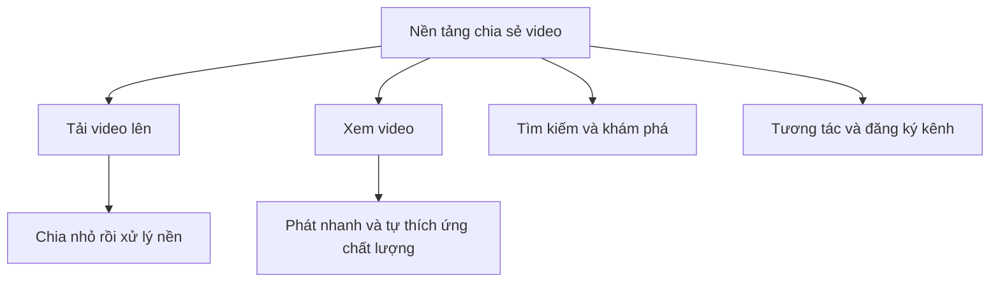

# 🎬 Thiết kế nền tảng chia sẻ video kiểu YouTube: Hiểu bài toán & xác định phạm vi

> Nguồn: `103-Understanding-the-Problem-Defining-the-Scope.txt` · [Udemy](https://ua.udemy.com/course/mastering-system-design-from-basics-to-cracking-interviews/learn/lecture/49891409)

Chúng ta bắt đầu case study mới: thiết kế một **nền tảng chia sẻ video có khả năng mở rộng** kiểu YouTube, và xem các hệ thống production xử lý upload, xử lý hậu kỳ, lưu trữ, streaming cùng phân phối nội dung cho hàng triệu người dùng như thế nào. Trước khi vẽ kiến trúc, mình và các bạn cần **rõ ràng như pha lê** về thứ chúng ta đang xây — vì mọi quyết định kiến trúc về sau đều phải truy ngược về một trải nghiệm người dùng nào đó.

---

### 🎯 Chúng ta đang xây gì? Bốn luồng người dùng cốt lõi

Về bản chất, chúng ta xây một nền tảng nơi người dùng có thể **upload video, xem nội dung, khám phá video mới và tương tác với các creator**. Nhìn từ phía người dùng, các tính năng này có vẻ đơn giản — nhưng mỗi tính năng lại đặt ra những yêu cầu rất khác nhau cho hệ thống.

Bốn workflow (luồng công việc) chính:

1. **Upload video:** đây không đơn thuần là thao tác tải file. Video có kích thước lớn, upload có thể bị ngắt giữa chừng và mạng của người dùng cũng không ổn định. Vì vậy upload thường được **chia thành các chunk (khối nhỏ)**. Sau khi upload xong, video phải đi qua **xử lý nền (background processing)** trước khi có thể phát.
2. **Xem video:** đây là trải nghiệm người dùng quan tâm nhất. Video phải **bắt đầu phát nhanh, phát mượt và tự thích ứng với điều kiện mạng thay đổi**. Giao được trải nghiệm đó một cách hiệu quả chính là một trong những thách thức kiến trúc lớn nhất của hệ thống dạng này.
3. **Tìm kiếm và khám phá nội dung:** người dùng tìm video theo **keyword, category, tag hoặc độ phổ biến**. Khi nền tảng lớn lên đến hàng triệu video, tìm kiếm hiệu quả quan trọng không kém việc lưu trữ video.
4. **Tương tác:** like, comment, share và đăng ký kênh (subscription). Từng thao tác là nhỏ, nhưng hợp lại tạo ra **khối lượng traffic khổng lồ** vì mọi người dùng đang hoạt động đều liên tục tương tác với nội dung.

Hãy giữ bốn workflow này trong đầu xuyên suốt case study: gần như mọi service, database, cache và thành phần hạ tầng chúng ta giới thiệu đều tồn tại để phục vụ một hoặc nhiều luồng trên. *Thay vì học thuộc kiến trúc cuối cùng, hãy tập trung hiểu mỗi quyết định thiết kế đang giải bài toán gì — đó là tư duy của những kiến trúc sư giàu kinh nghiệm.*

---

### 🧩 Yêu cầu chức năng: hệ thống phải làm được gì?

Đây là những năng lực nền tảng của nền tảng chia sẻ video, đồng thời là phạm vi bài toán và nguồn gốc của nhiều quyết định kiến trúc phía sau:

1. **Đăng ký và xác thực người dùng** — nền tảng nào cũng cần cách an toàn để định danh người dùng, quản lý tài khoản, và đảm bảo các hành động như upload, comment, subscription gắn đúng với chủ tài khoản.
2. **Upload video** — cho phép creator tải lên file video lớn một cách **đáng tin cậy, kể cả trên kết nối mạng không ổn định**. Hỗ trợ upload không chỉ là nhận file: nó là điểm khởi đầu của cả một pipeline xử lý.
3. **Encode thành nhiều độ phân giải (resolution)** — mỗi người dùng có thiết bị và tốc độ mạng khác nhau, nên tạo nhiều phiên bản của cùng một video giúp mang lại trải nghiệm xem tốt hơn hẳn.
4. **Streaming video** — khi ai đó xem video, nền tảng phải **tự động giao chất lượng phù hợp nhất với băng thông hiện tại**, đảm bảo phát mượt và hạn chế tối đa buffering (đệm chờ).
5. **Quản lý metadata video** — title, description, tag... không chỉ giúp người dùng hiểu nội dung, mà còn đóng vai trò then chốt trong việc tổ chức, tìm kiếm và gợi ý video.
6. **Tương tác** — like, comment, view count và subscription; chính các tương tác này làm nền tảng mang tính xã hội và tạo tín hiệu để đo độ phổ biến của nội dung.
7. **Tìm kiếm** — người dùng tìm video bằng keyword, category hoặc tag, giúp việc điều hướng trong kho nội dung đang lớn rất nhanh trở nên dễ dàng.
8. **Home feed cá nhân hóa** — thay vì ai cũng thấy cùng một nội dung, nền tảng gợi ý video dựa trên sở thích và hành vi xem của từng người, khiến trải nghiệm liên quan và hấp dẫn hơn.

---

### ⚡ Yêu cầu phi chức năng: phải làm tốt đến mức nào?

Đây là phần định nghĩa **chất lượng** của hệ thống — và theo mình, chúng thường tác động đến kiến trúc mạnh hơn cả chính các tính năng. Hai hệ thống có cùng chức năng, nhưng hệ thống mở rộng tốt hơn, phản hồi nhanh hơn và vẫn sẵn sàng khi có lỗi đương nhiên là thiết kế tốt hơn.

* **Low latency streaming (streaming độ trễ thấp)** — người dùng kỳ vọng video bắt đầu gần như tức thì và tiếp tục phát mượt; chỉ vài giây buffering thêm cũng đủ làm hỏng trải nghiệm, nên giảm độ trễ phát là ưu tiên cao nhất.
* **High availability (sẵn sàng cao)** — người dùng phải truy cập được video và metadata bất cứ lúc nào, kể cả khi một server hay cả một thành phần gặp lỗi; downtime với nền tảng hoạt động 24/7 là điều không thể chấp nhận.
* **Scalability (khả năng mở rộng)** — hệ thống có thể lớn từ hàng nghìn lên hàng triệu video và phục vụ hàng triệu người dùng đồng thời; kiến trúc phải **mở rộng theo chiều ngang (horizontal)** khi nhu cầu tăng mà không cần thiết kế lại.
* **Storage efficiency (hiệu quả lưu trữ)** — file video cực lớn, và lưu nhiều phiên bản encode của mỗi upload có thể nhanh chóng trở nên rất tốn kém; thiết kế phải cân bằng giữa hiệu năng và chi phí.
* **Global content delivery (phân phối nội dung toàn cầu)** — người dùng trải khắp thế giới; phục vụ mọi video từ một data center duy nhất sẽ tạo độ trễ không cần thiết cho người ở xa, nên phải đưa nội dung đến gần người xem.
* **Security và chống lạm dụng** — không thể coi là chuyện làm sau: phải bảo vệ tài khoản, bảo vệ upload và phòng chống hoạt động độc hại, trong khi người dùng hợp lệ vẫn dùng dịch vụ bình thường.

Điểm đáng chú ý: những yêu cầu này **không thêm tính năng mới** — chúng định hình chất lượng hệ thống. Xuyên suốt case study, từ storage, caching đến CDN và các service phân tán, rất nhiều quyết định kiến trúc của chúng ta sẽ được dẫn dắt bởi chính các yêu cầu phi chức năng này.

---

### 📦 Giả định & ràng buộc: phạm vi của thiết kế

Trong system design thực tế, hiếm khi người ta xây cho mọi kịch bản có thể xảy ra. Ta chốt một phạm vi rõ ràng rồi tối ưu cho phạm vi đó.

**Giả định:**

* Video chủ yếu là **short-form (dạng ngắn), tối đa khoảng 15 phút** — đủ để ước lượng kích thước upload, thời gian xử lý và dung lượng lưu trữ mà không bị phức tạp hóa vì file quá dài.
* **Toàn bộ nội dung là pre-recorded (ghi trước)**; không hỗ trợ live streaming, nhờ vậy ta có thể xử lý video sau khi upload trước khi đưa ra cho người xem.
* Mỗi video upload được chuyển thành **nhiều độ phân giải, từ chất lượng thấp đến 4K**, để giao đúng phiên bản theo thiết bị và điều kiện mạng.
* Video được giao qua **CDN (mạng phân phối nội dung)**; phục vụ media từ các edge location (điểm biên) là cách chuẩn để giảm độ trễ và chịu tải phát video lớn.
* **Metadata video** như title, description, tag, timestamp **nhỏ và dễ truy vấn**, trong khi file video thì khổng lồ — hai loại dữ liệu này có thể quản lý tách biệt.

**Ràng buộc:**

* **Storage là thách thức lớn nhất** — mỗi ngày nền tảng có thể nhận hàng terabyte nội dung mới, và dữ liệu đó tiếp tục tăng theo thời gian.
* **Processing pipeline** — mỗi video phải được encode thành nhiều độ phân giải, nên hệ thống phải xử lý nhiều job đồng thời mà không tạo độ trễ dài trước khi video sẵn sàng.
* **Adaptive bitrate streaming (phát thích ứng băng thông)** — người dùng phải nhận được trải nghiệm xem tốt nhất có thể bất kể mạng thay đổi thế nào.
* **Chống lạm dụng** — spam upload, nội dung vi phạm bản quyền và nội dung không phù hợp là bài toán thực tế mà mọi nền tảng video lớn đều phải giải.
* **Đồng bộ metadata với trạng thái sẵn sàng của video** — ví dụ: không để người dùng tìm thấy video qua search khi video chưa xử lý xong và các phiên bản độ phân giải chưa sẵn sàng để phát.
* **Quản lý chi phí** — storage video, xử lý media và băng thông CDN đều tăng theo mức sử dụng, nên kiến trúc phải cân bằng giữa hiệu năng và chi phí vận hành.

Gom lại, giả định và ràng buộc định nghĩa phạm vi của nền tảng, còn các ràng buộc làm nổi bật những thách thức mà kiến trúc phải giải. Khi bước vào thiết kế, các bạn sẽ thấy nhiều quyết định của chúng ta không chỉ xuất phát từ tính năng, mà từ chính những thực tế này của một nền tảng video ở quy mô lớn.

---

### 🎯 Tự kiểm tra nhanh

**Câu 1:** Bốn workflow chính của một nền tảng chia sẻ video là gì?

<b>Xem đáp án</b>

**Đáp án:** Upload video, xem video, tìm kiếm và khám phá nội dung, tương tác (like, comment, share, subscription).

Giải thích: Mỗi workflow đặt ra những yêu cầu rất khác nhau cho hệ thống.

Tham chiếu: Mục Chúng ta đang xây gì.

**Câu 2:** Vì sao upload video thường được chia thành các chunk?

<b>Xem đáp án</b>

**Đáp án:** Vì video rất lớn, upload có thể bị ngắt và mạng của người dùng có thể không ổn định.

Giải thích: Chia nhỏ giúp quá trình truyền file lớn đáng tin cậy hơn.

Tham chiếu: Mục Chúng ta đang xây gì.

**Câu 3:** Vì sao mỗi video phải được encode thành nhiều độ phân giải?

<b>Xem đáp án</b>

**Đáp án:** Vì người dùng có thiết bị và tốc độ mạng khác nhau; nhiều phiên bản giúp giao đúng chất lượng phù hợp.

Giải thích: Đây cũng là nền tảng cho streaming thích ứng theo băng thông.

Tham chiếu: Mục Yêu cầu chức năng.

**Câu 4:** Ràng buộc về đồng bộ metadata và video nói điều gì?

<b>Xem đáp án</b>

**Đáp án:** Không để người dùng tìm thấy video qua search trước khi video xử lý xong và các phiên bản độ phân giải sẵn sàng để phát.

Giải thích: Đây là lý do trạng thái xử lý của video phải được quản lý cẩn thận.

Tham chiếu: Mục Giả định & ràng buộc.

**Câu 5:** Vì sao yêu cầu phi chức năng thường ảnh hưởng đến kiến trúc mạnh hơn cả tính năng?

<b>Xem đáp án</b>

**Đáp án:** Vì chúng định nghĩa chất lượng hệ thống — độ trễ, sẵn sàng, mở rộng, chi phí — hai hệ thống cùng tính năng thì hệ thống mở rộng và phản hồi tốt hơn là thiết kế tốt hơn.

Giải thích: Từ storage, caching đến CDN, nhiều quyết định sau này đều bắt nguồn từ các yêu cầu này.

Tham chiếu: Mục Yêu cầu phi chức năng.

---

Vậy là chúng ta đã chốt xong bài toán, yêu cầu và phạm vi cho nền tảng chia sẻ video. Ở bài tiếp theo, mình và các bạn sẽ **ước lượng quy mô** — 100 triệu người dùng, 10 triệu video upload mỗi ngày, hàng trăm petabyte băng thông — để thấy con số biến thành áp lực kiến trúc như thế nào. Hẹn gặp lại các bạn! 🚀
