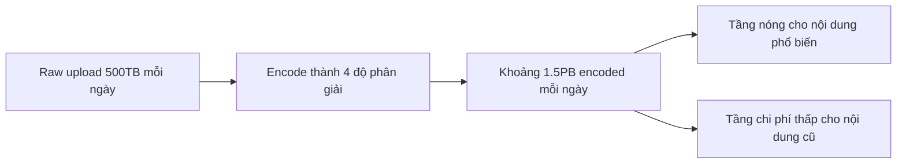

# 📊 Ước lượng quy mô nền tảng video: 50MB mỗi video, petabyte mỗi ngày

> Nguồn: `104-Estimating-Scale-Identifying-Bottlenecks.txt` · [Udemy](https://ua.udemy.com/course/mastering-system-design-from-basics-to-cracking-interviews/learn/lecture/49891411)

Trước khi thiết kế, chúng ta cần một ước lượng thô về **quy mô hệ thống đang xây**. Những con số này không cần chính xác tuyệt đối — mục đích của chúng là giúp các bạn **suy luận về capacity (năng lực hệ thống), nhận diện điểm nghẽn và ra quyết định kiến trúc có căn cứ**. Trong system design, kiến trúc sư luôn chốt một quy mô hợp lý trước, rồi dùng chính các con số đó để ước lượng storage, băng thông và throughput.

---

### 📐 Các con số quy mô ban đầu

Giả sử nền tảng của chúng ta có những chỉ số sau:

| Hạng mục | Con số giả định |
|---|---|
| Người dùng đăng ký | ~100 triệu |
| Video upload mỗi ngày | ~10 triệu |
| Video được xem mỗi ngày | ~500 triệu |
| Sự kiện tương tác mỗi ngày | ~100 triệu |
| Độ dài video trung bình | ~10 phút |
| Metadata mỗi video | ~1KB |
| Mỗi sự kiện tương tác | vài trăm byte |

Diễn giải các con số:

* **100 triệu người dùng đăng ký** — không phải ai cũng hoạt động cùng lúc, nhưng con số này cho cảm giác về quy mô tổng thể của hệ sinh thái.
* **10 triệu video upload mỗi ngày** — một dòng nội dung mới liên tục cần được nhận, xử lý, encode thành nhiều độ phân giải và lưu trữ đáng tin cậy. Điều này nói ngay rằng **pipeline upload và xử lý phải có khả năng mở rộng rất cao**.
* **500 triệu lượt xem video mỗi ngày** — đây chủ yếu là **workload read-heavy (đọc nhiều)**, hướng sự chú ý của chúng ta vào phân phối nội dung hiệu quả, caching và phục vụ video với độ trễ tối thiểu.
* **100 triệu like, comment, share mỗi ngày** — nghe nhỏ so với lượng traffic video, nhưng hợp lại tạo ra **lượng ghi đáng kể** mà hệ thống phải xử lý hiệu quả.
* **Video trung bình ~10 phút** — giúp ước lượng dung lượng lưu trữ và khối lượng xử lý sau mỗi upload, nhất là khi mỗi video được encode thành nhiều mức chất lượng.

Đặc biệt chú ý sự khác biệt giữa **file video** và **metadata**: metadata chỉ khoảng 1KB mỗi video, sự kiện tương tác chỉ vài trăm byte. Từng bản ghi rất nhỏ, nhưng nhân với hàng triệu upload và tương tác mỗi ngày thì vẫn là khối dữ liệu đáng kể cần lưu và truy vấn hiệu quả.

*Những giả định này không phải đáp án cuối cùng — chúng là điểm xuất phát.* Và việc tiếp theo chúng ta làm là dùng chúng để ước lượng storage, băng thông và tìm ra nơi kiến trúc sẽ chịu áp lực.

---

### 💾 Ước lượng storage: encode nhân dung lượng lên gấp ba

Nền tảng video bản chất là **storage-intensive (ngốn lưu trữ)**. Bắt đầu từ raw upload:

* Video trung bình ~10 phút, nặng khoảng **50MB**.
* Với **10 triệu video mỗi ngày**, nền tảng nhận khoảng **500TB video raw mỗi ngày**.
* Raw file không được giữ mãi: giữ vài tuần cho phép retry xử lý, kiểm duyệt hoặc khôi phục khi pipeline encode gặp sự cố. Với thời gian lưu 30 ngày, chúng ta có khoảng **15TB dung lượng raw tạm thời**.

Nhưng raw upload chỉ là một phần bức tranh. Để phát mượt trên nhiều thiết bị và điều kiện mạng, mỗi video được encode thành **4 phiên bản chất lượng**. Kết quả: tổng dung lượng tăng khoảng **3 lần** so với bản gốc.

Nghĩa là nhu cầu lưu trữ hằng ngày tăng từ **500TB lên khoảng 1.5 petabyte**. Tính theo tháng, đó là khoảng **45 petabyte video đã encode** cần được lưu bền vững và phục vụ hiệu quả cho người dùng.

Bài học quan trọng ở đây **không phải các con số chính xác** — chúng sẽ khác nhau giữa các nền tảng. Điều cốt lõi là: **encode khuếch đại nhu cầu lưu trữ lên một bội số lớn**. Khi thiết kế nền tảng video, các bạn không lưu một bản của mỗi video — các bạn lưu nhiều phiên bản đã tối ưu của từng upload. Vì thế, **tối ưu storage, lifecycle policy (chính sách vòng đời) và object storage tiết kiệm chi phí** trở thành những quyết định kiến trúc thiết yếu. Ở quy mô này, chỉ một cải thiện nhỏ về hiệu quả lưu trữ cũng có thể tiết kiệm đáng kể mà vẫn giữ trải nghiệm xem tốt.

---

### 🌐 Băng thông: 135PB mỗi ngày và đỉnh 10 Tbps

Storage mới là một nửa thách thức; nửa còn lại là **băng thông**. Mỗi lần ai đó bấm play, nền tảng phải liên tục truyền dữ liệu video — và ở quy mô toàn cầu, đây nhanh chóng trở thành một trong những chi phí vận hành lớn nhất.

* Ước tính có **hàng trăm triệu giờ video được stream mỗi ngày**.
* Với bitrate trung bình khoảng **1 Mbps**, mỗi giờ xem tương đương khoảng **0.45GB** dữ liệu truyền đi.
* Nhân lên toàn nền tảng: tổng traffic outbound đạt khoảng **135 petabyte mỗi ngày**.

Điều quan trọng cần nhận ra: lượng traffic này **không được phục vụ trực tiếp từ application server**. Nếu mọi yêu cầu phát video đều chạm tới hạ tầng gốc, hệ thống sẽ nhanh chóng bị quá tải. Thay vào đó, phần lớn traffic phải do **CDN phân tán toàn cầu** đảm nhiệm — giữ nội dung phổ biến gần người dùng, giảm mạnh cả độ trễ lẫn tải cho backend.

Còn đỉnh tải? Giả sử khoảng **10 triệu người xem video cùng lúc**, với tốc độ stream trung bình 1 Mbps, nền tảng cần duy trì khoảng **10 Tbps băng thông outbound**. Đó là con số mà một data center đơn lẻ hay vài server không thể nào kham nổi.

Đây chính là lý do CDN là thành phần **nền tảng không thể thiếu** của kiến trúc nền tảng video: nó không chỉ là tối ưu hiệu năng, mà là thứ khiến việc phục vụ video ở quy mô này trở nên khả thi. Bằng cách phân tán nội dung qua các edge location, nền tảng có thể phục vụ hàng triệu người xem đồng thời với trải nghiệm phát nhanh và ổn định.

Tóm lại: với nền tảng chia sẻ video, **băng thông quan trọng ngang với storage**. Thiết kế cho phân phối nội dung toàn cầu, caching hiệu quả và kiểm soát egress cost (chi phí thoát dữ liệu) là điều thiết yếu, vì khi nền tảng lớn lên, traffic mạng thường trở thành thách thức lớn nhất về cả khả năng mở rộng lẫn chi phí.

---

### 🧭 Metadata, engagement & hệ quả kiến trúc

Khi nghĩ về nền tảng video, người ta thường chỉ tập trung vào lưu trữ và stream video. Nhưng thực tế, **metadata và nội dung do người dùng tạo ra** — như tương tác — cũng quan trọng không kém, vì chúng làm nên khả năng tìm kiếm, tính tương tác và cá nhân hóa của nền tảng.

* **Metadata:** mỗi video upload tạo một bản ghi metadata gồm title, description, tag và các thuộc tính khác. **10 triệu upload mỗi ngày** nghĩa là thêm 10 triệu bản ghi mới mỗi ngày. Dù mỗi bản ghi nhỏ, database phải hỗ trợ **ghi liên tục** đồng thời **truy vấn nhanh** cho search, recommendation và hồ sơ người dùng.
* **Engagement:** like, comment và các tương tác khác tạo ra khoảng **100 triệu sự kiện mới mỗi ngày**. Từng thao tác rất nhẹ, nhưng hợp lại là dòng ghi liên tục mà hệ thống phải xử lý hiệu quả. Giá trị của chúng vượt xa việc ghi nhận hành vi: chúng ảnh hưởng đến chỉ số phổ biến, cấp dữ liệu cho gợi ý, cập nhật giao diện và giúp xác định nội dung đang trending — nói cách khác, **một hành động của người dùng thường có nhiều thành phần tiêu thụ dữ liệu phía sau**.
* **Tìm kiếm:** khi video mới được upload và dữ liệu tương tác thay đổi, search index cần **cập nhật tương đối kịp thời** để người dùng nhanh chóng khám phá nội dung mới. Đồng thời, video phổ biến trở nên cực kỳ **read-heavy**, nhận hàng nghìn request và metadata của chúng bị truy cập lặp lại liên tục.

Điểm mấu chốt: dù file video chiếm phần lớn dung lượng lưu trữ, **metadata và engagement mới là nguồn tạo ra phần lớn hoạt động của database**. Chúng tạo ra hỗn hợp gồm ghi liên tục, đọc thường xuyên và cập nhật gần thời gian thực — khiến chúng trở thành phần cực kỳ quan trọng của thiết kế tổng thể.

Vậy quy mô đó định hình kiến trúc của chúng ta thế nào? Storage, băng thông hay engagement không chỉ là những thống kê thú vị — chúng ảnh hưởng trực tiếp đến các quyết định thiết kế xuyên suốt hệ thống:

1. **Chiến lược lưu trữ đa tầng (multi-tier storage):** giữ mọi thứ trong cùng một tầng lưu trữ là vừa kém hiệu quả vừa đắt đỏ. Nội dung truy cập thường xuyên nằm ở tầng nhanh hơn, còn video cũ hoặc ít phổ biến dần được chuyển sang tầng chi phí thấp — cân bằng giữa hiệu năng và chi phí.
2. **Processing pipeline tự mở rộng:** một upload có thể kích hoạt nhiều job xử lý; với hàng triệu upload mỗi ngày, workload này phải **tự động scale và xử lý nhiều video song song**, nếu không người dùng sẽ chờ rất lâu trước khi video của họ sẵn sàng.
3. **Phân phối toàn cầu:** người dùng ở nhiều khu vực khác nhau, nên phục vụ mọi video từ một vị trí trung tâm sẽ tạo độ trễ không cần thiết và tiêu tốn băng thông khổng lồ. Vì vậy, **tích hợp CDN và phân phối nội dung theo vùng trở thành phần nền tảng của kiến trúc**, chứ không còn là tối ưu tùy chọn.
4. **Dữ liệu engagement xử lý bất đồng bộ:** cố cập nhật mọi bộ đếm một cách đồng bộ sẽ tạo điểm nghẽn không cần thiết. Cách mở rộng tốt hơn nhiều là **xử lý các sự kiện bất đồng bộ và tổng hợp trong nền**, giúp nền tảng hấp thụ các đỉnh traffic mà không ảnh hưởng trải nghiệm người dùng.
5. **Tìm kiếm và phân phối nội dung:** với hàng triệu video mới mỗi ngày, hạ tầng tìm kiếm phải liên tục **đánh index nội dung mới** trong khi vẫn phục vụ truy vấn nhanh — đòi hỏi một **giải pháp search phân tán** xử lý được đồng thời cả write throughput cao lẫn read traffic cao.

**Bài học lớn: quy mô thay đổi kiến trúc.** Ở quy mô nhỏ, nhiều lựa chọn thiết kế trên đây là không cần thiết. Nhưng khi đã xử lý hàng triệu người dùng, petabyte dữ liệu và hàng tỷ request, kiến trúc buộc phải tiến hóa để duy trì khả năng mở rộng, độ tin cậy và hiệu quả chi phí. Đây chính là những định hướng dẫn dắt phần thiết kế tiếp theo của chúng ta.

---

### 🎯 Tự kiểm tra nhanh

**Câu 1:** Vì sao workload của nền tảng được gọi là read-heavy?

<b>Xem đáp án</b>

**Đáp án:** Vì nền tảng phục vụ khoảng 500 triệu lượt xem video mỗi ngày, lớn hơn nhiều so với khối lượng ghi từ upload và tương tác.

Giải thích: Điều này hướng thiết kế vào phân phối nội dung hiệu quả, caching và độ trễ thấp.

Tham chiếu: Mục Các con số quy mô ban đầu.

**Câu 2:** Encode ảnh hưởng thế nào đến dung lượng lưu trữ?

<b>Xem đáp án</b>

**Đáp án:** Tăng khoảng 3 lần so với bản gốc — từ khoảng 500TB lên khoảng 1.5PB mỗi ngày với 4 phiên bản chất lượng.

Giải thích: Ta không lưu một bản của mỗi video mà lưu nhiều phiên bản đã tối ưu.

Tham chiếu: Mục Ước lượng storage.

**Câu 3:** Vì sao CDN là thành phần nền tảng chứ không chỉ là tối ưu hiệu năng?

<b>Xem đáp án</b>

**Đáp án:** Vì traffic outbound (khoảng 135PB mỗi ngày, đỉnh 10 Tbps) vượt xa khả năng của một data center; CDN phân tán nội dung giúp việc phục vụ ở quy mô này trở nên khả thi.

Giải thích: CDN giữ nội dung phổ biến gần người dùng, giảm độ trễ và giảm tải hạ tầng gốc.

Tham chiếu: Mục Băng thông.

**Câu 4:** Vì sao nên xử lý sự kiện engagement bất đồng bộ?

<b>Xem đáp án</b>

**Đáp án:** Vì cập nhật mọi bộ đếm đồng bộ sẽ tạo điểm nghẽn; xử lý bất đồng bộ và tổng hợp trong nền giúp hấp thụ đỉnh traffic mà không ảnh hưởng người dùng.

Giải thích: 100 triệu sự kiện mỗi ngày tạo dòng ghi liên tục với nhiều thành phần tiêu thụ phía sau.

Tham chiếu: Mục Metadata, engagement & hệ quả kiến trúc.

**Câu 5:** Vì sao cần chiến lược lưu trữ đa tầng?

<b>Xem đáp án</b>

**Đáp án:** Vì giữ mọi thứ trong cùng một tầng lưu trữ là kém hiệu quả và đắt đỏ; nội dung nóng nằm ở tầng nhanh, video cũ/ít phổ biến chuyển sang tầng chi phí thấp.

Giải thích: Cách này cân bằng giữa hiệu năng và chi phí ở quy mô hàng chục petabyte mỗi tháng.

Tham chiếu: Mục Metadata, engagement & hệ quả kiến trúc.

---

Vậy là chúng ta đã có bức tranh quy mô: mỗi ngày 10 triệu upload, 1.5PB video đã encode, 135PB băng thông và 100 triệu sự kiện tương tác — cùng những hệ quả kiến trúc trực tiếp từ các con số đó. *Đừng lo nếu các bạn chưa quen với kiểu tính toán này — cứ đi từng bước, đây không phải cuộc đua.* Ở bài tiếp theo, chúng ta sẽ bắt tay vào **high-level design**: các service chính, API và cách chúng giao tiếp. Hẹn gặp lại các bạn! 🚀
