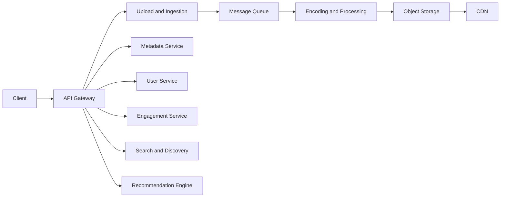

# 🏗️ High-Level Design nền tảng video: Services, API và cách chúng giao tiếp

> Nguồn: `105-High-Level-Design-Services-APIs-Communication.txt` · [Udemy](https://ua.udemy.com/course/mastering-system-design-from-basics-to-cracking-interviews/learn/lecture/49891413)

Chúng ta đã hiểu bài toán và ước lượng quy mô — đây là thời điểm phù hợp để xác định **các khối xây dựng chính (building blocks)** của kiến trúc. Ở bước này, các bạn chưa cần bận tâm các service giao tiếp thế nào hay dùng công nghệ gì; mục tiêu chỉ là hiểu **trách nhiệm của từng thành phần và vì sao nó tồn tại**.

---

### 🏗️ Các building block chính của nền tảng

Mọi thứ bắt đầu từ **API gateway**. Thay vì phơi bày từng service backend ra cho client, chúng ta cung cấp **một điểm vào duy nhất** xử lý các mối quan tâm chung: xác thực (authentication), định tuyến request (request routing), giới hạn tốc độ (rate limiting) và ghi log. Nhờ đó phần còn lại của hệ thống tập trung vào logic nghiệp vụ.

Phía sau gateway là các service chuyên trách:

* **Upload & ingestion service** — khi creator upload video, service này nhận file đáng tin cậy, **gán một video ID duy nhất**, lưu tạm rồi **khởi động pipeline xử lý**. Lưu ý: nó **không tự encode video**, mà chuyển công việc thành một job xử lý bất đồng bộ.
* **Encoding & processing service** — nơi video được chuyển thành **nhiều độ phân giải**, tạo thumbnail, chuẩn bị các định dạng streaming và lưu bộ asset cuối cùng. Tách xử lý khỏi luồng upload giúp upload nhanh, đồng thời cho phần tính toán nặng tự scale độc lập.
* **Object storage** và **CDN** — video sau khi xử lý được lưu trong object storage bền vững và giao đi qua CDN; hai thành phần này phối hợp để video vừa được lưu đáng tin cậy, vừa được phục vụ nhanh trên toàn cầu.
* **Metadata service** — quản lý title, description, tag **tách biệt khỏi file video**, nhờ vậy metadata được truy vấn hiệu quả cho search, recommendation và danh sách video mà không phải chạm vào file media lớn.
* **User service** — quản lý tài khoản, xác thực, subscription và tùy chọn người dùng; tách riêng giúp phần này tiến hóa độc lập với phần còn lại của nền tảng.
* **Engagement service** — xử lý view, like, comment; vì khối lượng cực lớn, nó chịu trách nhiệm ghi nhận tương tác hiệu quả, hỗ trợ xử lý bất đồng bộ và các luồng kiểm duyệt (moderation).
* **Search & discovery service** — liên tục đánh index video mới và cho phép tìm theo title, tag, category cùng các thuộc tính tìm kiếm khác.
* **Recommendation engine** — cá nhân hóa trải nghiệm bằng cách chọn video phù hợp nhất với hành vi và sở thích của từng người; nó không chỉ hiển thị nội dung mới nhất mà làm nổi bật nội dung mà mỗi người nhiều khả năng sẽ xem nhất.

Các bạn có thể thấy: mỗi thành phần có **trách nhiệm được định nghĩa rõ ràng**. Sự tách biệt này không chỉ để tổ chức hệ thống gọn gàng — nó cho phép các phần khác nhau của nền tảng **mở rộng, tiến hóa và vận hành độc lập**.

---

### 🔄 Giao tiếp: khi nào đồng bộ, khi nào bất đồng bộ?

Một trong những quyết định quan trọng nhất của system design là **chọn lúc nào giao tiếp đồng bộ (synchronous) và lúc nào bất đồng bộ (asynchronous)**.

* **Đồng bộ:** những thao tác cần phản hồi ngay vì người dùng đang chờ — ví dụ lấy metadata video, truy xuất thông tin người dùng hoặc thực hiện tìm kiếm. Trong các trường hợp này, dùng **HTTP hoặc gRPC** là hợp lý vì bên gọi cần câu trả lời trước khi tiếp tục.
* **Bất đồng bộ:** không phải thao tác nào cũng cần diễn ra tức thời. Encode một video lớn có thể mất vài phút, nên bắt người dùng chờ suốt quá trình đó là trải nghiệm tồi. Thay vào đó, khi upload hoàn tất, hệ thống **publish một event lên message queue/event bus**; encoding service nhận event và xử lý video một cách độc lập. Cách làm tương tự cũng hiệu quả với các sự kiện tương tác khối lượng lớn như comment, like — giúp nền tảng **hấp thụ đỉnh traffic mà không làm chậm request của người dùng**.

Từ đó ta có **quy tắc ngón tay cái** rất thực dụng: dùng giao tiếp đồng bộ khi bên gọi cần phản hồi ngay, dùng bất đồng bộ khi công việc có thể diễn ra ở nền.

Về thiết kế API, client **không bao giờ giao tiếp trực tiếp với các service nội bộ**. Mọi request — upload video, lấy thông tin video, like video — trước tiên đều đến API gateway và tương tác qua các **endpoint REST đơn giản** do gateway phơi bày. Gateway cũng là nơi lý tưởng để xử lý các mối quan tâm xuyên suốt như xác thực và định tuyến. Sau khi request được xác thực, nó được chuyển tiếp tới service backend phù hợp: metadata service, user service hay engagement service.

Riêng luồng upload hơi khác: sau khi upload service nhận video, nó **không gọi trực tiếp encoding service**, mà publish một event để quá trình encode bắt đầu bất đồng bộ. Cách này giữ upload phản hồi nhanh, đồng thời khiến pipeline xử lý dễ mở rộng và chịu lỗi tốt hơn.

Một chi tiết cuối: hệ thống dùng **signed URL (URL có chữ ký)** cho việc lưu trữ video. Thay vì cho phép truy cập không giới hạn vào file media, signed URL cấp quyền truy cập **tạm thời, an toàn** chỉ cho người dùng hoặc service được phép — bảo vệ nội dung lưu trữ mà không làm phức tạp hóa mọi request.

**Bài học:** mẫu giao tiếp phải khớp với bản chất công việc. Thao tác hướng người dùng ưu tiên API đồng bộ để phản hồi nhanh; tác vụ chạy lâu hoặc khối lượng lớn hưởng lợi từ messaging bất đồng bộ. Kết hợp cả hai giúp nền tảng vừa phản hồi nhanh với người dùng, vừa mở rộng tốt dưới tải nặng.

---

### 🗄️ Lưu trữ & caching: đúng loại dữ liệu, đúng công nghệ

Không phải loại dữ liệu nào cũng có cùng đặc điểm, nên dùng một giải pháp lưu trữ duy nhất cho mọi thứ sẽ dẫn đến những thỏa hiệp không cần thiết.

* **Video files** là các binary object lớn → hợp nhất với **object storage** như S3, Google Cloud Storage hoặc Azure Blob Storage. Những nền tảng này được thiết kế cho khả năng mở rộng khổng lồ, độ bền cao và chi phí hợp lý với file media lớn. Cùng với các video segment, chúng còn lưu **streaming manifest** và **thumbnail** đã tạo.
* **CDN** đảm nhiệm việc giao video hiệu quả toàn cầu: thay vì mọi người xem tải video từ storage gốc, nội dung phổ biến được cache tại **edge location gần người dùng** — giảm độ trễ, giảm tải tầng lưu trữ và giảm mạnh lượng traffic chạm tới origin.
* **Metadata** như title, description, tag hay thông tin người dùng có cấu trúc cao và được truy vấn thường xuyên → **relational database** rất phù hợp nhờ index hiệu quả và hỗ trợ đúng kiểu tra cứu mà ứng dụng thực hiện thường xuyên.
* **Dữ liệu linh hoạt** như tùy chọn người dùng hay dữ liệu liên quan recommendation có thể thay đổi theo thời gian và thường có schema mềm dẻo hơn → dùng **NoSQL database** để quản lý mà không phải ép vào mô hình quan hệ cứng nhắc.
* **In-memory cache** như Redis hoặc Memcached giúp video phổ biến, metadata truy cập thường xuyên và thông tin phiên (session) không phải tra database mỗi lần được yêu cầu — giảm độ trễ đồng thời bảo vệ database khỏi lượng đọc lặp lại.
* **Durability (độ bền dữ liệu):** dù hệ thống lưu trữ có đáng tin cậy đến đâu, sự cố vẫn có thể xảy ra. **Backup định kỳ, lưu ở nhiều vùng địa lý**, giúp đảm bảo dữ liệu video và metadata quan trọng có thể khôi phục khi thảm họa bất ngờ ập đến.

| Loại dữ liệu | Lựa chọn tiêu biểu | Vì sao phù hợp |
|---|---|---|
| Video, manifest, thumbnail | Object storage | Object lớn, độ bền cao, chi phí hợp lý |
| Metadata có cấu trúc | Relational database | Index hiệu quả, truy vấn thường xuyên |
| Tùy chọn người dùng, dữ liệu gợi ý | NoSQL | Schema linh hoạt, dễ tiến hóa |
| Dữ liệu nóng | In-memory cache | Giảm độ trễ, giảm tải database |

**Bài học:** kiến trúc lưu trữ là việc **gắn đúng công nghệ với đúng loại dữ liệu**. File media lớn, metadata có cấu trúc, dữ liệu người dùng linh hoạt, thông tin cache và backup — mỗi loại có yêu cầu khác nhau; dùng kho chuyên biệt cho từng loại giúp nền tảng mở rộng hiệu quả mà vẫn giữ hiệu năng và độ tin cậy.

---

### 🧩 Schema database ở mức khái niệm

Mục tiêu ở đây không phải thiết kế từng bảng hay tối ưu từng index, mà là xác định **các thực thể cốt lõi và quan hệ giữa chúng**:

* **Users** — thông tin tài khoản và hồ sơ của từng người dùng; gần như mọi hành động trên nền tảng đều do một người dùng thực hiện, nên đây là nền tảng cho xác thực, quyền sở hữu và cá nhân hóa.
* **Videos** — mỗi video upload có một bản ghi gồm title, description, ngày upload, trạng thái xử lý và thumbnail; mỗi video liên kết về creator qua **user ID**, tạo quan hệ giữa người dùng và nội dung họ đăng.
* **Likes** — ghi lại ai đã like video nào; lưu riêng thay vì nhúng vào bản ghi video cho phép mô hình hóa hiệu quả quan hệ **nhiều-nhiều** giữa người dùng và video.
* **Comments** — mỗi comment thuộc về cả một người dùng lẫn một video, giúp lấy được tất cả comment của một video hoặc tất cả comment của một người.
* **Watch History** — ghi lại ai đã xem video nào và khi nào; hữu ích cho tính năng lịch sử xem, gợi ý và hiểu hành vi người dùng theo thời gian.
* **Video Analytics** — lưu các chỉ số tổng hợp như view, like, share, comment count; duy trì giá trị tổng hợp tính trước giúp phục vụ các con số này hiệu quả hơn nhiều so với tính lại mỗi lần mở video.

Một điều quan trọng cần nhớ: đây là **schema khái niệm, không phải thiết kế database sẵn sàng cho production**. Khi nền tảng mở rộng, một số bảng có thể được phân vùng (partition), phi chuẩn hóa (denormalize) hoặc chuyển sang kho dữ liệu chuyên biệt. Nhưng dù chi tiết triển khai thay đổi, những thực thể cốt lõi này vẫn là nền tảng cho cách hệ thống mô hình hóa người dùng, video, tương tác và phân tích.

---

### 🎯 Tự kiểm tra nhanh

**Câu 1:** Upload & ingestion service có tự encode video không?

<b>Xem đáp án</b>

**Đáp án:** Không — nó nhận file, gán video ID, lưu tạm rồi chuyển công việc thành job xử lý bất đồng bộ cho encoding service.

Giải thích: Tách encoding khỏi luồng upload giúp upload nhanh và phần tính toán nặng scale độc lập.

Tham chiếu: Mục Các building block chính của nền tảng.

**Câu 2:** Khi nào nên dùng giao tiếp đồng bộ, khi nào dùng bất đồng bộ?

<b>Xem đáp án</b>

**Đáp án:** Đồng bộ khi bên gọi cần phản hồi ngay (metadata, thông tin người dùng, tìm kiếm); bất đồng bộ khi công việc có thể chạy nền (encode, sự kiện tương tác).

Giải thích: Đây là quy tắc ngón tay cái được rút ra trong bài.

Tham chiếu: Mục Giao tiếp: khi nào đồng bộ, khi nào bất đồng bộ.

**Câu 3:** Signed URL được dùng để làm gì?

<b>Xem đáp án</b>

**Đáp án:** Cấp quyền truy cập tạm thời, an toàn vào file media chỉ cho người dùng hoặc service được phép.

Giải thích: Cách này bảo vệ nội dung lưu trữ mà không làm phức tạp mọi request.

Tham chiếu: Mục Giao tiếp: khi nào đồng bộ, khi nào bất đồng bộ.

**Câu 4:** Vì sao metadata nên nằm trong relational database, còn dữ liệu gợi ý trong NoSQL?

<b>Xem đáp án</b>

**Đáp án:** Metadata có cấu trúc cao, được truy vấn thường xuyên nên hợp với index của relational database; dữ liệu gợi ý/tùy chọn có schema linh hoạt nên hợp NoSQL.

Giải thích: Nguyên tắc là gắn đúng công nghệ với đúng loại dữ liệu.

Tham chiếu: Mục Lưu trữ & caching.

**Câu 5:** Vì sao tương tác như like, comment được lưu ở bảng riêng thay vì nhúng vào bản ghi video?

<b>Xem đáp án</b>

**Đáp án:** Để mô hình hóa hiệu quả quan hệ nhiều-nhiều giữa người dùng và video.

Giải thích: Cách này cũng giúp truy vấn theo cả hai chiều: theo video và theo người dùng.

Tham chiếu: Mục Schema database ở mức khái niệm.

---

Vậy là chúng ta đã có bức tranh high-level design: các service với trách nhiệm rõ ràng, nguyên tắc chọn đồng bộ hay bất đồng bộ, cách chọn kho lưu trữ theo loại dữ liệu và schema khái niệm của nền tảng. Ở bài tiếp theo, chúng ta sẽ bàn **các quyết định công nghệ và hạ tầng** để hiện thực hóa kiến trúc này. Hẹn gặp lại các bạn! 🚀
