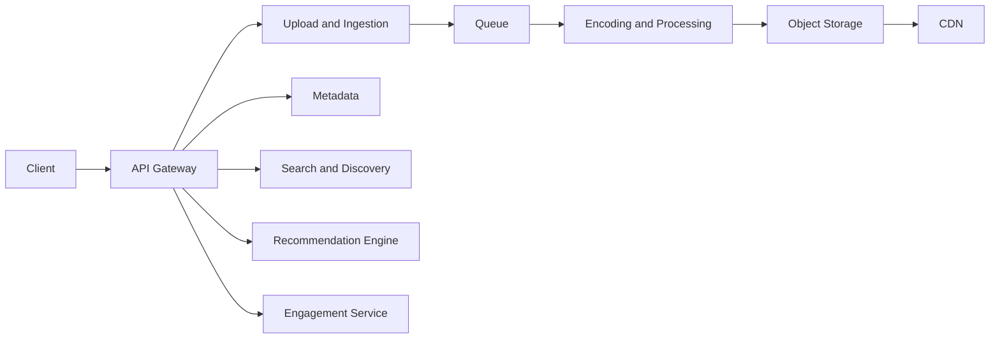

# 🗺️ Final Design nền tảng chia sẻ video: Một video đi qua hệ thống như thế nào?

> Nguồn: `107-The-Final-Design---Video-Sharing-Platform.txt` · [Udemy](https://ua.udemy.com/course/mastering-system-design-from-basics-to-cracking-interviews/learn/lecture/49891419)

Chúng ta đã tới **kiến trúc cuối cùng** của nền tảng chia sẻ video. Thay vì nhìn từng thành phần riêng lẻ, sơ đồ cuối sẽ ghép tất cả thành **một hệ thống end-to-end hoàn chỉnh**. Cách hay nhất để hiểu nó là đi theo **vòng đời của một video** — từ lúc creator upload đến lúc người xem thưởng thức.

---

### 🔄 Hành trình của một video: upload, xử lý, phát

Mọi thứ bắt đầu khi người dùng tương tác với nền tảng qua **API gateway**. Dù đang upload video, tìm kiếm nội dung hay xem stream, gateway vẫn là **điểm vào duy nhất**, đảm nhiệm xác thực, định tuyến và các mối quan tâm xuyên suốt trước khi chuyển request tới service backend phù hợp.

Khi creator upload video:

1. **Upload & ingestion service** nhận file, lưu tạm và **đặt ngay một yêu cầu encoding vào queue**. Đây là quyết định kiến trúc quan trọng: nó giữ upload nhanh, còn công việc xử lý đắt đỏ diễn ra độc lập ở nền.
2. **Encoding & processing service** xử lý các job này một cách **bất đồng bộ**: tạo nhiều độ phân giải, thumbnail, chuẩn bị streaming manifest và lưu kết quả cuối vào **object storage bền vững**.
3. Khi xử lý hoàn tất, video **sẵn sàng để phát**. Người xem được phục vụ nội dung qua **CDN** thay vì trực tiếp từ tầng lưu trữ — giảm độ trễ, giảm tải hạ tầng gốc và cho phép hàng triệu người ở nhiều khu vực stream hiệu quả.

---

### 🧩 Các service hỗ trợ: ai lo việc gì?

Song song với pipeline media, nhiều service hỗ trợ đảm nhiệm phần còn lại của nền tảng:

* **Metadata service** quản lý thông tin của từng video, giúp nội dung dễ tìm và dễ truy xuất.
* **Search & discovery service** liên tục đánh index metadata đó để người dùng nhanh chóng tìm thấy nội dung phù hợp.
* **Recommendation engine** cá nhân hóa trải nghiệm bằng cách chọn video theo sở thích và hành vi xem của từng người.
* **User service** quản lý tài khoản và xác thực.
* **Engagement service** ghi nhận like, comment, view và các tương tác khác.

Điểm đáng chú ý: mỗi service có **trách nhiệm được định nghĩa rõ ràng**, và sự tách biệt này cho phép từng phần của hệ thống **mở rộng độc lập**. Ví dụ: một đợt bùng nổ upload chủ yếu ảnh hưởng pipeline ingestion và encoding, còn một video viral lại tác động chủ yếu đến CDN, storage và engagement service. Vì các workload đã được cô lập, **toàn bộ nền tảng không cần scale đồng loạt**.

---

### 💡 Mọi quyết định đều truy về giả định quy mô

Các bạn sẽ thấy kiến trúc này dùng rất nhiều **xử lý bất đồng bộ, lưu trữ phân tán, caching và phân phối nội dung**. Chúng không phải những lựa chọn rời rạc — tất cả đều là **phản hồi trực tiếp cho các giả định quy mô đã thiết lập ở những bước trước**. Kiến trúc tiến hóa một cách tự nhiên từ yêu cầu, chứ không được xây quanh một công nghệ cụ thể nào.

Bài học lớn nhất của case study này: **thiết kế hệ thống thành công không phải là lắp ghép các thành phần phổ biến**, mà là hiểu workload, nhận diện điểm nghẽn và đưa ra quyết định kiến trúc giải quyết những thách thức thật về khả năng mở rộng, độ tin cậy và hiệu năng. Nếu các bạn giải thích được **vì sao từng thành phần tồn tại và nó giải quyết bài toán gì**, các bạn đã hiểu kiến trúc tốt hơn hẳn người chỉ học thuộc sơ đồ.

Vậy là chúng ta khép lại case study nền tảng chia sẻ video. Ở section tiếp theo, mình và các bạn sẽ áp dụng quy trình thiết kế tương tự cho **một hệ thống thực tế khác**. Hẹn gặp lại các bạn! 🚀
