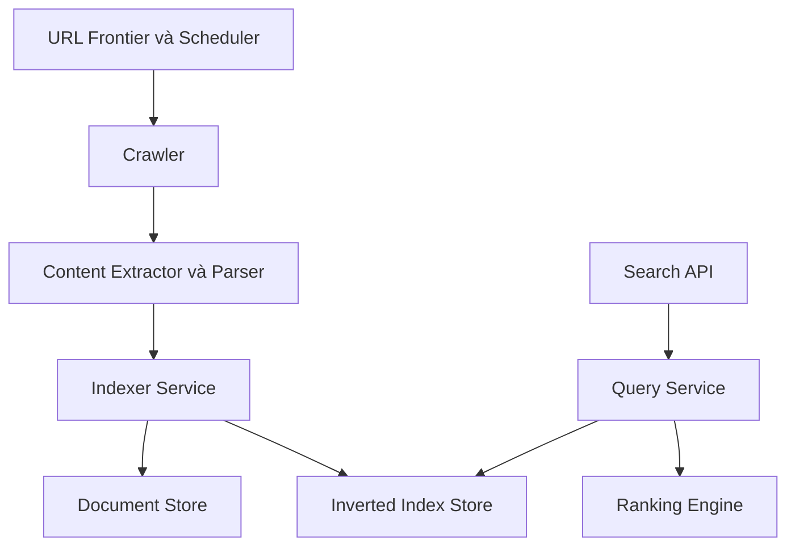
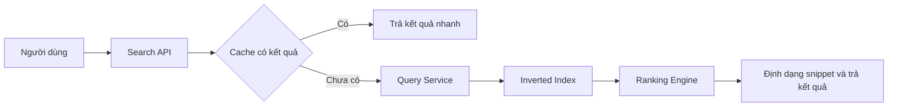

# 🏗️ High-Level Design search engine: Pipeline biến web thành kết quả tìm kiếm

> Nguồn: `110-High-Level-Design-Services-APIs-Communication.txt` · [Udemy](https://ua.udemy.com/course/mastering-system-design-from-basics-to-cracking-interviews/learn/lecture/49938835)

Chúng ta đã xác định yêu cầu và ràng buộc, giờ là lúc nhìn vào **các thành phần chính của search engine**. Thay vì coi chúng là những service độc lập, hãy nghĩ về chúng như **các giai đoạn trong một pipeline biến trang web thành kết quả tìm kiếm được** — mỗi giai đoạn có một trách nhiệm duy nhất, rõ ràng.

---

### 🧱 Các thành phần: một pipeline nhiều giai đoạn

* **Web crawler** — liên tục khám phá và tải trang từ khắp internet, tôn trọng chính sách crawl và rate limit.
* **URL frontier & scheduler** — khi URL mới được phát hiện, chúng được chuyển cho thành phần này, nơi **quyết định crawl gì tiếp theo** dựa trên độ tươi mới, lịch sử crawl và chính sách theo từng domain, đảm bảo tài nguyên crawler được dùng hiệu quả.
* **Content extractor & parser** — khi trang được tải về, thành phần này **loại bỏ HTML không cần thiết, trích xuất văn bản hiển thị cùng metadata** và nhận diện các liên kết đi ra để lập lịch crawl sau.
* **Indexer service** — nội dung đã làm sạch được xử lý và biến đổi thành **cấu trúc dữ liệu tối ưu**, gồm cả forward và inverted index, để các truy vấn sau này được trả lời hiệu quả.
* **Document store** và **inverted index store** — nơi lưu trữ: document store giữ các trang đã crawl cùng metadata; inverted index store tối ưu riêng cho **tra cứu từ khóa nhanh** bằng cách ánh xạ term tới document ID.
* **Query service** — điểm bắt đầu phía tìm kiếm: phân tích truy vấn, tra inverted index và lấy ra các **candidate document (tài liệu ứng viên)** khớp truy vấn.
* **Ranking engine** — chấm điểm các ứng viên bằng các tín hiệu liên quan như **TF-IDF, PageRank và độ tươi mới (freshness)** để quyết định thứ tự kết quả tốt nhất.
* **Search API** và **cache** — search API phơi bày chức năng cho client; cache lưu kết quả của các truy vấn phổ biến để câu trả lời lặp lại có độ trễ tối thiểu.
* **Front-end / API gateway** — điểm vào đơn giản để người dùng tương tác với hệ thống.

Điều quan trọng cần nhận ra: **mỗi thành phần có một trách nhiệm duy nhất, được định nghĩa rõ ràng**. Tách crawling, indexing, storage, searching và ranking thành các service độc lập giúp hệ thống dễ mở rộng hơn, dễ bảo trì hơn và dễ tiến hóa khi workload lớn lên.

---

### 🕸️ Phối hợp crawler: điều khó hơn cả việc crawl

Ở quy mô này, **phối hợp quan trọng ngang với chính việc crawl**. Làm sao điều phối hàng trăm crawler worker mà không tạo công việc trùng lặp hay làm quá tải website?

* Mọi thứ bắt đầu từ **URL frontier** — hàng đợi phân tán các trang đang chờ crawl. Thay vì một hàng đợi duy nhất, URL được **ưu tiên hóa** theo độ tươi mới, lịch sử crawl và chính sách theo domain, để những trang giá trị nhất được tải trước.
* **Crawler worker** liên tục kéo URL từ frontier, tải trang tương ứng và lưu nội dung thô vào document store. Trong lúc xử lý, chúng cũng **trích xuất liên kết mới và đẩy ngược URL vào frontier**, cho phép crawler liên tục khám phá những phần mới của web.
* **Chống trùng lặp:** nhiều trang khác nhau có thể cùng trỏ tới một URL, nên nội dung giống hệt có thể xuất hiện ở nhiều nơi. Để tránh crawl lặp, hệ thống tạo **fingerprint (dấu vân tay nội dung)** như **simhash** và bỏ qua những trang đã được xử lý.
* **Scheduler** quyết định khi nào một trang nên được crawl lại, đồng thời đảm bảo **tôn trọng robots.txt và rate limit** — giữ index tươi mới mà không gây tải không cần thiết cho website bên ngoài.
* **Mở rộng crawler:** phân tán workload cho nhiều worker bằng **hash-based partitioning theo domain**; cách này giữ request cho cùng website được phối hợp nhất quán, đơn giản hóa việc thực thi politeness policy và cho phép thêm worker khi crawl lớn lên.
* **Xử lý lỗi:** trong hệ phân tán, lỗi là tất yếu. Nếu một crawler hỏng khi đang xử lý URL, công việc được **retry hoặc gán lại cho worker khác**, đảm bảo quá trình crawl không mất tiến độ.

Bài học: crawling quy mô lớn **không nằm ở việc tải trang thật nhanh**, mà ở việc điều phối hàng nghìn tác vụ crawl hiệu quả, tránh trùng lặp, tôn trọng website bên ngoài và giữ hệ thống đáng tin cậy khi mở rộng.

---

### 📚 Indexing workflow: từ HTML thô đến cấu trúc tìm kiếm được

Sau khi trang được crawl, bước tiếp theo là **biến nội dung thô thành định dạng có thể tìm kiếm hiệu quả** — trách nhiệm của indexing pipeline.

1. **Content normalization (chuẩn hóa nội dung):** HTML thô chứa nhiều thứ không hữu ích cho tìm kiếm. Ta loại bỏ HTML, trích xuất văn bản hiển thị, **tokenize thành từng term, loại bỏ stop word (từ dừng) phổ biến và áp dụng stemming (đưa từ về gốc)** để các từ liên quan được xử lý nhất quán. Mục tiêu là tạo ra một biểu diễn sạch và chuẩn hóa cho mỗi document.
2. **Hai chỉ mục bổ trợ cho nhau:** từ nội dung đã xử lý, ta tạo **forward index** — ánh xạ document ID tới token và metadata của nó, giúp truy xuất thông tin một document cụ thể; và **inverted index** — làm việc ngược lại, ánh xạ mỗi token tới các document chứa nó, kèm thông tin hữu ích như tần suất term (term frequency) và vị trí. Đây chính là cấu trúc khiến tìm kiếm từ khóa cực nhanh.
3. **Trích xuất tín hiệu ranking:** indexing không chỉ lưu term tìm kiếm được; ta còn rút ra các đặc trưng như **PageRank, TF-IDF và freshness**, để ranking engine đánh giá không chỉ document nào khớp truy vấn mà còn **liên quan đến mức nào**.
4. **Phân vùng và nhân bản:** vì index tiếp tục lớn lên, ta **partition (phân vùng) index trên nhiều máy** để cả storage lẫn xử lý truy vấn mở rộng theo chiều ngang; đồng thời **replicate các partition** để hệ thống vẫn sẵn sàng khi từng node gặp lỗi.

**Bài học:** indexing **không chỉ là lưu document** — đó là một quá trình biến đổi biến trang web thô thành cấu trúc dữ liệu tối ưu và tín hiệu ranking, nhờ đó search engine trả kết quả nhanh và liên quan ở quy mô lớn.

---

### 🔍 Luồng truy vấn & giao tiếp giữa các thành phần: từ cú pháp đến snippet

Khi người dùng thực hiện tìm kiếm, dù request đi qua nhiều thành phần, tổng thể quá trình khá đơn giản:

1. Người dùng gửi truy vấn; **search API** là điểm vào và chuyển request vào pipeline tìm kiếm.
2. **Query processor** phân tích các từ khóa và chuẩn bị chúng cho việc tra cứu; đầu ra là một **truy vấn đã chuẩn hóa**.
3. **Inverted index lookup** — thay vì quét hàng tỷ document, hệ thống lấy trực tiếp danh sách document chứa các term được yêu cầu; đây là thứ cho phép tìm kiếm từ khóa hoàn tất chỉ trong vài mili-giây.
4. Các document ứng viên được đưa cho **ranking engine**, nơi các tín hiệu như **TF-IDF, PageRank và freshness** được kết hợp để xác định document nào trả lời tốt nhất.
5. Trước khi làm tất cả việc trên, hệ thống **có thể kiểm tra cache trước**: truy vấn phổ biến thường được lặp lại, nên phục vụ từ cache giảm đáng kể độ trễ và giảm tải hạ tầng tìm kiếm.
6. Cuối cùng, các document xếp hạng cao nhất được **định dạng để hiển thị**: cùng title và URL, hệ thống tạo một **snippet (đoạn trích)** làm nổi bật phần liên quan của document, giúp người dùng nhanh chóng quyết định kết quả nào hữu ích.

Điều cần nhớ: search engine **không bao giờ tìm kiếm trực tiếp trên trang web thô**. Nó tìm trên các index tối ưu, chỉ rank các document ứng viên, và dùng caching ở mọi nơi có thể để mang lại kết quả nhanh, liên quan. **Về schema mẫu:** hệ thống có hai nhóm bảng chính. **Crawler database** chứa bảng **URL queue** — theo dõi URL đang chờ crawl, trạng thái, thông tin retry và thời điểm crawl kế tiếp; đây là hàng đợi công việc trung tâm cho mọi crawler worker. **Search index database** chứa các **bảng document** (forward index: mỗi bản ghi lưu document cùng URL, title, nội dung đã xử lý) và **bảng inverted index** (tổ chức theo term: mỗi token trỏ tới danh sách document ID chứa nó, cho phép tra cứu từ khóa cực nhanh mà không phải quét mọi document). Ba nhóm bảng phục vụ ba mục đích khác nhau — quản lý luồng crawl, lưu thông tin trang đã index và cung cấp tìm kiếm từ khóa tốc độ cao — và cùng nhau tạo nên nền tảng của một search engine mở rộng được. *Lưu ý đây chỉ là schema khái niệm, không phải thiết kế sẵn sàng cho production.*

**Giao tiếp giữa các thành phần** phụ thuộc vào **bản chất của workload**:

* **Pipeline crawl và indexing dùng message queue.** Crawl, parse và indexing là các tác vụ nền chạy lâu, không cần phản hồi tức thời. Đưa message lên queue cho phép mỗi thành phần làm việc độc lập và xử lý theo nhịp riêng — giữ pipeline bền bỉ và **ngăn một thành phần chậm chặn các thành phần còn lại**. Cách tương tự cũng dùng khi indexer ghi dữ liệu vào index store: thay vì ghép nối chặt, messaging bất đồng bộ cung cấp **vùng đệm** và cho indexing mở rộng mượt khi tốc độ crawl tăng.
* **Luồng tìm kiếm thì khác — người dùng chờ phản hồi ngay.** Vì vậy search API giao tiếp với query service bằng **HTTP hoặc gRPC đồng bộ**, cho phép request chảy qua pipeline và trả kết quả đã xếp hạng trong mục tiêu độ trễ.
* **Caching** với các công nghệ như **Redis hoặc Memcached** giúp các truy vấn được tìm thường xuyên phục vụ trực tiếp từ cache, giảm cả thời gian phản hồi lẫn tải cho hạ tầng indexing.
* **Monitoring end-to-end:** hệ thống theo dõi liên tục các metric như tiến độ crawl, throughput indexing và độ trễ tìm kiếm — giúp phát hiện điểm nghẽn, nhận diện lỗi sớm và hiểu hệ thống hành xử thế nào khi traffic và dữ liệu tăng lên.

**Bài học:** không phải mọi thành phần nên giao tiếp giống nhau. Ta dùng messaging bất đồng bộ cho xử lý nền, API đồng bộ cho request hướng người dùng, caching để tăng hiệu năng và monitoring để giữ cả hệ thống khỏe mạnh, mở rộng được.

---

### 🎯 Tự kiểm tra nhanh

**Câu 1:** Vì sao URL frontier ưu tiên hóa thay vì dùng một hàng đợi đơn giản?

<b>Xem đáp án</b>

**Đáp án:** Vì cần quyết định crawl gì tiếp theo dựa trên độ tươi mới, lịch sử crawl và chính sách theo domain để dùng tài nguyên hiệu quả, ưu tiên trang giá trị nhất.

Giải thích: Đây là cách scheduler dùng tài nguyên crawler hiệu quả.

Tham chiếu: Mục Các thành phần: một pipeline nhiều giai đoạn.

**Câu 2:** Fingerprint như simhash giúp gì cho crawler?

<b>Xem đáp án</b>

**Đáp án:** Phát hiện nội dung đã được xử lý để tránh crawl lặp lại cùng nội dung xuất hiện ở nhiều nơi.

Giải thích: Chống trùng lặp là một trong những bài toán phối hợp quan trọng của crawling quy mô lớn.

Tham chiếu: Mục Phối hợp crawler.

**Câu 3:** Forward index khác inverted index ở điểm nào?

<b>Xem đáp án</b>

**Đáp án:** Forward index ánh xạ document ID tới token và metadata của document; inverted index ánh xạ mỗi token tới danh sách document chứa nó.

Giải thích: Hai cấu trúc bổ trợ nhau: một để truy xuất document, một để tìm nhanh theo từ khóa.

Tham chiếu: Mục Indexing workflow.

**Câu 4:** Vì sao pipeline crawl/indexing dùng message queue còn search dùng API đồng bộ?

<b>Xem đáp án</b>

**Đáp án:** Crawl, parse, indexing là tác vụ nền chạy lâu không cần phản hồi ngay nên dùng queue để decouple; người dùng chờ kết quả tìm kiếm ngay nên search API dùng HTTP/gRPC đồng bộ.

Giải thích: Cơ chế giao tiếp phải khớp với bản chất workload.

Tham chiếu: Mục Luồng truy vấn & giao tiếp giữa các thành phần.

**Câu 5:** Bảng URL queue và bảng inverted index phục vụ mục đích gì?

<b>Xem đáp án</b>

**Đáp án:** URL queue quản lý luồng crawl (URL chờ, trạng thái, retry, thời điểm crawl kế tiếp); bảng inverted index tổ chức theo term để tra cứu từ khóa cực nhanh.

Giải thích: Cùng với bảng document (forward index), chúng tạo nền tảng của search engine mở rộng được.

Tham chiếu: Mục Luồng truy vấn & giao tiếp giữa các thành phần.

---

Vậy là chúng ta đã có bức tranh high-level design của search engine: pipeline crawler và indexer, luồng truy vấn với ranking và caching, schema dữ liệu cốt lõi cùng cách các thành phần giao tiếp. Ở bài tiếp theo, chúng ta sẽ bàn **các quyết định công nghệ và hạ tầng** để hiện thực hóa kiến trúc này. Hẹn gặp lại các bạn! 🚀
