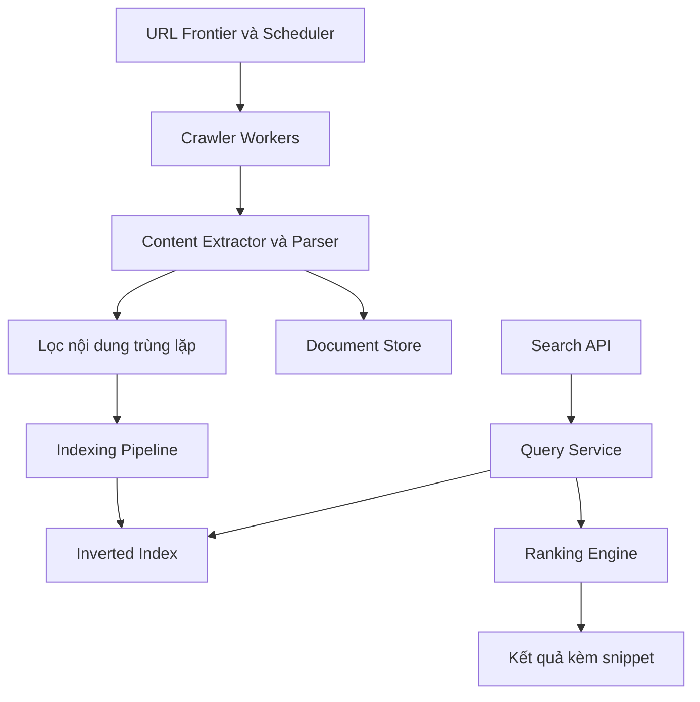

# 🗺️ Final Design search engine: Hai pipeline vận hành song song

> Nguồn: `112-The-Final-Design---Search-Engine.txt` · [Udemy](https://ua.udemy.com/course/mastering-system-design-from-basics-to-cracking-interviews/learn/lecture/49938841)

Chúng ta đã đi qua từng khối xây dựng riêng lẻ. Giờ là lúc ghép tất cả lại và xem **search engine hoàn chỉnh vận hành như một hệ thống duy nhất**. Kiến trúc này có **hai workflow lớn**: **pipeline crawl và indexing** liên tục xây dựng search index, và **pipeline truy vấn** phục vụ người dùng tìm kiếm trong thời gian thực.

---

### 🕸️ Pipeline crawl & indexing: liên tục xây dựng index

Hãy bắt đầu với crawling:

1. **URL frontier và scheduler** duy trì danh sách các trang đang chờ được thăm và **quyết định URL nào nên crawl tiếp theo**.
2. Nhiều **crawler worker** tải những trang đó về, đồng thời **tôn trọng robots.txt và rate limit** của website.
3. Các trang đã tải được chuyển cho **content extractor và parser**, nơi HTML được làm sạch, văn bản cùng metadata hữu ích được trích xuất và **các liên kết mới được phát hiện**.
4. Trước khi bất cứ thứ gì được index, **nội dung trùng lặp bị lọc bỏ** để không lãng phí storage và tài nguyên xử lý.
5. Các document đã xử lý được lưu vào **document store**, trong khi **indexing pipeline xây dựng và liên tục cập nhật inverted index** — biến trang thô thành cấu trúc dữ liệu tối ưu để tìm kiếm hiệu quả.

---

### 🔍 Pipeline truy vấn: từ cú pháp đến kết quả xếp hạng

Chuyển sang luồng tìm kiếm của người dùng:

1. Người dùng gửi truy vấn; request trước tiên đến **search API**, nơi chuyển tiếp cho **query service**.
2. Truy vấn được phân tích và dùng để tra **inverted index**, tạo ra một tập **candidate document**.
3. Các ứng viên được đưa cho **ranking engine**, nơi kết hợp các tín hiệu liên quan như **TF-IDF, PageRank và freshness** để xác định kết quả tốt nhất có thể.
4. Các document xếp hạng cao nhất được **định dạng kèm snippet** rồi trả về cho người dùng.
5. Nếu cùng truy vấn vừa được thực hiện gần đây, kết quả có thể được phục vụ **trực tiếp từ cache** — giảm đáng kể độ trễ.

---

### 💡 Mọi thành phần đều có lý do tồn tại

Hãy để ý cách mỗi thành phần đảm nhận một trách nhiệm tập trung: **crawler khám phá nội dung, indexing pipeline tổ chức nó, storage bảo tồn nó, query layer truy xuất nó, và ranking engine quyết định kết quả tốt nhất**. Vì các trách nhiệm được tách biệt, từng phần của hệ thống có thể **mở rộng độc lập** khi nhu cầu tăng.

Kiến trúc này cũng giải quyết đúng những thách thức đã nhận diện từ đầu case study:

* **Crawler phân tán** xử lý việc khám phá web quy mô lớn.
* **Index được phân vùng** hỗ trợ tìm kiếm hiệu quả trên tập dữ liệu khổng lồ.
* **Caching** cải thiện độ trễ truy vấn.
* **Replication** mang lại khả năng chịu lỗi.
* **Pipeline bất đồng bộ** giữ crawling và indexing tách rời khỏi các request tìm kiếm hướng người dùng.

Bài học quan trọng nhất của case study này: **xây search engine không phải là tìm một thuật toán hay một database duy nhất**, mà là thiết kế **một tập hợp các thành phần chuyên biệt phối hợp với nhau** để mang lại tìm kiếm nhanh, liên quan và đáng tin cậy ở quy mô lớn.

Mình hy vọng case study đã cho các bạn hiểu thực tế cách một search engine ngoài đời được thiết kế, và quan trọng hơn, **cách những kiến trúc sư giàu kinh nghiệm lý luận về các đánh đổi phía sau mỗi quyết định thiết kế**. Ở section tiếp theo, chúng ta sẽ thực hiện thêm một case study thực tế nữa. Hẹn gặp lại các bạn! 🚀
