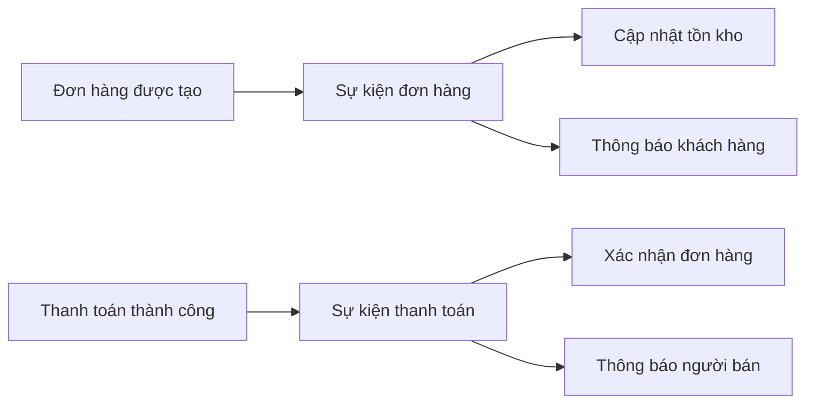

# 🏗️ E-Commerce Platform: High-Level Design — services, APIs & giao tiếp

> Nguồn: `115-High-Level-Design-Services-APIs-Communication.txt` · [Udemy](https://ua.udemy.com/course/mastering-system-design-from-basics-to-cracking-interviews/learn/lecture/49955307)

Bước 3 của case study — **high-level design (thiết kế mức cao)**. Sau khi đã biết nền tảng phải làm gì và chịu tải ra sao, giờ là lúc chia hệ thống thành các **service cốt lõi**, định hình API và quyết định cách chúng "nói chuyện" với nhau. Thay vì xây một ứng dụng khổng lồ ôm hết mọi thứ, chúng ta tách trách nhiệm để mỗi service có một mục đích rõ ràng.

---

### 🧩 Chia hệ thống thành 7 service cốt lõi

* **User service** — đăng ký, đăng nhập và xác thực. Service này quản lý danh tính cho cả người mua lẫn người bán, để phần còn lại của nền tảng dựa vào một cơ chế xác thực nhất quán.
* **Product catalog service** — quản lý listing sản phẩm, danh mục và tìm kiếm. Vì product discovery là tính năng được dùng nhiều nhất, tách catalog riêng cho phép phần này tiến hóa và scale độc lập.
* **Inventory service** — duy trì mức tồn kho và đảm bảo số liệu chính xác khi khách đặt hàng. Service này đặc biệt quan trọng trong giai đoạn đồng thời cao, khi nhiều người cùng mua một sản phẩm.
* **Order management service** — điều phối hành trình mua sắm sau khi sản phẩm được chọn: giỏ hàng, checkout và toàn bộ vòng đời đơn hàng từ lúc tạo đến khi hoàn tất.
* **Payment service** — chỉ tập trung xử lý thanh toán. Cô lập logic thanh toán cho phép tích hợp với nhà cung cấp bên ngoài, đồng thời giữ workflow then chốt đáng tin cậy và dễ bảo trì.
* **Notification service** — xử lý giao tiếp với người dùng: xác nhận đơn hàng, cập nhật thanh toán, thông báo vận chuyển. Tách khỏi luồng nghiệp vụ chính để việc gửi email hay SMS không làm chậm checkout.
* **Admin service** — công cụ vận hành marketplace: kiểm duyệt người bán và sản phẩm, giám sát hoạt động nền tảng, duy trì sức khỏe tổng thể của hệ thống.

Điểm chung dễ thấy: **mỗi service sở hữu một năng lực nghiệp vụ cụ thể**. Cách tách trách nhiệm này giúp hệ thống dễ hiểu, dễ bảo trì và dễ scale theo thời gian — và những service này sẽ là khối xây dựng chính của kiến trúc trong các bước sau.

---

### 🔌 API và trách nhiệm của từng service

Các endpoint cụ thể không phải phần quan trọng nhất — điều cần hiểu là **trách nhiệm mà mỗi service phơi ra qua API**.

* **User service:** đăng ký, đăng nhập, quản lý profile. Người dùng tạo tài khoản, xác thực và truy cập thông tin cá nhân một cách an toàn.
* **Catalog service:** duyệt sản phẩm, lấy chi tiết sản phẩm, và cho phép người bán tạo listing mới. Các endpoint này phục vụ cả trải nghiệm mua sắm lẫn quy trình quản lý sản phẩm của người bán.
* **Inventory service:** kiểm tra mức tồn kho hiện tại và **reserve (giữ chỗ) inventory** trong lúc checkout — hai thao tác thiết yếu để giữ tồn kho chính xác và chống overselling.
* **Order service:** thêm sản phẩm vào giỏ, khởi tạo checkout, lấy thông tin đơn hàng khi đơn đi qua các giai đoạn của vòng đời.
* **Payment service:** khởi tạo thanh toán và xác minh thanh toán. Bộ API riêng giữ xử lý thanh toán tách biệt khỏi phần còn lại của logic nghiệp vụ, nhưng vẫn tích hợp liền mạch vào luồng checkout.

Trên tất cả các service, chúng ta theo đuổi vài nguyên tắc thiết kế API quan trọng:

1. **RESTful** — trực quan và nhất quán.
2. **Stateless (không trạng thái)** — mỗi request chứa đầy đủ thông tin cần thiết để xử lý, nhờ đó service scale dễ dàng.
3. **Versioned** — bắt đầu từ `v1`, để các thay đổi tương lai có thể được đưa vào mà không phá vỡ client hiện hữu.

Các API này trở thành **contract (hợp đồng)** giữa các phần của hệ thống: chừng nào hợp đồng còn ổn định, phần triển khai bên trong mỗi service có thể tiến hóa độc lập mà không ảnh hưởng phần còn lại của nền tảng.

---

### 🔁 Giao tiếp đồng bộ hay bất đồng bộ?

Không phải tương tác nào cũng có cùng yêu cầu, nên chúng ta dùng **kết hợp cả hai** kiểu giao tiếp:

* **Synchronous (đồng bộ) — HTTP REST:** dùng khi bên gọi cần phản hồi ngay. Các service như user, catalog, inventory, order, payment giao tiếp theo cách này khi bước sau phụ thuộc kết quả bước trước. Ví dụ: trong checkout, hệ thống không thể đi tiếp nếu chưa biết còn hàng hay chưa, hoặc thanh toán thành công hay chưa.
* **Asynchronous (bất đồng bộ) — event (sự kiện):** không phải việc gì cũng cần xong trước khi trả lời người dùng. Service có thể **publish một event** để service khác xử lý độc lập. Ví dụ: đơn hàng được đặt → event kích hoạt cập nhật tồn kho và thông báo khách hàng; thanh toán thành công → event khởi động xác nhận đơn và thông báo cho người bán.

**Quy tắc ngón tay cái:** nếu người dùng đang chờ kết quả → dùng giao tiếp đồng bộ; nếu công việc có thể tiếp tục sau khi response đã được gửi đi → giao tiếp bất đồng bộ hướng sự kiện thường là lựa chọn tốt hơn. Vì sao? Vì nó cải thiện độ nhạy bén của hệ thống và giúp scale dễ hơn.

---

### 🗄️ Chọn database và lưu trữ theo loại dữ liệu

Chọn database không phải là tìm một công nghệ làm mọi thứ thật tốt, mà là **chọn giải pháp lưu trữ phù hợp với loại dữ liệu và yêu cầu của từng service**:

* **Dữ liệu người dùng** (tài khoản, xác thực) cần nhất quán mạnh → **relational database (cơ sở dữ liệu quan hệ)** như **Postgres**. Mọi lần đăng nhập, cập nhật profile hay thay đổi tài khoản đều phải đáng tin cậy và mang tính giao dịch (transactional).
* **Product catalog** có yêu cầu rất khác: tìm kiếm, lọc và duyệt nhanh trên hàng trăm nghìn sản phẩm → lưu **source of truth (nguồn sự thật)** trong Postgres, đồng thời duy trì **search index** trên một search engine như **Elasticsearch**. Cách này cho cả lưu trữ đáng tin cậy lẫn tìm kiếm hiệu năng cao.
* **Inventory** cũng thuộc về relational database vì cập nhật tồn kho phải luôn chính xác. Trong checkout, ta không thể chấp nhận mất nhất quán dẫn đến overselling — **transactional guarantees quan trọng hơn raw performance** ở đây.
* **Order data** theo cùng nguyên tắc: tạo đơn gồm nhiều thao tác liên quan nên **transactional integrity** là thiết yếu; relational database giữ đơn hàng nhất quán kể cả khi có lỗi xảy ra giữa chừng.
* **Payment/event records** là dữ liệu nghiệp vụ quan trọng: cần giao dịch đáng tin cậy và lưu trữ an toàn, với các trường nhạy cảm được **mã hóa (encrypted)** để bảo vệ thông tin tài chính.
* **Logs và events** thì rất khác dữ liệu giao dịch: chúng tăng nhanh, hiếm khi được cập nhật, chủ yếu dùng để phân tích hoặc troubleshoot → **object storage (lưu trữ đối tượng)** rất phù hợp nhờ khả năng mở rộng và lưu trữ dài hạn tiết kiệm chi phí.

Điểm mấu chốt: dùng **relational database cho dữ liệu nghiệp vụ then chốt** nơi tính nhất quán quan trọng nhất, và đưa vào những công nghệ chuyên biệt như Elasticsearch để giải bài toán cụ thể. Thay vì ép một database gánh mọi workload, hãy chọn đúng công cụ cho từng trách nhiệm.

---

### ⚡ Caching và queue — hai công cụ, hai mục đích

Khi traffic tăng, thêm application server thôi là chưa đủ — cần thêm cơ chế giữ hệ thống nhanh và nhạy bén.

* **Caching:** chúng ta dùng **Redis** để giữ dữ liệu truy cập thường xuyên trong bộ nhớ, khỏi phải truy vấn database cho mọi request. Ứng viên cache gồm: thông tin sản phẩm phổ biến, danh mục sản phẩm, dữ liệu session người dùng và thông tin tồn kho được đọc thường xuyên. Phục vụ từ bộ nhớ giúp **giảm tải database** và cải thiện đáng kể thời gian phản hồi.
* **Queues (hàng đợi):** nếu caching tăng tốc đọc, queue giúp xử lý công việc chạy nền. Thay vì bắt người dùng chờ mọi tác vụ hoàn tất, service publish event để xử lý bất đồng bộ — ví dụ sau khi đặt hàng, một event kích hoạt cập nhật tồn kho; thanh toán thành công sinh event xác nhận đơn và thông báo khách. Gửi email/SMS cũng là ứng viên hoàn hảo cho xử lý bất đồng bộ vì không cần chặn request của người dùng.

Hai công nghệ này bổ trợ cho nhau. Cách nhớ đơn giản: **caching tối ưu hiệu năng đọc (read performance), còn queue tối ưu workflow của hệ thống**. Kết hợp lại, chúng giúp nền tảng vừa nhanh vừa scale được khi traffic tiếp tục tăng.

---

### 🎯 Tự kiểm tra nhanh

**Câu 1:** Vì sao product catalog cần cả Postgres lẫn một search index?

<b>Xem đáp án</b>

**Đáp án:** Postgres giữ vai trò source of truth đáng tin cậy, Elasticsearch đảm bảo tìm kiếm và lọc hiệu năng cao.

Giải thích: Catalog vừa cần lưu trữ chắc chắn, vừa cần tìm kiếm nhanh trên hàng trăm nghìn sản phẩm.

Tham chiếu: Mục Chọn database và lưu trữ theo loại dữ liệu.

**Câu 2:** Khi nào nên dùng giao tiếp bất đồng bộ thay vì đồng bộ?

<b>Xem đáp án</b>

**Đáp án:** Khi công việc có thể tiếp tục sau khi response đã được gửi đi.

Giải thích: Nếu người dùng đang chờ kết quả thì dùng đồng bộ; các tác vụ nền như cập nhật tồn kho hay gửi thông báo nên chạy bất đồng bộ để không làm chậm checkout.

Tham chiếu: Mục Giao tiếp đồng bộ hay bất đồng bộ.

**Câu 3:** Ba nguyên tắc thiết kế API được áp dụng cho mọi service là gì?

<b>Xem đáp án</b>

**Đáp án:** RESTful, stateless và versioned bắt đầu từ v1.

Giải thích: Stateless giúp scale dễ; versioning cho phép thay đổi mà không phá vỡ client hiện hữu.

Tham chiếu: Mục API và trách nhiệm của từng service.

**Câu 4:** Vì sao dữ liệu payment/event cần được mã hóa?

<b>Xem đáp án</b>

**Đáp án:** Để bảo vệ thông tin tài chính nhạy cảm.

Giải thích: Đây là dữ liệu nghiệp vụ quan trọng, cần giao dịch đáng tin cậy và lưu trữ an toàn.

Tham chiếu: Mục Chọn database và lưu trữ theo loại dữ liệu.

**Câu 5:** Caching và queue khác nhau ở mục đích gì?

<b>Xem đáp án</b>

**Đáp án:** Caching tối ưu hiệu năng đọc; queue tối ưu workflow của hệ thống.

Giải thích: Redis giữ dữ liệu nóng trong bộ nhớ để giảm tải database; queue tách các tác vụ chạy nền khỏi luồng tương tác người dùng.

Tham chiếu: Mục Caching và queue — hai công cụ, hai mục đích.

---

Vậy là chúng ta đã có bức tranh tổng quan về service, API, cách giao tiếp, database, caching và queue. Ở bài tiếp theo, chúng ta sẽ biến các lựa chọn này thành **quyết định công nghệ và hạ tầng cụ thể**. Hẹn gặp lại các bạn! 🚀
