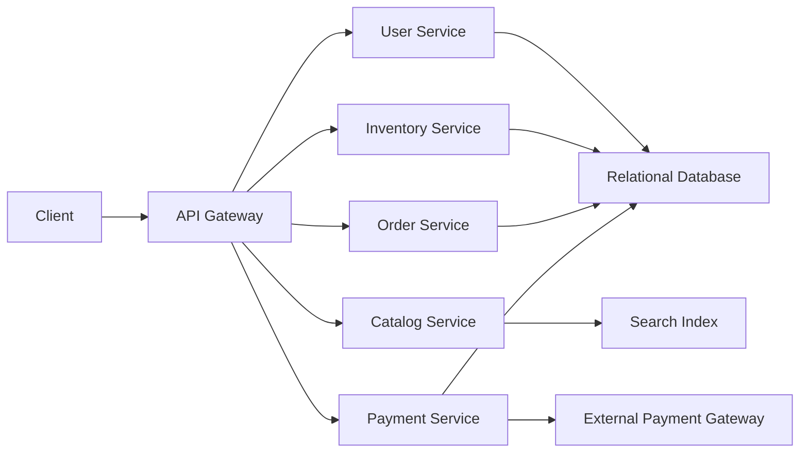
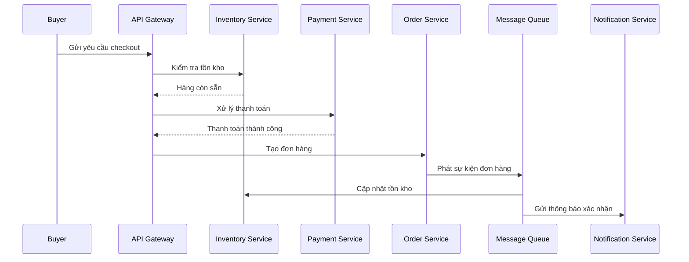

# 🏁 E-Commerce Platform: Bản thiết kế cuối cùng — ghép mọi mảnh ghép

> Nguồn: `117-The-Final-Design-E-Commerce-Platform.txt` · [Udemy](https://ua.udemy.com/course/mastering-system-design-from-basics-to-cracking-interviews/learn/lecture/49955311)

Đây là bài cuối của case study E-Commerce — lúc để mình và các bạn ghép mọi thứ thành một kiến trúc hoàn chỉnh. Xuyên suốt 4 bước trước, chúng ta đã nhận diện yêu cầu, ước lượng scale, phân tích thách thức và thiết kế từng service. **Kiến trúc cuối cùng** kết hợp tất cả những quyết định đó vào một hệ thống sẵn sàng cho môi trường production.

---

### 🗺️ Kiến trúc tổng thể

Mọi request từ client đều đi vào qua **API gateway** — điểm vào duy nhất cho authentication, routing và quản lý request.

* Từ gateway, request được định tuyến tới service phù hợp: **user, product catalog, inventory, order, payment, notification hoặc admin**.
* Nhờ tách trách nhiệm, mỗi service có thể tiến hóa, scale và được bảo trì độc lập.
* **Mỗi service sở hữu dữ liệu riêng.** Thông tin nghiệp vụ then chốt như user, inventory, orders và payments nằm trong **relational database** để đảm bảo strong consistency và giao dịch đáng tin cậy.
* Với product discovery, catalog database được bổ sung một **search index**, cho phép tìm kiếm sản phẩm nhanh và hiệu quả kể cả khi catalog lớn lên.
* Để tăng hiệu năng, thông tin truy cập thường xuyên được phục vụ từ **Redis** thay vì truy vấn database lặp lại — giảm độ trễ cho các thao tác phổ biến như duyệt sản phẩm và kiểm tra tồn kho, đồng thời giảm tải database.

---

### 🚶 Hành trình người mua và luồng checkout đồng bộ

Giờ hãy đi qua hành trình chính của người dùng: người mua đăng nhập, tìm sản phẩm, thêm vào giỏ và tiến hành checkout.

Trong lúc checkout:

1. **Inventory service** kiểm tra hàng còn sẵn.
2. **Payment service** giao tiếp với nhà cung cấp thanh toán bên ngoài để xử lý giao dịch.
3. **Order service** tạo đơn hàng khi thanh toán đã thành công.

Con đường **synchronous** này đảm bảo khách hàng biết ngay việc mua có thành công hay không — yếu tố sống còn cho niềm tin của người mua.

---

### 🔄 Bất đồng bộ tiếp quản phần việc còn lại

Sau khi đơn hàng được tạo, **xử lý bất đồng bộ** đảm nhận phần còn lại: việc publish vào **message queue** kích hoạt cập nhật tồn kho, xác nhận đơn hàng và thông báo cho khách hàng hoặc người bán.

Vì những hoạt động này diễn ra độc lập với request của người dùng, **trải nghiệm checkout vẫn nhanh** trong khi phần công việc còn lại tiếp tục chạy đáng tin cậy ở phía sau. Đây chính là sự kết hợp kinh điển: đồng bộ cho con đường ra quyết định, bất đồng bộ cho mọi việc có thể chờ.

---

### ✅ Đối chiếu với những thách thức ban đầu

Nhìn lại 5 thách thức đã nhận diện ở bài đầu case study, các bạn sẽ thấy kiến trúc này giải quyết từng vấn đề:

| Thách thức | Cách kiến trúc giải quyết |
|---|---|
| Tìm kiếm độ trễ thấp | Cache và service chuyên trách giúp duy trì tìm kiếm nhanh |
| Chống overselling | Quản lý tồn kho với strong consistency |
| Chịu đỉnh traffic | Xử lý hướng sự kiện giữ hệ thống nhạy bén |
| Scale và vận hành | Managed cloud services cùng các thành phần mô-đun |
| Bảo vệ người dùng, giao dịch | Xác thực an toàn kết hợp external payment gateway |

Một điều các bạn sẽ nhận ra: **mọi quyết định kiến trúc đều truy ngược về một yêu cầu hoặc thách thức đã xác định từ đầu**. Đó chính xác là cách system design trong thế giới thực vận hành.

---

### 🎓 Bài học cuối cùng của case study

Kiến trúc tốt không được xây bằng cách chọn công nghệ trước tiên. Chúng được xây bằng cách **hiểu bài toán, nhận diện ràng buộc và đưa ra những quyết định thiết kế có chủ đích** để giải quyết các bài toán đó.

Và đây cũng là một bài học quan trọng: kiến trúc này **không phải giải pháp duy nhất**. Scale khác, mục tiêu kinh doanh khác, ràng buộc khác có thể dẫn tới thiết kế hoàn toàn khác. Điều quan trọng là **giải thích được lý do đằng sau mỗi quyết định** — đó là tư duy phân biệt một kiến trúc sư phần mềm kinh nghiệm với người chỉ học thuộc lòng các sơ đồ system design.

*Và nhớ nhé: hiếm khi có một thiết kế hoàn hảo — mọi quyết định kiến trúc đều là trade-off.*

---

Vậy là chúng ta đã khép lại case study E-Commerce với một bản thiết kế hoàn chỉnh, đi từ bài toán đến production. Ở section tiếp theo, mình và các bạn sẽ gặp một case study thực tế mới — **Taxi Hailing App kiểu Uber** — và áp dụng lại đúng blueprint 4 bước này. Hẹn gặp lại các bạn! 🚀
