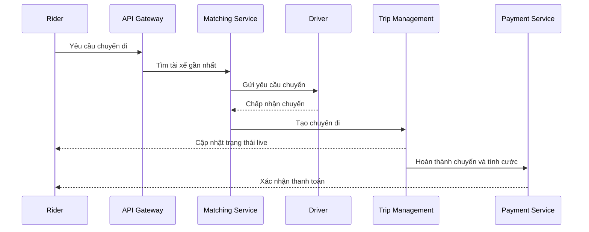

# 🏗️ Taxi Hailing App: High-Level Design — services, APIs & real-time

> Nguồn: `120-High-Level-Design-Services-APIs-Communication.txt` · [Udemy](https://ua.udemy.com/course/mastering-system-design-from-basics-to-cracking-interviews/learn/lecture/49971991)

Bước 3 của case study — **high-level design**. Sau khi đã hiểu requirements và thách thức, mình và các bạn bắt đầu chia hệ thống thành các **microservices (vi dịch vụ)** với trách nhiệm rõ ràng, để mỗi service có thể tiến hóa và scale độc lập. Đi kèm với đó là câu hỏi không kém phần quan trọng: các service giao tiếp với nhau và với client như thế nào?

---

### 🧩 Bảy microservice cốt lõi

* **User service** — quản lý tài khoản rider: onboarding, authentication và quản lý profile. Mọi thứ liên quan đến danh tính người dùng thuộc về đây.
* **Driver service** — quản lý thông tin riêng của tài xế: onboarding, chi tiết xe và trạng thái hiện tại là online hay offline. Tách quản lý tài xế riêng cho phép phát triển tính năng cho tài xế mà không ảnh hưởng đến tính năng của rider.
* **Location service** — tiếp nhận luồng cập nhật GPS liên tục và duy trì thông tin vị trí cho các service khác sử dụng. Vì cập nhật vị trí là một trong những workload khối lượng lớn nhất hệ thống, tách riêng service này giúp việc scale dễ dàng hơn nhiều.
* **Ride matching service** — trái tim của nền tảng. Khi rider yêu cầu chuyến, service này xác định tài xế gần phù hợp dựa trên dữ liệu vị trí mới nhất và tình trạng sẵn sàng của tài xế. Mục tiêu chính: ra quyết định matching chính xác với độ trễ tối thiểu.
* **Trip management service** — sau khi chuyến được gán, service này quản lý toàn bộ vòng đời: từ assignment và điểm đón, đến chuyến đang di chuyển và hoàn tất, đồng thời giữ trạng thái chuyến đồng bộ trên toàn nền tảng.
* **Payment service** — xử lý mọi thứ liên quan đến tính cước, xử lý thanh toán và hoàn tiền (refunds). Cô lập nghiệp vụ tài chính giúp logic thanh toán độc lập với phần còn lại của luồng chuyến đi.
* **Notification service** — chịu trách nhiệm giao tiếp với người dùng: gửi yêu cầu chuyến cho tài xế, báo rider rằng tài xế đã đến, hay gửi xác nhận thanh toán. Mọi luồng thông báo đi ra đều qua service này.

Điểm mấu chốt: **mỗi service có một trách nhiệm duy nhất, được định nghĩa rõ ràng**. Thay vì xây một ứng dụng lớn ôm hết mọi thứ, chúng ta chia nền tảng thành những service tập trung, phối hợp với nhau để mang lại trải nghiệm chuyến đi hoàn chỉnh. Cách tách này cải thiện khả năng bảo trì hôm nay và cho chúng ta sự linh hoạt để scale từng service khi nhu cầu tăng.

---

### 🔁 API Gateway và các pattern giao tiếp

Chọn đúng pattern giao tiếp quan trọng không kém việc chia service. Không phải tương tác nào cũng có cùng yêu cầu, nên thiết kế dùng **kết hợp nhiều pattern**:

* **Giao tiếp nội bộ - synchronous:** dùng **gRPC** cho giao tiếp đồng bộ, độ trễ thấp giữa các service — phù hợp khi một service cần phản hồi ngay từ service khác trước khi xử lý tiếp.
* **Giao tiếp nội bộ - asynchronous:** với luồng không cần phản hồi tức thì, nhắn tin bất đồng bộ qua các công nghệ như **Kafka** thường là lựa chọn tốt hơn. Cách này giữ các service **loosely coupled (liên kết lỏng)**, cho phép chúng xử lý event độc lập, giúp hệ thống scale tốt hơn và kiên cường hơn.
* **Giao tiếp với client bên ngoài:** thay vì phơi từng microservice, mọi request từ client đi qua **API gateway**. Gateway phơi **REST hoặc GraphQL API**, cho front-end một điểm vào duy nhất bất kể có bao nhiêu service phía sau.
* **Real-time:** các tính năng như theo dõi tài xế trực tiếp và cập nhật trạng thái chuyến cần kết nối thường trực, nên **WebSockets hoặc MQTT** phù hợp hơn kiểu API request-response truyền thống.

Ngoài việc định tuyến traffic, API gateway còn vài trách nhiệm quan trọng:

1. **Tập trung hóa authentication và rate limiting** — đảm bảo mọi request được xác thực và ngăn client làm quá tải service backend.
2. **Định tuyến request** tới microservice phù hợp, giấu kiến trúc nội bộ khỏi front-end, để backend tiến hóa mà không ảnh hưởng ứng dụng client.
3. **Tổng hợp dữ liệu (aggregation)** từ nhiều service và trả về một response duy nhất. Thay vì ứng dụng di động gọi lần lượt nhiều service, nó nhận mọi thứ cần thiết qua một API — đơn giản hóa phát triển client và giảm network overhead.

*Không có một pattern giao tiếp nào đúng ở mọi nơi.* Một hệ phân tán được thiết kế tốt dùng đồng bộ, bất đồng bộ và giao thức real-time ở những chỗ phù hợp nhất, trong khi API gateway mang lại điểm vào đơn giản và an toàn cho mọi client bên ngoài.

---

### 🚕 Hành trình đặt xe end-to-end

Hãy cùng đi qua điều gì xảy ra khi một rider đặt chuyến — nhìn nó như hành trình đầu-cuối qua hệ thống thay vì từng lời gọi API riêng lẻ.

Mọi thứ bắt đầu khi rider yêu cầu chuyến từ ứng dụng di động. Thay vì gọi thẳng service backend, request trước tiên đến **API gateway** — nơi xác thực request và chuyển tiếp đến service phù hợp.

**Ride matching service** tiếp quản. Dùng thông tin vị trí mới nhất và tình trạng sẵn sàng của tài xế, nó tìm tài xế gần phù hợp và thử gán chuyến. Khi tài xế được chọn, **notification service** gửi yêu cầu chuyến đến ứng dụng tài xế; tài xế có thể chấp nhận hoặc từ chối. Nếu chấp nhận, cả rider và tài xế ngay lập tức thấy trạng thái chuyến được cập nhật.

Khi chuyến diễn ra, **location service** liên tục nhận cập nhật GPS từ cả hai thiết bị. Những cập nhật này cung cấp năng lượng cho việc theo dõi tài xế trực tiếp, tính ETA và bản đồ thời gian thực mà cả hai người dùng cùng thấy.

Đồng thời, **trip management service** duy trì vòng đời chuyến đi: ghi nhận các chuyển trạng thái quan trọng như tài xế được gán, tài xế đến điểm đón, chuyến bắt đầu và cuối cùng là hoàn thành. Khi chuyến kết thúc, **payment service** tính cước cuối cùng và xử lý thanh toán qua nhà cung cấp đã cấu hình. Xuyên suốt hành trình, notification service giữ cả hai bên được thông báo: xác nhận chuyến, thông báo tài xế đã đến, tin nhắn hoàn thành chuyến và xác nhận thanh toán.

Một điều đáng chú ý: **không service nào sở hữu trọn vẹn workflow**. Mỗi service làm một việc cụ thể rồi chuyển quyền kiểm soát cho service tiếp theo. Cùng nhau, chúng mang lại cho người dùng một trải nghiệm đặt xe liền mạch như một khối — và đó là một trong những nguyên tắc nền tảng của kiến trúc microservices được thiết kế tốt.

---

### 📡 Thiết kế giao tiếp real-time

Giao tiếp real-time là đặc trưng định hình của nền tảng gọi xe. Không có nó, trải nghiệm sẽ chậm và rời rạc, vì rider và tài xế kỳ vọng thông tin cập nhật tức thì.

* **Kết nối thường trực:** dùng các kênh như **WebSockets hoặc MQTT**. Thay vì hỏi server liên tục, client giữ một kết nối mở để backend đẩy cập nhật ngay khi có thay đổi — giảm đáng kể độ trễ và mang lại trải nghiệm mượt mà hơn.
* **Publish-subscribe (xuất bản - đăng ký):** nhiều cập nhật được phân phối theo mô hình này. Khi một event quan trọng xảy ra — cập nhật vị trí hay thay đổi trạng thái chuyến — nó được publish, và các service hoặc client quan tâm tự động nhận được. Điều này giữ các phần khác nhau của hệ thống đồng bộ mà không gắn chặt vào nhau.
* **Fallback khi mạng kém:** không thể giả định kết nối hoàn hảo — người dùng di động thường đi qua vùng sóng yếu. Nếu kết nối thường trực tạm không khả dụng, client có thể chuyển sang **polling (hỏi định kỳ)** cho đến khi kết nối được khôi phục. Trải nghiệm có thể kém nhạy hơn, nhưng ứng dụng vẫn tiếp tục hoạt động.

Còn về trải nghiệm người dùng: khi tài xế di chuyển đến điểm đón, rider thấy chuyển động của tài xế trực tiếp trên bản đồ. Suốt hành trình, các chuyển trạng thái từ tài xế đang đến → chuyến đang di chuyển → hoàn thành được phản ánh ngay lập tức trên cả hai ứng dụng. Cùng kênh giao tiếp đó cũng dùng cho các sự kiện vận hành: nếu chuyến bị hủy, ETA thay đổi, hoặc **surge pricing (giá tăng cao điểm)** ảnh hưởng đến chuyến, những cập nhật ấy được gửi đến đúng người dùng ngay khi chúng xảy ra.

Điểm mấu chốt: **real-time communication không chỉ là hiển thị những biểu tượng di chuyển trên bản đồ**. Đó là cơ chế giữ rider, tài xế và backend services đồng bộ với nhau suốt cả chuyến đi — đảm bảo ai cũng có góc nhìn mới nhất về điều đang diễn ra ngay lúc này.

---

### 🎯 Tự kiểm tra nhanh

**Câu 1:** Khi nào dùng gRPC, khi nào dùng Kafka giữa các service?

<b>Xem đáp án</b>

**Đáp án:** gRPC cho giao tiếp đồng bộ cần phản hồi ngay; Kafka cho luồng bất đồng bộ không cần phản hồi tức thì.

Giải thích: Kafka giữ service liên kết lỏng, xử lý event độc lập, giúp hệ thống scale và kiên cường hơn.

Tham chiếu: Mục API Gateway và các pattern giao tiếp.

**Câu 2:** Ba trách nhiệm chính của API gateway là gì?

<b>Xem đáp án</b>

**Đáp án:** Tập trung authentication và rate limiting; định tuyến request tới microservice; tổng hợp dữ liệu từ nhiều service thành một response.

Giải thích: Gateway cũng giấu kiến trúc nội bộ khỏi front-end, giúp backend tiến hóa độc lập.

Tham chiếu: Mục API Gateway và các pattern giao tiếp.

**Câu 3:** Service nào xác định tài xế gần phù hợp, và dựa trên dữ liệu gì?

<b>Xem đáp án</b>

**Đáp án:** Ride matching service, dựa trên dữ liệu vị trí mới nhất và tình trạng sẵn sàng của tài xế.

Giải thích: Đây là trái tim của nền tảng, cần matching chính xác với độ trễ tối thiểu.

Tham chiếu: Mục Bảy microservice cốt lõi.

**Câu 4:** Vì sao cần fallback polling cho giao tiếp real-time?

<b>Xem đáp án</b>

**Đáp án:** Vì mạng di động không ổn định; khi kết nối thường trực tạm mất, client chuyển sang polling để ứng dụng vẫn hoạt động.

Giải thích: Trải nghiệm có thể kém nhạy hơn nhưng hệ thống không ngừng phục vụ.

Tham chiếu: Mục Thiết kế giao tiếp real-time.

**Câu 5:** Vì sao nói không service nào sở hữu trọn vẹn workflow đặt xe?

<b>Xem đáp án</b>

**Đáp án:** Vì mỗi service làm một việc cụ thể rồi chuyển quyền cho service tiếp theo.

Giải thích: Sự phối hợp đó tạo ra trải nghiệm liền mạch cho người dùng — nguyên tắc nền tảng của microservices.

Tham chiếu: Mục Hành trình đặt xe end-to-end.

---

Vậy là chúng ta đã có bức tranh tổng quan về microservices, API gateway và cách giao tiếp real-time. Ở bài tiếp theo, chúng ta sẽ đi sâu vào **quyết định công nghệ và hạ tầng** cho từng phần của nền tảng. Hẹn gặp lại các bạn! 🚀
