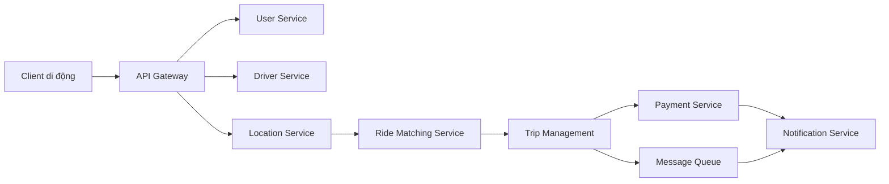
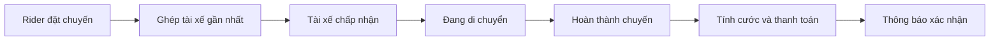

# 🏁 Taxi Hailing App: Bản thiết kế cuối cùng

> Nguồn: `122-The-Final-Design---Taxi-Hailing-Application.txt` · [Udemy](https://ua.udemy.com/course/mastering-system-design-from-basics-to-cracking-interviews/learn/lecture/49971995)

Chúng ta đã đến kiến trúc cuối cùng. Qua nhiều bài, mình và các bạn đã đi từ bài toán kinh doanh, xác định yêu cầu, ước lượng scale, hiểu các điểm nghẽn rồi chọn pattern kiến trúc phù hợp. Bản thiết kế cuối cùng kết hợp tất cả những quyết định đó thành một hệ thống định hướng production — hãy nhìn nó như **sự cộng tác giữa các thành phần chuyên biệt**, mỗi thành phần phụ trách một phần của nền tảng.

---

### 🗺️ Kiến trúc tổng thể

Mọi request từ client đều đi vào qua **API gateway** — điểm vào duy nhất cho authentication, routing và quản lý request. Từ đó, mỗi request được dẫn tới microservice phù hợp.

* **User service và driver service** quản lý hai nhóm tác nhân chính của nền tảng.
* **Location service** liên tục tiếp nhận cập nhật GPS, đưa dữ liệu vị trí mới cho **ride matching service**; matching service dùng thông tin đó để nhanh chóng xác định tài xế gần phù hợp.
* Sau khi chuyến được gán, **trip management service** sở hữu vòng đời chuyến đi, theo dõi mọi giai đoạn từ assignment đến completion.
* Khi chuyến kết thúc, **payment service** tính cước và xử lý giao dịch, còn **notification service** giữ rider và tài xế được thông báo suốt hành trình.

Vài nguyên tắc xuyên suốt kiến trúc:

* **Mỗi service sở hữu data store riêng**, cho phép nó tiến hóa và scale độc lập.
* Thông tin truy cập thường xuyên được **cache** để giảm tải database và cải thiện thời gian phản hồi.
* **WebSocket** cung cấp kết nối thường trực cần thiết cho theo dõi vị trí trực tiếp và cập nhật chuyến đi.
* Các thao tác bất đồng bộ như gửi thông báo được xử lý qua **queue** để không làm chậm luồng chuyến đi chính.

---

### 🚕 Luồng chuyến đi hoàn chỉnh

Giờ hãy xem toàn bộ workflow của một chuyến đi:

1. Rider yêu cầu chuyến qua ứng dụng di động. Request đi qua **API gateway** và đến **ride matching service**.
2. Dùng thông tin mới nhất từ **location service** và **driver service**, nền tảng xác định một tài xế gần đang sẵn sàng và gửi yêu cầu chuyến.
3. Khi tài xế chấp nhận, **trip management service** tạo chuyến và cả hai ứng dụng ngay lập tức nhận trạng thái cập nhật.
4. Suốt chuyến đi, **location service** liên tục xử lý các cập nhật GPS, cho phép cả rider và tài xế thấy chuyển động trực tiếp trên bản đồ.
5. Khi đến điểm đến, trip management service đánh dấu chuyến hoàn thành. **Payment service** xử lý cước, và **notification service** gửi xác nhận cuối cùng về chuyến đi lẫn thanh toán.

---

### ✅ Mỗi quyết định giải quyết một vấn đề

Nếu lùi lại và so sánh thiết kế này với những thách thức đã nhận diện từ đầu case study, các bạn sẽ thấy mỗi lựa chọn kiến trúc đều nhắm vào một vấn đề cụ thể:

* **Các service tách biệt** giúp cô lập những năng lực nghiệp vụ khác nhau.
* **Caching** giảm áp lực lên database.
* **WebSockets** mở ra giao tiếp thời gian thực.
* **Queues** tách công việc bất đồng bộ khỏi luồng chính.
* **Database độc lập cho từng service** cho phép scale riêng lẻ.

Kết hợp lại, tất cả những quyết định ấy giúp nền tảng giữ được sự nhạy bén, khả năng mở rộng và độ tin cậy kể cả khi traffic tăng.

---

### 🔭 Nhìn từ góc độ phi chức năng

Nếu soi kiến trúc này qua lăng kính những yêu cầu phi chức năng đã đặt ra từ bài đầu case study, các bạn sẽ thấy các quyết định kể trên phục vụ đúng những mục tiêu đó:

* **Low latency:** location service xử lý luồng GPS liên tục, còn WebSocket đẩy cập nhật ngay khi có thay đổi thay vì để client hỏi liên tục.
* **Scalability:** tách service cùng data store độc lập cho phép từng phần mở rộng theo nhu cầu riêng, còn cache giảm tải cho database.
* **Reliability:** queue đảm nhận công việc bất đồng bộ như thông báo, nên luồng chuyến đi chính không bị chậm vì các tác vụ phụ.
* **Security:** mọi request đều đi qua một cửa vào duy nhất là API gateway để xác thực và định tuyến.

Tất cả cùng hướng tới mục tiêu xuyên suốt case study: một nền tảng nhạy bén, mở rộng được và đáng tin cậy ngay cả khi traffic tăng cao.

---

### 🎓 Bài học mang vào phỏng vấn

Một bài học rất quan trọng từ case study này: **system design tốt không phải là chọn thật nhiều công nghệ**. Đó là hiểu bài toán, nhận diện ràng buộc và ra quyết định kiến trúc giải quyết được những bài toán đó với đúng trade-off.

Kiến trúc này chắc chắn không phải giải pháp duy nhất — nhưng nó thể hiện cách các kiến trúc sư kinh nghiệm suy nghĩ: **bắt đầu từ yêu cầu, nhận diện điểm nghẽn, và để chính những điểm nghẽn dẫn dắt thiết kế**. Đó là mindset các bạn nên mang vào mọi buổi phỏng vấn system design và mọi hệ thống production mình xây dựng.

*Và nhớ nhé: hiếm khi có một thiết kế hoàn hảo — mọi quyết định kiến trúc đều là trade-off.*

---

Vậy là chúng ta đã hoàn thành case study Taxi Hailing App — từ bài toán, scale, high-level design đến bản thiết kế cuối cùng. Ở section tiếp theo, chúng ta sẽ gặp một case study thực tế khác và tiếp tục áp dụng blueprint system design này. Hẹn gặp lại các bạn! 🚀
