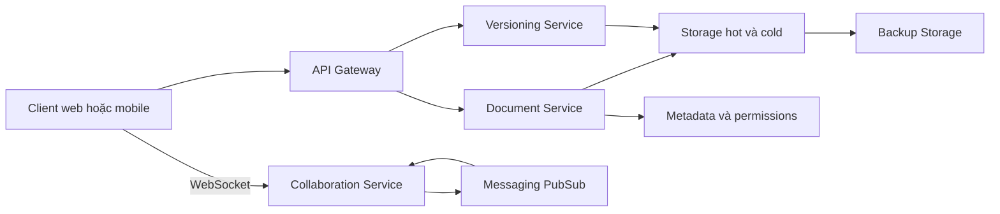
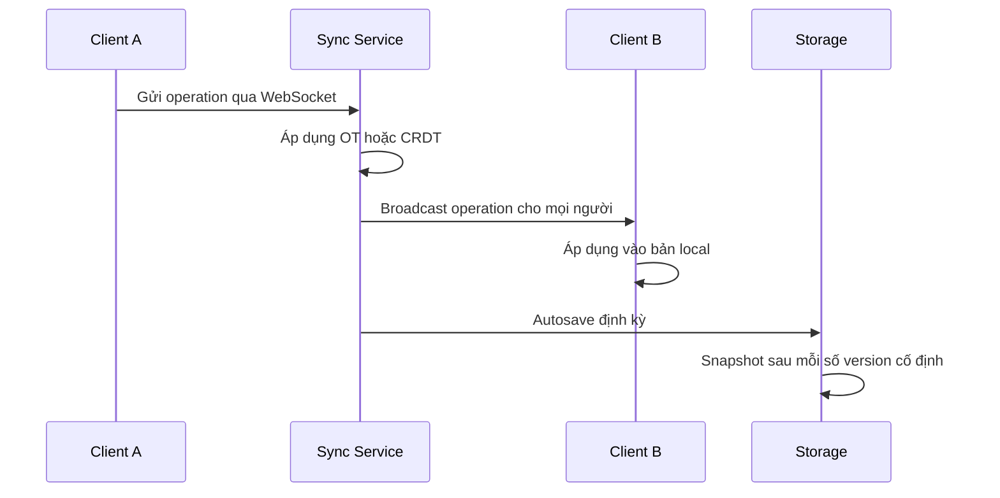

# 🏗️ High-Level Design Collaborative Document Editor: Document model, luồng sync và API

> Nguồn: `125-High-Level-Design-Document-Model-Sync-Flow-APIs.txt` · [Udemy](https://ua.udemy.com/course/mastering-system-design-from-basics-to-cracking-interviews/learn/lecture/49990479)

Sau khi đã hiểu yêu cầu, quy mô và thách thức, chúng ta bước vào bước 3: **high-level design**. Ở giai đoạn này mình chưa đi vào chi tiết triển khai, mà xác định **những khối xây dựng chính và trách nhiệm của từng khối** — rồi ghép chúng thành một kiến trúc tổng thể cho hệ thống.

---

### 🧱 Kiến trúc tổng quan: các khối xây dựng chính

Mọi thứ bắt đầu từ **client**: dù chạy trên trình duyệt hay thiết bị di động, client cung cấp trải nghiệm soạn thảo văn bản phong phú và duy trì một **kết nối WebSocket** để trao đổi thay đổi với server theo thời gian thực. Từ đó, kiến trúc gồm các thành phần:

1. **API gateway:** mọi request đi qua đây trước tiên — một điểm vào duy nhất để **xác thực người dùng, định tuyến request** tới đúng service và **áp rate limiting** trước khi traffic chạm backend.
2. **Collaboration service (service cộng tác):** **trái tim của hệ thống**, nơi diễn ra đồng bộ thời gian thực. Nó nhận chỉnh sửa từ nhiều người dùng, áp dụng logic cộng tác bằng các kỹ thuật như **operational transformation hoặc CRDT**, và đảm bảo mọi người hội tụ về cùng trạng thái tài liệu.
3. **Document service:** quản lý tài liệu — load và save, lưu **metadata**, cùng việc **thực thi quyền** để chỉ người được phép mới truy cập hoặc sửa tài liệu.
4. **Versioning service:** duy trì lịch sử tài liệu. Thay vì chỉ giữ phiên bản mới nhất, nó lưu **snapshot và lịch sử thay đổi**, cho phép người dùng xem lại hoặc khôi phục phiên bản cũ khi cần.
5. **Storage layer:** tài liệu truy cập thường xuyên nằm ở **hot storage** để đọc với độ trễ thấp, còn phiên bản cũ và dữ liệu lưu trữ chuyển sang **cold storage**. **Backup storage** thêm một lớp bảo vệ trước mất mát dữ liệu.
6. **Messaging layer:** thay vì mọi service gọi trực tiếp lẫn nhau, các sự kiện được publish và phân phối qua hạ tầng **PubSub như Kafka hoặc Redis streams**, giúp **fan-out (phát tán) thời gian thực** hiệu quả khi hệ thống mở rộng.

Điểm đáng chú ý: các năng lực này được tách thành **các microservice với API stateless**, cho phép mở rộng collaboration service **độc lập** với storage hay versioning — điều thiết yếu vì mỗi thành phần chịu mẫu lưu lượng rất khác nhau. Ý tưởng cốt lõi của kiến trúc là **tách bạch trách nhiệm**: mỗi service tập trung giải một bài toán, giúp toàn hệ thống dễ mở rộng, dễ bảo trì và dễ tiến hóa khi nhu cầu tăng.

---

### 🧩 Document model và luồng đồng bộ thời gian thực

**Document model** là một trong những quyết định thiết kế quan trọng nhất, vì nó quyết định cách thay đổi được **biểu diễn, đồng bộ và hợp nhất** giữa người dùng. Để hỗ trợ sửa đồng thời, ta cần một cấu trúc dữ liệu hiểu được cập nhật song song — vì vậy các trình soạn thảo cộng tác thường dùng **model tương thích CRDT hoặc OT như Yjs hay Automerge**. Đây không chỉ là định dạng lưu trữ, mà được thiết kế chuyên biệt để nhiều người sửa cùng tài liệu mà vẫn đạt trạng thái nhất quán sau cùng.

Một lựa chọn quan trọng khác là cách truyền cập nhật: thay vì gửi toàn bộ tài liệu mỗi lần, client chỉ gửi **operation (thao tác)** mô tả thay đổi — chèn hay xóa. Vì hầu hết chỉnh sửa rất nhỏ, cách này **giảm mạnh lưu lượng mạng** và khiến đồng bộ thời gian thực hiệu quả hơn nhiều. Cuối cùng, mỗi tài liệu duy trì **version metadata** song song với nội dung, giúp theo dõi thay đổi, đồng bộ client đúng cách, tính khác biệt giữa các phiên bản và hỗ trợ rollback khi cần khôi phục.

Vậy là trong collaborative editor, tài liệu **không được coi là một file text đơn giản**: nó là một chuỗi các operation kèm thông tin phiên bản, cho phép đồng bộ hiệu quả, xử lý xung đột và cộng tác đáng tin cậy ở quy mô lớn. Một chỉnh sửa truyền qua hệ thống như sau:

Khi người dùng chèn hoặc xóa văn bản, client gửi operation qua kết nối WebSocket; synchronization service áp dụng logic OT/CRDT để **sắp thứ tự hoặc biến đổi các chỉnh sửa đồng thời**, rồi **broadcast ngay** cho các cộng tác viên khác — mỗi client áp dụng cùng operation vào bản sao cục bộ của mình. Song song đó, persistence đi theo đường khác: hệ thống **autosave định kỳ** vào lưu trữ bền vững thay vì ghi từng cú gõ, giảm áp lực ghi mà vẫn bảo vệ công việc người dùng, và **tạo snapshot sau mỗi số phiên bản cố định** để phục hồi hiệu quả mà không phải replay toàn bộ lịch sử từ đầu. Ý tưởng then chốt: **cộng tác thời gian thực và lưu trữ bền vững là hai mối quan tâm tách biệt** — đường sync tối ưu cho tốc độ, còn autosave và snapshot đảm bảo độ bền và khả năng phục hồi.

---

### 🌐 Communication patterns và API

Hệ thống như thế này **không dựa vào một giao thức duy nhất** — mỗi tương tác có yêu cầu riêng, nên ta chọn pattern phù hợp nhất cho từng use case:

| Kịch bản | Giao thức | Lý do chọn |
|---|---|---|
| Tạo, mở tài liệu, xem version, cập nhật metadata | REST | Đơn giản, hỗ trợ rộng, dễ dùng cho web và mobile |
| Microservices gọi nhau | gRPC | Protocol nhị phân gọn, hỗ trợ streaming, nhanh hơn REST |
| Xử lý document event, backup, ghi audit log | Message queue | Bất đồng bộ, không chặn request người dùng |
| Đồng bộ chỉnh sửa thời gian thực | WebSocket | Kết nối hai chiều liên tục, tránh polling |

Với **API**, vòng đời tài liệu gồm tạo, lấy về để sửa và lưu nội dung — các thao tác CRUD chuẩn nên nằm ở REST, cùng các endpoint xem lịch sử phiên bản và quản lý cộng tác viên. Riêng cộng tác thì khác: thay vì lưu cả tài liệu sau mỗi cú phím, client gửi **từng edit operation** như chèn hay xóa — request nhẹ, để collaboration engine xử lý trước khi phân phối cho người khác. Còn **đồng bộ thời gian thực không đi qua REST**: khi tham gia tài liệu, client thiết lập **kết nối WebSocket** qua collaboration endpoint, để operation chảy liên tục hai chiều mà không phải tạo request HTTP mới. Nhìn tổng thể, có sự **phân tách trách nhiệm rõ ràng**: REST lo quản lý tài liệu và hành động người dùng, WebSocket chuyên cho đồng bộ thời gian thực — giúp API đơn giản, dễ mở rộng và khớp với từng communication pattern.

---

### 🧠 Consistency và xử lý xung đột

Bài toán khó nhất của collaborative editor là đảm bảo mọi người dùng cuối cùng thấy **cùng một tài liệu**, kể cả khi các chỉnh sửa diễn ra đồng thời hoặc đến theo thứ tự khác nhau. Để giải quyết, các hệ thống cộng tác thường dùng **Operational Transformation hoặc CRDT**: cả hai đều xử lý chỉnh sửa đồng thời và đảm bảo mọi client hội tụ về cùng trạng thái — **cách triển khai khác nhau, nhưng mục tiêu hoàn toàn giống nhau**: cộng tác nhất quán mà không cần người dùng tự giải quyết xung đột.

Để làm được điều đó, hệ thống duy trì một **operation log cho mỗi tài liệu**: thay vì chỉ theo dõi nội dung mới nhất, nó ghi lại **chuỗi các thao tác chỉnh sửa**. Lịch sử này giúp các client đã đồng bộ giải quyết thay đổi đồng thời và duy trì version history. Mỗi client áp dụng **cùng một phép biến đổi theo cùng thứ tự logic** — kể cả khi operation đến lệch thời điểm vì độ trễ mạng, thuật toán cộng tác vẫn đảm bảo chúng tạo ra cùng một tài liệu cuối cùng cho mọi người tham gia.

Tất nhiên, client không phải lúc nào cũng đồng bộ hoàn hảo: có người mất kết nối, có người tham gia muộn. Thay vì replay toàn bộ lịch sử từ đầu, hệ thống gửi **snapshot gần nhất kèm các operation còn thiếu** để client bắt kịp nhanh chóng. Khi một client bị ngắt kết nối tạm thời rồi quay lại, nó **trao đổi thông tin phiên bản với server**, lấy về các operation đã bỏ lỡ và tham gia lại an toàn mà **không mất chỉnh sửa cục bộ**. Thuộc tính quan trọng nhất của toàn hệ thống là **convergence (hội tụ)**: bất kể độ trễ mạng hay thứ tự giao nhận, mọi client cuối cùng đều đạt cùng một trạng thái tài liệu. Đó là nền tảng khiến chỉnh sửa cộng tác thời gian thực trở nên đáng tin cậy và có thể dự đoán được ở quy mô lớn.

---

### 🎯 Tự kiểm tra nhanh

**Câu 1:** Collaboration service đóng vai trò gì trong kiến trúc?

<b>Xem đáp án</b>

**Đáp án:** Nhận chỉnh sửa từ nhiều người dùng, áp dụng logic OT/CRDT để sắp thứ tự và biến đổi, đảm bảo mọi người hội tụ về cùng trạng thái tài liệu.

**Giải thích:** Đây là trái tim của hệ thống — nơi diễn ra đồng bộ thời gian thực.

Tham chiếu: Mục Kiến trúc tổng quan.

**Câu 2:** Vì sao client gửi operation thay vì cả tài liệu?

<b>Xem đáp án</b>

**Đáp án:** Vì hầu hết chỉnh sửa rất nhỏ; gửi operation giúp giảm mạnh lưu lượng mạng và làm đồng bộ hiệu quả hơn.

**Giải thích:** Operation chỉ mô tả thay đổi như chèn hoặc xóa, thay vì toàn bộ nội dung.

Tham chiếu: Mục Document model và luồng đồng bộ.

**Câu 3:** Vì sao đường đồng bộ và đường lưu trữ bền vững được tách riêng?

<b>Xem đáp án</b>

**Đáp án:** Đường sync tối ưu cho tốc độ, còn autosave định kỳ và snapshot đảm bảo độ bền và khả năng phục hồi mà không gây áp lực ghi.

**Giải thích:** Hệ thống không ghi từng cú gõ ngay lập tức; nó autosave định kỳ và tạo snapshot sau mỗi số phiên bản cố định.

Tham chiếu: Mục Document model và luồng đồng bộ.

**Câu 4:** Client mất kết nối rồi kết nối lại được xử lý như thế nào?

<b>Xem đáp án</b>

**Đáp án:** Client trao đổi thông tin phiên bản với server, nhận snapshot gần nhất kèm các operation còn thiếu — không replay toàn bộ lịch sử.

**Giải thích:** Nhờ vậy client tham gia lại an toàn mà không mất chỉnh sửa cục bộ.

Tham chiếu: Mục Consistency và xử lý xung đột.

**Câu 5:** Bốn communication pattern và kịch bản tương ứng là gì?

<b>Xem đáp án</b>

**Đáp án:** REST cho API hướng client; gRPC cho giao tiếp giữa microservices; message queue cho công việc bất đồng bộ; WebSocket cho cộng tác thời gian thực.

**Giải thích:** Không có giao thức nào phù hợp mọi tình huống — chọn theo yêu cầu từng use case.

Tham chiếu: Mục Communication patterns và API.

---

Vậy là chúng ta đã có thiết kế tổng quan: các service tách bạch trách nhiệm, document model dựa trên operation và version, luồng sync tách khỏi luồng lưu trữ, cùng bốn communication pattern cho bốn loại tương tác. Ở bài tiếp theo, chúng ta sẽ **chọn công nghệ và hạ tầng** để hiện thực hóa kiến trúc này. Hẹn gặp lại các bạn! 🚀
