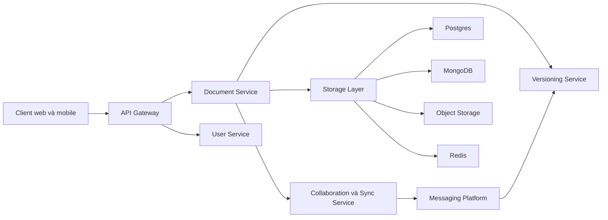

# 🗺️ Final Design Collaborative Document Editor: Kiến trúc hoàn chỉnh và bài học về quy trình

> Nguồn: `127-The-Final-Design---Collaborative-Document-Editor.txt` · [Udemy](https://ua.udemy.com/course/mastering-system-design-from-basics-to-cracking-interviews/learn/lecture/49990483)

Chúng ta đã đi đến cuối case study. Giờ là lúc lùi lại một bước và nhìn vào **giải pháp hoàn chỉnh** đã xây dựng — không phải từng service riêng lẻ, mà là cách chúng **phối hợp với nhau** để mang lại trải nghiệm chỉnh sửa cộng tác liền mạch.

---

### 🗺️ Kiến trúc cuối cùng — các service và tầng lưu trữ

Người dùng tương tác qua client web hoặc mobile, với **API gateway** đóng vai trò điểm vào duy nhất của hệ thống. Bên trong, **document service** lo quản lý tài liệu, **collaboration và sync service** vận hành chỉnh sửa thời gian thực, **versioning service** duy trì lịch sử tài liệu, còn **user service** quản lý xác thực và phân quyền. **Messaging layer** giữ các service ghép nối lỏng với nhau. Cùng lại, chúng tạo thành một **kiến trúc microservices có khả năng mở rộng**, nơi mỗi service có trách nhiệm rất rõ ràng.

Nâng đỡ các service là **tầng lưu trữ được thiết kế cho từng loại dữ liệu**: **Postgres** lưu metadata có cấu trúc, **MongoDB** mang lại độ linh hoạt cho dữ liệu document-oriented, **object storage** giữ tài liệu và snapshot, **Redis** tăng tốc thông tin được truy cập thường xuyên, còn nền tảng messaging phân phối sự kiện khắp hệ thống. Mỗi công nghệ được chọn theo **loại workload nó đảm nhiệm**, thay vì dùng một giải pháp duy nhất cho mọi thứ.

---

### 🚶 Hành trình người dùng — từ đăng nhập đến từng cú gõ

Hãy hình dung một hành trình điển hình: người dùng **xác thực**, **mở tài liệu** rồi bắt đầu chỉnh sửa. Tài liệu được tải qua document service, đồng thời **kết nối WebSocket** được thiết lập cho cộng tác. Mỗi chỉnh sửa được synchronization service xử lý, **lan truyền tới các cộng tác viên khác theo thời gian thực**, định kỳ lưu xuống storage và cũng được versioning service ghi nhận.

Xuyên suốt quá trình đó, người dùng chỉ cảm nhận một ứng dụng duy nhất, phản hồi nhanh — dù phía sau là nhiều service phân tán đang phối hợp với nhau.

---

### 🎯 Đối chiếu với mục tiêu ban đầu

Nhìn lại các mục tiêu đặt ra từ đầu case study, kiến trúc này giải quyết từng mục tiêu:

* **Mở rộng theo chiều ngang** để phục vụ hàng triệu người dùng.
* **Cộng tác thời gian thực độ trễ thấp**.
* **Duy trì tính nhất quán** bất chấp chỉnh sửa đồng thời.
* **Lịch sử phiên bản và khả năng phục hồi**.
* **Bảo mật dữ liệu** qua xác thực và mã hóa.
* **Kiên cường** nhờ caching, messaging và các service phân tán.

---

### 🎓 Bài học lớn nhất: quy trình thiết kế

Bài học quan trọng nhất của case study này **không nằm ở những công nghệ cụ thể** đã chọn, mà ở **chính quy trình thiết kế**: bắt đầu bằng việc hiểu bài toán, xác định yêu cầu chức năng và phi chức năng, ước lượng quy mô, phân tích điểm nghẽn, thiết kế kiến trúc, chọn communication pattern phù hợp, và chỉ sau đó mới chọn công nghệ hỗ trợ tốt nhất cho kiến trúc đó.

Đó chính xác là cách các kiến trúc sư giàu kinh nghiệm tiếp cận system design: **họ không bắt đầu từ công nghệ, họ bắt đầu từ bài toán, suy luận qua các trade-off, và để kiến trúc tiến hóa một cách tự nhiên từ những yêu cầu đó**. Nếu rèn được tư duy này, các bạn sẽ thiết kế được không chỉ một collaborative document editor, mà gần như bất kỳ hệ phân tán quy mô lớn nào.

---

Vậy là case study collaborative document editor khép lại tại đây. Ở section tiếp theo, chúng ta sẽ tổng kết toàn khóa học và bàn về những bước tiếp theo cho các bạn trên hành trình system design. Hẹn gặp lại các bạn! 🚀
