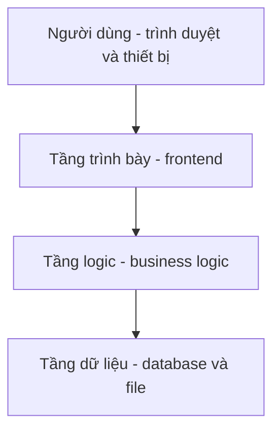

# 🏗️ Microservices và Event-Driven Architecture: Vì sao cần, khi nào dùng?

> Nguồn: `001-Introduction-to-Microservices-and-Event-Driven-Architecture.txt` · [Udemy](https://ua.udemy.com/course/the-complete-microservices-event-driven-architecture/learn/lecture/38145126)

Chào mừng các bạn đến với bài học đầu tiên. Trước khi đi vào kỹ thuật, mình muốn dành bài này để trả lời một câu hỏi nền tảng: tại sao ngành phần mềm lại chuyển dịch mạnh mẽ sang microservices và event-driven architecture, và quan trọng không kém — khi nào thì **không** nên dùng chúng? Đây là nền móng cho toàn bộ khóa học, nên các bạn hãy đọc chậm một chút.

---

### 🎯 Vì sao microservices là kiến trúc thống trị hiện nay

Microservices (vi dịch vụ) là **phong cách kiến trúc hiện đại và phổ biến nhất** trong ngành công nghiệp phần mềm. Trong kiến trúc này, toàn bộ hệ thống được tổ chức thành một tập hợp các **service độc lập**: mỗi service có phạm vi trách nhiệm hẹp, và được **sở hữu trọn vẹn bởi một team phát triển độc lập**.

Nếu các bạn từng dự một hội nghị software architecture nghiêm túc, các bạn sẽ thấy rất nhiều bài nói xoay quanh microservices — và điều đó hoàn toàn có lý:

* Phần lớn công ty công nghệ lớn nhất, thành công nhất hiện nay đều dùng microservices và coi đây là một trong những yếu tố đóng góp lớn nhất cho thành công của họ.
* Khi làm đúng, microservices cho phép tổ chức mở rộng tới **hàng nghìn, thậm chí hàng chục nghìn kỹ sư**, chia thành các team nhỏ vận hành độc lập.
* Nhờ vậy, họ xây được hệ thống có khả năng mở rộng cực cao, phục vụ **hàng tỷ người dùng**, mà vẫn giữ chi phí vận hành thấp và duy trì được sự hiệu quả, sáng tạo.

Nghe tới đây, thật khó để không hào hứng và muốn refactor ngay codebase của mình sang microservices. Nhưng mình phải nói thẳng: **microservices không phải viên đạn bạc (silver bullet)** giải quyết mọi vấn đề. Rất nhiều tổ chức đã gặp khó khăn nghiêm trọng, thậm chí quay lại quyết định cũ, đơn giản vì họ áp dụng microservices **sai cách** hoặc áp dụng ở công ty chưa sẵn sàng cho sự thay đổi đó. Khi đó, microservices chỉ mang lại overhead (chi phí phát sinh) mà không có chút lợi ích nào.

Trong khóa học này, chúng ta sẽ đi qua tất cả những gì cần biết: điều kiện tiên quyết và các bước migration đúng đắn, best practices, những pattern đã được kiểm chứng trong công nghiệp — cùng cách test, deploy và troubleshoot microservices trong production. Mục tiêu cuối cùng là giúp các bạn tránh được các sai lầm, pitfall và anti-pattern, tiết kiệm thời gian, tiền bạc và cả sự bực bội cho công ty. Đây cũng là nhóm kiến thức xuất hiện rất nhiều trong **phỏng vấn system design**, đặc biệt ở các vị trí senior.

---

### 🧩 Kiến trúc ba tầng — ông vua thực sự của web

Để hiểu vấn đề mà microservices tìm cách giải quyết, hãy nhìn vào kiến trúc của một công ty web điển hình. Hệ thống được chia thành **ba tầng logic và vật lý**:

1. **Presentation tier (tầng trình bày):** chứa code front-end phía client, chạy trên điện thoại, máy tính bảng và trình duyệt web của người dùng.
2. **Logic tier (tầng logic):** còn gọi là application tier hoặc business tier, chạy toàn bộ business logic — nơi xử lý mọi tương tác giữa người dùng và hệ thống.
3. **Data tier (tầng dữ liệu):** nơi lưu trữ thông tin lâu dài về khách hàng và hoạt động kinh doanh — thường là database, đôi khi là file trên file system.

Kiến trúc ba tầng này còn được gọi phổ biến là **monolithic architecture (kiến trúc khối đơn)**: toàn bộ business logic và back-end tập trung trong **một codebase duy nhất** (tầng ứng dụng), và khi chạy thì deploy như **một process nguyên khối**.

Trước khi đi tiếp, mình muốn nhấn mạnh: kiến trúc ba tầng **vẫn là kiến trúc được dùng phổ biến nhất** vì nó mang lại nhiều lợi ích sẵn có.

---

### 🏢 Monolith: lựa chọn đúng cho giai đoạn đầu

Monolith có hai lợi ích rất lớn mà chúng ta phải công nhận:

* **Thiết kế cực kỳ dễ:** kiến trúc này phù hợp với gần như mọi hệ thống web, bất kể ngành nghề hay dịch vụ. Tạp chí tin tức online, dịch vụ giao dịch chứng khoán, ứng dụng hẹn hò hay ngân hàng trực tuyến — kiến trúc hệ thống có thể giống hệt nhau.
* **Triển khai cực kỳ nhanh:** chỉ cần một team nhỏ full-stack developer, vài web framework phổ biến và database tiêu chuẩn là đã có một hệ thống hoàn chỉnh.

Vì vậy, nếu các bạn là startup muốn đưa ý tưởng tới tay người dùng càng nhanh càng tốt, hoặc là công ty với team phát triển nhỏ, **đây chính là lựa chọn tốt nhất**. Jeff Bezos — nhà sáng lập Amazon — từng nói đội ngũ lý tưởng phải nhỏ đến mức **"đủ hai chiếc pizza" (two-pizza team)**, và đó là chìa khóa của hiệu quả lẫn khả năng mở rộng. Nếu công ty của các bạn khớp với mô hình này, **không có lý do gì phải dùng thứ phức tạp hơn**.

---

### 📉 Khi công ty lớn lên: bài toán scalability tổ chức

Vấn đề bắt đầu khi công ty thành công hơn và team phát triển liên tục phình to. Lúc đó, chúng ta gặp hàng loạt vấn đề nghiêm trọng hơn chuyện "hai chiếc pizza" rất nhiều:

* **Khả năng mở rộng tổ chức kém (low organizational scalability):** quá nhiều kỹ sư cùng làm trên một codebase dẫn tới **merge conflict** triền miên. Ai cũng giẫm lên chân nhau, và hoàn thành một feature nhỏ nhất cũng trở nên chậm chạp, khó khăn.
* **Chi phí phối hợp tăng vọt:** cần nhiều kế hoạch và điều phối hơn, đồng nghĩa nhiều cuộc họp hơn. Càng đông người trong cuộc họp, cuộc họp càng dài và càng kém hiệu quả.
* **Codebase phình to và phức tạp:** càng thêm feature, code càng lớn, càng khó lý luận, load trong IDE lâu hơn, build và test chậm hơn, deploy rủi ro hơn. Kết quả là **release schedule thưa dần** — và điều này lại càng tệ, vì mỗi bản release chứa nhiều feature hơn, khả năng có bug và outage cũng cao hơn.
* **Onboarding chậm:** lập trình viên mới mất nhiều thời gian hơn để làm quen với codebase khổng lồ.

Nói cách khác, với mỗi kỹ sư được thêm vào, chúng ta bắt đầu thấy **hiệu suất giảm dần (diminishing returns)** — cho tới một điểm mà việc thêm người vào team thực chất **làm giảm năng suất của tất cả mọi người**.

---

### 🧱 Khi monolith đuối sức: vấn đề kỹ thuật

Bên cạnh scalability tổ chức, một ứng dụng monolithic lớn còn gặp các vấn đề kỹ thuật khiến **cả hệ thống khó mở rộng**:

* **Tốn tài nguyên:** mỗi instance ứng dụng chứa toàn bộ business logic, đòi hỏi rất nhiều CPU và memory. Thay vì dùng phần cứng phổ thông rẻ tiền, chúng ta phải chạy trên máy cấu hình cao, đắt tiền.
* **Bị khóa vào lựa chọn công nghệ cũ:** những quyết định công nghệ từ nhiều năm trước vẫn trói buộc chúng ta, khiến không thể tận dụng công nghệ mới tốt hơn. Refactor dù chỉ đổi một thư viện đã là nỗ lực khổng lồ, chứ chưa nói tới đổi ngôn ngữ hay framework.
* **Độ ổn định thấp:** chỉ một memory leak, một vấn đề performance hay một bug nhỏ cũng có thể ảnh hưởng tới **toàn bộ hệ thống** và buộc chúng ta phải rollback.

Điều quan trọng cần nói rõ: việc tách monolith thành các layer, module hay thư viện chỉ giúp được **tới một mức nào đó**. Suy cho cùng, mọi module vẫn bị **gắn chặt (tightly coupled)** với nhau, vẫn dùng chung công nghệ và ngôn ngữ, và ứng dụng vẫn phải được deploy như **một đơn vị runtime duy nhất**.

Vậy nên, khi đã hiểu rõ vấn đề cần giải quyết và điều kiện để cân nhắc một hướng kiến trúc khác, chúng ta đã sẵn sàng khám phá lựa chọn thay thế monolith: **microservices architecture**.

---

### 🔄 Event-driven architecture — mảnh ghép đi kèm

Bên cạnh microservices, khóa học này còn bàn về một phong cách kiến trúc khác: **event-driven architecture (kiến trúc hướng sự kiện)**. Cần nói rõ: kiến trúc hướng sự kiện **không mới** và **không bắt buộc phải có microservices**.

Tuy nhiên, hai phong cách này thường được dùng cùng nhau. Bằng cách thiết lập **giao tiếp bất đồng bộ dựa trên sự kiện** giữa các microservice, chúng ta đạt được **mức độ tách rời (decoupling) lớn hơn** và **khả năng mở rộng cao hơn** cho hệ thống. Kiến trúc hướng sự kiện còn là nền tảng để hiện thực hóa những design pattern rất mạnh cho microservices — nhóm nội dung mà chúng ta sẽ đi sâu trong các bài tới.

Tóm lại bài đầu tiên đã mang lại cho chúng ta ba điểm tựa: **động lực** đằng sau microservices và event-driven (thành công của các công ty lớn nhất ngành), **sự tỉnh táo** (không có viên đạn bạc — phải biết dùng đúng lúc, đúng cách), và **bức tranh kiến trúc ba tầng** tức monolithic, vốn là lựa chọn hoàn hảo cho startup và team nhỏ nhưng bộc lộ cả vấn đề tổ chức lẫn kỹ thuật khi công ty và codebase lớn lên. Hành trình tiếp theo sẽ bắt đầu từ chính microservices architecture. Hẹn gặp lại các bạn ở bài sau! 🚀

---

**Câu 1:** Điều gì khiến microservices được coi là nguyên nhân thành công của nhiều công ty công nghệ lớn?

<b>Xem đáp án</b>

**Đáp án:** Nó cho phép tổ chức mở rộng tới hàng nghìn đến hàng chục nghìn kỹ sư chia thành các team nhỏ vận hành độc lập, nhờ đó xây được hệ thống phục vụ hàng tỷ người dùng với chi phí vận hành thấp.

Giải thích: Mỗi service có phạm vi trách nhiệm hẹp và được sở hữu bởi một team độc lập — đó là gốc rễ của khả năng mở rộng tổ chức.

Tham chiếu: Mục Vì sao microservices là kiến trúc thống trị hiện nay.

**Câu 2:** Vì sao nói microservices "không phải viên đạn bạc"?

<b>Xem đáp án</b>

**Đáp án:** Vì nếu áp dụng sai cách hoặc ở công ty chưa sẵn sàng, nó chỉ mang lại overhead mà không có lợi ích, khiến nhiều tổ chức gặp khó khăn và thậm chí quay lại quyết định cũ.

Giải thích: Giá trị của microservices phụ thuộc vào điều kiện áp dụng và cách áp dụng đúng đắn.

Tham chiếu: Mục Vì sao microservices là kiến trúc thống trị hiện nay.

**Câu 3:** Kiến trúc ba tầng gồm những tầng nào và vì sao nó được gọi là monolithic?

<b>Xem đáp án</b>

**Đáp án:** Ba tầng gồm presentation tier, logic tier (application/business tier) và data tier. Nó được gọi là monolith vì toàn bộ business logic và back-end tập trung trong một codebase duy nhất và deploy như một process nguyên khối.

Giải thích: Chính sự tập trung trong một codebase và một đơn vị runtime là đặc trưng của monolithic architecture.

Tham chiếu: Mục Kiến trúc ba tầng — ông vua thực sự của web.

**Câu 4:** Hai lợi ích lớn nhất của monolith với công ty nhỏ là gì?

<b>Xem đáp án</b>

**Đáp án:** Thiết kế rất dễ (phù hợp gần như mọi hệ thống web, bất kể ngành nghề) và triển khai rất nhanh với team nhỏ full-stack cùng vài web framework, database tiêu chuẩn.

Giải thích: Vì vậy monolith là lựa chọn tốt nhất cho startup và công ty có team phát triển nhỏ.

Tham chiếu: Mục Monolith: lựa chọn đúng cho giai đoạn đầu.

**Câu 5:** Vì sao việc tách monolith thành các layer hay module chỉ giúp được tới một mức?

<b>Xem đáp án</b>

**Đáp án:** Vì các module vẫn tightly coupled, vẫn dùng chung công nghệ và ngôn ngữ, và ứng dụng vẫn phải deploy như một đơn vị runtime duy nhất.

Giải thích: Tách logic bên trong không thay đổi được bản chất tập trung của monolith.

Tham chiếu: Mục Khi monolith đuối sức: vấn đề kỹ thuật.

