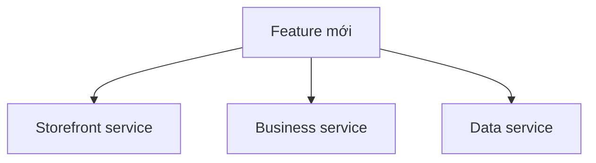

# 🧭 Ranh giới Microservices: Ba nguyên tắc cốt lõi rút ra từ ba case study

> Nguồn: `004-Microservices-Boundaries---Core-Principles.txt` · [Udemy](https://ua.udemy.com/course/the-complete-microservices-event-driven-architecture/learn/lecture/38377174)

Chào mừng các bạn trở lại. Hôm nay chúng ta bước vào phần quan trọng bậc nhất của migration: **đặt ranh giới giữa các microservices**. Mình sẽ kể ba case study có thật — không phải thí nghiệm tư duy — về những công ty đã migrate và gặp vấn đề, để từ mỗi thất bại rút ra một **nguyên tắc cốt lõi**. Học qua sai lầm của người khác là cách nhớ lâu nhất.

---

### 🏬 Bối cảnh: một sàn e-commerce chạm giới hạn

Hãy tưởng tượng chúng ta là một công ty e-commerce thành công, đang vận hành cửa hàng online cho hàng nghìn khách. Kiến trúc hiện tại là **three-tier architecture (kiến trúc ba tầng)** quen thuộc, với web application monolith ở tầng giữa:

* **Presentation tier:** front-end chạy trong web browser và mobile app, gửi request tới tầng giữa.
* **Logic tier:** monolithic web application xử lý toàn bộ nghiệp vụ.
* **Data tier:** internal database lưu transactions, products, reviews và inventory.
* Riêng phần **billing thẻ tín dụng** do một **external payment service** của bên thứ ba đảm nhiệm.

Kiến trúc này phục vụ rất tốt suốt nhiều năm, nhưng giờ codebase đã quá lớn: binary size đòi hỏi phần cứng đắt tiền và đội phát triển đã vượt xa **two-pizza rule (quy tắc hai chiếc pizza)**. Nghe nói tách thành microservices sẽ giải quyết mọi vấn đề — nhưng tách thế nào? Ba case study dưới đây là ba lần thử và ba lần thất bại theo những cách khác nhau.

---

### 🧱 Case study 1: tách theo tầng logic → nguyên tắc cohesion

Cách đầu tiên là bám theo **các tầng logic sẵn có** trong codebase:

1. **Store front layer** (xử lý request, kiểm tra security và permission, serve HTML/JavaScript/CSS) tách thành một service, một team riêng, deploy độc lập.
2. **Toàn bộ business functionality** (checkout, discounts, seasonal sales, products, reviews) thành service thứ hai, và **data layer** thành service thứ ba.

Bề ngoài cách này rất hấp dẫn vì **tận dụng sẵn sự phân tách logic**, gần như không cần refactor. Nhưng nó không hiệu quả:

* Mỗi feature mới gần như đều cần **API change, business change và data change**, nghĩa là **mọi microservice đều tham gia vào mọi feature**, kéo theo lập kế hoạch và **release coordination (phối hợp phát hành)** giữa các team.
* Kết cục: không có chút lợi ích nào về organizational scalability.

Thực chất chúng ta chỉ biến kiến trúc **ba tầng thành năm tầng** — và vẫn không phải microservices.

Từ đây rút ra **nguyên tắc thứ nhất: Cohesion (tính gắn kết)**. Cohesion nghĩa là những element **liên quan chặt chẽ và thay đổi cùng nhau phải nằm cùng nhau**. Nếu mọi logic thay đổi cùng nhau nằm gọn trong một service, từng team mới thật sự vận hành độc lập. Case study này thất bại chính vì các service **không đủ cohesive** để cải thiện organizational scalability.

---

### 💻 Case study 2: tách theo công nghệ → nguyên tắc single responsibility

Lần này các developer quan sát codebase và nhận ra những cơ hội công nghệ rất hấp dẫn:

* Viết lại một phần storefront bằng `Node.js` với `JavaScript`: giảm **50% số dòng code**.
* Phần khác viết bằng `Java`: tăng **20% performance**.
* Product recommendation engine (tính toán nặng) vốn đã được tách thành **thư viện C++**; viết lại một phần recommendation bằng `Python` còn dùng được các machine learning library mạnh, performance tốt hơn nữa.
* Tách phần data layer nói chuyện với external payment service sang `Golang`: cải thiện cả performance lẫn số dòng code.

Tách theo các module công nghệ này và deploy thành service riêng, **performance cải thiện thật**. Nhưng ranh giới thuần túy công nghệ lại tạo ra một loạt vấn đề:

* **Stakeholder bên ngoài** như product manager hay support engineer **không biết task thuộc subteam nào** — ví dụ muốn cập nhật recommendation engine thì phải nói chuyện với team nào, một hay cả hai?
* **Trách nhiệm không rõ ràng** và **API terminology rối rắm**: front-end developer không biết codebase nào cần thay đổi cho một feature, còn API thì trộn nhiều context — users, products, bank accounts — vào cùng một chỗ.
* Service cuối cùng giữ phần lớn business logic vẫn **quá lớn và ôm đồm**, có nguy cơ trở thành một monolith mới.

**Nguyên tắc thứ hai: Single Responsibility Principle (nguyên tắc đơn trách nhiệm)** — mỗi microservice **chỉ làm một việc và làm việc đó thật xuất sắc**. Nhờ đó không còn mơ hồ về nơi đặt chức năng mới và team nào sở hữu nó.

Nguyên tắc này còn giúp API của mỗi service rõ ràng, dễ theo dõi vì mọi terminology, entity hay identifier đều gắn với một context duy nhất:

* Nói chuyện với **user service** thì ID là user ID, name là tên user; còn với **product service**, những từ đó mang nghĩa hoàn toàn khác — không có nhập nhằng.

---

### 🔬 Case study 3: hiểu chữ "micro" theo nghĩa đen → nguyên tắc loose coupling

Lần thứ ba, chúng ta chú ý tới chữ **micro** trong "microservices" và nghĩ rằng **chia càng nhỏ càng tốt**. Vậy là:

* Tách **mọi package/module** thành một microservice, hoặc vì ứng dụng viết bằng ngôn ngữ hướng đối tượng, tách **từng class** thành một service được deploy và quản lý độc lập.

Production lập tức dạy cho chúng ta một bài học đau:

* Mỗi request từ người dùng **kích hoạt một chuỗi communication** giữa rất nhiều microservice, và mỗi service lại phải nói chuyện với nhiều service khác nữa để hoàn thành việc của mình.
* **Performance trở nên rất tệ** và **troubleshooting gần như bất khả thi**, vì các service **tightly coupled (gắn chặt)** với nhau — mỗi thao tác đòi hỏi quá nhiều giao tiếp.

**Nguyên tắc thứ ba: Loose coupling (tách rời lỏng)** — microservices nên **hầu như không có interdependency (phụ thuộc lẫn nhau)**; mỗi service hoàn thành chức năng với **giao tiếp tối thiểu** với các service khác.

Một điểm cực kỳ quan trọng đi kèm: **kích thước service không quan trọng**. Có một **misconception (hiểu lầm) phổ biến** rằng microservices phải nhỏ nhất có thể — thật ra chính cái tên "microservices" đã phần nào gây nhầm lẫn. Miễn là service **cohesive, theo single responsibility và loosely coupled**, kích thước không thành vấn đề. Cũng đừng kỳ vọng mọi microservice có cùng kích thước — tự nhiên sẽ có service nhỏ, service lớn, và điều đó hoàn toàn bình thường.

---

### 📋 Ba nguyên tắc — bộ điều kiện tiên quyết

Ba nguyên tắc này là **prerequisites (điều kiện tiên quyết)** cho một kiến trúc microservices thành công: nếu không tuân theo, sớm muộn chúng ta cũng gặp vấn đề. Bảng tóm tắt:

| Nguyên tắc | Nội dung cốt lõi | Vi phạm thì sao |
|---|---|---|
| Cohesion | Element liên quan chặt, thay đổi cùng nhau thì ở cùng một service | Mọi feature động đến mọi service, cần release coordination |
| Single responsibility | Mỗi service làm một việc và làm xuất sắc | Trách nhiệm mơ hồ, API rối, service ôm đồm thành monolith mới |
| Loose coupling | Phụ thuộc lẫn nhau tối thiểu, giao tiếp runtime ít nhất | Chuỗi gọi chằng chịt, performance tệ, troubleshooting bất khả thi |

Tuy nhiên, ba nguyên tắc vẫn chưa trả lời câu hỏi thực tế nhất: **làm sao để thực sự tách một ứng dụng monolith?** Đó chính là nội dung bài tiếp theo.

---

**Câu 1:** Vì sao cách tách monolith theo tầng logic thất bại?

<b>Xem đáp án</b>

**Đáp án:** Vì mỗi feature mới đều cần API change, business change và data change, khiến mọi service tham gia vào mọi feature và phải release coordination — không đạt lợi ích organizational scalability.

Giải thích: Cách này chỉ biến kiến trúc ba tầng thành năm tầng, vẫn không phải microservices.

Tham chiếu: Mục Case study 1.

**Câu 2:** Cohesion nghĩa là gì?

<b>Xem đáp án</b>

**Đáp án:** Những element liên quan chặt chẽ và thay đổi cùng nhau phải nằm trong cùng một microservice.

Giải thích: Khi logic thay đổi cùng nhau nằm chung ranh giới, mỗi team mới thật sự vận hành độc lập.

Tham chiếu: Mục Case study 1.

**Câu 3:** Tách theo công nghệ gây ra những vấn đề gì?

<b>Xem đáp án</b>

**Đáp án:** Stakeholder không biết task thuộc team nào, trách nhiệm không rõ ràng, API terminology rối rắm, và service giữ nhiều business logic vẫn quá lớn — có nguy cơ thành monolith mới.

Giải thích: Ranh giới thuần túy công nghệ không tạo được sự rõ ràng về trách nhiệm.

Tham chiếu: Mục Case study 2.

**Câu 4:** Single responsibility principle mang lại lợi ích gì cho API của service?

<b>Xem đáp án</b>

**Đáp án:** Giúp API rõ ràng, dễ theo dõi vì mọi terminology, entity, identifier đều gắn với một context duy nhất — ví dụ user service và product service không còn nhập nhằng.

Giải thích: Mỗi service chỉ giải quyết một việc nên ngữ nghĩa của API nhất quán.

Tham chiếu: Mục Case study 2.

**Câu 5:** Vì sao hiểu "micro" là "nhỏ nhất có thể" lại sai?

<b>Xem đáp án</b>

**Đáp án:** Vì kích thước service không quan trọng; điều kiện là cohesive, single responsibility và loosely coupled. Chia nhỏ tối đa khiến mọi request kích hoạt chuỗi communication dài, performance tệ và khó troubleshooting.

Giải thích: Các service nên có kích thước khác nhau tùy chức năng, miễn là thỏa ba nguyên tắc.

Tham chiếu: Mục Case study 3.

---

Tóm lại, ba case study đã cho chúng ta ba nguyên tắc nền tảng: **cohesive, single responsibility và loosely coupled** — cùng một sự thật giải phóng tư duy rằng service **không cần nhỏ nhất có thể**. Đây là prerequisites cho mọi bước migration phía sau, nên các bạn hãy đọc lại thật kỹ. Ở bài tiếp theo, chúng ta sẽ học **hai phương pháp decompose cụ thể**: theo business capabilities và theo domain/subdomain. Hẹn gặp lại các bạn! 🚀
