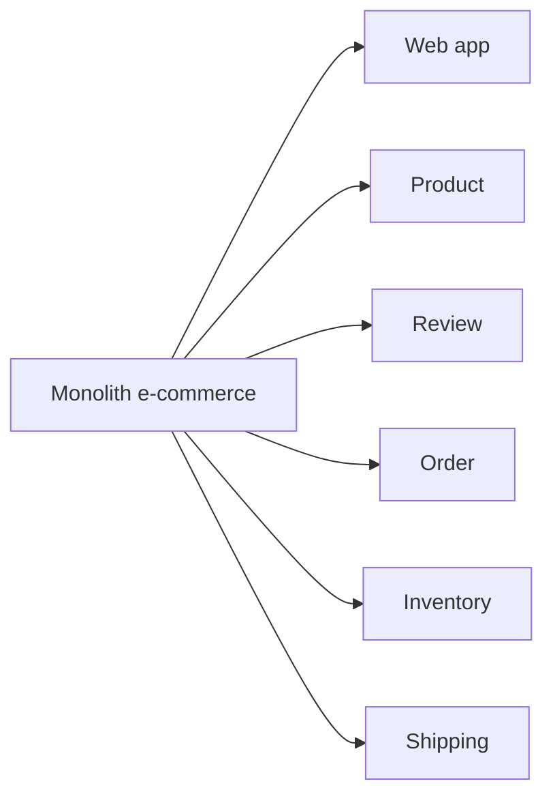

# 🗂️ Decompose Monolith: Hai cách tách chuẩn ba nguyên tắc

> Nguồn: `005-Decomposition-of-a-Monolithic-Application-to-Microservices.txt` · [Udemy](https://ua.udemy.com/course/the-complete-microservices-event-driven-architecture/learn/lecture/38377178)

Chào mừng các bạn quay lại. Bài trước chúng ta đã có ba nguyên tắc đặt ranh giới: **cohesive, single responsibility và loosely coupled**. Bài này mình sẽ giới thiệu **hai phương pháp decompose (phân rã) monolith** thỏa mãn cả ba: **theo business capabilities (năng lực nghiệp vụ)** và **theo domain/subdomain (miền/miền con)**. Chúng ta học từng cách trước, rồi đặt lên bàn cân so sánh.

---

### 💼 Cách 1: Tách theo business capabilities

Trong phương pháp này, chúng ta quan sát và phân tích hệ thống từ **góc nhìn thuần nghiệp vụ**. Một **business capability** là bất kỳ năng lực cốt lõi nào **mang lại giá trị cho doanh nghiệp hoặc khách hàng** — ví dụ revenue, marketing, customer experience...

Cách xác định mà giảng viên thích nhất là một **thought experiment (thí nghiệm tư duy)**: thử mô tả hệ thống cho một **người không có chuyên môn kỹ thuật** và giải thích hệ thống làm gì, mỗi năng lực mang lại giá trị gì.

Với một cửa hàng online, chúng ta sẽ kể ra:

* Xem sản phẩm bằng web browser thông thường.
* Tìm kiếm sản phẩm và xem chi tiết sản phẩm.
* Đọc review của khách đã mua hàng.
* Thêm sản phẩm vào giỏ, đặt hàng và nhận giao hàng tận nơi.
* Cập nhật và duy trì inventory — cả từ phía khách khi mua lẫn từ phía merchant khi thực hiện đơn.

Map các capability này sang microservices, chúng ta có thiết kế như sau:

Làm sao biết các service này tuân thủ ba nguyên tắc?

* **Single responsibility:** chỉ cần nhìn tên service cũng thấy — mỗi service phụ trách trọn vẹn một business capability.
* **Cohesion:** kiểm chứng bằng các thay đổi thực tế. Muốn thêm sản phẩm mới hay thuộc tính mới, ngoài UI chỉ cần sửa **product service**. Muốn đặt chính sách mới cho review, chỉ **review service** thay đổi. Muốn đổi đối tác xử lý thẻ tín dụng hoặc thêm hình thức thanh toán, chỉ **order service** cần cập nhật.
* **Loose coupling:** kiểm chứng qua các user journey. Load cửa hàng → chỉ **web app service**. Tìm/xem sản phẩm → chỉ **product service**. Xem review → chỉ **review service**. Đặt hàng và giao hàng → chỉ gồm **order service, inventory service và shipping service**, mỗi service đảm nhận một phần rõ ràng của giao dịch.

---

### 🧠 Cách 2: Tách theo domain và subdomain

Phương pháp thứ hai có tên **composition by domain or subdomain**. Khác với cách trên chỉ nhìn từ phía nghiệp vụ, lần này chúng ta dùng **góc nhìn của developer**. Tiêu chí đặt ranh giới dựa trên **hiểu biết kỹ thuật về hệ thống**, nên nhìn chung **trực quan hơn**.

Hệ thống được chia thành các **subdomain** — mỗi subdomain là một **sphere of knowledge, influence or activity (phạm vi kiến thức, ảnh hưởng hoặc hoạt động)**. Subdomain có **ba loại**:

| Loại subdomain | Đặc điểm | Ví dụ trong sàn online |
|---|---|---|
| Core | Khác biệt hóa doanh nghiệp, **không thể mua sẵn hoặc thuê ngoài**, nơi dồn nỗ lực và đầu tư, không có nó thì doanh nghiệp không tạo ra giá trị | Product catalog |
| Supporting | Thiết yếu cho vận hành và hỗ trợ core domain, nhưng **không tạo khác biệt** với đối thủ | Orders, inventory, shipping |
| Generic | **Không đặc thù cho bất kỳ ngành nào**, nhiều công ty dùng, thường có thể mua giải pháp có sẵn | Reviews, payments, search, image compression, security, web UI |

Cách phân loại này giúp chúng ta **ưu tiên đầu tư**: dồn những engineer giỏi nhất và kinh nghiệm nhất vào đâu, và ở đâu có thể **tiết kiệm thời gian, chi phí** bằng giải pháp mua sẵn.

Quay lại sàn online của chúng ta:

* **Core subdomain** rõ ràng là **product catalog** — vì đi sang bất kỳ cửa hàng online nào khác, chúng ta sẽ không thấy cùng sản phẩm hay cùng trải nghiệm. Đó là thứ khiến cửa hàng của chúng ta độc nhất.
* **Supporting subdomains** gồm **orders, inventory, shipping** — không có chúng thì không bán được hàng, nhưng chức năng có thể giống các cửa hàng khác.
* **Generic subdomains** gồm **reviews, payments, search, images, image compression, security, web UI** — vẫn thiết yếu, nhưng rất phổ biến; nhiều doanh nghiệp (không nhất thiết là cửa hàng online) đều cần và dùng.

Sau khi xác định subdomain, chúng ta có vài lựa chọn:

1. **Dành một microservice riêng cho mỗi subdomain**, hoặc
2. **Gộp vài subdomain vào một microservice** nếu chúng quá tightly coupled hoặc chưa đủ cohesive. Ví dụ: product image service và image compression quá phụ thuộc lẫn nhau → gộp chung. Hoặc payment service chưa đủ logic để tách riêng, hay quá gắn với order service → gộp chung.

Điều này **không cố định**: nếu sau này thấy nên tách ra, chúng ta luôn có thể tách — và vì các microservice nhỏ, việc migration diễn ra rất dễ và nhanh.

*Ghi chú thêm: đây không phải hai phương pháp duy nhất. Một số cách khác gồm tách theo **actions (hành động)** hoặc **entities (thực thể)**; nhưng business capabilities và subdomain là hai cách phổ biến và dễ làm nhất.*

---

### ⚖️ So sánh hai phương pháp

| Tiêu chí | Theo business capabilities | Theo domain/subdomain |
|---|---|---|
| Độ mịn | Coarse-grained — service lớn hơn | Fine-grained — service nhỏ hơn |
| Cohesion và coupling | Thường cohesive và loosely coupled hơn | Thấp hơn một chút |
| Độ ổn định | Ổn định hơn — vì core business ổn định hơn engineering và technology | Thấp hơn |
| Góc nhìn | Cần hiểu business rất tốt; kém trực quan với engineer | Góc nhìn engineer; trực quan hơn |

Nói ngắn gọn: **business capability** cho service to hơn, ổn định hơn, tách rời hơn — nhưng đòi hỏi hiểu nghiệp vụ sâu. **Subdomain** cho service nhỏ hơn, dễ hình dung với engineer hơn — nhưng kém cohesive hơn một chút.

---

### 💡 Vài sự thật cần nhớ trước khi chốt

Trước khi kết thúc, có ba điều mình muốn nhấn mạnh:

1. **Không có một cách đúng duy nhất** để đặt ranh giới microservices. Điều chạy tốt hôm nay có thể không còn tốt trong tương lai — kiến trúc sẽ **liên tục tiến hóa** khi feature mới và business capability mới xuất hiện.
2. **Không có decomposition hoàn hảo**: một chút **friction (ma sát) hay coupling là điều không thể tránh khỏi**. Mục tiêu của chúng ta là **giảm thiểu** nó, không phải xóa bỏ hoàn toàn.
3. Các kỹ thuật trong bài **không phải viên đạn bạc**: chúng chỉ là **guidelines (kim chỉ nam)** giúp đi tới một kiến trúc tốt, **không thay thế được engineering judgment và trực giác kỹ thuật** của các bạn.

---

**Câu 1:** Business capability là gì và đâu là cách xác định dễ nhất?

<b>Xem đáp án</b>

**Đáp án:** Là năng lực cốt lõi mang lại giá trị cho doanh nghiệp hoặc khách hàng. Cách dễ nhất là thí nghiệm tư duy: mô tả hệ thống cho một người không có chuyên môn kỹ thuật.

Giải thích: Khi giải thích cho người ngoài ngành, chúng ta buộc phải gọi tên các giá trị cốt lõi của hệ thống.

Tham chiếu: Mục Cách 1.

**Câu 2:** Ba loại subdomain là gì?

<b>Xem đáp án</b>

**Đáp án:** Core subdomain, supporting subdomain và generic subdomain.

Giải thích: Core tạo khác biệt; supporting hỗ trợ vận hành; generic không đặc thù ngành và thường mua sẵn được.

Tham chiếu: Mục Cách 2.

**Câu 3:** Vì sao product catalog là core subdomain của sàn online?

<b>Xem đáp án</b>

**Đáp án:** Vì đó là thứ khiến cửa hàng độc nhất — sản phẩm và trải nghiệm không giống bất kỳ cửa hàng nào khác; không thể mua sẵn hay thuê ngoài.

Giải thích: Core subdomain là nơi dồn nỗ lực, đầu tư và engineer giỏi nhất.

Tham chiếu: Mục Cách 2.

**Câu 4:** Khi nào nên gộp vài subdomain vào cùng một microservice?

<b>Xem đáp án</b>

**Đáp án:** Khi chúng quá tightly coupled hoặc chưa đủ cohesive — ví dụ image service với image compression, hoặc payment với order khi payment chưa đủ logic để tách riêng.

Giải thích: Ranh giới không cố định; sau này thấy cần tách thì vẫn có thể tách vì service nhỏ, migration nhanh.

Tham chiếu: Mục Cách 2.

**Câu 5:** Hai phương pháp decompose khác nhau chính ở điểm nào?

<b>Xem đáp án</b>

**Đáp án:** Business capabilities cho kiến trúc coarse-grained, cohesive và loosely coupled hơn, ổn định hơn nhưng cần hiểu business tốt và kém trực quan với engineer; subdomain cho kiến trúc fine-grained, trực quan hơn với engineer.

Giải thích: Đây là trade-off giữa ổn định/độ tách rời và mức độ trực quan khi thiết kế.

Tham chiếu: Mục So sánh hai phương pháp.

---

Tóm lại, chúng ta đã nắm hai công cụ decompose: **theo business capabilities** (coarse-grained, ổn định, cần hiểu nghiệp vụ) và **theo subdomain** (fine-grained, trực quan với engineer) — cả hai đều là kim chỉ nam, không thay thế phán đoán kỹ thuật. Ở bài tiếp theo, chúng ta sẽ học **cách thực hiện migration từng bước** với những tip thực chiến và pattern nổi tiếng **Strangler Fig**. Hẹn gặp lại các bạn! 🚀
