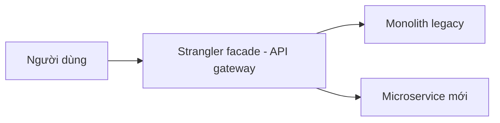

# 🚚 Migration thực chiến: Bắt đầu từ đâu và pattern Strangler Fig

> Nguồn: `006-Migration-to-Microservices---Steps-Tips-and-Patterns.txt` · [Udemy](https://ua.udemy.com/course/the-complete-microservices-event-driven-architecture/learn/lecture/38488708)

Chào mừng các bạn quay lại. Sau khi đã biết cách đặt ranh giới và decompose, bài này chúng ta bước vào phần **thực thi migration** từ một legacy monolith lớn sang microservices: bắt đầu từ đâu, chuẩn bị gì, dùng pattern nào, và một tip quan trọng để tránh rắc rối. Giả sử chúng ta đang có một codebase rất lớn cần hiện đại hóa — câu hỏi đầu tiên luôn là: **bắt đầu từ đâu?**

---

### 🚦 Big bang hay incremental — chọn sai là mất cả dự án

Cách tiếp cận mà nhiều developer nghĩ tới đầu tiên là **big bang**: vẽ ra ranh giới mong muốn cho kiến trúc tương lai, thuyết phục ban quản lý **dừng mọi phát triển feature** và dồn toàn lực cho migration. Nghe rất hợp lý — dồn toàn lực thì xong nhanh hơn, ít nhất là trên lý thuyết.

Thực tế, đây là cách **tệ nhất** về cả năng suất lẫn tác động lên business. Ba lý do:

1. **Quá nhiều developer trên cùng một dự án** sẽ tạo ra rất nhiều friction. Nhớ lại: chúng ta migrate chính vì team đã có vấn đề về năng suất và giao tiếp — tức organizational scalability. "Quá nhiều đầu bếp trong một căn bếp" chỉ làm vấn đề tệ hơn.
2. **Rất khó ước lượng khối lượng công việc** của dự án lớn như vậy, và như mọi dự án lớn đầy bất định, chúng ta thường gặp các vấn đề kỹ thuật không lường trước. Hứa với quản lý 4 tháng, 5 tháng sau vẫn chưa xong → quản lý bắt đầu sốt ruột → **cả quá trình có nguy cơ bị bỏ dở**.
3. **Dừng phát triển feature nhiều tháng** cực kỳ tai hại: product manager chán nản, không có cơ hội thăng tiến nên rời công ty; sales không có gì để bán hay chào mời khách mới; còn người dùng — những người **không hề quan tâm kiến trúc nội bộ** — bắt đầu nghĩ rằng doanh nghiệp đang gặp khó khăn hoặc không muốn cải thiện trải nghiệm của họ.

Cách tốt hơn là **incremental and continuous (tăng dần và liên tục)**. Trong cách này, chúng ta tìm những component **hưởng lợi nhiều nhất** khi tách thành microservice. Xếp hạng theo mức lợi ích:

1. **Khu vực được phát triển nhiều nhất và thay đổi thường xuyên nhất.**
2. **Component có yêu cầu scalability cao** mà không thể đáp ứng khi còn nằm trong monolith.
3. **Component ít technical debt (nợ kỹ thuật) và có sự phân tách logic tốt**, khớp với phạm vi của một microservice.

Vì sao ưu tiên code được phát triển nhiều nhất?

* Migrate code **không ai từng chạm tới** không mang lại giá trị gì — nó không phải nguồn gốc vấn đề.
* Ngược lại, **logic liên tục tiến hóa là nguồn merge conflict lớn nhất**, đồng thời là nhân tố chính khiến toàn bộ monolith phải release liên tục. Tách nó ra thành microservice, những thay đổi đó **không còn bắt chúng ta redeploy cả version monolith**.
* Việc tách còn giúp **gỡ rối business logic** khỏi phần còn lại, dễ lý luận hơn và ít có khả năng gây bug hơn.

Migrate xong một phần, chúng ta xác định candidate tiếp theo và tiếp tục **liên tục cho tới khi monolith cũ biến mất**, hoặc phần còn lại **không bao giờ thay đổi** nữa — lúc đó chẳng còn lý do gì phải chạm vào.

| Tiêu chí | Big bang | Incremental |
|---|---|---|
| Cách làm | Dừng mọi feature, dồn toàn lực migrate | Migrate từng component, liên tục |
| Rủi ro | Rất cao — trượt deadline, nguy cơ bị bỏ dở | Thấp — từng phần nhỏ, dễ kiểm soát |
| Tác động business | Feature freeze nhiều tháng, PM/sales/người dùng bất mãn | Không gián đoạn |
| Tiến độ | Khó ước lượng, dễ mất kiểm soát | Tiến bộ rõ ràng, đo lường được; trễ chỉ vài ngày hoặc vài tuần |

Điểm hay của cách incremental: chúng ta **không cần đặt deadline cứng** cho việc hoàn tất migration — kể cả mất một năm hoặc lâu hơn để tới đích cuối. Tiến độ vẫn **liên tục, hữu hình và đo lường được**, business không bị gián đoạn, và nếu một phần bị chậm so với ước lượng thì cũng chỉ **vài ngày vài tuần**, thay vì vài tháng vài năm.

---

### 🧪 Chuẩn bị trước khi migrate: ba bước bắt buộc

Sau khi xác định được component muốn migrate, đây là ba việc phải làm trước khi bắt tay vào tách:

1. **Đảm bảo test coverage tốt.** Đây là bước **cực kỳ quan trọng**: có coverage tốt, chúng ta tự tin rằng quá trình refactor **không làm hỏng chức năng nào**. Ngược lại, nếu mọi thứ bắt đầu vỡ, cả migration sẽ bị trì hoãn.
2. **Định nghĩa API rõ ràng và được tính toán kỹ** cho component sẽ migrate.
3. **Cô lập component** bằng cách **loại bỏ mọi interdependency (phụ thuộc lẫn nhau)** với phần còn lại của ứng dụng.

---

### 🌱 Strangler Fig pattern — tách cây cổ thụ mà không chặt nó

Pattern nổi tiếng nhất cho việc migrate thực tế là **Strangler Fig**, được **Martin Fowler** giới thiệu. Nó lấy cảm hứng từ một loài cây dây leo bắt đầu sống trên và dọc theo một **cây cổ thụ**, rồi theo thời gian lan rộng, phát triển và **bao phủ hoàn toàn cây cũ**, chiếm lấy vị trí của nó.

Ý tưởng của pattern:

Quy trình từng bước:

1. **Đặt một proxy** trước monolithic legacy application, đơn giản chỉ cho request đi qua. Proxy này gọi là **Strangler facade**, thường được hiện thực bằng một **API gateway**.
2. Nếu các bạn chưa quen, **API gateway** là component open source hoặc cloud-based có sẵn, có nhiệm vụ **route request dựa trên API mà request hướng tới**.
3. Khi microservice mới đã được **test kỹ lưỡng và deploy**, chúng ta **chuyển hướng traffic của API đó** khỏi monolith sang microservice mới. Thay đổi này diễn ra **hoàn toàn trong suốt với người dùng** và giảm thiểu rủi ro trong quá trình migrate.
4. **Theo dõi performance và chức năng** của microservice mới một thời gian.
5. **Xóa component cũ** trong monolith ứng với chức năng đó, rồi **lặp lại quy trình** với microservice tiếp theo — cho tới khi hoặc là ứng dụng cũ trống rỗng, hoặc chỉ còn phần legacy cần thiết để phục vụ các client cũ.

---

### ⚠️ Tip cuối: giữ nguyên code và tech stack

Khi migrate từ monolith cũ sang kiến trúc microservices mới, rất khó kìm nén sự háo hức muốn dùng ngay công nghệ và ngôn ngữ lập trình mới. Nhưng cách làm tốt nhất là **giữ nguyên code và tech stack càng nhiều càng tốt** trong lúc migrate.

Lý do rất đơn giản: **mỗi thay đổi thêm vào là một nguồn tiềm ẩn của bug**, trong khi bản thân migration đã đủ phức tạp và rủi ro. Chúng ta không muốn thêm càng nhiều yếu tố rủi ro càng tốt.

*Khi migration đã hoàn tất và microservice mới chạy ổn định, các bạn có thể thoải mái refactor sang công nghệ mới hơn nếu cần.*

---

**Câu 1:** Vì sao big bang approach là cách tệ nhất?

<b>Xem đáp án</b>

**Đáp án:** Vì quá nhiều developer trên cùng một dự án gây friction (đúng vấn đề chúng ta đang muốn giải quyết), rất khó ước lượng nên dễ trượt deadline và bị bỏ dở, và feature freeze nhiều tháng gây hại cho business.

Giải thích: Cả ba yếu tố cộng lại khiến big bang phản tác dụng so với mục tiêu migration.

Tham chiếu: Mục Big bang hay incremental.

**Câu 2:** Ba tiêu chí xếp hạng component nên migrate trước là gì?

<b>Xem đáp án</b>

**Đáp án:** Khu vực phát triển nhiều và thay đổi thường xuyên; component có yêu cầu scalability cao mà monolith không đáp ứng được; component ít technical debt và phân tách logic tốt.

Giải thích: Ưu tiên code được phát triển nhiều vì đó là nguồn merge conflict và release chính, khác với code không ai chạm tới.

Tham chiếu: Mục Big bang hay incremental.

**Câu 3:** Ba bước chuẩn bị trước khi migrate một component là gì?

<b>Xem đáp án</b>

**Đáp án:** Đảm bảo test coverage tốt; định nghĩa API rõ ràng; cô lập component khỏi các interdependency với phần còn lại của ứng dụng.

Giải thích: Test coverage cho tự tin không làm hỏng chức năng; API và cô lập tạo nền tảng cho việc tách service.

Tham chiếu: Mục Chuẩn bị trước khi migrate.

**Câu 4:** Strangler facade là gì và thường được hiện thực bằng gì?

<b>Xem đáp án</b>

**Đáp án:** Là proxy đặt trước legacy monolith để cho request đi qua, thường được hiện thực bằng API gateway — component route request dựa trên API mà request hướng tới.

Giải thích: Khi microservice mới sẵn sàng, traffic của API đó được chuyển trong suốt sang service mới.

Tham chiếu: Mục Strangler Fig pattern.

**Câu 5:** Vì sao nên giữ nguyên tech stack trong lúc migrate?

<b>Xem đáp án</b>

**Đáp án:** Vì mỗi thay đổi thêm vào là một nguồn tiềm ẩn của bug, trong khi migration vốn đã phức tạp và rủi ro. Sau khi service ổn định mới nên refactor sang công nghệ mới.

Giải thích: Giảm tối đa biến số trong một quá trình đã đủ nhiều rủi ro.

Tham chiếu: Mục Tip cuối.

---

Tóm lại, một migration lành mạnh bắt đầu bằng **cách tiếp cận incremental** (ưu tiên code thay đổi nhiều, yêu cầu scalability cao, ít technical debt), chuẩn bị kỹ bằng **test coverage — API — cô lập component**, rồi thực thi bằng **Strangler Fig pattern** với API gateway, và **giữ nguyên tech stack** cho tới khi service ổn định. Đây chính là cách các công ty đã đi trước đưa monolith khổng lồ của họ sang microservices mà không làm gián đoạn business. Hẹn gặp lại các bạn ở bài sau, khi chúng ta tiếp tục hoàn thiện bức tranh kiến trúc microservices! 🚀
