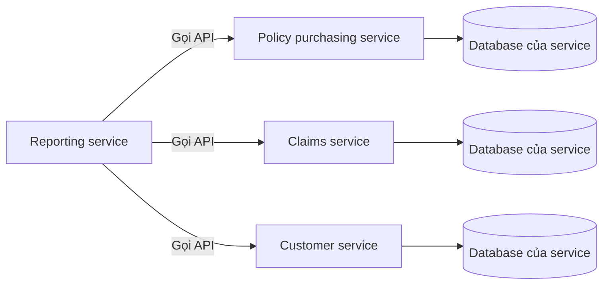

# 🗄️ Database per Microservice: vì sao mỗi dịch vụ phải sở hữu dữ liệu của riêng mình

> Nguồn: `007-Databases-in-Microservices-Architecture.txt` · [Udemy](https://ua.udemy.com/course/the-complete-microservices-event-driven-architecture/learn/lecture/38247904)

Chào mừng các bạn đến với section mới: **các nguyên lý và best practices của microservices architecture**. Đây là những bài học được đúc kết từ nhiều năm kinh nghiệm của các software architect và technical lead vận hành hệ thống quy mô lớn — áp dụng đúng sẽ giúp các bạn hưởng trọn lợi ích của microservices và giảm tối đa nguy cơ đụng phải vấn đề scalability. Mở màn, mình nói về nguyên lý đầu tiên và quan trọng bậc nhất: **database per microservice (mỗi dịch vụ một database)**.

---

### 🎯 Cái bẫy mang tên "chia sẻ database"

Hãy bắt đầu với một công ty bảo hiểm đang chạy kiến trúc ba tầng truyền thống: một **ứng dụng monolithic** ở tầng giữa và **một database** duy nhất ở tầng dữ liệu. Để tăng **organizational scalability (khả năng mở rộng tổ chức)**, công ty migrate sang microservices, mỗi service do một team riêng sở hữu. Giả sử các **service boundary (ranh giới dịch vụ)** được đặt đúng, bề ngoài các team sẽ vận hành độc lập và rất ít ma sát.

Lúc này, cho các microservice chia sẻ dữ liệu nghe có vẻ hoàn toàn hợp lý: **reporting service** cần dữ liệu mua bảo hiểm (policy purchasing), dữ liệu yêu cầu bồi thường (claims) và dữ liệu khách hàng (customers) — truy cập thẳng database sẽ hiệu quả hơn nhiều so với việc chịu **performance overhead** khi đi vòng qua các service trung gian.

Nhưng chính "tối ưu hiệu năng tưởng như logic" đó lại tạo ra vấn đề. Hãy xem ba tình huống thực tế:

1. **Policy purchasing service** nhận lượng traffic lớn từ người mua tiềm năng, nên team sở hữu quyết định tận dụng quyền tự chủ: thay **legacy relational database (cơ sở dữ liệu quan hệ cũ)** chậm bằng một **NoSQL database** tối ưu cho đọc. Nhưng code của reporting service **tightly coupled (gắn chặt)** với công nghệ database đó, nên thay đổi buộc phải diễn ra ở cả hai codebase và **release đồng thời**.
2. **Claims service** đổi schema bảng claims: đổi tên vài cột, xóa cột cũ không dùng, thêm cột mới. Reporting service phụ thuộc schema cũ, nên hai team phải ngồi lại, thống nhất schema mới dùng chung được cho cả hai — rồi lại sửa cả hai codebase và release đồng thời.
3. **Customer service** thêm lớp **fine-grained security (bảo mật chi tiết)** cho dữ liệu người dùng theo **organizational roles (vai trò tổ chức)**. Các security policy này nằm ngoài domain của reporting team, nên customer team phải truyền đạt thay đổi kèm toàn bộ chi tiết triển khai cho reporting team. Và một lần nữa: cả hai team cùng sửa code, viết test riêng, rồi release và monitor đồng thời.

Kết cục: bất chấp công sức migration, các team vẫn **tightly coupled**, vẫn cần cực nhiều giao tiếp và điều phối — ảnh hưởng tiêu cực trực tiếp tới **productivity (năng suất)** và **development velocity (tốc độ phát triển)** của tổ chức. Đây chính là lúc nguyên lý database per microservice phát huy giá trị.

---

### 🧩 Nguyên lý database per microservice

Nguyên lý này phát biểu ngắn gọn: **mỗi team microservice sở hữu trọn vẹn dữ liệu của mình và không expose trực tiếp cho bất kỳ service nào khác — kể cả khi phải chịu thêm latency**.

* Khi một service cần dữ liệu của service khác, request **bắt buộc phải đi qua API** của service mục tiêu.
* Mỗi service phải **abstract công nghệ và cấu trúc database** ở tầng API. Nhờ vậy, nếu team quyết định đổi database hoặc schema, thay đổi đó **hoàn toàn trong suốt** với các consumer của API.
* Nếu thay đổi đó cũng cần điều chỉnh API, chúng ta có thể offer **hai phiên bản API song song** trong vài tuần, thậm chí vài tháng — cho các team khác đủ thời gian cập nhật mà **không cần bất kỳ coordination (phối hợp)** nào.

Điểm mấu chốt các bạn cần nhớ: **dữ liệu chỉ được chạm tới qua API của chủ sở hữu**. Đây là ranh giới giữ cho các team thật sự độc lập — đúng tinh thần "không có viên đạn bạc": ta chủ động đánh đổi vài thứ về mặt kỹ thuật để đổi lấy sự tự chủ của tổ chức.

---

### ⚠️ Cái giá phải trả: latency, join và transaction

Nguyên lý này không miễn phí. Transcript nêu rõ ba hệ quả, và mình muốn các bạn nắm chắc cả ba:

* **Thêm latency (độ trễ):** gửi network request sang service khác, parse request, query database, gửi trả kết quả rồi parse response — chắc chắn tốn kém hơn một câu query trực tiếp. Khi overhead này trở thành vấn đề, việc **cache hoặc lưu trữ một phần dữ liệu của service khác ngay trong database của service cần nó là hoàn toàn hợp lý**. Nhưng có một điều kiện bất di bất dịch: **source of truth (nguồn chân lý) vẫn phải duy nhất — chính là service sở hữu dữ liệu đó**. Khi cache dữ liệu của service khác, chúng ta chấp nhận mất **strict consistency (nhất quán nghiêm ngặt)** và phải hài lòng với **eventual consistency (nhất quán sau cùng)**, vì dữ liệu lưu local có thể **stale (cũ)** cho tới khi nhận được bản mới từ source of truth.
* **Mất khả năng join dữ liệu:** khi mọi thứ nằm trong một database, ta join các bảng theo key hoặc cột chung rất dễ dàng. Khi dữ liệu bị chia sang nhiều database — thậm chí có database không phải relational — các phép join đó **không còn thực hiện được**. Cách duy nhất để có chức năng tương đương: **pull dữ liệu từ hai database, transform để hai object cùng format, rồi join programmatically bằng code**.
* **Mất transaction guarantees (đảm bảo giao dịch):** với một database, ta có thể sửa nhiều bảng trong **một transaction** và đảm bảo tính **atomic (nguyên tử)** cho toàn bộ thay đổi. Thực hiện **distributed transaction (giao dịch phân tán)** xuyên nhiều service thì **rất khó** — dù về lý thuyết là khả thi, thực tế gần như không ai dùng.

| Hệ quả | Trước khi tách dữ liệu | Sau khi tách dữ liệu | Hướng xử lý |
|---|---|---|---|
| Latency | Query trực tiếp trong cùng database | Network request, parse, query rồi trả kết quả | Cache dữ liệu local, chấp nhận eventual consistency |
| Join | Join bảng theo key chung | Dữ liệu nằm nhiều database, có thể không relational | Pull hai nguồn, transform rồi join programmatically |
| Transaction | Nhiều bảng update atomic | Distributed transaction rất khó, hầu như không dùng | Sẽ có các pattern xử lý ở phần sau khóa học |

*Đừng lo* — transcript nhắn nhủ rất rõ: các pattern giải quyết hiệu quả những thách thức trên sẽ được giới thiệu ở phần sau của khóa học. Việc của chúng ta lúc này là hiểu đúng nguyên lý và biết cái giá của nó.

---

### 🎓 Tự kiểm tra nhanh

**Câu 1:** Theo nguyên lý database per microservice, khi một service cần dữ liệu của service khác thì phải làm gì?

<b>Xem đáp án</b>

**Đáp án:** Gửi request đi qua API của service sở hữu dữ liệu đó, không truy cập database trực tiếp.

Giải thích: Mỗi team sở hữu trọn vẹn dữ liệu của mình và không expose nó trực tiếp cho bất kỳ service nào khác.

Tham chiếu: Mục Nguyên lý database per microservice.

**Câu 2:** Vì sao cho reporting service truy cập thẳng database của service khác lại gây hại?

<b>Xem đáp án</b>

**Đáp án:** Vì nó làm codebase và các team tightly coupled: mọi thay đổi về database, schema hay security policy đều buộc cả hai bên sửa code, viết test và release đồng thời.

Giải thích: Điều này sinh ra coordination overhead lớn, giảm productivity và development velocity dù đã migrate sang microservices.

Tham chiếu: Mục Cái bẫy mang tên chia sẻ database.

**Câu 3:** Việc abstract công nghệ database ở tầng API mang lại lợi ích gì?

<b>Xem đáp án</b>

**Đáp án:** Thay đổi database hoặc schema trở nên trong suốt với consumer; nếu API cũng phải đổi, có thể chạy hai phiên bản API song song để các team khác kịp cập nhật mà không cần coordination.

Giải thích: API chính là lớp cách ly giữa dữ liệu nội bộ và thế giới bên ngoài service.

Tham chiếu: Mục Nguyên lý database per microservice.

**Câu 4:** Ba hậu quả của nguyên lý database per microservice là gì?

<b>Xem đáp án</b>

**Đáp án:** Thêm latency, mất khả năng join dữ liệu giữa các bảng, và mất transaction guarantees.

Giải thích: Distributed transaction xuyên nhiều service rất khó nên thực tế gần như không dùng; các pattern thay thế sẽ học ở phần sau.

Tham chiếu: Mục Cái giá phải trả.

**Câu 5:** Khi cache dữ liệu thuộc sở hữu của service khác, cần đảm bảo hai điều gì?

<b>Xem đáp án</b>

**Đáp án:** Service sở hữu vẫn là source of truth duy nhất, và hệ thống chỉ đảm bảo eventual consistency.

Giải thích: Dữ liệu local có thể stale cho tới khi nhận bản mới; mọi thao tác ghi vẫn phải thuộc về service sở hữu.

Tham chiếu: Mục Cái giá phải trả.

---

Tóm lại, các bạn đã nắm nguyên lý đầu tiên và quan trọng nhất của microservices: **database per microservice**. Động lực đến từ một kịch bản rất thật — chia sẻ database làm codebase và các team tightly coupled, sinh ra coordination overhead khổng lồ; còn giải pháp là để mỗi service sở hữu dữ liệu riêng và chỉ expose qua API abstraction. Đổi lại, chúng ta chấp nhận hiệu năng thấp hơn, join phức tạp hơn và mất transaction guarantees — những bài toán sẽ có pattern giải quyết riêng ở phần sau khóa học. Hẹn gặp lại các bạn ở bài tiếp theo, khi chúng ta bàn về nguyên lý **DRY** và câu chuyện shared libraries đầy tranh cãi! 🚀
