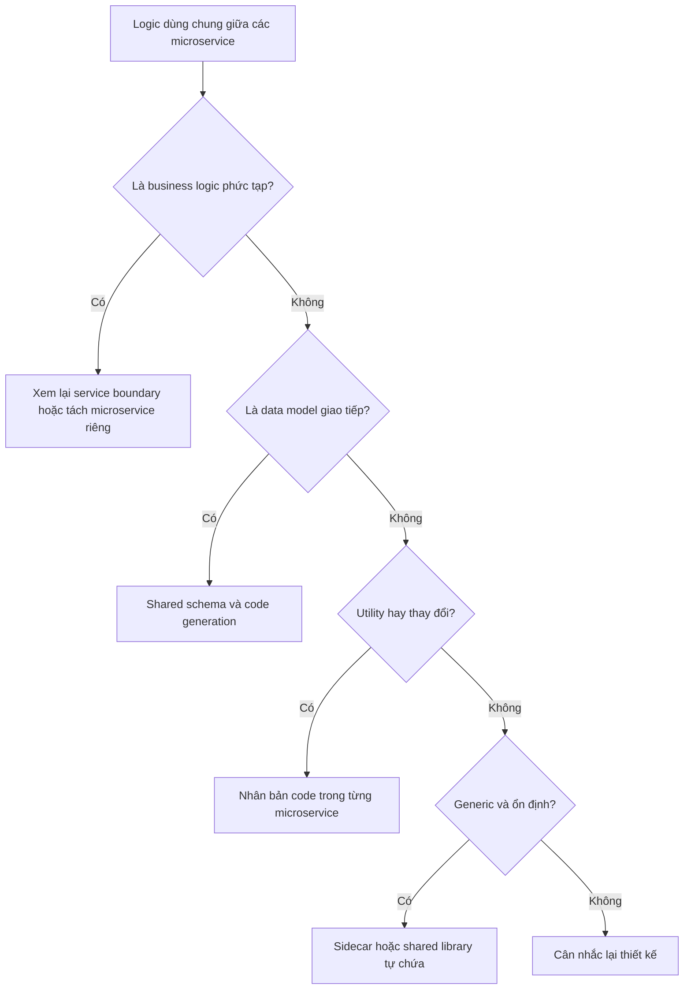

# 🔁 DRY trong Microservices: chia sẻ thư viện hay nhân bản code?

> Nguồn: `008-The-DRY-Principle-In-Microservices-and-Shared-Libraries.txt` · [Udemy](https://ua.udemy.com/course/the-complete-microservices-event-driven-architecture/learn/lecture/38247920)

Chào mừng các bạn trở lại. Hôm nay mình sẽ "mổ xẻ" một trong những nguyên lý nền tảng nhất của software engineering — **DRY (Don't Repeat Yourself — đừng lặp lại chính mình)** — trong bối cảnh microservices. Nghe thì đơn giản, nhưng đây là chủ đề gây tranh cãi bậc nhất: áp dụng DRY máy móc qua **shared library (thư viện dùng chung)** có thể phá hỏng chính mục tiêu tách rời mà microservices theo đuổi. Chúng ta sẽ đi qua ba câu hỏi: DRY quan trọng vì điều gì, vì sao shared library trở thành vấn đề, và có những lựa chọn thay thế nào.

---

### 🔁 Nhắc nhanh: DRY quan trọng vì điều gì?

Nói một cách tổng quát, DRY là **một trong những nguyên lý nền tảng nhất của software engineering**:

* Nếu bạn thấy mình lặp lại cùng một logic hoặc cùng một dữ liệu, hãy **hợp nhất nó vào một chỗ duy nhất** — một shared method, class hoặc variable.
* Ở phạm vi rộng hơn, nếu có logic phức tạp được dùng ở nhiều project hay application, cách làm phổ biến là **package logic đó thành một shared library** để các ứng dụng khác import và sử dụng.
* Nhờ vậy, khi cần thay đổi logic, ta **chỉ sửa một chỗ** thay vì lùng sục các bản sao khắp nhiều codebase.
* Nó cũng **giảm duplicate effort**: công sức của một engineer được những người khác tái sử dụng.

Nghe rất hợp lý, phải không? Nhưng câu chuyện thật sẽ phức tạp hơn: nguyên lý DRY **không phải lúc nào cũng đúng** trong microservices architecture, đặc biệt khi nói tới shared libraries. Hãy cùng xem vì sao.

---

### ⚠️ Vì sao shared library là "quả bom" trong microservices

**Vấn đề thứ nhất: tight coupling (gắn chặt).** Nhớ lại một trong những nguyên lý cốt lõi của microservices là **loose coupling (tách rời lỏng)**. Nhưng khi nhiều microservice chia sẻ và phụ thuộc vào cùng một library, thay đổi trên library đó trở thành nguồn tight coupling và ma sát giữa các microservice với nhau, cũng như với team sở hữu library:

* Nếu library có **API change**, thay đổi phải được truyền đạt tới các team sở hữu microservice; các team này buộc phải sửa codebase để tiếp tục dùng được library.
* Nhưng kể cả khi API **không đổi**, các microservice vẫn phải **rebuild, retest và redeploy** mỗi khi shared library có bất kỳ thay đổi nào.
* Nguy hiểm hơn: một **bug hoặc vulnerability (lỗ hổng)** trong shared library có thể ảnh hưởng tới **tất cả service dùng nó** — phá hỏng hoàn toàn mục đích cô lập các microservice thành những runtime unit riêng biệt.

**Vấn đề thứ hai: dependency hell (địa ngục phụ thuộc).** Hãy xét tình huống rất thật sau:

1. Một microservice dùng **Library A**, và Library A nội bộ dùng **Library B**.
2. Microservice cũng dùng **Library B trực tiếp** ở một phần khác của codebase cho mục đích khác.
3. Giả sử microservice và Library A đang dùng cùng một version của Library B.
4. Library A có bản update quan trọng mà microservice cần gấp — nhưng bản A mới phụ thuộc vào một version B **mới hơn** version mà microservice đang dùng trực tiếp.
5. Tùy ngôn ngữ và runtime: nếu không thể phụ thuộc hai version của cùng một library cùng lúc, ta buộc phải **sửa code một cách không cần thiết** ở chỗ dùng Library B chỉ để update Library A.
6. Ngược lại, nếu có thể load hai version khác nhau, ta lại **phá vỡ chính nguyên lý DRY**: ứng dụng phải load hai bản của cùng một library trong khi phần lớn code giống hệt nhau. Điều này còn làm **tăng kích thước binary** và **tăng thời gian build và test**.

Các bạn thấy đấy: một nguyên lý đúng trong nội bộ ứng dụng có thể trở thành rắc rối khi áp dụng xuyên nhiều runtime độc lập.

---

### 🧩 Các lựa chọn thay thế shared library

Đây là phần thực chiến nhất của bài. Tùy loại code muốn chia sẻ, chúng ta có những hướng xử lý khác nhau:

* **Business logic phức tạp dùng chung ở nhiều microservice:** đây có thể là **dấu hiệu service boundary bị đặt sai**. Nhớ lại nguyên lý cốt lõi **single responsibility principle (nguyên lý đơn trách nhiệm)**: nếu decompose theo **business capability (năng lực nghiệp vụ)** hoặc **subdomain (miền con)**, tình huống này rất hiếm khi xảy ra. Hai lựa chọn: **điều chỉnh boundary** để chỉ một service chứa logic đó, hoặc nếu logic đủ phức tạp thì **tách nó thành một microservice riêng**.
* **Data model chung cho giao tiếp giữa hai microservice:** trong trường hợp này, dùng shared library hoặc shared file lại là **good practice**. Lý do: khi nói về giao tiếp giữa hai microservice, ta thật ra **muốn** hai team và hai codebase **codependent (phụ thuộc lẫn nhau)**. Nếu API hoặc data model của một service thay đổi tới mức hai bên không thể giao tiếp, ta **muốn test fail càng sớm càng tốt**. Nếu không share mà duplicate, test của mỗi microservice có thể vẫn pass mà không phát hiện thay đổi của bên kia — hai service chỉ lộ ra là không nói chuyện được **lúc runtime, thậm chí chỉ phát hiện trên production**.
* **Code generation từ data model hoặc schema:** dùng một **shared schema** thể hiện data model chung cho giao tiếp; tùy loại API, ngôn ngữ hay công nghệ, dùng tool phù hợp để **generate data model và boilerplate code** cho việc giao tiếp. Miễn là code được generate từ **shared interface definition** và việc generate diễn ra **trong build và test process**, đây là cách làm rất phổ biến và an toàn.
* **Utility methods hay thay đổi:** tốt hơn là **nhân bản (duplicate)** qua các microservice thay vì cố tái sử dụng trong shared library. Nhờ vậy, mỗi microservice có implementation riêng, **tối ưu cho use case** của nó; đồng thời việc migrate toàn bộ codebase sang ngôn ngữ lập trình khác (nếu muốn) cũng dễ dàng hơn.
* **Tuyệt đối không muốn duplicate:** có hai lựa chọn bổ sung. Thứ nhất là **sidecar pattern**: package và deploy shared functionality như **một process riêng**, nhưng thay vì chạy như một service độc lập, process này chạy trên **cùng host** với các instance microservice. Cách này chia sẻ functionality cho nhiều instance của cùng microservice lẫn các microservice khác nhau; instance giao tiếp với sidecar cùng host qua **network protocol chuẩn**. Vì cùng host, performance overhead **nhỏ hơn** khi chạy process trên host khác — nhưng vẫn **cao hơn** so với shared library chạy ngay trong process của microservice. Thứ hai là **shared library — nhưng chỉ như last resort (giải pháp cuối)**, dành cho code **rất generic và ổn định, ít khi thay đổi** như logging, retrying, pattern matching... miễn là không dẫn tới dependency hell. Các library này phải càng **self-contained (tự chứa)** và độc lập với nhau càng tốt.
* **Lưu ý cuối cùng:** bên trong codebase của **từng microservice riêng lẻ**, chúng ta vẫn phải theo DRY như bình thường. Nhân bản code trong nội bộ một microservice là **không thể chấp nhận** — luôn extract logic chung vào một method, class hoặc module duy nhất.

| Cách tiếp cận | Phù hợp khi | Điểm cần nhớ |
|---|---|---|
| Shared library | Code generic, ổn định, ít thay đổi: logging, retrying, pattern matching | Chỉ dùng như last resort; phải self-contained, tránh dependency hell |
| Nhân bản code | Utility methods hay thay đổi | Mỗi service có bản riêng tối ưu; dễ migrate sang ngôn ngữ khác |
| Shared schema + code generation | Data model dùng cho giao tiếp giữa các service | Generate phải nằm trong build và test process |
| Sidecar pattern | Không muốn duplicate nhưng vẫn cần chia sẻ functionality | Process riêng, cùng host; overhead thấp hơn cross-host nhưng cao hơn in-process |
| Xem lại boundary hoặc tách service | Business logic phức tạp bị dùng chung | Dấu hiệu boundary sai; cần đánh giá lại thiết kế |

---

### 📊 Nhân bản dữ liệu giữa các microservices

Bây giờ hãy chuyển sang chuyện **data duplication (nhân bản dữ liệu)**. Bề ngoài, duplicate cùng một dữ liệu ở nhiều microservice và lưu vào database của từng service nghe như lãng phí dung lượng. Tuy nhiên, như chúng ta đã thấy ở bài trước, đôi khi điều này là **cần thiết để cải thiện hiệu năng**: nếu không muốn trả giá cho mỗi request sang service khác để lấy dữ liệu, ta có thể lưu một bản cache của dữ liệu đó ngay trong microservice của mình.

Trong microservices architecture, cách làm này **hoàn toàn chấp nhận được**, miễn là ghi nhớ hai điều:

1. **Chỉ một microservice là chủ sở hữu và là source of truth** cho dữ liệu đó. Nghĩa là chỉ nó được thực hiện thao tác **get, write, update, delete**; các microservice khác giữ bản sao chỉ có quyền **read**.
2. Khi nhân bản dữ liệu, chúng ta chỉ có thể đảm bảo **eventual consistency**. Với những tình huống cần **strict consistency**, tuyệt đối không nhân bản dữ liệu.

Ví dụ rất dễ hình dung từ transcript — một **online store**:

* Ta có thể lưu **rating** hoặc vài **review gần nhất** của sản phẩm ngay trong **product service**. Nhờ đó, khi user xem sản phẩm, dữ liệu được load nhanh từ product service, không phải chờ gọi sang review service để lấy toàn bộ review và rating. Đổi lại, rating hiển thị có thể **không chính xác nhất**, và mục review gần nhất có thể **không còn là mới nhất** với người đang cân nhắc mua. Mức sai lệch này **không quan trọng** và eventual consistency hoàn toàn chấp nhận được.
* Ngược lại, thông tin **inventory (tồn kho) mới nhất** của sản phẩm hay **số dư tài khoản** của người dùng thì tuyệt đối cần **strict consistency**. Trong trường hợp này, dữ liệu **không được nhân bản** ở bất kỳ service nào khác ngoài chủ sở hữu.

---

### 🎓 Tự kiểm tra nhanh

**Câu 1:** Nguyên lý DRY nói gì và vì sao nó quan trọng?

<b>Xem đáp án</b>

**Đáp án:** Nếu lặp lại cùng logic hoặc dữ liệu thì phải hợp nhất vào một chỗ; logic phức tạp dùng ở nhiều ứng dụng thường được đóng gói thành shared library.

Giải thích: Nhờ vậy chỉ cần sửa một chỗ khi thay đổi và công sức của một engineer được người khác tái sử dụng.

Tham chiếu: Mục Nhắc nhanh.

**Câu 2:** Vì sao shared library gây tight coupling giữa các microservice?

<b>Xem đáp án</b>

**Đáp án:** Vì API change phải truyền đạt cho mọi team để sửa code; kể cả API không đổi, mọi thay đổi library vẫn buộc các service rebuild, retest và redeploy; bug hay vulnerability trong library ảnh hưởng tất cả service dùng nó.

Giải thích: Điều này đi ngược nguyên lý loose coupling và phá hỏng mục đích cô lập runtime của microservices.

Tham chiếu: Mục Vì sao shared library là quả bom trong microservices.

**Câu 3:** Dependency hell trong ví dụ Library A và Library B xảy ra như thế nào?

<b>Xem đáp án</b>

**Đáp án:** Microservice dùng trực tiếp Library B, còn Library A cũng dùng B; khi A cần update nhưng bản mới đòi version B mới hơn — tùy runtime, ta hoặc phải sửa code không cần thiết, hoặc phải load hai version của B.

Giải thích: Load hai version làm tăng kích thước binary và thời gian build, test — đồng thời phá vỡ chính nguyên lý DRY.

Tham chiếu: Mục Vì sao shared library là quả bom trong microservices.

**Câu 4:** Khi nào dùng shared library cho data model giao tiếp giữa hai microservice lại là good practice?

<b>Xem đáp án</b>

**Đáp án:** Khi hai service giao tiếp với nhau, ta muốn hai codebase codependent để test fail ngay khi API hoặc data model thay đổi tới mức không còn giao tiếp được.

Giải thích: Nếu duplicate, test của từng service vẫn pass và ta chỉ phát hiện vấn đề lúc runtime, thậm chí trên production.

Tham chiếu: Mục Các lựa chọn thay thế shared library.

**Câu 5:** Sidecar pattern hoạt động thế nào và đánh đổi của nó là gì?

<b>Xem đáp án</b>

**Đáp án:** Shared functionality được deploy như một process riêng chạy trên cùng host với các instance microservice, giao tiếp qua network protocol chuẩn.

Giải thích: Overhead nhỏ hơn chạy trên host khác, nhưng vẫn cao hơn so với shared library chạy trong cùng process — nên đây là lựa chọn cho trường hợp không muốn duplicate.

Tham chiếu: Mục Các lựa chọn thay thế shared library.

---

Tóm lại, bài này giúp các bạn nhìn DRY bằng con mắt của kiến trúc sư microservices: **DRY đúng bên trong từng service, nhưng không phải lúc nào cũng đúng khi chia sẻ xuyên service**. Shared library mang lại tight coupling, gánh nặng rebuild/retest/redeploy và dependency hell; các lựa chọn thay thế gồm xem lại boundary hoặc tách service, shared schema kèm code generation, nhân bản utility code, sidecar pattern và cuối cùng mới là shared library cho code generic, ổn định. Chúng ta cũng đã bàn về nhân bản dữ liệu: hoàn toàn hợp lý khi chỉ một service là source of truth và ta chấp nhận eventual consistency. Hẹn gặp lại các bạn ở bài sau, khi chúng ta bàn về **structured autonomy** — tự chủ trong khuôn khổ cho các team phát triển! 🚀
