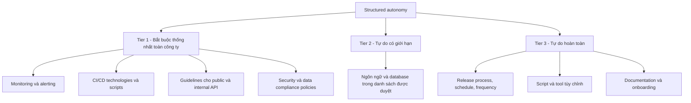

# 🧭 Structured Autonomy: tự chủ trong khuôn khổ cho các team microservices

> Nguồn: `009-Structured-Autonomy-for-Development-Teams.txt` · [Udemy](https://ua.udemy.com/course/the-complete-microservices-event-driven-architecture/learn/lecture/38247960)

Chào mừng các bạn trở lại. Nếu bài trước trả lời câu hỏi "code và dữ liệu nên được tổ chức thế nào", thì bài này trả lời câu hỏi về **con người**: mỗi team microservice nên được tự chủ tới đâu? Đây là bài học về một trong những **pitfall (cạm bẫy) lớn nhất** của các công ty chuyển sang microservices — và cách thoát khỏi nó bằng một khái niệm mình rất tâm đắc: **structured autonomy (tự chủ có cấu trúc)**. Chúng ta sẽ đi qua lầm tưởng phổ biến, cái giá của tự do tuyệt đối, ba tầng tự chủ, và những yếu tố quyết định ranh giới giữa các tầng.

---

### 🧭 Lầm tưởng: "tự do tuyệt đối" là lợi ích lớn nhất

Có một **myth (lầm tưởng)** rất phổ biến: lợi ích lớn nhất của microservices là mỗi team được **toàn quyền tự chủ** trong việc chọn công nghệ, tech stack, tools, database, API và framework của riêng mình. Nghe có vẻ hấp dẫn, nhưng theo kinh nghiệm của giảng viên, đây lại chính là **một trong những cạm bẫy lớn nhất** của các công ty migrate sang microservices.

Vì sao? Hãy tưởng tượng các team phải tự xây dựng lại từ đầu mọi thứ mà trước đây công ty chỉ làm một lần. Và vấn đề không dừng ở đó — nó kéo theo cả chi phí học tập lẫn sự hỗn loạn trong giao tiếp giữa các service. Chúng ta cùng phân tích từng nhóm vấn đề.

---

### 🔥 Cái giá của tự do tuyệt đối

**1. Chi phí hạ tầng ban đầu và duy trì liên tục.** Khi còn là ứng dụng monolithic, công ty đã đầu tư rất nhiều công sức ngay từ đầu: quyết định cấu trúc code, chọn framework, tổ chức class vào module, package hay library; đặt ra guideline về nơi lưu test và cách chạy test; setup và customize build tools, script cùng **continuous integration pipeline**; đầu tư vào monitoring và alerting (một việc không hề tầm thường); thiết kế database schema và cấu hình để nó **scalable, fault tolerant và highly available**. Nếu sau khi migrate mà **mỗi team phải trả lại đúng từng đó chi phí** và duplicate đúng từng đó effort cho codebase cùng hệ sinh thái của mình thì lãng phí là khổng lồ. Tệ hơn, maintain hạ tầng là **ongoing effort**: nếu có team DevOps/QA chuyên trách, các engineer này sẽ phải quản lý hạ tầng của **hàng trăm microservice với mỗi cái hoàn toàn khác nhau**. Họ sẽ nhanh chóng bị overwhelm và buộc phải tuyển thêm người để chạy theo "khu rừng công nghệ" đó.

**2. Chi phí học và trở nên productive.** Ngoài setup và maintenance, còn chi phí để **học và làm chủ** mọi tool. Một developer mới vào team phải đọc documentation, học và ghi nhớ toàn bộ best practices của team đó rồi quen dần với việc tuân theo chúng hằng ngày. Nhưng nếu cần sang codebase của team khác để sửa một thay đổi nhỏ thì sao? Hoặc chỉ cần xem cách team đó setup một integration test, hay cấu hình của họ trông thế nào? Đó là **learning curve khổng lồ** và hoàn toàn **không scale nổi** trong một tổ chức lớn.

**3. API không đồng nhất (non-uniform API).** Đừng quên rằng cuối cùng, mọi microservice phải ghép lại thành **một hệ thống duy nhất**, giao tiếp với nhau để đạt mục tiêu chung theo cách dễ dàng và hiệu năng tốt. Vậy hãy tưởng tượng mỗi team tự định nghĩa API theo style riêng, theo best practices riêng của họ:

* **Frontend engineer** phải pull dữ liệu từ nhiều microservice sẽ phải học API của từng team, gọi endpoint với những **naming convention** khác nhau, dùng nhiều **API style và công nghệ** khác nhau — frontend code trở thành một mớ hỗn độn khó đọc, khó maintain.
* **Giao tiếp service-to-service** cũng gặp đúng vấn đề đó: engineer cần thêm hoặc cập nhật một API call sẽ phải dành hàng giờ đọc documentation của team khác để đảm bảo tuân thủ best practices của họ.

Kết luận rất rõ: bằng cách cho mỗi team **toàn quyền tự do**, chúng ta thực ra đang **làm mọi thứ tệ hơn** và tạo ra vô số overhead. Đến đây chắc các bạn sẽ hỏi: *"Nhưng chẳng phải mục đích của migrate sang microservices chính là để mỗi team độc lập sao?"* — Đúng, nhưng chìa khóa của microservices thành công là **sự cân bằng giữa team autonomy và structure**.

---

### 🏗️ Structured autonomy — ba tầng tự chủ

Đó là lý do mình dùng thuật ngữ **structured autonomy**: mỗi team vẫn tự chủ, nhưng **chỉ trong những ranh giới nhất định**, được chia thành ba tầng.

**Tầng 1 — hạn chế nhất, những lĩnh vực KHÔNG thuộc quyền của từng team, phải đồng nhất (uniform) trên toàn công ty:**

* **Hạ tầng**: monitoring, alerting, công nghệ và script cho **CI/CD (Continuous Integration/Continuous Delivery — tích hợp và chuyển giao liên tục)**. Nhờ đồng nhất, ta đầu tư lớn ngay từ đầu vào việc adopt hoặc tự xây hạ tầng, và effort đó được **amortize (phân bổ)** cho toàn tổ chức — đầu tư trở nên cost effective.
* **Guidelines và best practices cho public API lẫn internal API.** Điều này hiển nhiên vì **external client không quan tâm** request của họ cuối cùng rơi vào microservice nào bên trong hệ thống; còn nội bộ thì chuẩn chung giúp integration và giao tiếp giữa các service thuộc các team khác nhau trở nên rất dễ dàng.
* **Security và data compliance policies.** Lý do cũng hiển nhiên: nếu một microservice bị hack, **cả hệ thống trở nên vulnerable**; nếu một microservice vi phạm privacy hoặc **data retention policy (chính sách lưu trữ dữ liệu)** địa phương, **toàn bộ tổ chức phải chịu trách nhiệm** — và bên ngoài chẳng ai quan tâm rằng lỗi là của một microservice nhỏ.

**Tầng 2 — tự do nhưng trong giới hạn:**

* **Chọn programming language và database technologies.** Sau cùng, mỗi runtime và giải pháp lưu trữ tối ưu cho một use case khác nhau.
* Nhưng **danh sách ngôn ngữ và database được duyệt phải có giới hạn**, để tránh một "khu rừng công nghệ" nếu team nào cũng chọn ngôn ngữ mới nhất và thời thượng nhất cho microservice của mình.
* Lý do thực tế: mỗi công ty cần **rất nhiều thời gian** để phát triển chuyên môn quản lý, cấu hình và vận hành từng loại runtime và database trong production. Hầu hết các công ty big tech dùng **không quá một handful (số ít)** ngôn ngữ lập trình cho hàng trăm microservice.

**Tầng 3 — toàn quyền tự chủ:**

* **Release process, schedule và frequency.** Nhờ đó mỗi team làm việc hoàn toàn độc lập với các team khác, release tính năng mới dựa trên workload, độ ưu tiên và yêu cầu của chính họ.
* **Script và tool tùy chỉnh** phục vụ nhu cầu riêng, giúp local development và testing hiệu quả hơn.
* **Documentation và quá trình onboarding developer mới** do chính team sở hữu trọn vẹn.

| Tầng | Thuộc về ai | Nội dung chính | Mức tự do |
|---|---|---|---|
| Tier 1 | Toàn công ty | Monitoring/alerting, CI/CD, API guidelines, security và data compliance | Không tự do — phải đồng nhất |
| Tier 2 | Từng team, trong danh sách duyệt | Programming language và database technologies | Tự do có giới hạn |
| Tier 3 | Từng team | Release process/schedule/frequency, tool và script riêng, documentation và onboarding | Toàn quyền |

---

### 🌍 Điều gì quyết định ranh giới ba tầng?

Cần nói rõ: đây là **general guidelines**, và ranh giới thực tế của ba tầng **khác nhau đôi chút ở mỗi công ty**. Có ba yếu tố ảnh hưởng trực tiếp:

1. **Quy mô và ảnh hưởng của team DevOps hoặc SRE (Site Reliability Engineering).** Các công ty có team DevOps/SRE mạnh thường nghiêng về **common standards** hơn, vì như vậy việc quản lý hệ thống của họ dễ dàng hơn.
2. **Trình độ (seniority) của developer được tuyển.** Nhìn chung, developer càng senior thì càng thích **tự do** trong việc setup hoặc tự xây hạ tầng riêng.
3. **Văn hóa công ty.** Ví dụ, một số công ty chỉ dùng đúng một ngôn ngữ lập trình như **C#, Java hoặc Python** và không cho phép tự do chọn ngôn ngữ khác. Lợi ích của hạn chế này: họ có thể tuyển developer **một lần** rồi luân chuyển giữa các team với overhead rất nhỏ.

*Đừng lo nếu công ty bạn chưa có câu trả lời rõ ràng cho ba tầng này* — điều quan trọng là nhận ra rằng tự chủ không phải là "muốn làm gì thì làm", mà là tự chủ **trong khuôn khổ được thiết kế có chủ đích**.

---

### 🎓 Tự kiểm tra nhanh

**Câu 1:** Vì sao cho mỗi team toàn quyền tự do chọn công nghệ lại là một pitfall?

<b>Xem đáp án</b>

**Đáp án:** Vì nó nhân bản chi phí setup và maintain hạ tầng lên từng team, tạo learning curve lớn, và dẫn tới API không đồng nhất — thực chất làm mọi thứ tệ hơn.

Giải thích: DevOps/QA phải quản hàng trăm hạ tầng khác nhau; frontend và các service khác phải học API của từng team.

Tham chiếu: Mục Cái giá của tự do tuyệt đối.

**Câu 2:** Ba tầng của structured autonomy gồm những gì?

<b>Xem đáp án</b>

**Đáp án:** Tier 1 bắt buộc đồng nhất toàn công ty (monitoring/alerting, CI/CD, API guidelines, security và data compliance); Tier 2 tự do có giới hạn (ngôn ngữ, database trong danh sách được duyệt); Tier 3 toàn quyền (release process/schedule/frequency, tool và script riêng, documentation và onboarding).

Giải thích: Tầng 1 càng xuống thấp thì quyền tự chủ của team càng lớn.

Tham chiếu: Mục Structured autonomy.

**Câu 3:** Vì sao guidelines cho API phải được chuẩn hóa toàn công ty?

<b>Xem đáp án</b>

**Đáp án:** Vì external client không quan tâm request rơi vào microservice nào, còn nội bộ thì chuẩn chung giúp integration và giao tiếp giữa các service thuộc team khác nhau trở nên dễ dàng.

Giải thích: Nếu mỗi team tự đặt style API riêng, frontend và các service khác sẽ phải học từng API một.

Tham chiếu: Mục Structured autonomy.

**Câu 4:** Vì sao security và data compliance phải đồng nhất trên toàn công ty?

<b>Xem đáp án</b>

**Đáp án:** Vì một microservice bị hack thì cả hệ thống vulnerable; một microservice vi phạm privacy hoặc data retention policy thì toàn tổ chức chịu trách nhiệm.

Giải thích: Bên ngoài không ai quan tâm lỗi thuộc về một microservice nhỏ bé nào.

Tham chiếu: Mục Structured autonomy.

**Câu 5:** Những yếu tố nào ảnh hưởng đến ranh giới của các tầng tự chủ?

<b>Xem đáp án</b>

**Đáp án:** Quy mô và ảnh hưởng của team DevOps/SRE, trình độ seniority của developer được tuyển, và văn hóa công ty.

Giải thích: Ví dụ công ty chỉ dùng một ngôn ngữ như C#, Java hay Python có thể luân chuyển developer giữa các team với rất ít overhead.

Tham chiếu: Mục Điều gì quyết định ranh giới ba tầng.

---

Tóm lại, các bạn đã nắm được vì sao cho mỗi team **toàn quyền tự do** lại phản tác dụng: chi phí hạ tầng upfront lẫn ongoing bị nhân bản, learning curve tăng vọt, và API trở nên không đồng nhất. Giải pháp **structured autonomy** với ba tầng — đồng nhất bắt buộc, tự do có giới hạn, và toàn quyền — giữ được sự độc lập của team trong khi vẫn bảo vệ hệ thống chung. Và nhớ rằng ranh giới giữa các tầng được điều chỉnh bởi DevOps/SRE, seniority của developer và văn hóa công ty. Hẹn gặp lại các bạn ở bài sau, khi chúng ta bàn về mảnh ghép cuối cùng của kiến trúc: **micro-frontends**! 🚀
