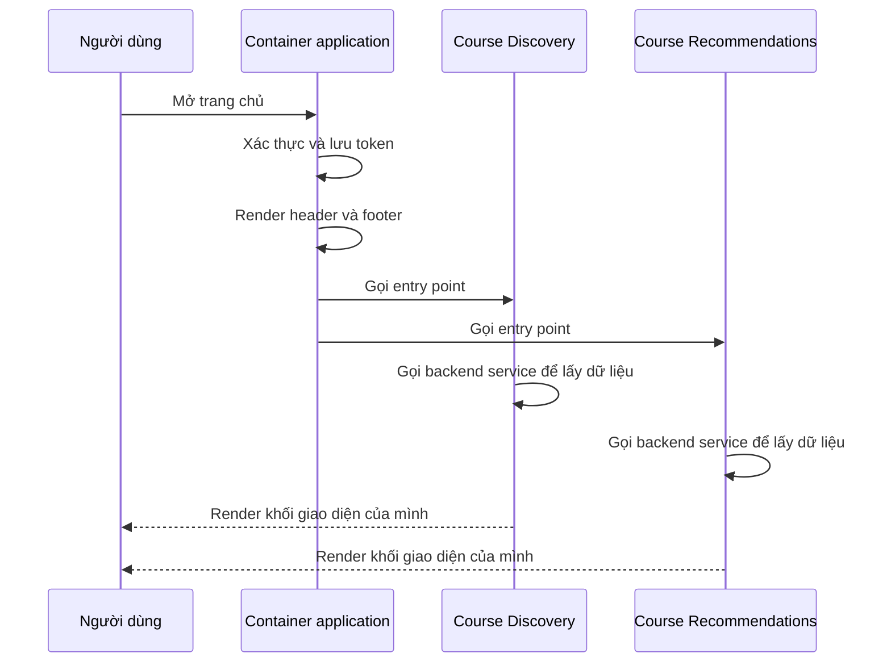

# 🧩 Micro-frontends: khi frontend cũng cần được "chia nhỏ"

> Nguồn: `010-Micro-frontends-Architecture-Pattern.txt` · [Udemy](https://ua.udemy.com/course/the-complete-microservices-event-driven-architecture/learn/lecture/38247910)

Chào mừng các bạn trở lại. Chúng ta đã đi qua best practices cho **dữ liệu** và cho **cách tổ chức team** vận hành microservices. Còn một mảnh ghép cuối cùng của kiến trúc chưa được chạm tới: **frontend**. Nếu backend đã chia thành microservices nhưng frontend vẫn là một khối khổng lồ, các bạn sẽ sớm gặp lại đúng những vấn đề cũ — và bài này giới thiệu pattern giải quyết chúng: **micro-frontends (giao diện vi dịch vụ)**. Chúng ta sẽ cùng xem monolithic frontend gây ra những gì, micro-frontends hoạt động ra sao qua ví dụ thực tế, hai hiểu lầm phổ biến, và bộ best practices để dùng pattern này cho đúng.

---

### 🧱 Monolithic frontend và nút thắt mang tên "một team"

Hãy tưởng tượng một **nền tảng học trực tuyến** nơi người dùng tìm kiếm, đăng ký và học các khóa học. Frontend gồm:

* **Homepage** với thanh tìm kiếm cho phép tìm khóa học theo keyword hoặc category, kèm khu vực **course recommendation** gợi ý khóa học người dùng có thể quan tâm. Góc trên bên phải là nút **profile** của learner — khi user tìm kiếm, danh sách khóa học liên quan hiển thị trên trang, còn click vào một khóa học sẽ mở **course landing page**.
* Khi quyết định đăng ký, user bấm nút enroll để sang **enrollment page**, điền thông tin thanh toán, tên và địa chỉ thanh toán để hoàn tất đăng ký.
* Quay lại trang chủ, bấm nút profile sẽ hiện **user profile** cùng toàn bộ khóa học đã đăng ký.

Phía backend, hệ thống đã được kiến trúc theo microservices với đầy đủ best practices decomposition: mỗi microservice do một team backend riêng sở hữu, giữ dữ liệu trong database riêng, giao tiếp qua API được định nghĩa rõ ràng và tuân thủ chuẩn chung toàn công ty; các service chia sẻ bộ tool và hạ tầng chung để test, deploy và monitor trên production. Nhưng phía frontend thì hoàn toàn khác: **một frontend team duy nhất** maintain **một codebase duy nhất** chịu trách nhiệm cho toàn bộ trải nghiệm người dùng vừa kể; toàn bộ code web application nằm trong một repository và được fetch từ web application service về browser của người dùng. Hệ quả là gì?

**Vấn đề tổ chức:**

* Khi **course discovery team** muốn thêm tính năng tìm kiếm theo thuộc tính mới — độ dài khóa học, ngôn ngữ, rating, hay category bổ sung — team phải implement trong microservice của mình trước, rồi **nhờ frontend team dành thời gian** thêm tính năng đó vào frontend. Tương tự, khi **course recommendations team** muốn hiển thị thêm hoặc đổi dữ liệu, họ cũng phải phối hợp với chính frontend team đó.
* Kết quả: **mọi microservice team đều phụ thuộc vào một frontend team duy nhất** — team này trở thành **bottleneck (nút thắt cổ chai)** của tổ chức phát triển.
* Chiều ngược lại cũng đau đầu không kém: khi frontend team muốn cải thiện profile page, developer phải **học và integrate với user service team**; muốn tối ưu enrollment và checkout process, họ phải cực kỳ quen thuộc domain và API của enrollment lẫn payment services. Nghĩa là frontend team **liên tục phải phát triển chuyên môn ở những domain thuộc về team khác** — tight coupling giữa backend teams và frontend team vốn đã quá tải, đúng thứ chúng ta muốn tránh khi chuyển sang microservices.
* **Vấn đề kỹ thuật:** khi business lớn lên, frontend cũng phình to. Codebase duy nhất trở nên rất lớn, khó maintain và khó **reason about (lý luận)**, test lâu hơn rất nhiều. Và mỗi khi muốn release một UI feature mới, **toàn bộ frontend code phải được rebuild, retest và redeploy**. Đây đúng là những vấn đề của monolithic backend — giờ chúng lặp lại ở frontend.

---

### 🧩 Micro-frontends hoạt động như thế nào

Để giải quyết, chúng ta dùng pattern **micro-frontends**: chia ứng dụng web monolithic thành **nhiều frontend module hoặc library hoạt động như những single page application (SPA) độc lập**.

* Việc chia tách được thực hiện theo **business capability hoặc domain**, y hệt cách chúng ta decompose microservices. Trong đa số trường hợp, **mỗi page** của web application trở thành một micro-frontend riêng; nhưng cũng có thể có **nhiều micro-frontend cùng hiển thị trên một page**.
* Mỗi micro-frontend **hoàn toàn decoupled** với các micro-frontend khác, và **tự biết cách load, mount và unmount chính nó** khỏi **DOM (Document Object Model)** trong browser. Nó cũng có thể được load như một **web application standalone** để phục vụ testing.
* Quan trọng hơn cả: mỗi micro-frontend do **một team riêng sở hữu**, với **full-stack technical capabilities** và domain knowledge để phát triển, maintain nó.
* Tất cả micro-frontend được **assemble (lắp ghép) lại ở runtime** bởi một **container web application**. Khi user load site, container application có nhiệm vụ: render các **common element** như page header và footer, xử lý **common functionality** như authentication và shared libraries, và **báo cho từng micro-frontend biết khi nào, ở đâu cần render** trên page.

---

### ⚠️ Hai hiểu lầm thường gặp

Trước khi đi vào ví dụ, mình muốn gỡ hai nguồn nhầm lẫn lớn nhất về pattern này:

1. **Micro-frontends là một architectural pattern, không phải web framework hay library.** Nhiều web framework hỗ trợ pattern này, nhưng chúng ta **không bắt buộc phải dùng framework cụ thể nào** để implement nó.
2. **Micro-frontend không phải shared web component.** Nó không phải một cái button, search bar hay UI element chung có thể tái sử dụng ở nhiều chỗ trên page. Nó là một **single page web application với business functionality rất hạn chế**. Các micro-frontend khác nhau có thể tái sử dụng chung UI element, nhưng **hai khái niệm này không liên quan tới nhau**.

---

### 🔄 Ví dụ thực tế: một lần user mở trang chủ

Quay lại nền tảng học trực tuyến, hãy xem pattern chạy như thế nào:

1. User gửi request mở **home page**; **web application service** trả về **container application** cho user.
2. Container xử lý **authentication** trước, rồi **lưu authentication token trên thiết bị của user** để user không phải xác thực lại cho mỗi request hay mỗi lần reload page.
3. Sau khi authentication xong, container render **header và footer** của nền tảng, rồi gọi **entry point** của **course discovery micro-frontend** và **course recommendations micro-frontend**.
4. Code của mỗi micro-frontend gọi tới backend service tương ứng để **build HTML với dữ liệu liên quan**, rồi **tự render vào đúng vị trí** mà container đã chỉ định.
5. Khi user chuyển sang **user profile page**, hệ thống **unmount course discovery và course recommendations** trước, sau đó render **user profile micro-frontend** — được maintain bởi **user profile team** và fetch dữ liệu từ backend service của nó.
6. **Enrollment page** tương tự: micro-frontend đến từ **enrollment service**, do **enrollment team** maintain. Mọi phần khác của web application đều theo cùng pattern này.

---

### ✅ Lợi ích và best practices

**Lợi ích chính** của pattern này:

* Thay codebase frontend lớn, phức tạp và monolithic bằng **vài codebase nhỏ, dễ quản lý hơn**, mỗi cái cho một micro-frontend.
* Mỗi team **sở hữu trọn vẹn domain và tech stack của mình từ đầu đến cuối (end to end)**. Course recommendations team, enrollment team hay course discovery team muốn ship feature mới đều có thể làm **độc lập**, không chờ đợi hay phụ thuộc bất kỳ team nào.
* Mỗi micro-frontend **dễ và nhanh hơn nhiều khi test cô lập** vì scope nhỏ hơn hẳn; đồng thời có **continuous integration pipeline và deployment process riêng**, team sở hữu được release feature mới theo **schedule của chính mình**.

**Best practices:**

1. **Đảm bảo micro-frontend được load ở runtime**, không được biểu diễn như **compile-time hay build-time dependency** của container application. Nếu không, ta chỉ tách codebase **trên mặt logic**, còn runtime vẫn là một monolithic frontend đòi hỏi redeploy toàn bộ cho mỗi feature mới. Best practice này rất giống bài học ở backend: tách monolithic application thành module hay library **không mang lại lợi ích** như tách thành microservices.
2. **Không chia sẻ state giữa các micro-frontend** — chia sẻ state trong browser tương đương với việc các microservice **chia sẻ database**, cách làm chúng ta đã biết là tệ. Nếu các micro-frontend cần giao tiếp, dùng **custom events**, **passing callbacks**, hoặc **browser's address bar**.

| Tiêu chí | Monolithic frontend | Micro-frontends |
|---|---|---|
| Codebase | Một khối lớn, khó reason about | Nhiều module nhỏ, dễ quản lý |
| Quyền sở hữu | Một frontend team duy nhất | Từng team full-stack sở hữu domain của mình |
| Release | Rebuild, retest, redeploy toàn bộ | Mỗi micro-frontend release theo schedule riêng |
| Lắp ghép | Tĩnh, một ứng dụng duy nhất | Container application assemble ở runtime |

---

### 🎓 Tự kiểm tra nhanh

**Câu 1:** Vì sao monolithic frontend trở thành nút thắt của tổ chức?

<b>Xem đáp án</b>

**Đáp án:** Vì mọi microservice team muốn thêm tính năng đều phải chờ frontend team, còn frontend team thì liên tục phải học domain và API của các team khác.

Giải thích: Điều này tạo tight coupling giữa backend teams và frontend team — đúng thứ microservices muốn tránh.

Tham chiếu: Mục Monolithic frontend và nút thắt.

**Câu 2:** Micro-frontends là gì và ai assemble chúng?

<b>Xem đáp án</b>

**Đáp án:** Là pattern chia web application thành nhiều frontend module hoặc library hoạt động như các SPA độc lập; chúng được assemble ở runtime bởi một container web application.

Giải thích: Mỗi micro-frontend tự load, mount, unmount khỏi DOM và có thể chạy standalone để test.

Tham chiếu: Mục Micro-frontends hoạt động như thế nào.

**Câu 3:** Vai trò của container application là gì?

<b>Xem đáp án</b>

**Đáp án:** Render common elements như header, footer; xử lý common functionality như authentication và shared libraries; và báo cho từng micro-frontend khi nào, ở đâu cần render.

Giải thích: Container cũng lưu authentication token trên thiết bị để user không phải xác thực lại mỗi request hoặc reload.

Tham chiếu: Mục Ví dụ thực tế.

**Câu 4:** Hai hiểu lầm thường gặp về micro-frontends là gì?

<b>Xem đáp án</b>

**Đáp án:** Thứ nhất, micro-frontends là architectural pattern chứ không phải framework hay library. Thứ hai, micro-frontend không phải shared web component như button hay search bar, mà là một single page web application với business functionality hạn chế.

Giải thích: Nhiều framework hỗ trợ pattern này nhưng không bắt buộc dùng framework nào; micro-frontend và shared UI element là hai khái niệm không liên quan.

Tham chiếu: Mục Hai hiểu lầm thường gặp.

**Câu 5:** Vì sao micro-frontends phải được load ở runtime và không được chia sẻ state?

<b>Xem đáp án</b>

**Đáp án:** Nếu là compile-time hoặc build-time dependency, runtime vẫn là monolithic frontend và mọi feature vẫn cần redeploy toàn bộ. Chia sẻ state trong browser tương đương các microservice chia sẻ database — một bad approach.

Giải thích: Khi cần giao tiếp, các micro-frontend có thể dùng custom events, passing callbacks hoặc browser's address bar.

Tham chiếu: Mục Lợi ích và best practices.

---

Tóm lại, các bạn vừa nắm trọn pattern **micro-frontends**: khởi điểm là monolithic frontend — vừa là bottleneck tổ chức, vừa tái diễn mọi vấn đề kỹ thuật của monolith; giải pháp là chia web application thành các SPA độc lập theo domain, do từng team full-stack sở hữu, được container application assemble ở runtime. Cùng với đó là hai best practices vàng: **load ở runtime, không share state** — giao tiếp qua custom events, callbacks hoặc address bar. Như mọi pattern khác, giá trị nằm ở việc áp dụng đúng cách chứ không phải bản thân công nghệ. Hẹn gặp lại các bạn ở bài sau, khi chúng ta bàn về **API management** và API gateway — cửa ngõ của toàn hệ thống! 🚀
