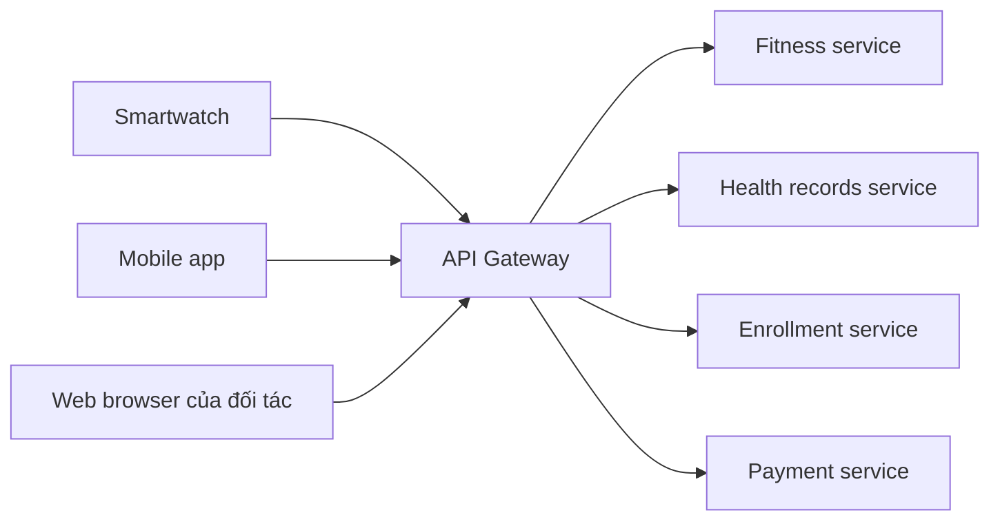

# 🚪 API Gateway: cửa ngõ quản lý API cho hệ microservices

> Nguồn: `011-API-Management-for-Microservices-Architecture.txt` · [Udemy](https://ua.udemy.com/course/the-complete-microservices-event-driven-architecture/learn/lecture/38708512)

Chào mừng các bạn trở lại. Hôm nay chúng ta giải quyết một bài toán mà mọi hệ microservices đều gặp khi lớn lên: **quản lý API**. Khi hàng tá hay hàng trăm microservice expose hàng trăm API cho đủ loại client, làm sao để phía client không bị trói chặt vào kiến trúc nội bộ, và làm sao để các team không lặp lại cùng một đống boilerplate? Câu trả lời là **API gateway pattern** — và mình cũng sẽ gỡ luôn một nhầm lẫn kinh điển giữa API gateway và load balancer.

---

### 🎯 Bài toán: "rừng API" của một hệ microservices

Hãy tưởng tượng chúng ta là một công ty **health care và fitness** cung cấp digital services cho cả khách hàng cá nhân lẫn doanh nghiệp như fitness centers, hospitals và doctors offices.

* Phía client có đủ loại thiết bị: **smartwatch, điện thoại, và các wearable accessory** khác tương tác với platform.
* Bên cạnh đó là server của các công ty khác, developer, máy tính và chuyên gia y tế dùng hệ thống qua web browser.
* Bên trong, chúng ta có **hàng tá, thậm chí hàng trăm microservice**, mỗi service expose những API đặc thù cho chức năng của mình.

Từ bối cảnh đó nảy sinh bốn vấn đề:

1. **API endpoint bị hardcode khắp nơi.** Endpoint do từng microservice expose bị hardcode trong rất nhiều frontend và **client SDK**, khiến code phía client **tightly coupled** với internal implementation của hệ thống. Ví dụ: ta quyết định tách một microservice hiện có thành hai microservice, mỗi service expose API mới với ID và endpoint riêng — vì tight coupling, ta buộc phải refactor **toàn bộ client code trên mọi loại thiết bị** để dùng API mới.
2. **Mỗi service phục vụ nhiều nhóm khách khác nhau.** Có thể cùng lúc phải expose **public API** ra ngoài cho client, **private API** chỉ cho internal service, và **partner API** chỉ cho partner business cùng developer của họ. Trong khi nội bộ có thể tuân thủ API guideline tốt, với API bên ngoài điều đó không phải lúc nào cũng khả thi: cùng một service có thể phải expose một loại API cho partner chỉ hỗ trợ **công nghệ API cũ**, rồi expose cùng chức năng đó cho hai công ty khác dùng công nghệ mới hơn nhưng **khác nhau**. Thêm nữa là **nhiều version API cho các tier khách hàng khác nhau**: một API giới hạn hơn dành cho **free user**, một API nhiều khả năng hơn cho **premium customer**. Kết quả là một "khu rừng API" ngày càng khó quản lý và khó lý giải.
3. **Khó kiểm soát và monitor tương tác của client.** Ví dụ khi load dashboard bài tập hằng ngày, mobile app của một user có thể phải gọi **nhiều API tới nhiều microservice khác nhau**. Vì frontend gọi thẳng các service, việc monitor và tracking những call này xuyên toàn hệ thống là rất khó.
4. **Boilerplate lặp lại ở từng service.** Rất nhiều code boilerplate như **authorization** và **rate limiting** phải được implement trong **mỗi microservice**. Điều này tốn công, gây duplication và lãng phí thời gian của từng team — thời gian lẽ ra dành cho việc khác.

---

### 🚪 API gateway pattern

Để **decouple phía client khỏi kiến trúc nội bộ** và làm API management dễ thở hơn, chúng ta dùng **API gateway pattern**. Pattern này đặt một component gọi là **API gateway** tại **entry point của hệ thống**, chịu trách nhiệm cho toàn bộ việc quản lý API. Nó đặc biệt hữu ích với microservices architecture và được rất nhiều công ty sử dụng.

Ở kịch bản đơn giản nhất, API gateway chỉ **route request** cho một API endpoint tới microservice phù hợp. Nhưng trong đa số trường hợp, nó làm được nhiều hơn thế:

* **Chuyển đổi protocol và data format.** Giả sử ba client cần tương tác với cùng một microservice để lấy dữ liệu, nhưng công nghệ API và data format của mỗi client khác nhau. API gateway **transform request về một canonical API type và data format duy nhất** mà microservice hỗ trợ, và dịch ngược response trở lại cho client. Nhờ vậy, định nghĩa và quản lý API trở nên sạch sẽ, dễ dàng hơn cho mỗi service: họ không phải bận tâm về client nào cả, chỉ cần theo **một standard** và dùng chung một hạ tầng.
* **Traffic management và throttling.** Nếu một business partner query dữ liệu với tần suất quá cao, ta dễ dàng **throttle (giới hạn tốc độ)** ngay tại gateway, ngăn nó đè tải lên microservice phải xử lý request.
* **Authorization và TLS termination.** Có thể **delegate (giao khoán)** hai việc này cho API gateway, để microservice không phải bận tâm và tập trung vào business logic.
* **Monitoring.** Vì toàn bộ traffic từ frontend đều đi qua gateway, việc monitor trở nên đơn giản: phát hiện vấn đề ở một API cụ thể, phân tích hành vi của client và partner company.
* **Fan-out và aggregation.** Một số implementation của API gateway còn cho phép **fan-out một request tới nhiều service** rồi **aggregate kết quả** trước khi trả về client. Đây là tính năng critical vì hai lý do. Thứ nhất, nó **tăng cường decoupling**: bên trong ta có thể refactor — gộp vài microservice thành một, hay tách một microservice thành nhiều — mà **mọi chi tiết implementation vẫn hoàn toàn trong suốt** với người dùng. Thứ hai, nó đặc biệt quan trọng với **mobile devices và IoT** vì mỗi network request ở phía thiết bị ảnh hưởng **trực tiếp tới tuổi thọ pin (battery life)**.

Với các bạn đang ôn **system design interview**, đây là pattern xuất hiện gần như mặc định khi đề bài nhắc tới microservices — hãy nắm chắc cả công dụng lẫn lý do tồn tại của nó.

---

### ⚖️ Load balancer và API gateway — đừng nhầm lẫn

Đây là nguồn nhầm lẫn phổ biến nhất, nên mình dành phần cuối để làm rõ.

**Điểm giống nhau:** cả load balancer lẫn API gateway đều **route incoming network request từ client tới một destination duy nhất**. Nhưng tương đồng chỉ có vậy.

**Khác biệt cốt lõi nằm ở mục đích:**

* **Load balancer** có nhiệm vụ — đúng như tên gọi — **cân bằng traffic load trên một nhóm server**, thường là các server chạy những bản copy **giống hệt nhau** của cùng một application. Trong bối cảnh microservices, ta thường đặt load balancer phía trước **mỗi microservice**, nơi service được deploy thành một nhóm **instance giống hệt nhau**.
* **API gateway** có mục đích trở thành **public-facing interface** của hệ thống. Nó route request **tới service, không phải tới server**, dựa trên nhiều tiêu chí khác nhau.

**Khác biệt tinh tế về chức năng:**

* Load balancer hướng tới **đơn giản hết mức có thể** để giảm performance overhead; thường thực hiện **health check** trên backend server để không route request tới server không phản hồi; và cung cấp nhiều **thuật toán cân bằng tải** cho các workload khác nhau.
* API gateway được kỳ vọng cung cấp rất nhiều tính năng: **throttling, monitoring, API versioning và management, protocol và data format translation**, v.v.

| Tiêu chí | Load balancer | API gateway |
|---|---|---|
| Mục đích | Cân bằng traffic trên nhóm server | Public-facing interface của hệ thống |
| Đối tượng route | Server chạy bản copy giống hệt nhau | Service, theo nhiều tiêu chí khác nhau |
| Chức năng chính | Health check, thuật toán cân bằng tải, đơn giản để giảm overhead | Throttling, monitoring, versioning, translation, authorization, TLS termination, fan-out |
| Vị trí | Thường đứng trước mỗi microservice | Đặt tại entry point của toàn hệ thống |

Vì mục đích khác nhau, hai component này thường được **dùng cùng nhau** trong microservices architecture — không phải chọn một trong hai.

---

### 🎓 Tự kiểm tra nhanh

**Câu 1:** Vì sao hardcode API endpoint trong client gây ra vấn đề?

<b>Xem đáp án</b>

**Đáp án:** Nó làm client tightly coupled với internal implementation: khi tách một microservice thành hai, ta phải refactor toàn bộ client code trên mọi loại thiết bị để dùng API mới.

Giải thích: Endpoint của từng microservice bị nhúng vào nhiều frontend và client SDK.

Tham chiếu: Mục Bài toán rừng API.

**Câu 2:** Bốn vấn đề của API management trong microservices là gì?

<b>Xem đáp án</b>

**Đáp án:** Endpoint hardcode gây tight coupling; mỗi service phải phục vụ nhiều loại API và version cho các nhóm khách khác nhau; khó kiểm soát và monitor tương tác của client; boilerplate như authorization và rate limiting bị lặp lại ở từng service.

Giải thích: Cả bốn vấn đề đều khiến hệ thống khó quản lý và lãng phí công sức của các team.

Tham chiếu: Mục Bài toán rừng API.

**Câu 3:** Ngoài routing, API gateway còn cung cấp những tính năng nào?

<b>Xem đáp án</b>

**Đáp án:** Protocol và data format translation, traffic management và throttling, authorization, TLS termination, monitoring, fan-out và aggregation kết quả.

Giải thích: Nhờ đó microservice chỉ cần theo một standard chung và tập trung vào business logic.

Tham chiếu: Mục API gateway pattern.

**Câu 4:** Load balancer khác API gateway ở điểm cốt lõi nào?

<b>Xem đáp án</b>

**Đáp án:** Load balancer cân bằng traffic giữa các server chạy bản copy giống hệt nhau của một application; API gateway là public-facing interface, route request tới service theo nhiều tiêu chí và cung cấp nhiều tính năng quản lý API.

Giải thích: Load balancer thường hướng tới đơn giản, có health check và nhiều thuật toán cân bằng tải; API gateway có throttling, versioning, translation, v.v.

Tham chiếu: Mục Load balancer và API gateway.

**Câu 5:** Vì sao tính năng fan-out và aggregation của API gateway đặc biệt quan trọng với mobile và IoT?

<b>Xem đáp án</b>

**Đáp án:** Vì mỗi network request ở phía thiết bị ảnh hưởng trực tiếp tới tuổi thọ pin; gộp nhiều service call vào một request giúp tiết kiệm pin.

Giải thích: Fan-out còn giúp decouple client khỏi internal implementation — việc gộp hoặc tách microservice bên trong trở nên trong suốt với người dùng.

Tham chiếu: Mục API gateway pattern.

---

Tóm lại, các bạn đã nắm trọn bức tranh **API management** cho microservices: từ bốn bài toán thực tế — endpoint hardcode, rừng API cho nhiều nhóm khách, khó monitor, boilerplate lặp lại — đến giải pháp **API gateway** đặt tại entry point với routing, translation, throttling, authorization, TLS termination, monitoring và fan-out aggregation. Điểm cuối cùng cần khắc cốt: **API gateway và load balancer phục vụ hai mục đích hoàn toàn khác nhau và thường được dùng cùng nhau** — đừng bao giờ coi chúng là một. Với bài này, chúng ta đã khép lại phần principles và best practices, sẵn sàng bước sang những pattern nâng cao giải quyết bài toán giao tiếp và nhất quán dữ liệu mà mình đã hẹn ở các bài trước. Hẹn gặp lại các bạn ở bài sau! 🚀
