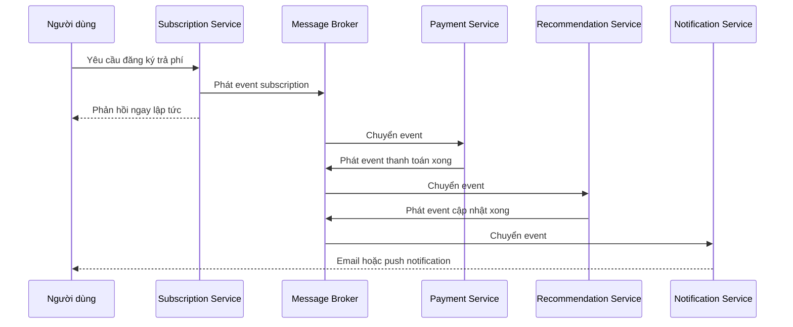

# ⚡ Event-Driven Architecture: Khi microservices cần nói chuyện bất đồng bộ

> Nguồn: `012-Introduction-to-Event-Driven-Architecture.txt` · [Udemy](https://ua.udemy.com/course/the-complete-microservices-event-driven-architecture/learn/lecture/38247986)

Trong bài này, mình và các bạn sẽ làm quen với một phong cách kiến trúc mới: **event-driven architecture (EDA — kiến trúc hướng sự kiện)** — và quan trọng hơn, cách kết hợp nó với microservices. Chúng ta sẽ bắt đầu từ một tình huống thực tế để thấy nỗi đau của mô hình request-response, rồi đi tới các khái niệm nền tảng của EDA trước khi áp dụng nó trở lại vào chính tình huống đó.

---

### 🎬 Đặt vấn đề: giao dịch đăng ký trải dài nhiều microservice

Hãy tưởng tượng chúng ta xây dựng một **dịch vụ video on demand (xem phim theo yêu cầu) theo kiến trúc microservices**. Người dùng đã dùng thử miễn phí và giờ sẵn sàng nâng cấp lên **gói trả phí** để truy cập toàn bộ kho phim cùng nhiều tính năng nâng cao.

Ở phía backend, giao dịch này có sự tham gia của các microservices sau:

* **Subscription service:** giữ toàn bộ thông tin về người đăng ký — hạng subscription, ngày hết hạn và nhiều thông tin khác.
* **Payment service:** nhận thông tin thẻ tín dụng và giao tiếp với các công ty bên thứ ba để **thu tiền** người dùng.
* **Recommendations & personalization service:** tạo và duy trì hồ sơ riêng cho từng khách hàng trả phí, cung cấp **lịch sử xem phim** và gợi ý phim dựa trên những gì họ từng xem, cùng quốc gia của họ.

Điểm then chốt cần nhớ: để người dùng được coi là đăng ký thành công, **tất cả các service này đều phải nhận và xử lý thành công yêu cầu đăng ký**. Vậy chúng ta sẽ hiện thực giao dịch này như thế nào? Hãy cùng đi qua vài cách — và chỉ ra vấn đề của từng cách, đúng tinh thần "mọi quyết định kiến trúc đều là trade-off".

---

### 🔗 Hai cách tiếp cận đồng bộ — và những nút thắt

**Cách thứ nhất — chuỗi request-response.** Yêu cầu chứa toàn bộ thông tin người dùng được gửi tới subscription service. Service này cập nhật database của mình rồi gửi request sang payment service. Payment service liên hệ dịch vụ xử lý thẻ tín dụng bên thứ ba; khi nhận được xác nhận, nó cập nhật database rồi gửi request sang recommendation service. Recommendation service cập nhật database thành công và trả response về payment service; payment gửi xác nhận về subscription service; cuối cùng subscription service phản hồi front-end để hiển thị trang đăng ký thành công.

* **Ưu điểm:** khi người dùng nhận được response, có **bảo đảm 100%** rằng giao dịch đã thành công và cả ba service đều đã nhận và xử lý yêu cầu.
* **Nhược điểm:** chuỗi giao tiếp dài giữ chân người dùng rất lâu, gây **trải nghiệm tồi tệ ngay cả khi mọi thứ diễn ra suôn sẻ**. Trong trường hợp xấu — dịch vụ bên thứ ba mà payment service gọi tới gặp vấn đề hiệu năng, hoặc kết nối từ payment sang recommendation đứt và phải retry — toàn bộ giao dịch còn khiến người dùng chờ lâu hơn nữa.

Liệu có thể "cắt góc" để giảm thời gian chờ không? Không ổn. Nếu subscription service phản hồi người dùng **trước khi** nhận được xác nhận từ payment, mà payment thất bại hoặc không bao giờ nhận được request, **người dùng sẽ bị tính tiền sai**. Tương tự, nếu payment phản hồi trước khi recommendation xử lý xong, chúng ta có nguy cơ rơi vào **trạng thái không nhất quán**: recommendation service crash ngay trước hoặc trong lúc xử lý, thế là người dùng chẳng nhận được tính năng gợi ý nào dù đã trả tiền. Nói cách khác, với mô hình request-response: **càng nhiều microservice trong chuỗi, chúng ta càng phải giữ người dùng lâu hơn để đảm bảo trạng thái nhất quán** — và trong rất nhiều trường hợp, độ trễ đó vượt ngưỡng chấp nhận được.

**Cách thứ hai — orchestration pattern (điều phối tập trung).** Thay vì chuỗi request nối tiếp, ta thêm **một service duy nhất đóng vai trò điều phối** giao dịch nghiệp vụ phức tạp gồm nhiều thao tác/service. Service này về mặt kỹ thuật có thể gộp chung với API gateway, nhưng cứ tạm giả định nó là service riêng. Request sẽ đi vào orchestration service rồi được **broadcast song song** tới các service liên quan. Nhờ chạy song song, độ trễ tổng giảm từ **tổng độ trễ của tất cả service** xuống còn **độ trễ của service chậm nhất**.

Tuy vậy, cách này vẫn còn những vấn đề đáng kể:

1. **Độ trễ đôi khi vẫn quá cao:** ví dụ dịch vụ xử lý thẻ tín dụng bên thứ ba gặp vấn đề hiệu năng vì nhiều công ty khác cũng dồn request tới nó. Tình huống này nằm ngoài tầm kiểm soát của chúng ta nhưng vẫn ảnh hưởng tiêu cực tới hệ thống và khách hàng.
2. **Orchestration service bị gắn chặt (tightly coupled)** với mọi service tham gia giao dịch: nếu API của một service thay đổi, hoặc ta cần thêm một bước mới cho luồng đăng ký, ta buộc phải sửa orchestration service để gọi service đó.
3. **Chỉ một service gặp sự cố tạm thời** cũng khiến **toàn bộ** yêu cầu đăng ký bị từ chối — và chúng ta mất đi những khách hàng đáng giá.

---

### ⚡ Event-driven architecture: event và ba nhân vật chính

Để giải quyết những vấn đề trên — và nhiều vấn đề khác — chúng ta có thể dùng **event-driven architecture**. Khái niệm trung tâm của EDA là **event (sự kiện)**: một **sự thật, hành động hoặc thay đổi trạng thái** xảy ra trong hệ thống.

Điểm khác biệt cốt lõi so với request:

* **Event luôn bất biến (immutable)** — đã sinh ra thì không bao giờ thay đổi; còn request chỉ là **tạm thời (ephemeral)**.
* Event **có thể được lưu trữ vô thời hạn** trong hệ thống, và **có thể được nhiều service tiêu thụ nhiều lần**; ngược lại, một request chỉ được tiêu thụ **một lần duy nhất bởi một server**.

Có **ba nhân vật** tham gia vào quá trình trao đổi event:

1. **Producer (nhà sản xuất):** tạo ra event.
2. **Message broker (trung gian thông điệp):** lưu trữ và định tuyến event.
3. **Consumer (người tiêu thụ):** một hoặc nhiều service nhận và xử lý event.

Message broker cho phép định tuyến **một event tới bao nhiêu consumer tùy ý**, đồng thời bổ sung một tầng **dư thừa (redundancy)** cho hệ thống: event đã được tạo vào broker thì không bị mất, và ta luôn có thể lấy lại nó từ broker. Vậy đâu là hai khác biệt nền tảng giữa request-response và event-driven?

| Tiêu chí | Request-response | Event-driven |
|---|---|---|
| Kiểu giao tiếp | **Synchronous (đồng bộ)** — người gửi phải chờ phản hồi, kể cả khi phản hồi không mang thông tin hữu ích; phản hồi không bao giờ tới thường báo hiệu có vấn đề | **Asynchronous (bất đồng bộ)** — publisher không cần và không mong đợi phản hồi từ consumer |
| Quyền kiểm soát | Người gửi phải biết receiver và biết chính xác cách gọi API của nó; muốn gửi cho nhiều receiver thì phải biết hết và dùng đúng tham số riêng của từng bên | **Đảo ngược quyền kiểm soát (inversion of control)** — publisher không quan tâm, thậm chí không cần biết consumer là ai |

Trong mô hình request-response, người gửi **phụ thuộc vào người nhận**. Còn trong EDA, việc event tới được consumer hay không **nằm ngoài tầm kiểm soát và trách nhiệm của publisher** — nhờ đó producer có thể chuyển ngay sang xử lý tác vụ tiếp theo thay vì ngồi chờ một phản hồi mà nó không hề cần. Chính **inversion of control** giải phóng producer khỏi consumer và **tách rời hoàn toàn (complete decoupling)** hai bên. Và như chúng ta đã nhớ từ các bài trước, **loose coupling (tách rời lỏng) là một trong những phẩm chất quan trọng nhất mà chúng ta mong muốn ở kiến trúc microservices**. Đó chính là lý do event-driven architecture và microservices architecture kết hợp với nhau thành công đến vậy.

---

### 📬 Áp dụng EDA vào bài toán subscription

Quay lại ví dụ video on demand: một cách áp dụng EDA là đặt **message broker ở giữa từng cặp service**:

1. Subscription service nhận request từ người dùng, **lưu vào database của mình** và **phát một event vào message broker**. Ngay tại thời điểm này, nó có thể phản hồi người dùng — người dùng không cần chờ phần còn lại của giao dịch hoàn tất.
2. Payment service **tiêu thụ event**, xử lý thanh toán, lưu kết quả vào database của mình và **phát một event mới** cho service kế tiếp. Lưu ý: **người dùng hoàn toàn không bị ảnh hưởng kể cả khi bước này mất rất lâu.**
3. Recommendation service tiêu thụ event, xử lý, và tùy chọn phát thêm một event cho **notification service**.
4. Notification service tiêu thụ event của mình và gửi email xác nhận hoặc push notification tới ứng dụng di động của người dùng.

---

### 🎯 Tự kiểm tra nhanh

**Câu 1:** Vì sao chuỗi request-response dài lại khiến trải nghiệm người dùng kém?

<b>Xem đáp án</b>

**Đáp án:** Vì nó giữ chân người dùng rất lâu để đảm bảo trạng thái nhất quán, và độ trễ còn tăng thêm khi một service hay bên thứ ba gặp vấn đề hoặc phải retry.

Giải thích: Càng nhiều microservice trong chuỗi, thời gian chờ càng dài, trong khi ta không thể "cắt góc" bằng cách phản hồi sớm vì sẽ gây tính tiền sai hoặc trạng thái không nhất quán.

Tham chiếu: Mục Hai cách tiếp cận đồng bộ — và những nút thắt.

**Câu 2:** Orchestration pattern cải thiện độ trễ bằng cách nào?

<b>Xem đáp án</b>

**Đáp án:** Broadcast các request song song tới các service liên quan, nhờ đó độ trễ tổng giảm từ tổng độ trễ của tất cả service xuống còn độ trễ của service chậm nhất.

Giải thích: Service điều phối trung tâm gọi song song thay vì nối tiếp.

Tham chiếu: Mục Hai cách tiếp cận đồng bộ — và những nút thắt.

**Câu 3:** Hai nhược điểm chính của orchestration pattern là gì?

<b>Xem đáp án</b>

**Đáp án:** Orchestration service bị tightly coupled với mọi service tham gia (API đổi hoặc thêm bước là phải sửa), và chỉ cần một service gặp sự cố tạm thời là toàn bộ giao dịch bị từ chối.

Giải thích: Ngoài ra độ trễ vẫn có thể quá cao nếu bên thứ ba bị quá tải; tình huống này ngoài tầm kiểm soát của chúng ta.

Tham chiếu: Mục Hai cách tiếp cận đồng bộ — và những nút thắt.

**Câu 4:** Event khác request ở những điểm cốt lõi nào?

<b>Xem đáp án</b>

**Đáp án:** Event là sự thật/hành động/thay đổi trạng thái, luôn bất biến, có thể được lưu trữ vô thời hạn và được nhiều service tiêu thụ nhiều lần — trong khi request là tạm thời và chỉ được một server tiêu thụ đúng một lần.

Giải thích: Đây là nền tảng để EDA phân phối và replay sự kiện cho nhiều consumer.

Tham chiếu: Mục Event-driven architecture: event và ba nhân vật chính.

**Câu 5:** Inversion of control trong EDA nghĩa là gì?

<b>Xem đáp án</b>

**Đáp án:** Publisher không cần biết và không quan tâm consumer là ai; việc event tới được consumer nằm ngoài tầm kiểm soát và trách nhiệm của publisher.

Giải thích: Trong request-response, người gửi phải biết receiver và cách gọi API — chính sự đảo ngược này giúp producer và consumer tách rời hoàn toàn.

Tham chiếu: Mục Event-driven architecture: event và ba nhân vật chính.

---

Vậy là chúng ta đã có bức tranh tổng quan về event-driven architecture: bài toán thực tế khiến chuỗi request-response và orchestration lộ điểm yếu, event cùng ba nhân vật producer — message broker — consumer, và hai khác biệt nền tảng là bất đồng bộ với đảo ngược quyền kiểm soát. Chính nhờ đó EDA và microservices là cặp bài trùng: **loose coupling** được đẩy lên mức cao hơn, còn người dùng không còn bị "giam" trong chuỗi giao tiếp dài. Ở bài tiếp theo, chúng ta sẽ trả lời câu hỏi thực chiến: **khi nào nên dùng EDA, khi nào nên quay về request-response** — cùng hai pattern giao event quan trọng nhất. Hẹn gặp lại các bạn! 🚀
