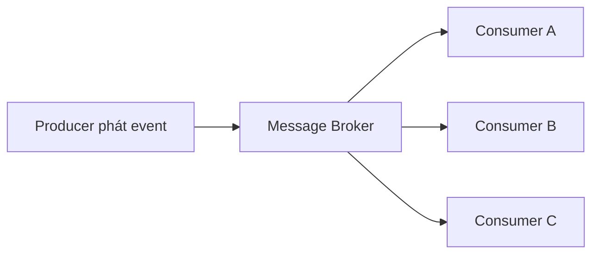

# 🧭 Khi nào dùng Event-Driven? 6 use case và 2 pattern giao sự kiện

> Nguồn: `013-Use-Cases-and-Patterns-of-Event-Driven-Architecture.txt` · [Udemy](https://ua.udemy.com/course/the-complete-microservices-event-driven-architecture/learn/lecture/38790432)

Ở bài trước, chúng ta đã thấy event-driven architecture mạnh đến nhường nào. Nhưng như mọi giải pháp kiến trúc khác, **EDA không phải viên đạn bạc**. Trong bài này, mình sẽ cùng các bạn đi qua những use case mà EDA là lựa chọn đúng, những tình huống nên quay về request-response truyền thống, và hai pattern giao event phổ biến nhất trong công nghiệp.

---

### ⚡ Fire-and-forget và reliable delivery

**Use case đầu tiên: hành động thuộc dạng fire-and-forget (gửi rồi quên) và mang bản chất bất đồng bộ.** Ở những trường hợp này, người gửi không mong đợi nhận lại dữ liệu ngay lập tức — hoặc không mong đợi gì cả. Hai ví dụ rất đời:

* Người dùng yêu cầu **tạo một báo cáo** có thể mất vài phút, thậm chí vài giờ mới xong. Event ở đây là hành động "generate report", và kết quả sẽ được gửi tới email người dùng khi hoàn tất.
* Người dùng **để lại đánh giá sản phẩm** đã mua. Họ không mong nhận dữ liệu phản hồi — ngay bây giờ hay sau này — điều duy nhất họ quan tâm là đánh giá có được hệ thống chấp nhận hay không.

**Use case thứ hai: reliable delivery (giao nhận đáng tin cậy).** Điều này đặc biệt quan trọng trong **giao dịch tài chính**, nơi chúng ta không thể để mất thông điệp trên đường truyền hoặc cần bảo đảm một ngữ nghĩa giao nhận nhất định (mình sẽ nói kỹ về delivery semantics ở bài riêng). Hai ví dụ tiêu biểu:

* **Cửa hàng online:** khi đã nói với người dùng là họ sẽ nhận được hàng, chúng ta tuyệt đối phải giữ lời — hoặc gửi email giải thích vì sao đơn không thực hiện được. Không thể chấp nhận chuyện người dùng đặt hàng rồi đơn biến mất trên đường truyền chỉ vì một server crash giữa chừng.
* **Chuyển tiền giữa các tài khoản hoặc ngân hàng:** hành động này đòi hỏi độ tin cậy cao và chúng ta không được phép "đánh rơi" nó.

---

### 🌊 Chuỗi dữ liệu vô hạn, anomaly detection và broadcasting

**Use case thứ ba: infinite streams (chuỗi dữ liệu/sự kiện vô hạn).** Ví dụ là **dữ liệu vị trí từ thiết bị di động** hoặc **dữ liệu cảm biến từ thiết bị IoT** như robot hút bụi hay xe tự lái. Ở đây, một dòng dữ liệu liên tục và vô hạn đổ vào hệ thống, và chúng ta cần **phân tích, tổng hợp, biến đổi hoặc lưu trữ theo thời gian thực**.

**Use case thứ tư: anomaly detection (phát hiện bất thường) và pattern recognition (nhận diện mẫu).** Mỗi event có thể đại diện cho một sự thật, chẳng hạn **số request mỗi giây tại từng server**. Một điểm dữ liệu đơn lẻ chẳng thú vị gì; nhưng khi **xếp chúng thành một chuỗi**, ta thu được những thông tin giá trị:

* Nếu số request mỗi giây của một server/service **tăng lên**, ta biết cần **scale out** và thêm server, nếu không hệ thống sẽ sớm không tải nổi lưu lượng.
* Nếu số request mỗi giây **đột ngột về 0**, đó là dấu hiệu **lỗi phần cứng hoặc phần mềm** cần điều tra ngay lập tức.

**Use case thứ năm: service có thay đổi trạng thái muốn broadcast tới mọi service quan tâm.** Đây là lựa chọn hoàn hảo cho EDA vì **producer không cần biết gì về người tiêu thụ event và cách họ dùng nó**. Ví dụ: người dùng **click vào một quảng cáo số** trên website. Khi ad service nhận request từ front-end, nó phát event vào message broker; broker **broadcast event tới tất cả service quan tâm**, và mỗi service tự đảm nhận vai trò riêng của mình — hoàn toàn không ai biết vai trò của ai.

---

### 🛡️ Buffering chống traffic spike — và khi nào nên ở lại request-response

**Use case thứ sáu: buffering (đệm) thông điệp để chịu được các đợt bùng nổ lưu lượng.** Ta có thể chịu đựng một đợt event tăng vọt từ một service bằng cách đặt **message broker** và cho các service giao tiếp bất đồng bộ. Hãy tưởng tượng một công ty mạng xã hội: một sự kiện toàn cầu bỗng khiến số bài đăng và bình luận tăng khổng lồ trên một bài viết cụ thể. Ta **đệm các event trong message broker** và chỉ giao chúng tới các service khác **với tốc độ mà chúng có thể xử lý** — hệ thống nhờ vậy không bị sập.

Nhưng không phải chỗ nào cũng nên dùng EDA. Có hai tình huống chúng ta nên ưu tiên **request-response đồng bộ**:

1. **Khi cần phản hồi người dùng hoặc service gọi ngay lập tức kèm dữ liệu.** Ví dụ người dùng mở trang web cần danh sách sản phẩm theo danh mục — phải trả lời ngay và đồng bộ, nếu không người dùng sẽ rời khỏi cửa hàng.
2. **Khi tương tác quá đơn giản, dùng EDA chẳng mang lại lợi ích gì.** Cấu hình và vận hành một message broker phân tán (hoặc managed trên cloud) tốn kém độ phức tạp và chi phí; nếu không thu được lợi ích tương xứng thì **không đáng**.

*Sự thật thực tế là:* một kiến trúc microservices điển hình **kết hợp cả EDA lẫn request-response đơn giản**. Và lời khuyên thực chiến: hãy **bắt đầu với request-response** trước, rồi chỉ nâng cấp những phần quan trọng sang EDA khi thật sự cần.

---

### 📬 Hai pattern giao event: event streaming và pub-sub

**Pattern thứ nhất — event streaming (truyền sự kiện).** Message broker được dùng như **nơi lưu trữ tạm thời hoặc vĩnh viễn** cho event. Consumer có **quyền truy cập đầy đủ vào log sự kiện**, kể cả những event đã được chính nó hoặc consumer khác tiêu thụ. Consumer mới tham gia sau này **cũng truy cập được các event cũ** và có thể **replay từ bất kỳ điểm nào** họ muốn.

* Rất phù hợp với **reliable delivery**, vì broker giữ event vô thời hạn hoặc trong một khoảng thời gian — cho phép **khôi phục và audit** khi cần.
* Cũng hoàn hảo cho **pattern/anomaly detection**, vì consumer cần truy cập **toàn bộ event trong một cửa sổ thời gian**.

**Pattern thứ hai — publisher-subscriber (pub-sub).** Consumer **đăng ký (subscribe)** vào một **topic, queue hoặc channel** cụ thể và **chỉ nhận các event mới sau khi đăng ký**. Các đặc điểm:

* Subscriber **không có quyền truy cập event cũ**.
* Ngay khi tất cả subscriber hiện tại nhận được event, message broker **thường xóa nó khỏi queue**.
* Subscriber mới đăng ký sẽ **chỉ được thông báo về các event mới**.
* Phù hợp khi broker chỉ là **nơi lưu tạm hoặc cơ chế broadcast**; sau khi được tiêu thụ, event thường được biến đổi và **lưu vĩnh viễn vào database** hoặc chuyển tiếp sang service khác.
* Tất cả các tình huống **fire-and-forget, broadcasting, buffering, hoặc xử lý chuỗi event vô hạn** đều hợp với pattern này.

| Tiêu chí | Event streaming | Pub-sub |
|---|---|---|
| Vai trò của broker | Lưu event tạm thời hoặc vĩnh viễn | Lưu tạm, thường xóa sau khi giao cho subscriber hiện tại |
| Event cũ | Consumer truy cập được log, replay từ điểm bất kỳ | Chỉ nhận event mới sau khi subscribe |
| Use case hợp nhất | Reliable delivery, anomaly/pattern detection | Fire-and-forget, broadcasting, buffering, infinite stream |

---

### 🎯 Tự kiểm tra nhanh

**Câu 1:** Những hành động nào phù hợp nhất với EDA theo kiểu fire-and-forget?

<b>Xem đáp án</b>

**Đáp án:** Những hành động bất đồng bộ mà người gửi không mong nhận dữ liệu trả về ngay hoặc không nhận gì cả — ví dụ yêu cầu tạo báo cáo (kết quả gửi qua email) hay để lại đánh giá sản phẩm.

Giải thích: Người gửi chỉ quan tâm hành động có được hệ thống tiếp nhận hay không, không chờ kết quả.

Tham chiếu: Mục Fire-and-forget và reliable delivery.

**Câu 2:** Vì sao reliable delivery đặc biệt quan trọng trong giao dịch tài chính?

<b>Xem đáp án</b>

**Đáp án:** Vì không thể để mất thông điệp trên đường truyền và cần bảo đảm ngữ nghĩa giao nhận nhất định — ví dụ đơn hàng đã hứa với khách hoặc giao dịch chuyển tiền.

Giải thích: Mất event trong các tình huống này đồng nghĩa phá vỡ cam kết với người dùng hoặc mất tiền.

Tham chiếu: Mục Fire-and-forget và reliable delivery.

**Câu 3:** Vì sao dữ liệu cảm biến IoT và vị trí di động là use case hợp với EDA?

<b>Xem đáp án</b>

**Đáp án:** Vì đó là chuỗi dữ liệu liên tục, vô hạn, cần được phân tích, tổng hợp, biến đổi hoặc lưu trữ theo thời gian thực.

Giải thích: Mô hình hướng sự kiện xử lý tự nhiên dòng dữ liệu không bao giờ kết thúc.

Tham chiếu: Mục Chuỗi dữ liệu vô hạn, anomaly detection và broadcasting.

**Câu 4:** Khi nào nên quay về request-response thay vì EDA?

<b>Xem đáp án</b>

**Đáp án:** Khi cần phản hồi ngay lập tức kèm dữ liệu cho người dùng/service, hoặc khi tương tác quá đơn giản đến mức lợi ích không bù nổi độ phức tạp và chi phí vận hành message broker.

Giải thích: Thực tế nên bắt đầu với request-response rồi nâng cấp dần các phần quan trọng sang EDA.

Tham chiếu: Mục Buffering chống traffic spike — và khi nào nên ở lại request-response.

**Câu 5:** Phân biệt event streaming và pub-sub.

<b>Xem đáp án</b>

**Đáp án:** Event streaming lưu event tạm thời hoặc vĩnh viễn, consumer truy cập log và replay từ điểm bất kỳ; pub-sub chỉ giao event mới cho subscriber sau khi đăng ký và broker thường xóa event sau khi giao hết.

Giải thích: Streaming hợp với reliable delivery và anomaly detection; pub-sub hợp với fire-and-forget, broadcasting, buffering, infinite stream.

Tham chiếu: Mục Hai pattern giao event: event streaming và pub-sub.

---

Tóm lại, EDA là lựa chọn mạnh mẽ cho **sáu nhóm use case**: fire-and-forget, reliable delivery, chuỗi dữ liệu vô hạn, anomaly detection, broadcasting thay đổi trạng thái, và buffering chống traffic spike. Ngược lại, hãy tỉnh táo quay về request-response khi cần phản hồi tức thì hoặc khi độ phức tạp của broker không đáng để đánh đổi. Và hai pattern giao event — **event streaming** với **pub-sub** — chính là công cụ để các bạn chọn đúng cách vận hành broker cho từng bài toán. Hẹn gặp lại các bạn ở bài sau! 🚀
