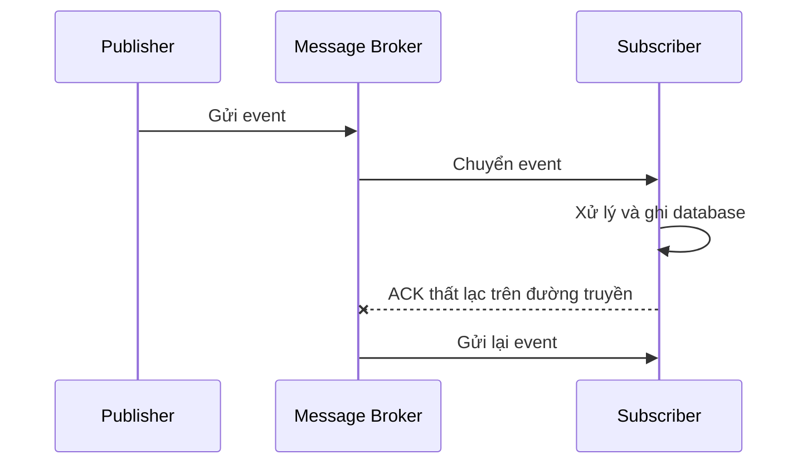

# 📨 Message Delivery Semantics: at-most-once, at-least-once và exactly-once

> Nguồn: `014-Message-Delivery-Semantics-in-Event-Driven-Architecture.txt` · [Udemy](https://ua.udemy.com/course/the-complete-microservices-event-driven-architecture/learn/lecture/38247988)

Chủ đề của bài này là **message delivery semantics (ngữ nghĩa giao nhận thông điệp)** trong microservices và event-driven architecture — một khái niệm ít được nói tới nhưng lại quyết định hệ thống của các bạn có mất dữ liệu hay không. Chúng ta sẽ bắt đầu từ vấn đề với request-response đơn giản, mở rộng sang EDA, rồi lần lượt mổ xẻ ba ngữ nghĩa: **at-most-once**, **at-least-once** và **exactly-once** — kèm cả những hiểu lầm phổ biến về cái cuối cùng.

---

### ⚠️ Vấn đề: khi phản hồi thất lạc

Hãy tưởng tượng giao tiếp đơn giản giữa hai microservices. Trong điều kiện bình thường: sender gửi request cho receiving service; service nhận request, xử lý, cập nhật database và gửi response về cho sender. Mọi thứ thật dễ dàng — cho tới khi có sự cố.

Có những tình huống sender **không bao giờ nhận được response**:

* Receiver **chưa từng nhận được request**, hoặc đã nhận nhưng **crash ngay trước khi xử lý thành công**.
* Receiver **đã xử lý thành công và lưu vào database**, nhưng **response bị thất lạc** trên đường về sender.

Vấn đề nằm ở chỗ: **từ góc nhìn của sender, ta không thể phân biệt hai trường hợp này**. Vậy nên làm gì? Gửi lại request và chấp nhận rủi ro receiver nhận cùng một message hai lần? Hay không gửi lại và chấp nhận rủi ro mất dữ liệu?

Trong event-driven architecture, vấn đề giao event cũng tương tự nhưng **phức tạp hơn nhiều** vì có **ba nhân vật**: publisher, message broker và subscriber/consumer. Từng chặng đều có thể đứt gãy:

1. Publisher tạo event cho broker nhưng **request bị mất trên mạng**; hoặc broker nhận và lưu event vào log nhưng **acknowledgement gửi về producer bị mất**.
2. Broker gửi event cho subscriber nhưng subscriber **không nhận được**, hoặc nhận rồi **crash ngay trước khi xử lý**; hoặc subscriber **xử lý thành công** nhưng **acknowledgement bị mất** trên mạng.

Vì vậy, để xử lý tình trạng này, **publisher, message broker và subscriber phải thống nhất trước về delivery semantics của event**. Một điểm quan trọng: các khái niệm trong bài này là **phổ quát, không gắn với bất kỳ công nghệ message broker cụ thể nào** — tuy nhiên cấu hình và mức bảo đảm cụ thể sẽ khác nhau giữa các công nghệ.

---

### 🏃 At-most-once: chấp nhận mất dữ liệu để đổi lấy tốc độ

Với **at-most-once (giao nhiều nhất một lần)**, chúng ta chấp nhận **có thể mất dữ liệu** nhưng muốn **tránh hoàn toàn trùng lặp event**. Cách cấu hình:

* **Phía publisher:** nếu không nhận được acknowledgement từ broker thì **không gửi lại event**. Trường hợp tốt nhất — event đã tới broker nhưng ack thất lạc — ta không mất gì; nhưng nếu broker chưa nhận request, hoặc crash trước khi lưu event, **event đó mất vĩnh viễn**.
* **Phía subscriber:** **acknowledge trước khi xử lý** hoặc lưu event vào database. Nhờ vậy, nếu consumer crash rồi khởi động lại **sau khi đã xử lý**, mọi thứ vẫn ổn vì event đã được xử lý xong. Nhưng nếu nó crash và restart **sau khi đã ack, trước khi kịp xử lý**, subscriber sẽ **không bao giờ nhận lại event đó** — coi như mất.

Ngữ nghĩa này phù hợp với những tình huống **mất một ít dữ liệu là chấp nhận được** và ta có thể **suy ra (extrapolate) thông tin cần thiết từ các event khác**. Ví dụ: nếu là **dịch vụ ride-sharing (chia sẻ xe)**, mỗi tài xế gửi cập nhật vị trí được lưu thành event trong broker — mất vài event vị trí là chuyện nhỏ, nhưng lưu hoặc xử lý trùng một cập nhật vị trí thì chỉ **tốn tài nguyên vô ích**.

Đổi lại, đây là ngữ nghĩa có **overhead thấp nhất và độ trễ thấp nhất**. Với bài toán xử lý thời gian thực như **log hay metric từ hàng trăm cloud server**, đây là lựa chọn **tiết kiệm chi phí nhất**.

---

### 🔁 At-least-once: không bao giờ mất, đôi khi trùng

**At-least-once (giao ít nhất một lần)** là ngữ nghĩa chúng ta thống nhất rằng: nếu publisher **không nhận được acknowledgement trong một khoảng thời gian nhất định**, nó sẽ **gửi lại event** cho broker. Điều này bảo đảm **không bao giờ mất event**, nhưng có thể khiến cùng một event **được lưu trong broker nhiều hơn một lần**.

* **Phía subscriber:** cấu hình để **xử lý event trước**, và chỉ sau khi xong mới **gửi acknowledgement** về broker. Nếu subscriber nhận event nhưng crash trước khi xử lý và lưu, sau khi khởi động lại nó sẽ **nhận lại chính event đó**, xử lý lần nữa rồi mới ack. Khi broker nhận được ack, nó sẽ **không giao event đó cho subscriber này nữa**.
* Tuy nhiên, nếu subscriber crash **ngay sau khi xử lý nhưng trước khi gửi ack**, hoặc **ack bị mất trên mạng**, broker sẽ **gửi lại event sau khi subscriber restart** — dẫn tới **xử lý trùng**, đổi lại **event không bao giờ bị mất**.

Ngữ nghĩa này cực hợp với những use case mà **không giao event có thể mất dữ liệu quý giá**, nhưng **trùng lặp ở mức nào đó là chấp nhận được**:

* Gửi **push notification** cho người dùng về việc đơn hàng đã được vận chuyển: hiếm hoi lắm mới đẩy trùng một thông báo thì không sao, nhưng nhất định phải thông báo **ít nhất một lần**.
* Người dùng **để lại đánh giá sản phẩm**: vì đánh giá gắn với người dùng và hệ thống đã có logic chỉ cho phép đánh giá một lần cho mỗi sản phẩm, đánh giá trùng sẽ **bị ghi đè hoặc bỏ qua**.

Bên cạnh nguy cơ trùng lặp, ngữ nghĩa này còn một nhược điểm nữa: **tăng độ trễ**. Publisher phải **chờ một khoảng thời gian** trước khi có thể gửi lại event — có thể tính bằng **mili giây hoặc thậm chí vài giây**, tùy cấu hình. Tương tự, broker phải **chờ và cho subscriber thời gian gửi ack** trước khi kết luận subscriber đã crash hoặc ack bị mất. Chính vì độ trễ cộng thêm này, at-least-once **không phải lựa chọn tốt cho hệ thống thời gian thực hoặc lưu lượng cao**.

---

### 💯 Exactly-once: khát vọng và cái bẫy phía subscriber

**Exactly-once (giao đúng một lần)** là ngữ nghĩa **đáng mơ ước nhất**, đặc biệt với các use case **giao dịch tài chính**. Đáng tiếc: đây là ngữ nghĩa **khó đạt được nhất**, có **overhead và độ trễ cao nhất**. Đáng lưu ý thêm: **không phải công nghệ message broker nào cũng hỗ trợ**, và những cái hỗ trợ đôi khi **không làm đúng như kỳ vọng**. Vì vậy, dù chọn công nghệ nào, hãy **đọc tài liệu thật kỹ** — nhất là khi xử lý dữ liệu ảnh hưởng tài chính.

Ý tưởng chung để đạt exactly-once diễn ra như sau:

1. **Phía publisher:** trước khi gửi event, cần lấy một **idempotency ID (mã bất biến) hoặc số thứ tự duy nhất (unique sequence number)**. Một số broker tự sinh giúp ta; trường hợp khác ta phải dùng service riêng. Mục đích là có **định danh duy nhất gửi kèm event**.
2. Nếu publisher gửi event mà không nhận được ack, nó áp dụng đúng quy trình của at-least-once: **gửi lại event với cùng ID đó**.
3. Nếu **chính broker** là bên cấp ID, nó sẽ **kiểm tra xem event với ID đó đã có trong log chưa**: nếu có thì bỏ qua, nếu chưa thì thêm vào. Vậy là ta đạt exactly-once **ở phía producer**: không mất event, không sinh event trùng.

Vấn đề nằm ở **phía subscriber**. Xét tình huống điển hình: subscriber nhận một event tài chính (ví dụ **billing event** hoặc **giao dịch chuyển tiền**), cần **xử lý trước** (validation, tính toán...) rồi **lưu vào database**. Khi việc đăng ký event bao gồm **cập nhật trạng thái nằm ngoài message broker**, thì **broker không thể bảo đảm hơn mức at-least-once** — kể cả khi nó quảng cáo hỗ trợ exactly-once.

Cụ thể: subscriber nhận event, xử lý, lưu database, rồi gửi ack. Nếu nó **crash sau khi lưu nhưng trước khi gửi ack**, broker sẽ tiếp tục chờ; hết thời gian chờ, broker **mặc định event chưa được giao** và gửi lại **khi subscriber restart hoặc một instance mới được khởi động** — thế là event bị xử lý hai lần. Cách chặn đứng sự trùng lặp này: **tự tay thêm idempotency ID vào bản ghi event trong database của mình**; nếu cùng event được xử lý lại, ta **chủ động từ chối theo lập trình** khi thấy ID đó đã tồn tại.

*Điểm mình muốn nhấn mạnh:* việc này chúng ta **phải tự làm**, message broker **không thể làm giúp** để đạt exactly-once. Các bạn có thể **tận dụng chính idempotency ID đi kèm event từ broker**.

| Tiêu chí | At-most-once | At-least-once | Exactly-once |
|---|---|---|---|
| Mất dữ liệu | Có thể mất | Không bao giờ mất | Không bao giờ mất |
| Trùng lặp | Không bao giờ trùng | Có thể trùng | Không trùng |
| Độ trễ / overhead | Thấp nhất | Tăng (chờ ack, retry) | Cao nhất |
| Phù hợp | Location update, log/metric thời gian thực | Push notification, review, dữ liệu quý không được mất | Giao dịch tài chính (kèm kiểm tra idempotency) |

---

### 🎯 Tự kiểm tra nhanh

**Câu 1:** Vì sao sender không thể biết request đã được xử lý hay chưa khi không nhận được phản hồi?

<b>Xem đáp án</b>

**Đáp án:** Vì hai tình huống — receiver chưa từng nhận request hoặc crash trước khi xử lý, và receiver đã xử lý thành công nhưng response thất lạc — trông giống hệt nhau từ góc nhìn của sender.

Giải thích: Chính sự nhập nhằng này buộc ta phải chọn giữa gửi lại (nguy cơ trùng) và không gửi lại (nguy cơ mất).

Tham chiếu: Mục Vấn đề: khi phản hồi thất lạc.

**Câu 2:** Trong at-most-once, subscriber ack trước hay xử lý trước, và hệ quả là gì?

<b>Xem đáp án</b>

**Đáp án:** Ack trước khi xử lý; nếu crash sau khi ack nhưng trước khi xử lý thì event bị mất vĩnh viễn, đổi lại không bao giờ có trùng lặp.

Giải thích: Đây là ngữ nghĩa có overhead và độ trễ thấp nhất, hợp với dữ liệu chấp nhận mất như vị trí tài xế hay log/metric.

Tham chiếu: Mục At-most-once: chấp nhận mất dữ liệu để đổi lấy tốc độ.

**Câu 3:** Vì sao at-least-once làm tăng độ trễ?

<b>Xem đáp án</b>

**Đáp án:** Publisher phải chờ một khoảng thời gian trước khi gửi lại event, và broker cũng phải chờ subscriber gửi ack trước khi kết luận sự cố.

Giải thích: Thời gian chờ có thể tính bằng mili giây đến vài giây tùy cấu hình, nên không hợp với hệ thống thời gian thực/lưu lượng cao.

Tham chiếu: Mục At-least-once: không bao giờ mất, đôi khi trùng.

**Câu 4:** Phía producer đạt exactly-once nhờ cơ chế nào?

<b>Xem đáp án</b>

**Đáp án:** Gửi kèm một idempotency ID hoặc unique sequence number; khi gửi lại thì dùng đúng ID cũ, broker kiểm tra log và bỏ qua nếu ID đã tồn tại.

Giải thích: Cách này bảo đảm không mất event và không sinh event trùng ở phía producer.

Tham chiếu: Mục Exactly-once: khát vọng và cái bẫy phía subscriber.

**Câu 5:** Vì sao broker không thể bảo đảm exactly-once ở phía subscriber, và ta khắc phục thế nào?

<b>Xem đáp án</b>

**Đáp án:** Vì subscriber còn cập nhật trạng thái ngoài broker (xử lý rồi lưu database); nếu crash sau khi lưu trước khi ack, event sẽ được gửi lại. Ta tự thêm idempotency ID vào bản ghi event trong database và từ chối các bản ghi trùng.

Giải thích: Việc chống trùng này là trách nhiệm của chúng ta, broker không làm thay được; có thể tận dụng ID đi kèm event từ broker.

Tham chiếu: Mục Exactly-once: khát vọng và cái bẫy phía subscriber.

---

Tóm lại, bài này đã trang bị cho các bạn ba ngữ nghĩa giao nhận: **at-most-once** đơn giản nhất, có thể mất dữ liệu nhưng không bao giờ trùng, độ trễ và overhead thấp nhất; **at-least-once** phức tạp hơn, tốn thêm độ trễ nhưng bảo đảm không mất event, đổi lại có thể xử lý trùng; và **exactly-once** — đắt đỏ nhất, cũng là thứ khó đạt được nhất — nơi phía subscriber bắt buộc phải tự xử lý idempotency nếu muốn tránh trùng lặp. Hãy nhớ: **thiết kế hệ thống ngay từ đầu để xử lý việc giao event không đáng tin cậy** sẽ tiết kiệm cho các bạn rất nhiều đau đầu về sau. Hẹn gặp lại các bạn ở bài tiếp theo! 🚀
