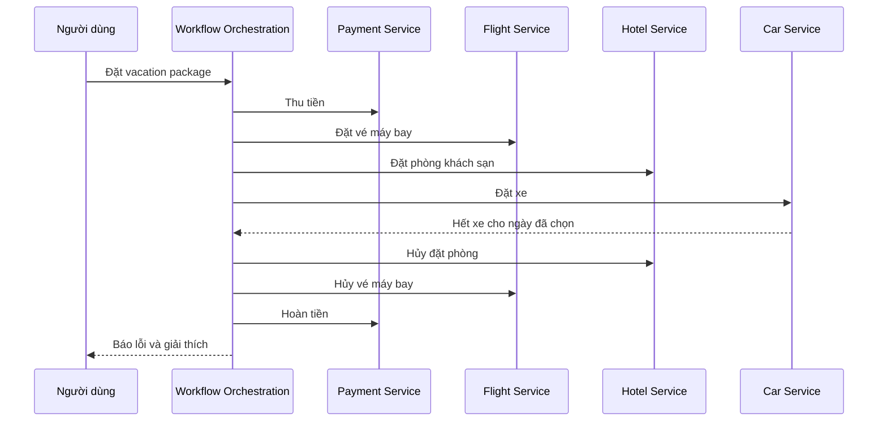

# 🧩 Saga Pattern: Distributed Transaction cho kiến trúc microservices

> Nguồn: `015-Saga-Pattern.txt` · [Udemy](https://ua.udemy.com/course/the-complete-microservices-event-driven-architecture/learn/lecture/38247974)

Chào mừng các bạn đến với pattern đầu tiên trong nhóm design pattern kết hợp microservices với event-driven architecture: **saga pattern**. Đây là một trong những pattern quan trọng nhất của khóa học, bởi nó giải quyết bài toán đau đầu nhất khi rời bỏ monolith — làm sao giữ tính nguyên tử của giao dịch khi dữ liệu đã nằm rải rác ở nhiều service. Chúng ta sẽ đi từ vấn đề, tới định nghĩa pattern, rồi mổ xẻ hai cách hiện thực nó.

---

### 🗄️ Mất ACID transaction khi tách database

Nhắc lại một nguyên lý nền tảng của microservices: **one database per microservice (mỗi microservice sở hữu một database riêng)**. Chính sự tách biệt này giúp **decouple team và codebase** của từng microservice trong công ty. Database trở thành **chi tiết hiện thực (implementation detail)** của team đó và không được phơi ra ngoài cho các microservice khác dưới bất kỳ hình thức nào. Nhờ vậy, mỗi team có thể chọn đúng công nghệ database cho workload của mình, và quan trọng hơn — **thay đổi, cải tiến database mà không cần thông báo hay phối hợp với bất kỳ ai**.

Nhưng như chúng ta đều biết, **mọi thứ trong software architecture đều là trade-off**. Sự decoupling này mang theo một vấn đề mới: khi còn là monolith với tất cả dữ liệu trong một database, ta có thể **sửa nhiều nguồn dữ liệu một cách nguyên tử (atomically) trong cùng một transaction** — **ACID transaction guarantees** (Atomicity, Consistency, Isolation, Durability) bảo đảm với người quan sát bên ngoài, chuỗi thao tác trông như một thao tác duy nhất, dù liên quan tới nhiều bản ghi ở nhiều bảng khác nhau. Chuyển sang microservices, ta **không còn một database duy nhất**, và mỗi thao tác do **một microservice riêng đảm nhiệm**, chỉ biết phần việc của mình.

Vậy làm sao thực hiện một giao dịch trải dài nhiều microservice và nhiều database? Đó chính là lúc **saga pattern** xuất hiện.

---

### 🧩 Saga pattern: local transaction và compensating operation

**Saga pattern giúp chúng ta thực hiện distributed transaction (giao dịch phân tán) trải trên nhiều microservice và database.** Cơ chế cốt lõi:

1. Các thao tác riêng lẻ của giao dịch được thực hiện như **một chuỗi local transaction (giao dịch cục bộ) trong từng database**.
2. **Mỗi thao tác thành công sẽ kích hoạt thao tác kế tiếp** trong chuỗi.
3. Nếu một thao tác thất bại, saga **rollback các thao tác trước đó** bằng cách áp dụng **compensating operation (thao tác bù trừ)** — tức thao tác có **hiệu ứng ngược lại** với thao tác gốc.

Về cơ bản, có **hai cách hiện thực**: dùng **stateful workflow management service (service quản lý luồng nghiệp vụ có trạng thái)** điều phối toàn bộ giao dịch, hoặc dùng **mô hình event-driven thuần** — loại bỏ service điều phối và giao việc quản lý luồng cho chính các microservice. Chúng ta sẽ đi vào từng cách với cùng một ví dụ xuyên suốt.

---

### 🎛️ Cách 1 — Orchestration với workflow service

Hãy lấy ví dụ một **dịch vụ đặt kỳ nghỉ (vacation booking)** bán các gói vacation package, gồm **vé máy bay khứ hồi** tới điểm đến, **đặt phòng khách sạn** và **thuê xe** cho đúng các ngày đã chọn. Đây là ví dụ hoàn hảo cho một transaction vì chỉ có hai kịch bản được phép: hoặc **tất cả thành phần đều được đặt và thanh toán** (giao dịch thành công), hoặc **chỉ cần một phần thất bại là toàn bộ giao dịch bị hủy**.

Trong kiến trúc microservices của dịch vụ này, ta có các service: **payment service, flight reservation service, hotel booking service, car rental service và order service**.

Cách hiện thực với workflow management service gồm ba bước: định nghĩa thứ tự workflow trong workflow orchestration service — các thao tác còn được gọi là **activities**; hiện thực workflow operation để gọi API của microservice tương ứng; và hiện thực compensating operation để gọi API (cùng hoặc khác API tùy thao tác) của các service đó.

Với vacation package, thứ tự activity và compensating operation tương ứng:

| Activity | Compensating operation |
|---|---|
| Thu tiền toàn bộ kỳ nghỉ | Hoàn tiền về tài khoản/thẻ đúng số tiền |
| Đặt vé máy bay đi và về theo chỗ ngồi ưa thích | Hủy cả hai chuyến |
| Đặt phòng khách sạn | Hủy đặt phòng |
| Đặt xe theo đúng ngày | Hủy đặt xe |
| Thêm order entry cho người dùng | Cập nhật order sang trạng thái cancelled |

Activity cuối cùng vẫn nên có compensating operation — phòng khi tương lai thêm thao tác mới vào sau bước này.

Khi người dùng đặt kỳ nghỉ: request đi qua web app service (hiển thị lựa chọn, nhắc nhập ngày và chi tiết) → khi submit, request qua API gateway tới **workflow orchestration service** để chạy workflow từng bước. Nếu mọi thứ suôn sẻ: người dùng bị trừ tiền, vé được đặt, khách sạn được giữ, xe được thu xếp, order service được cập nhật, và orchestration service trả xác nhận cho người dùng.

Còn nếu có sự cố? Giả sử khi orchestration service gọi tới car rental service thì công ty cho thuê đã **hết xe cho địa điểm và ngày đó** — lúc này người dùng **đã bị tính tiền toàn bộ kỳ nghỉ**, vé máy bay và khách sạn **cũng đã được đặt**. Service điều phối sẽ **hủy các đặt chỗ** với hotel reservation service và flight service, **hoàn lại toàn bộ tiền** vào thẻ tín dụng, rồi gửi **thông báo lỗi** kèm giải thích cho người dùng.

---

### 🔄 Cách 2 — Choreography thuần event-driven

Cách thứ hai để hiện thực saga là dùng **mô hình event-driven thuần**: **loại bỏ workflow orchestration service** và **giao toàn bộ việc quản lý workflow cho chính các microservice**. Để bù cho sự biến mất của service điều phối, giao tiếp giữa các microservice được thực hiện **bất đồng bộ qua event publish lên message broker**. Mỗi microservice phải **biết vai trò của mình trong workflow**: khi thao tác thành công thì gửi event đi đâu, khi thất bại thì gửi event đi đâu, và cần kích hoạt compensating operation cho service đứng trước trong chuỗi như thế nào.

Quay lại ví dụ vacation booking, luồng thành công diễn ra như sau: người dùng đặt kỳ nghỉ → request đi **thẳng tới payment service** (vì workflow giờ bất đồng bộ) và service này **phản hồi ngay lập tức**; payment service trừ tiền rồi **phát event** vào message broker; flight reservation service nhận event, đặt vé và **phát event vào topic mà hotel reservation service đã subscribe**; chuỗi tiếp tục cho tới khi **order service** cập nhật database của mình. Vì mọi thứ bất đồng bộ, phản hồi **thành công hay thất bại cũng phải bất đồng bộ**: publish event tới **notification service** để thông báo qua email hoặc push notification.

Còn khi cần rollback? Giả sử thu tiền, đặt vé và đặt khách sạn đều thành công, nhưng car reservation service **không thể đặt xe**: car service **phát event báo thất bại**; **hotel reservation service** đang subscribe topic đó sẽ **hủy đặt phòng** rồi phát event vào topic mà flight service đã subscribe; **flight reservation service** hủy vé rồi phát event để **payment service** nhận; payment service hoàn tiền và phát event tới topic của **notification service** báo giao dịch thất bại; cuối cùng notification service thông báo cho người dùng đầy đủ chi tiết và các bước tiếp theo.

| Tiêu chí | Orchestration | Choreography |
|---|---|---|
| Trung tâm điều phối | Có — workflow service stateful | Không — các service tự điều phối |
| Giao tiếp | Orchestrator gọi API theo thứ tự định sẵn | Bất đồng bộ qua event và message broker |
| Độ coupling | Orchestrator gắn chặt với mọi service | Mỗi service chỉ cần biết topic nhận/gửi |
| Rollback | Orchestrator gọi compensating operation theo thứ tự ngược | Chuỗi event ngược dần qua từng service |

---

### 🎯 Tự kiểm tra nhanh

**Câu 1:** Khi chuyển từ monolith sang microservices, chúng ta mất bảo đảm gì và vì sao?

<b>Xem đáp án</b>

**Đáp án:** Mất khả năng sửa nhiều nguồn dữ liệu một cách nguyên tử trong một ACID transaction, vì không còn một database duy nhất và mỗi thao tác do một microservice riêng đảm nhiệm.

Giải thích: Module hóa không thể thay thế bảo đảm giao dịch xuyên database khi dữ liệu bị tách ra.

Tham chiếu: Mục Mất ACID transaction khi tách database.

**Câu 2:** Saga thực hiện "giao dịch phân tán" theo cơ chế nào?

<b>Xem đáp án</b>

**Đáp án:** Chia giao dịch thành chuỗi local transaction ở từng database; thao tác thành công kích hoạt thao tác kế tiếp, còn khi thất bại thì rollback bằng các compensating operation có hiệu ứng ngược lại, áp dụng theo thứ tự đảo ngược.

Giải thích: Không có transaction xuyên service — saga chỉ có chuỗi giao dịch cục bộ và bù trừ.

Tham chiếu: Mục Saga pattern: local transaction và compensating operation.

**Câu 3:** Trong ví dụ vacation booking, compensating operation cho từng activity là gì?

<b>Xem đáp án</b>

**Đáp án:** Hoàn tiền cho người dùng, hủy cả hai chuyến bay, hủy đặt phòng khách sạn, hủy đặt xe, và cập nhật order sang trạng thái cancelled.

Giải thích: Mỗi thao tác thành công đều cần một thao tác bù trừ để có thể undo khi giao dịch thất bại.

Tham chiếu: Mục Cách 1 — Orchestration với workflow service.

**Câu 4:** Trong choreography, các microservice "biết vai trò của mình" nghĩa là gì?

<b>Xem đáp án</b>

**Đáp án:** Mỗi service biết khi thành công thì gửi event tới đâu, khi thất bại thì gửi event tới đâu, và phải kích hoạt compensating operation cho service đứng trước trong chuỗi.

Giải thích: Không có orchestrator nên trách nhiệm điều phối được phân tán về từng service qua event.

Tham chiếu: Mục Cách 2 — Choreography thuần event-driven.

**Câu 5:** Vì sao trong choreography, phản hồi cho người dùng cũng phải bất đồng bộ?

<b>Xem đáp án</b>

**Đáp án:** Vì toàn bộ workflow chạy bất đồng bộ qua event nên kết quả thành công/thất bại chỉ có thể tới người dùng qua một event gửi tới notification service (email hoặc push notification).

Giải thích: Payment service đã phản hồi người dùng ngay khi nhận đơn, trước khi biết kết quả cuối cùng.

Tham chiếu: Mục Cách 2 — Choreography thuần event-driven.

---

Tóm lại, saga pattern là câu trả lời của microservices cho bài toán mất ACID transaction: thay vì một giao dịch lớn xuyên database, ta dùng **chuỗi thao tác thành công nối tiếp nhau** và **chuỗi compensating operation chạy theo thứ tự ngược lại khi thất bại**. Hai cách hiện thực — **orchestration** với workflow service stateful, và **choreography** thuần event-driven — có trade-off riêng về độ tập trung và độ coupling; các bạn sẽ gặp lại chúng trong rất nhiều hệ thống thực tế. Hẹn gặp lại ở bài sau, nơi chúng ta khám phá **CQRS**. 🚀
