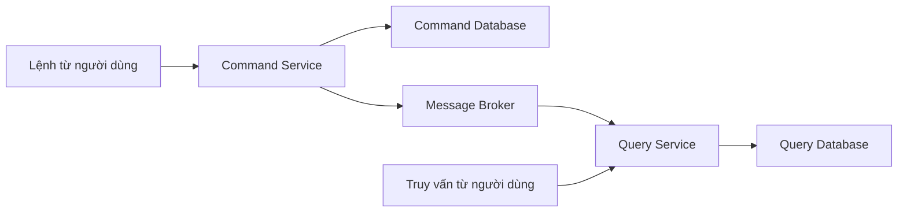

# 🔀 CQRS Pattern: Tách lệnh và truy vấn để đọc ghi đều nhanh

> Nguồn: `016-CQRS-Pattern.txt` · [Udemy](https://ua.udemy.com/course/the-complete-microservices-event-driven-architecture/learn/lecture/38247976)

Tiếp nối saga, bài này chúng ta đến với một pattern cực kỳ mạnh khác khi kết hợp microservices với event-driven architecture: **CQRS (Command Query Responsibility Segregation — tách trách nhiệm giữa lệnh và truy vấn)**. Mình sẽ giới thiệu pattern, hai nhóm use case mà nó tỏa sáng trong các hệ thống lớn, và khép lại bằng một ví dụ thực chiến — kèm một "caveat" mà các bạn nhất định phải nhớ.

---

### 🧩 Command và query: hai loại thao tác trên dữ liệu

Trong một hệ thống điển hình có dữ liệu lưu trong database, mọi thao tác trên dữ liệu có thể gom thành **hai loại**:

* **Command (lệnh):** là hành động **làm thay đổi dữ liệu** trong hệ thống. Nhóm này gồm:
  * **Chèn bản ghi mới** — ví dụ thêm người dùng mới.
  * **Cập nhật bản ghi** — ví dụ sửa đánh giá sản phẩm, đổi số điện thoại người dùng.
  * **Xóa bản ghi** — ví dụ người dùng xóa bình luận của mình trên mạng xã hội.
* **Query (truy vấn):** khác với command, query **chỉ đọc dữ liệu** mà không thay đổi gì. Hệ thống có thể trả dữ liệu nguyên trạng hoặc thực hiện **biến đổi đơn giản** như sắp xếp, tổng hợp — nhưng database **không bao giờ thay đổi vì query**. Ví dụ: yêu cầu hiển thị tất cả sản phẩm trong một danh mục, sắp xếp theo bảng chữ cái.

**CQRS** chính là việc **tách rời (segregate) code và storage** cho phần command khỏi phần query:

* Mọi thay đổi dữ liệu đi qua **command service** tới **command database**.
* Mọi truy vấn đi qua **query service** tới **query database** — nơi chứa **một bản sao dữ liệu** của command database.

Vậy làm sao giữ hai database đồng bộ? Câu trả lời quen thuộc: **event-driven architecture**. Tất cả những gì cần làm là **thêm một message broker giữa command service và query service**: mỗi khi command service nhận request thay đổi dữ liệu trong database của mình, nó cũng **phát một event** vào broker; query service tiêu thụ event đó và **cập nhật database của mình với dữ liệu mới**.

---

### 🎯 Lợi ích thứ nhất: tách mối quan tâm và tối ưu đọc/ghi

**Use case lớn thứ nhất của CQRS là tách mối quan tâm (separation of concerns) giữa hai loại workload — về cả business logic lẫn hiệu năng.**

Về nghiệp vụ, pattern này **khớp hoàn hảo với single responsibility principle**:

* Toàn bộ độ phức tạp của việc **quản lý quyền ghi, kiểm tra dữ liệu đầu vào và business logic** nằm ở **command service**.
* **Query service** được giữ **sạch, đơn giản**, chỉ tập trung vào cách trình bày dữ liệu tốt nhất cho người dùng.
* Việc tách mối quan tâm này cho phép **tiến hóa độc lập từng phần**, dùng **data model tối ưu trong ngôn ngữ lập trình cho từng workload**.
* Và nếu chỉ một phần — ví dụ command service — được cập nhật logic nghiệp vụ/validation mới, thì **phía query không phải test lại hay deploy lại** vì nó không thay đổi.

Về hiệu năng, lợi ích còn quan trọng hơn:

* Mọi thao tác command làm thay đổi dữ liệu đều đi vào command database, nên ta có thể dùng **cấu trúc, schema và công nghệ database tối ưu nhất cho ghi (write operations)**.
* Mọi truy vấn đi vào query database, nên có thể tổ chức dữ liệu để **truy vấn hiệu quả**, chọn **công nghệ và cấu hình database tối ưu cho workload đọc (read intensive)** — vốn thường rất khác với workload ghi.
* Nói cách khác, ta **tối ưu được cho cả hai loại thao tác** — điều **bất khả thi nếu chỉ có một database chung** cho cả command lẫn query.

Về **scalability**, CQRS cũng mở ra nhiều lợi ích: ta có thể **điều chỉnh số instance của từng microservice theo lưu lượng của nó**, và vì đang làm việc với database phân tán, cũng có thể **điều chỉnh số instance database** cho từng database tùy theo tốc độ thao tác của mỗi loại.

---

### 🍣 Lợi ích thứ hai: join view và ví dụ thực chiến

**Use case lớn thứ hai của CQRS là giải bài toán mất khả năng join dữ liệu từ nhiều nguồn** — hệ quả của nguyên lý one database per microservice.

Khi tất cả bảng dữ liệu nằm trong một relational database, việc join giữa nhiều bảng khá dễ dàng. Nhưng khi đã tách monolith thành các microservice với database riêng, ta **không còn lựa chọn đó**:

1. Muốn join dữ liệu, trước tiên phải **gọi API của từng microservice** liên quan.
2. Mỗi microservice lấy dữ liệu từ database của nó và trả về cho bên gọi.
3. Sau khi **parse và format** dữ liệu từ các microservice khác nhau, ta mới **join bằng code** thành một view duy nhất.

Thao tác join bằng code này có thể **rất khó, dễ lỗi và quan trọng nhất là rất chậm**. Và đương nhiên, mức overhead đó **không thể chấp nhận được nếu phải hiển thị cho người dùng trên trình duyệt hay ứng dụng di động**. Giải pháp theo đúng pattern CQRS: tạo một **microservice mới với database tối ưu cho đọc**. Service này chỉ nhận **query request** cho đúng nhóm dữ liệu cần hiển thị; trong database của nó, ta lưu một **join view** của dữ liệu từ cả hai microservice, được format theo cách **tối ưu cho việc đọc/truy vấn**. Để tạo và cập nhật view này, ta thêm **message broker** mà cả **microservice A** lẫn **microservice B** đều có thể publish event mỗi khi dữ liệu của chúng thay đổi:

* Khi dữ liệu ở microservice A thay đổi, A **publish event** vào broker; query service nhận và **cập nhật join view** với dữ liệu mới.
* Nếu request thay đổi dữ liệu đi vào microservice B, B cũng publish event sau khi cập nhật database của mình; query service tiêu thụ và cập nhật view tương ứng.

Kết quả: mọi truy vấn cần join view từ A và B đều **đi thẳng tới query service**, và service này trả về gần như nguyên trạng, chỉ formatting/lọc tối thiểu. **Mức tăng hiệu năng cho người dùng — hoặc bất kỳ service nào gọi API của query service — là rất đáng kể.**

Giờ hãy áp dụng vào một ví dụ thực tế: một **dịch vụ review cộng đồng** cho các doanh nghiệp như nhà hàng, tiệm bánh, đại lý ô tô, tiệm làm tóc... Người dùng ăn ở quán sushi có thể để lại **đánh giá và chấm điểm**; sau đó bất kỳ ai cũng có thể tìm kiếm "quán sushi ở khu vực X" và hệ thống trả về danh sách nhà hàng **sắp xếp theo số lượng review, điểm trung bình và mức liên quan tới từ khóa tìm kiếm**.

Giả sử phân rã theo domain (decomposition by domain), kiến trúc ban đầu có những vấn đề và yêu cầu xung đột nhau:

* **Phía command:** các quy tắc nghiệp vụ rất chặt — chỉ **chủ doanh nghiệp đã xác minh** mới được cập nhật website, địa chỉ, số điện thoại... Review service cũng đầy validation: **xác thực người dùng để chặn bot đánh giá giả**, kiểm tra người dùng **chưa từng đánh giá doanh nghiệp này gần đây** (nếu có thì gợi ý cập nhật review cũ thay vì tạo mới), xác thực nội dung và số sao hợp lệ. Về lưu lượng: thông tin doanh nghiệp **ít khi thay đổi**, nhưng review **đổ về hàng ngày** — nên review service cần schema và công nghệ database **tối ưu cho ghi**.
* **Phía query:** khi người dùng tìm quán sushi hay tiệm bánh vegan, ta cần **join dữ liệu từ cả business service lẫn review service** — business service phải trả về mọi doanh nghiệp khớp truy vấn, rồi ta phải lấy toàn bộ rating của từng doanh nghiệp để tính toán và sắp xếp. Thao tác này **cực kỳ chậm và kém hiệu quả**.

Giải pháp CQRS: thêm một service mới gọi là **Business Search Service**, sở hữu **database tối ưu cho đọc với text search engine chuyên dụng cho truy vấn văn bản**.

* Mọi thao tác **thêm mới hoặc cập nhật doanh nghiệp** ở business service được publish thành event tới business search service; service này **đánh index tên, mô tả và metadata** rồi đưa vào database của mình.
* Mỗi khi một **review được submit và duyệt** ở review service, nó cũng được publish thành event tới topic tương ứng trong message broker; business search service **join review đó với doanh nghiệp tương ứng và tính lại điểm trung bình mới**.

Khi đó, mọi search request đi qua phần query tới **business search service** — service này **hoàn toàn không có validation, authentication hay business logic phức tạp**. Nó chỉ parse và format request, đưa vào text search database, rồi trả về danh sách doanh nghiệp **sắp xếp theo độ liên quan với truy vấn và theo rating dựa trên một công thức định trước**.

**Một caveat quan trọng:** với CQRS, chúng ta chỉ có thể bảo đảm **eventual consistency (nhất quán cuối cùng)** giữa thao tác ghi và thao tác đọc. Nghĩa là trong khoảng thời gian giữa lúc dữ liệu thay đổi ở command database và lúc query database được cập nhật, **một số truy vấn sẽ nhìn thấy dữ liệu cũ**. Tùy use case, điều này có thể chấp nhận được — hoặc không.

| Tiêu chí | Command | Query |
|---|---|---|
| Bản chất | Thay đổi dữ liệu | Chỉ đọc dữ liệu |
| Ví dụ | Thêm user, sửa review, xóa comment | Danh sách sản phẩm theo danh mục, sắp xếp A-Z |
| Hạ tầng đi kèm | Command service + command database tối ưu cho ghi | Query service + query database tối ưu cho đọc |

---

### 🎯 Tự kiểm tra nhanh

**Câu 1:** Command và query khác nhau ở điểm nào?

<b>Xem đáp án</b>

**Đáp án:** Command là hành động làm thay đổi dữ liệu (insert, update, delete); query chỉ đọc dữ liệu, có thể biến đổi đơn giản như sắp xếp/tổng hợp nhưng không làm dữ liệu trong database thay đổi.

Giải thích: Đây là hai loại workload có đặc tính và yêu cầu tối ưu hoàn toàn khác nhau.

Tham chiếu: Mục Command và query: hai loại thao tác trên dữ liệu.

**Câu 2:** CQRS giữ command database và query database đồng bộ bằng cách nào?

<b>Xem đáp án</b>

**Đáp án:** Thêm message broker giữa command service và query service: mỗi khi command service thay đổi dữ liệu, nó publish event; query service tiêu thụ event và cập nhật database của mình.

Giải thích: Chính event-driven architecture là cơ chế đồng bộ hai phía của CQRS.

Tham chiếu: Mục Command và query: hai loại thao tác trên dữ liệu.

**Câu 3:** CQRS mang lại lợi ích gì về hiệu năng so với một database chung?

<b>Xem đáp án</b>

**Đáp án:** Cho phép chọn schema, cấu trúc và công nghệ database tối ưu riêng cho write và cho read — điều bất khả thi khi chỉ có một database phục vụ cả hai.

Giải thích: Ngoài ra còn điều chỉnh instance từng service/database theo lưu lượng từng loại thao tác.

Tham chiếu: Mục Lợi ích thứ nhất: tách mối quan tâm và tối ưu đọc/ghi.

**Câu 4:** CQRS giải bài toán join dữ liệu giữa các microservice như thế nào?

<b>Xem đáp án</b>

**Đáp án:** Tạo query service với database tối ưu cho đọc và lưu join view của dữ liệu từ nhiều microservice; các microservice publish event khi dữ liệu thay đổi để query service cập nhật view, nhờ đó truy vấn không phải join bằng code chậm và dễ lỗi.

Giải thích: Ví dụ business search service join dữ liệu doanh nghiệp với review và trả kết quả tìm kiếm nhanh.

Tham chiếu: Mục Lợi ích thứ hai: join view và ví dụ thực chiến.

**Câu 5:** Caveat quan trọng nhất khi dùng CQRS là gì?

<b>Xem đáp án</b>

**Đáp án:** Chỉ bảo đảm eventual consistency — trong khoảng thời gian giữa lúc command database thay đổi và query database được cập nhật, một số truy vấn sẽ thấy dữ liệu cũ.

Giải thích: Mức chấp nhận được của độ trễ này phụ thuộc vào từng use case cụ thể.

Tham chiếu: Mục Lợi ích thứ hai: join view và ví dụ thực chiến.

---

Vậy là chúng ta đã nắm trọn CQRS: tách command khỏi query về cả code lẫn storage, đồng bộ hai phía bằng event qua message broker, từ đó có được **separation of concerns**, **hiệu năng đọc/ghi tối ưu**, **khả năng mở rộng linh hoạt** và lời giải cho bài toán **join dữ liệu xuyên microservice**. Đổi lại, các bạn phải chấp nhận **eventual consistency** — hãy cân nhắc kỹ với từng use case. Ở bài tiếp theo, chúng ta sẽ khép nhóm design pattern bằng một pattern rất hay bị hiểu lầm: **event sourcing**. Hẹn gặp lại! 🚀
