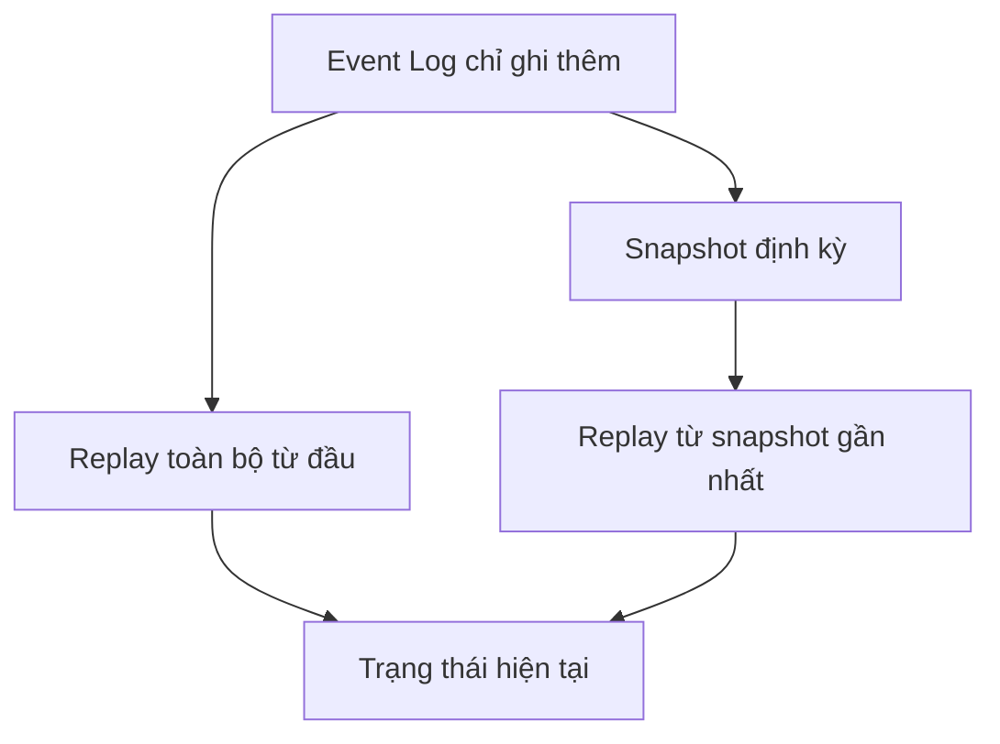

# 📚 Event Sourcing: Lưu sự kiện thay vì trạng thái

> Nguồn: `017-Event-Sourcing-Pattern.txt` · [Udemy](https://ua.udemy.com/course/the-complete-microservices-event-driven-architecture/learn/lecture/38247982)

Bài cuối của nhóm design pattern là **event sourcing (lưu trữ theo sự kiện)** — một pattern cực kỳ hữu ích nhưng cũng **bị hiểu lầm nhiều nhất**. Trước khi nói về nó, mình muốn các bạn nhìn lại cách ứng dụng thông thường xử lý dữ liệu, vì chính sự đối lập giữa hai cách tiếp cận này sẽ giúp các bạn nhớ bài lâu hơn.

---

### 🗃️ Trạng thái hiện tại: cách lưu dữ liệu quen thuộc

Nói chung, dữ liệu mà ứng dụng lưu trong database **phản ánh trạng thái hiện tại của nghiệp vụ**, và mọi sửa đổi trên dữ liệu đều phản ánh **trạng thái mới — ghi đè lên trạng thái cũ**. Nếu muốn tìm lại trạng thái cũ sau khi đã bị ghi đè, ta luôn có thể tìm **bản backup**. Nhưng trong hầu hết trường hợp, trừ khi có sự cố, **chúng ta không quan tâm tới trạng thái (hay các trạng thái) trước đó của dữ liệu — chỉ quan tâm hiện tại đang có gì**.

Tương tác với dữ liệu thường diễn ra qua **CRUD operations (create, read, update, delete)** — và với phần lớn use case, thế là đủ.

Ví dụ: một **cửa hàng online** lưu collection sản phẩm trong **NoSQL database**, mỗi sản phẩm gồm tên, mô tả, giá và link ảnh. Khi chủ sản phẩm cập nhật giá hay mô tả, **người dùng không quan tâm** — họ chỉ cần giá và mô tả **mới nhất, cập nhật nhất**, còn lịch sử thay đổi **không có giá trị gì**.

---

### 🧭 Khi lịch sử quan trọng: ngân hàng và kho hàng

Nhưng không phải lúc nào cũng vậy. Có những tình huống chúng ta cần biết **không chỉ trạng thái hiện tại mà cả từng bước dẫn tới nó**.

**Ví dụ thứ nhất — ngân hàng online.** Hãy tưởng tượng phản ứng của khách hàng nếu ta chỉ đưa cho họ **số dư hiện tại và không gì khác**: không giải thích số dư đó hình thành thế nào, không dữ liệu về rút tiền, nạp tiền, phí hay khoản ghi có. Chỉ một con số trơ trọi. Điều đó là **không thể tưởng tượng nổi** — bởi cách tính ra số dư quan trọng không chỉ để hiển thị, mà còn cho **auditing (kiểm toán)** và **hiệu chỉnh khi cần**.

**Ví dụ thứ hai — kho hàng của một merchant.** Giả sử ta chỉ biết **trạng thái tồn kho hiện tại**: sáng đăng nhập hệ thống thấy còn 200 sản phẩm, tối đăng nhập lại thấy còn 100. Vậy là ta đã bán 100 sản phẩm? Nếu đúng thế thì tuyệt. Nhưng nếu ta bán 200 và bị **trả lại 100** thì lại là câu chuyện khác. Hoặc biết đâu chỉ có một **khách hàng doanh nghiệp mua sỉ một lần**. Chỉ với trạng thái hiện tại, ta **không đủ thông tin** — ta cần thấy các bước dẫn tới trạng thái đó.

Đây chính là lúc **event sourcing pattern** xuất hiện.

---

### 📚 Event sourcing: lưu sự kiện, replay ra trạng thái

Trong event sourcing, **thay vì lưu trạng thái hiện tại, chúng ta chỉ có các sự kiện**. Mỗi event mô tả **một thay đổi hoặc một sự thật về một thực thể (entity)** trong hệ thống. Quan trọng nhất: **event là bất biến (immutable)** — một khi đã vào hệ thống, nó **không bao giờ thay đổi**; việc duy nhất ta có thể làm là **append event mới vào cuối log**.

Muốn biết **trạng thái hiện tại của một thực thể**, ta chỉ việc **áp dụng (apply/replay) toàn bộ event đã xảy ra với thực thể đó**. Cách hình dung dễ nhất: **giống như version control, nhưng dành cho dữ liệu** — mỗi event chỉ đại diện cho **phần thay đổi (delta) so với trạng thái trước**.

Với tài khoản ngân hàng: thay vì duy trì và cập nhật số dư, ta chỉ lưu **các giao dịch chuyển tiền ra/vào tài khoản**. Replay các giao dịch từ ngày mở tài khoản, ta luôn tính được **số dư hiện tại mới nhất**. Lợi ích của việc lưu giao dịch thay vì lưu số dư:

* Có **lịch sử đầy đủ** về cách hình thành số dư — để báo cáo và kiểm toán.
* Có thể **phát hiện giao dịch trùng lặp** xảy ra do vô tình.
* Có thể **phát hiện mẫu giao dịch đáng ngờ** — dấu hiệu gian lận mà khách hàng không hề hay biết.
* Có thể đưa ra **insight**: gợi ý thói quen chi tiêu tốt hơn, hay đề xuất sản phẩm như tài khoản tiết kiệm, thẻ tín dụng.

Ngoài ra còn một lợi ích cộng thêm rất đẹp: **hiệu năng ghi**. Không dùng event sourcing, workload ghi nhiều sẽ dẫn tới **tranh chấp (contention) cao trên cùng một thực thể** trong database, thường cho hiệu năng kém. Ví dụ bảng inventory theo dõi tồn kho từng sản phẩm: nếu có nhiều cập nhật đồng thời vào cùng bảng — tệ hơn là cùng sản phẩm — thì **các cập nhật tranh chấp lẫn nhau**, làm chậm chính chúng và làm chậm cả các reader của bảng đó. Chuyển sang event sourcing, mỗi lượt mua hoặc trả hàng trở thành **một event chỉ ghi thêm (append-only)**, không cần **khóa database (locking)** và hiệu quả hơn nhiều.

---

### 💾 Lưu và đọc event: database, broker, snapshot và CQRS

Có hai cách chính để **lưu và biểu diễn event**:

**Cách 1 — lưu từng event như một bản ghi riêng trong database.** Với cửa hàng online, mỗi đơn hàng mới được lưu vào bảng orders; mỗi lần trạng thái đơn thay đổi, ta **append một dòng mới với cùng order ID, trạng thái mới và timestamp**. Nhờ đó, ta thấy được toàn bộ lịch sử của từng đơn chuyển trạng thái theo thời gian.

* **Ưu điểm:** khả năng **truy vấn và phân tích trên toàn bộ tập dữ liệu**. Không chỉ theo dõi tiến trình của một đơn, ta còn phân tích được tiến trình của **nhiều đơn cùng lúc**: ví dụ phát hiện một ngày cụ thể có rất nhiều đơn mới (có thể tương quan với một đợt sale), hoặc một ngày có nhiều vấn đề giao hàng.

**Cách 2 — lưu event trong message broker.** Thay vì lưu trong database riêng của service, ta **publish event cho bất kỳ ai muốn tiêu thụ**.

* **Ưu điểm:** khác với hầu hết database, message broker được **tối ưu cho việc xử lý lượng lớn event**, đồng thời **dễ giữ thứ tự giữa các event của cùng một thực thể**.
* **Nhược điểm:** thực hiện **truy vấn phức tạp trên dòng event trong broker khó hơn và kém trực quan hơn**.

| Tiêu chí | Database | Message broker |
|---|---|---|
| Khả năng truy cập | Riêng của service sở hữu | Publish cho mọi consumer |
| Truy vấn/phân tích | Mạnh, dễ trên tập dữ liệu lớn | Khó hơn, kém trực quan |
| Thế mạnh | Phân tích nhiều bản ghi, tương quan dữ liệu | Xử lý lượng event lớn, giữ thứ tự theo thực thể |

Cuối cùng, làm sao **đọc và tái dựng trạng thái mới nhất một cách hiệu quả**? Replay toàn bộ giao dịch của một tài khoản mỗi lần muốn hiển thị số dư là **không hiệu quả**. Có hai chiến lược:

1. **Chụp snapshot tại các mốc nhất định của event log.** Ví dụ: chụp snapshot số dư của mỗi người dùng **một tháng một lần**. Ta vẫn giữ toàn bộ lịch sử giao dịch từ thuở khai sinh nếu người dùng muốn xem, nhưng từ snapshot, người dùng chỉ cần **replay các giao dịch từ snapshot gần nhất** thay vì từ ngày mở tài khoản.
2. **Dùng CQRS — pattern chúng ta vừa học.** Ta tách phần **append và lưu event** khỏi phần **query** (nơi lưu trạng thái hiện tại trong database tối ưu cho đọc). Database chỉ đọc đó thậm chí có thể là **in-memory database** để đọc còn nhanh hơn nữa. Nếu event được lưu trong message broker, **query service chỉ cần subscribe đúng topic/channel đó và kéo dữ liệu trực tiếp về**, còn phía command **không cần database đặc biệt nào cả**.

Sự kết hợp **CQRS + event sourcing rất phổ biến trong công nghiệp** vì ta có "cả hai thế giới": **lịch sử và kiểm toán**, **ghi nhanh hiệu quả**, và **đọc nhanh hiệu quả**. Tất nhiên, không có gì miễn phí: dùng event sourcing kèm CQRS thì ta chỉ có **eventual consistency** — điều này có thể đủ hoặc không đủ tùy use case của các bạn.

---

### 🎯 Tự kiểm tra nhanh

**Câu 1:** Cách lưu dữ liệu truyền thống (CRUD) khác event sourcing ở điểm cốt lõi nào?

<b>Xem đáp án</b>

**Đáp án:** CRUD lưu trạng thái hiện tại và ghi đè khi dữ liệu thay đổi; event sourcing chỉ lưu các event bất biến mô tả thay đổi/sự thật, và trạng thái hiện tại được tái dựng bằng cách replay event.

Giải thích: Event sourcing giống version control cho dữ liệu, mỗi event là một delta.

Tham chiếu: Mục Event sourcing: lưu sự kiện, replay ra trạng thái.

**Câu 2:** Vì sao ví dụ kho hàng cho thấy chỉ biết trạng thái hiện tại là không đủ?

<b>Xem đáp án</b>

**Đáp án:** Vì từ 200 xuống 100 sản phẩm có thể là bán 100, hoặc bán 200 rồi nhận 100 hàng trả lại, hoặc một khách doanh nghiệp mua sỉ — các kịch bản này dẫn tới hành động kinh doanh khác nhau.

Giải thích: Cần thấy các bước dẫn tới trạng thái hiện tại, không chỉ con số cuối cùng.

Tham chiếu: Mục Khi lịch sử quan trọng: ngân hàng và kho hàng.

**Câu 3:** Lợi ích hiệu năng ghi của event sourcing là gì?

<b>Xem đáp án</b>

**Đáp án:** Thay vì nhiều cập nhật tranh chấp (contention) trên cùng bản ghi, mỗi thay đổi trở thành event append-only không cần khóa database, nên hiệu quả hơn nhiều cho workload ghi.

Giải thích: Ví dụ bảng inventory bị nhiều cập nhật đồng thời làm chậm cả người ghi lẫn người đọc.

Tham chiếu: Mục Event sourcing: lưu sự kiện, replay ra trạng thái.

**Câu 4:** Hai cách lưu event và trade-off của chúng là gì?

<b>Xem đáp án</b>

**Đáp án:** Lưu trong database: dễ truy vấn, phân tích toàn bộ dữ liệu. Lưu trong message broker: publish cho mọi consumer, tối ưu lượng lớn event và giữ thứ tự theo thực thể, nhưng truy vấn phức tạp khó và kém trực quan hơn.

Giải thích: Mỗi cách có thế mạnh riêng tùy nhu cầu đọc/phân tích.

Tham chiếu: Mục Lưu và đọc event: database, broker, snapshot và CQRS.

**Câu 5:** Snapshot và CQRS giúp đọc trạng thái hiện tại nhanh hơn như thế nào?

<b>Xem đáp án</b>

**Đáp án:** Snapshot lưu trạng thái tại các mốc định kỳ để chỉ phải replay các event từ snapshot gần nhất; CQRS tách phần query sang database tối ưu cho đọc (có thể in-memory), query service có thể subscribe trực tiếp topic của broker.

Giải thích: Kết hợp CQRS + event sourcing cho cả lịch sử/kiểm toán, ghi nhanh và đọc nhanh, đổi lại chỉ có eventual consistency.

Tham chiếu: Mục Lưu và đọc event: database, broker, snapshot và CQRS.

---

Tóm lại, event sourcing đảo ngược cách nhìn về dữ liệu: **thay vì lưu trạng thái, ta lưu các thay đổi/sự thật dưới dạng event bất biến** rồi replay để tái dựng trạng thái. Ta đã biết hai cách lưu event (database hoặc message broker) với trade-off rõ ràng, lợi ích hiệu năng ghi cho workload nặng, và cách đọc hiệu quả bằng **snapshot** hoặc **kết hợp với CQRS** — công thức rất phổ biến trong công nghiệp, đổi lại phải chấp nhận **eventual consistency**. Đến đây, nhóm design pattern của khóa học đã khép lại với ba mảnh ghép: **Saga**, **CQRS** và **Event Sourcing**. Hẹn gặp lại các bạn ở section tiếp theo trên hành trình microservices! 🚀
