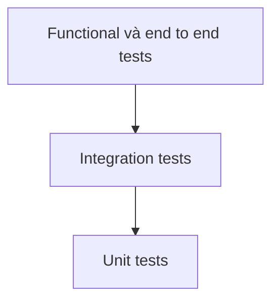
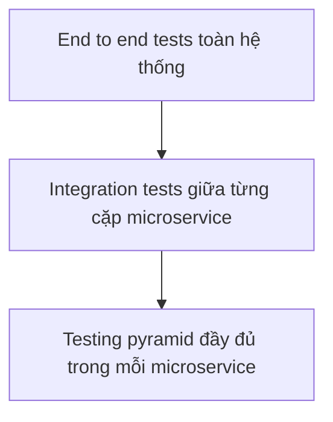

# 🧪 Testing Pyramid cho Microservices: Nền tảng kiểm thử và ba thách thức lớn

> Nguồn: `018-Testing-Pyramid-for-Microservices---Introduction-and-Challen.txt` · [Udemy](https://ua.udemy.com/course/the-complete-microservices-event-driven-architecture/learn/lecture/38638332)

Chào mừng các bạn trở lại. Sau khi đã bàn rất kỹ về thiết kế và phát triển microservices, chúng ta bước sang phần quan trọng không kém: **đưa microservices ra production**. Nhưng trước khi deploy hệ thống và nhận traffic thật, chúng ta cần có niềm tin — và niềm tin đó đến từ **automated tests (kiểm thử tự động)**. Trong bài này, mình sẽ ôn lại cách chúng ta từng test ứng dụng monolith, cách áp dụng testing pyramid cho microservices, rồi chỉ ra ba thách thức lớn nhất của cách làm truyền thống.

---

### 📐 Ôn lại Testing Pyramid của ứng dụng monolith

Khi thiết lập test cho một ứng dụng đơn, chúng ta có thể chia chúng thành **ba nhóm**: unit tests, integration tests và functional (end-to-end) tests. Cách phân tầng này thường được gọi là **testing pyramid (kim tự tháp kiểm thử)**.

| Tầng test | Phạm vi kiểm tra | Chi phí và tốc độ | Mức độ tin cậy | Số lượng |
|---|---|---|---|---|
| Unit test | Một class hoặc module đơn lẻ, chạy cô lập | Rẻ, dễ viết, chạy nhanh | Thấp nhất | Nhiều nhất |
| Integration test | Các unit và hệ thống bên ngoài như database, message broker | Lớn hơn, chậm hơn | Cao hơn | Ít hơn unit test |
| Functional / end-to-end test | Toàn hệ thống gồm UI, application và database | Nặng nhất, phức tạp nhất, chậm nhất | Cao nhất | Ít nhất |

Chi tiết từng tầng:

1. **Unit tests** nằm ở đáy pyramid. Mỗi test kiểm tra một **đơn vị logic nhỏ** như một class hay một module trong trạng thái **cô lập (isolation)**. Đây là loại test **rẻ nhất để bảo trì**: nhỏ, dễ viết, chạy nhanh. Chính vì rẻ nên chúng ta nên tạo **số lượng nhiều nhất** — đó cũng là lý do chúng nằm ở đáy. Đổi lại, unit test cho chúng ta **độ tin cậy thấp nhất** về toàn hệ thống, vì chúng chỉ test từng đơn vị riêng lẻ; khi chạy ứng dụng thật, ta không biết chắc các đơn vị đó có phối hợp ăn ý với nhau hay không.
2. **Integration tests** kiểm tra rằng các đơn vị và các hệ thống mà ta tích hợp vào — như **database** hay **message broker** — thực sự hoạt động cùng nhau. Loại test này **lớn hơn và chậm hơn**, nên số lượng nên ít hơn unit test. Bù lại, sau khi chạy chúng ta có **niềm tin cao hơn** vào hệ thống.
3. **Functional / end-to-end tests** nằm trên đỉnh. Chúng chạy **toàn bộ hệ thống**, gồm UI, toàn bộ application và database, để xác minh mọi thứ hoạt động đúng như thiết kế. Dưới góc nhìn người dùng cuối, mỗi test như vậy kiểm tra một **hành trình người dùng (user journey)** hay một **yêu cầu nghiệp vụ** cụ thể, đảm bảo khớp với đặc tả. Không ngạc nhiên khi đây là loại **nặng nhất, phức tạp nhất để dựng và chậm nhất khi chạy**, nên số lượng phải **ít nhất**. Bù lại, chúng cho **mức độ tin cậy cao nhất** rằng hệ thống sẽ hoạt động đúng trên production.

---

### 🧩 Áp Testing Pyramid vào kiến trúc microservices

Câu hỏi đặt ra là: làm sao dịch chuyển kim tự tháp này sang microservices — nơi các service giao tiếp với nhau **qua network hoặc message broker**, và mỗi microservice có **database riêng**?

Bước thứ nhất: **mỗi team microservice vẫn tuân theo đúng testing pyramid cũ**, gồm unit tests, integration tests và functional tests cho chính microservice cùng database của mình.

Bước thứ hai: coi **mỗi microservice như một "unit" nhỏ** nằm trong một hệ thống lớn hơn, và đặt nó vào một **testing pyramid lớn hơn**.

Việc test từng microservice trong trạng thái cô lập là **thiết yếu nhưng chưa đủ**: nó không chứng minh được rằng tất cả các microservice có thể **"nói chuyện" được với nhau lúc runtime** và phối hợp chính xác. Vì vậy chúng ta cần thêm:

* **Một tầng integration tests giữa các microservice**, xác minh rằng **từng cặp microservice** có thể giao tiếp qua **API đã thống nhất** — trong khi **mock (giả lập) phần còn lại** của hệ thống.
* **System-level end-to-end tests** trên đỉnh, về lý thuyết chạy **tất cả microservices, database, message broker và front-end** trong một môi trường test, để xác minh mọi thành phần phối hợp đúng như kỳ vọng.

Nghe có vẻ trọn vẹn, nhưng chính phiên bản pyramid mới này lại sinh ra ba thách thức rất thực tế.

---

### 💸 Thách thức 1 — End-to-end tests: đắt đỏ và khó sở hữu

End-to-end tests cho độ tin cậy cao nhất, nhưng chúng **cực kỳ khó dựng và khó bảo trì**:

* **Không rõ team nào sở hữu** môi trường test này.
* Chỉ cần **một team microservice làm hỏng build** — dù chỉ một ngày — là **toàn bộ test pipeline bị gãy**. Hệ quả là **mọi team bị chặn**, không thể release bất cứ thứ gì ra production.
* Hoặc tệ hơn: lập trình viên **bắt đầu phớt lờ** các end-to-end tests và cứ release microservice của mình. Lúc đó, những test này trở thành **gánh nặng thuần túy**, chẳng đem lại lợi ích gì.
* Việc chạy một môi trường **gần như trùng lặp với production** — dù scale nhỏ hơn nhiều — cũng **rất tốn kém**.

Thực tế trong ngành cho thấy hai thái cực: có công ty **đổ nguồn lực quá lớn** để xây và bảo trì vài test này, trong khi công ty khác quyết định **chấp nhận rủi ro và không đầu tư gì** cho chúng.

---

### 🔗 Thách thức 2 — Integration tests: điểm gắn chặt giữa các team

Ngay cả chạy integration tests giữa các microservice cũng **khá khó khăn**, và nó tạo ra một **điểm gắn chặt (tight coupling) giữa các team**:

* Team sở hữu **microservice A** muốn test việc mình tiêu thụ API của **microservice B** thì phải **build, cấu hình và chạy cả hai microservice**. Team A biết cách dựng service của mình, nhưng **có thể không biết cách dựng microservice B**. Mọi chuyện còn khó hơn nếu B có nhiều phụ thuộc — như database hay một service khác — phải chạy hoặc mock.
* Ở chiều ngược lại, team sở hữu **microservice B** cũng có vấn đề riêng: B có thể được **nhiều microservice tiêu thụ API**. Để chắc rằng thay đổi API không phá vỡ các consumer, team B phải **build, cấu hình và chạy toàn bộ consumer** để thực thi test.

Cứ như vậy, mọi thứ rất dễ **vượt khỏi tầm kiểm soát** và **làm chậm toàn bộ tổ chức**.

---

### 📡 Thách thức 3 — Kiểm thử microservices hướng sự kiện

Thách thức thứ ba xuất hiện khi chúng ta dùng **event-driven architecture (kiến trúc hướng sự kiện)** để tách rời microservices:

* **Phía producer:** microservice phát **event** vào message broker và thường **không hề biết** microservice nào tiêu thụ event đó. Sự tách rời này chính là **lợi ích mà chúng ta muốn** từ event-driven architecture — nhưng hệ quả là ta **không thể chạy integration tests** với các microservice đó theo cách thông thường.
* **Phía consumer:** team sở hữu microservice tiêu thụ event cũng gặp vấn đề tương tự — họ phải **chạy các microservice phát event cùng message broker** chỉ để kiểm tra rằng service của mình **tiêu thụ được event** và **định dạng event không bị thay đổi** mà họ không hề hay biết.

Vậy là chúng ta đã có bức tranh đầy đủ về vấn đề. Tóm lại, pyramid truyền thống khi áp lên microservices vấp phải: **chi phí và độ phức tạp của một môi trường end-to-end hoàn chỉnh**, **sự gắn chặt giữa các team khi chạy integration tests**, và **sự phức tạp lẫn overhead khi test các microservice hướng sự kiện**. *Đừng lo nếu các bạn chưa từng tự tay dựng pipeline kiểm thử microservices — chỉ cần nắm chắc ba thách thức này là các bạn đã đi trước rất nhiều người.*

---

### 🎯 Tự kiểm tra nhanh

**Câu 1:** Vì sao unit tests nằm ở đáy testing pyramid?

<b>Xem đáp án</b>

**Đáp án:** Vì chúng rẻ, dễ viết, chạy nhanh nên nên được tạo số lượng nhiều nhất; nhưng chúng cho độ tin cậy thấp nhất về toàn hệ thống.

Giải thích: Unit test chỉ kiểm tra một class/module cô lập, không cho biết các đơn vị có phối hợp đúng khi chạy ứng dụng hay không.

Tham chiếu: Mục Ôn lại Testing Pyramid của ứng dụng monolith.

**Câu 2:** Test từng microservice trong trạng thái cô lập có đủ để tự tin release không?

<b>Xem đáp án</b>

**Đáp án:** Không. Cô lập là thiết yếu nhưng chưa đủ; cần thêm tầng integration tests giữa từng cặp microservice để chứng minh chúng giao tiếp đúng qua API đã thống nhất.

Giải thích: Test cô lập không phát hiện lỗi tương tác giữa các service lúc runtime.

Tham chiếu: Mục Áp Testing Pyramid vào kiến trúc microservices.

**Câu 3:** Vì sao end-to-end tests dễ trở thành "gánh nặng vô ích"?

<b>Xem đáp án</b>

**Đáp án:** Vì khó xác định team sở hữu, một team làm hỏng build là cả pipeline bị chặn, và nếu dev phớt lờ rồi cứ release thì test chỉ còn là trách nhiệm chứ không còn lợi ích.

Giải thích: Cộng thêm chi phí chạy một môi trường gần như trùng lặp với production.

Tham chiếu: Mục Thách thức 1 — End-to-end tests: đắt đỏ và khó sở hữu.

**Câu 4:** Vì sao integration tests giữa các microservice tạo tight coupling giữa các team?

<b>Xem đáp án</b>

**Đáp án:** Vì team consumer phải build, cấu hình và chạy cả provider cùng các phụ thuộc của nó; còn team provider phải chạy toàn bộ consumer để chắc thay đổi API không phá vỡ ai.

Giải thích: Việc phụ thuộc vào build của team khác khiến tiến độ các team trói vào nhau.

Tham chiếu: Mục Thách thức 2 — Integration tests: điểm gắn chặt giữa các team.

**Câu 5:** Vì sao event-driven architecture làm integration testing khó hơn?

<b>Xem đáp án</b>

**Đáp án:** Vì producer thường không biết ai tiêu thụ event, còn consumer phải chạy cả producer lẫn message broker chỉ để kiểm tra việc tiêu thụ event và định dạng event không thay đổi.

Giải thích: Sự tách rời vốn là lợi ích của event-driven lại chính là rào cản với cách test truyền thống.

Tham chiếu: Mục Thách thức 3 — Kiểm thử microservices hướng sự kiện.

---

Ba thách thức đã được đặt lên bàn, và đó cũng là lúc chúng ta sẵn sàng cho phần thú vị nhất: **các giải pháp thay thế mà ngành công nghiệp đang dùng** để test microservices và event-driven architecture mà không cần dựng cả một môi trường production thu nhỏ. Ở bài tiếp theo, mình sẽ giới thiệu **lightweight mocking (mock nhẹ)**, **contract tests (kiểm thử hợp đồng)** và **production testing (kiểm thử trên môi trường thật)**. Hẹn gặp lại các bạn! 🚀
