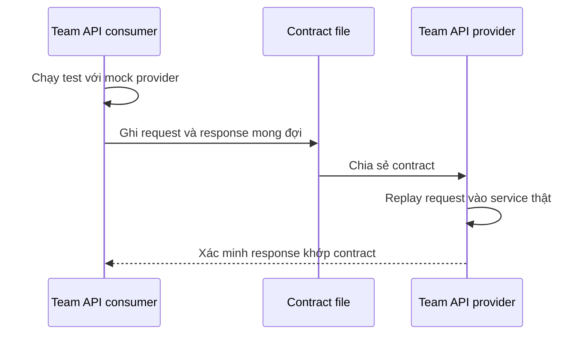
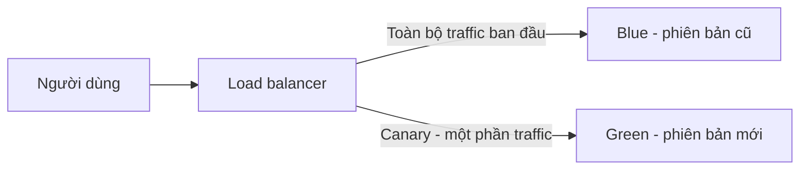

# 📝 Contract Tests và Production Testing: Kiểm thử microservices mà không cần dựng cả hệ thống

> Nguồn: `019-Contract-Tests-and-Production-Testing.txt` · [Udemy](https://ua.udemy.com/course/the-complete-microservices-event-driven-architecture/learn/lecture/38247928)

Chào mừng các bạn trở lại. Ở bài trước, chúng ta đã thấy testing pyramid khi áp lên microservices vấp phải hai nút thắt lớn: **end-to-end tests quá đắt đỏ để dựng và vận hành**, còn **integration tests thì phức tạp và tạo gắn chặt giữa các team**. Nhiều công ty buộc phải chọn giữa đầu tư quá mức hoặc bỏ hẳn. Bài này mình sẽ giới thiệu các giải pháp thay thế: **mock nhẹ (lightweight mocking)**, **contract tests (kiểm thử hợp đồng)** và **kiểm thử trên production (production testing)**.

---

### 🪶 Mock nhẹ — bước đơn giản hóa đầu tiên

Hãy bắt đầu với bài toán integration tests. Thay vì **chạy nguyên một microservice**, chúng ta dùng **lightweight mocking (mock nhẹ)**. Xét tình huống: team chúng ta sở hữu **microservice A** — bên tiêu thụ API của **microservice B** — và muốn chạy một integration test để xác minh rằng khi một số chức năng được kích hoạt với một bộ tham số, **A gửi request đúng tới B** và **xử lý response từ B chính xác**.

* Thay vì build, cấu hình và chạy **microservice B cùng toàn bộ phụ thuộc của nó** — rất nặng — ta chỉ **mock lớp API của B** mà mình tích hợp, cấu hình nó **trả về response đã hard-code (viết cứng)** nếu nhận được request như mong đợi.

Chiều ngược lại cũng tương tự: team sở hữu **microservice B** — bên cung cấp API — có thể chạy **một bộ mock consumer** thay vì chạy các microservice thật, rồi viết test để chúng **gửi request tới B** và kiểm tra response đúng như kỳ vọng. Chiến lược này giảm **gắn chặt giữa các team**, vì một team hỏng build cũng không chặn test của team khác, đồng thời giảm **overhead** chạy instance thật của các microservice khác.

Tuy nhiên, chỉ mock nhẹ thì có **một vấn đề lớn**: **hợp đồng (contract) giữa bên tiêu thụ API và bên cung cấp API có thể lệch nhau mà không team nào phát hiện**. Ví dụ:

1. Team cung cấp API **thay đổi API**, cập nhật mock consumer và test của họ — mọi test đều pass; nhưng thông tin về thay đổi đó **bị mất hoặc bị hiểu sai** ở phía microservice A.
2. Team A **không sửa gì**, hoặc sửa sai — test của họ **cũng pass**. Khi release lên production, hai microservice **không thể giao tiếp với nhau** và gây ra **outage**.

---

### 🤝 Contract tests — đồng bộ hợp đồng giữa hai phía

**Contract tests** dùng một **công cụ chuyên dụng** để giữ **mock API provider** và **mock API consumer** luôn **đồng bộ thông qua một contract dùng chung**.

1. Khi team consumer chạy test, test chạy **trên mock API provider của họ**, kiểm tra rằng microservice A **gửi request đúng** và **nhận response đúng** như kỳ vọng.
2. Đồng thời, **mỗi request gửi tới mock provider được ghi lại kèm response mong đợi vào một contract file**.
3. Contract file này được **chia sẻ với team sở hữu microservice B** — bên cung cấp API.
4. Team B **replay (phát lại) toàn bộ request đã ghi** vào microservice B thật, và xác minh response nhận được **giống hệt** response trong contract.
5. Nếu B có nhiều consumer, team B lấy **tất cả contract đã ghi**, tạo các mock consumer tương ứng và chạy từng cái **trên implementation API thật** của mình.

Kết quả: mỗi team có thể **chạy integration tests của riêng mình** mà không phải vật lộn với việc build, cấu hình và chạy các microservice khác — nhưng công cụ contract test **đảm bảo mọi người đang test trên contract mới nhất và chính xác** được chia sẻ giữa hai service.

---

### 📨 Mở rộng Contract Tests cho microservices hướng sự kiện

Ý tưởng contract tests cũng được **mở rộng cho integration tests giữa các microservice giao tiếp bất đồng bộ**. Hãy xét một kịch bản cụ thể trong hệ thống **thương mại điện tử**:

1. Người dùng gửi yêu cầu **mua một sản phẩm**; request đi tới **order service**.
2. Order service **publish một event** cho **payment service**, đồng thời **trả lời người dùng**.
3. Payment service **tiêu thụ event**, **tính tiền (bill) cho người dùng**, rồi chuyển tiếp dưới dạng **một event khác** cho **shipping service**.

Để đơn giản, chúng ta tập trung vào integration tests giữa **payment service** và **shipping service**. Ở đây, **contract chính là định dạng event** — chứa thông tin về người dùng, sản phẩm, số lượng, v.v.

* Thay vì dựng một **message broker** và chạy cả hai microservice, **mỗi team tự tạo một mock nhẹ của message broker**.
* Khi team shipping service test khả năng **tiêu thụ và phân tích event** của payment service, event đó cũng được **ghi vào một contract file**.
* Contract file được chia sẻ với team sở hữu **microservice phát event** — tức payment service.
* Khi team payment muốn chạy integration test giữa service của mình và consumer, họ **kích hoạt hàm trong service đáng lẽ sinh ra event đó**.
* Contract test sẽ **xác minh định dạng và nội dung event khớp với những gì đã ghi** trong contract.

Nếu khớp, contract giữa hai microservice đang **đồng bộ**, và chúng ta có thể **tự tin release lên production**. Như vậy, contract tests giúp việc chạy integration tests trở nên đơn giản hơn nhiều cho cả hai kiểu giao tiếp — **đồng bộ lẫn bất đồng bộ** — mà vẫn cho độ tin cậy cao rằng các service sẽ "nói chuyện" được với nhau sau khi deploy.

---

### 🚀 Production testing — blue-green deployment kết hợp canary testing

Cần nói rõ: **contract tests là giải pháp thay thế tốt cho integration tests, nhưng không thay thế được end-to-end tests**. Vậy nếu việc dựng end-to-end tests là **không khả thi** với công ty bạn, giải pháp thay thế là **kiểm thử trên production (testing in production)**. Một trong nhiều cách làm là **release dần dần bằng blue-green deployment kết hợp canary testing**. **Blue-green deployment** là cách release phiên bản microservice mới **an toàn**, dùng **hai môi trường production giống hệt nhau** và **không có downtime** trong lúc release:

* **Blue environment**: tập hợp server hoặc container đang chạy **phiên bản cũ**.
* **Green environment**: tập hợp server hoặc container chạy **phiên bản mới** mà ta muốn release.

1. Deploy phiên bản mới lên **green** — lúc này **chưa có traffic người dùng thật** đi vào. Đây là cơ hội để **chạy test tự động, thậm chí test thủ công** trên các server mới mà không ảnh hưởng người dùng.
2. Sau khi test xong, **chuyển một phần traffic production sang green** và **theo dõi** phiên bản mới về hiệu năng lẫn lỗi chức năng. Quá trình này gọi là **canary testing**.
3. Nếu phát hiện vấn đề, lập tức **điều traffic từ green trở lại blue** với ảnh hưởng tối thiểu tới người dùng.
4. Nếu không có vấn đề, **chuyển toàn bộ traffic production từ blue sang green**, rồi **ngừng dần (decommission) môi trường blue** vì không còn cần thiết.

| Cách tiếp cận | Giải quyết được gì | Điểm còn lại |
|---|---|---|
| Mock nhẹ | Bỏ chi phí dựng microservice thật khi chạy integration tests | Contract có thể lệch nhau mà không ai phát hiện |
| Contract tests | Giữ contract giữa consumer và provider luôn đồng bộ qua file dùng chung | Không thay thế được end-to-end tests |
| Production testing | Kiểm chứng phiên bản mới trên môi trường thật với rủi ro thấp | Chỉ nên dùng khi dựng môi trường test đầy đủ là quá phức tạp hoặc tốn kém |

*Lưu ý quan trọng:* tất cả các giải pháp thay thế này **chỉ nên dùng khi việc dựng microservice thật ở môi trường development để test là quá phức tạp hoặc quá tốn kém**.

---

### 🎯 Tự kiểm tra nhanh

**Câu 1:** Lợi ích chính của mock nhẹ so với chạy microservice thật là gì?

<b>Xem đáp án</b>

**Đáp án:** Giảm gắn chặt giữa các team và giảm overhead chạy instance thật của các microservice khác.

Giải thích: Team này hỏng build cũng không chặn test của team kia.

Tham chiếu: Mục Mock nhẹ — bước đơn giản hóa đầu tiên.

**Câu 2:** Vấn đề lớn nhất của mock nhẹ là gì?

<b>Xem đáp án</b>

**Đáp án:** Contract giữa consumer và provider có thể lệch nhau mà cả hai team không hề biết, dẫn tới outage khi release.

Giải thích: Test của cả hai phía đều pass vì mỗi bên mock bên còn lại theo giả định của mình.

Tham chiếu: Mục Mock nhẹ — bước đơn giản hóa đầu tiên.

**Câu 3:** Contract test đồng bộ hai phía bằng cách nào?

<b>Xem đáp án</b>

**Đáp án:** Team consumer ghi request và response mong đợi vào contract file; team provider replay request đó vào service thật và xác minh response khớp contract.

Giải thích: Một công cụ chuyên dụng giữ mock provider và mock consumer đồng bộ qua contract dùng chung.

Tham chiếu: Mục Contract tests — đồng bộ hợp đồng giữa hai phía.

**Câu 4:** Trong hệ thống event-driven, "contract" giữa payment service và shipping service thực chất là gì?

<b>Xem đáp án</b>

**Đáp án:** Định dạng event chứa các thông tin như người dùng, sản phẩm, số lượng.

Giải thích: Mỗi team mock nhẹ message broker; event được ghi vào contract file rồi phía publisher kiểm tra lại định dạng và nội dung.

Tham chiếu: Mục Mở rộng Contract Tests cho microservices hướng sự kiện.

**Câu 5:** Blue-green deployment kết hợp canary testing hoạt động ra sao?

<b>Xem đáp án</b>

**Đáp án:** Deploy bản mới lên green khi chưa có traffic thật, chạy test trên đó, rồi chuyển một phần traffic sang green để theo dõi; nếu ổn thì chuyển toàn bộ traffic và ngừng dần blue.

Giải thích: Nếu phát hiện lỗi, chỉ cần đưa traffic về blue với ảnh hưởng tối thiểu.

Tham chiếu: Mục Production testing — blue-green deployment kết hợp canary testing.

---

Vậy là chúng ta đã đi hết hành trình kiểm thử: từ testing pyramid, qua các thách thức của nó, tới những giải pháp thực chiến — **mock nhẹ, contract tests và production testing**. Đây là bộ công cụ giúp các bạn chọn đúng cách kiểm thử theo bối cảnh công ty mình, thay vì máy móc áp dụng một công thức cho mọi hệ thống. Ở section tiếp theo, chúng ta sẽ chuyển sang một chủ đề cũng không kém phần quan trọng khi vận hành microservices: **observability (khả năng quan sát)** với ba trụ cột logs, metrics và tracing. Hẹn gặp lại các bạn! 🚀
