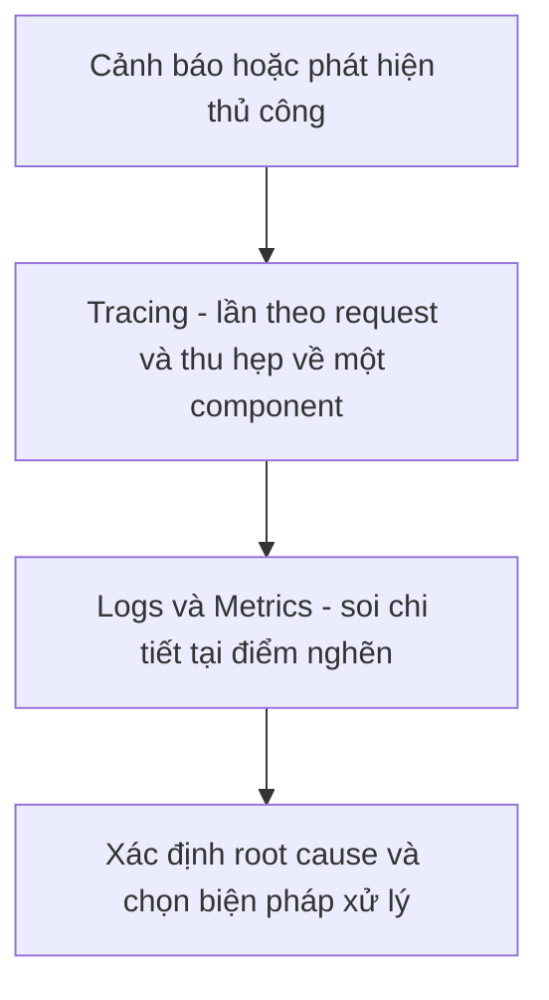

# 🔭 Ba trụ cột Observability: Logs, Metrics và Tracing khác nhau thế nào?

> Nguồn: `020-Introduction-to-the-Three-Pillars-of-Observability-in-Micros.txt` · [Udemy](https://ua.udemy.com/course/the-complete-microservices-event-driven-architecture/learn/lecture/39033416)

Chào mừng các bạn đến với bài mở đầu của section về **observability (khả năng quan sát)**. Là kỹ sư phần mềm chuyên nghiệp, chúng ta đều biết: dù test kỹ đến đâu, **bug, lỗi và vấn đề hiệu năng vẫn sẽ xảy ra**. Những sự cố như vậy đặc biệt khó xử lý trong một **hệ thống phân tán quy mô lớn** gồm hàng chục, thậm chí hàng trăm microservice. Trong bài này, mình sẽ làm rõ observability là gì, khác gì với monitoring, vì sao nó đặc biệt quan trọng với microservices, và giới thiệu **ba trụ cột** mà chúng ta sẽ đào sâu ở các bài sau.

---

### 🧐 Observability và Monitoring khác nhau ở đâu?

Nhìn bề ngoài, **monitoring (giám sát)** và **observability (khả năng quan sát)** rất giống nhau: cả hai đều cung cấp công cụ **thu thập dữ liệu**, đem lại góc nhìn về hệ thống trên production, và giúp chúng ta phát hiện sự cố khi chúng xảy ra. Nhưng có một khác biệt tinh tế:

* **Monitoring** là quá trình **thu thập, phân tích và hiển thị một tập metrics định trước**. Bằng cách gắn **alert (cảnh báo)** lên các metric định trước đó, chúng ta biết được khi nào có gì đó sai.
* Tuy nhiên, công cụ monitoring và dashboard thường chỉ cho biết **có gì đó sai**, chứ **không đủ để nói cái gì sai và sửa thế nào**.
* **Observability** cho phép chúng ta **chủ động debug, tìm kiếm pattern, theo dõi input/output** của microservices và hiểu tường tận hành vi hệ thống. Nó cho phép lần theo **dòng chảy của từng request, transaction hoặc event** xuyên toàn hệ thống, **phát hiện và cô lập điểm nghẽn hiệu năng**, và cuối cùng **chỉ thẳng vào nguồn gốc vấn đề** — thay vì chỉ nói rằng vấn đề đang tồn tại.

| Tiêu chí | Monitoring | Observability |
|---|---|---|
| Bản chất | Thu thập và hiển thị tập metrics định trước, gắn alert | Chủ động debug, tìm pattern, lần theo request xuyên hệ thống |
| Trả lời được | Có gì đó sai | Cái gì sai, sai ở đâu, xử lý thế nào |
| Mức độ ưu tiên | Quan trọng với mọi hệ thống | Đặc biệt sống còn với microservices |

*Monitoring rất quan trọng với mọi loại hệ thống, nhưng observability mới là thứ tối quan trọng với microservices.*

---

### 🏗️ Vì sao microservices "khát" observability hơn monolith?

Nếu ứng dụng của chúng ta là một **monolith (khối đơn)** và gặp sự cố, việc debug hay profiling thường **khá đơn giản**, vì tất cả nằm trong **ranh giới của một ứng dụng duy nhất**. Trong trường hợp xấu nhất, chúng ta luôn có thể **ssh vào một instance** của ứng dụng monolith, xem log hoặc instrument code để biết phần code nào gây ra vấn đề hiệu năng hay ném ra exception.

Với kiến trúc microservices, mọi chuyện khó hơn rất nhiều:

* Một **request duy nhất của người dùng** có thể đi qua **nhiều microservice và database**.
* Các thành phần đó thậm chí có thể giao tiếp **bất đồng bộ qua message broker**.
* Khi sự cố xảy ra ở đâu đó trong transaction, việc tìm ra **service nào gây lỗi** là cực kỳ khó.
* Tất cả service còn chạy thành **nhóm instance trên nhiều máy khác nhau**, càng làm vấn đề khó hơn gấp bội.
* Thống kê cho thấy phần lớn sự cố trong microservices xảy ra ở **ranh giới API giữa các service**, chứ không nằm trong code của chính microservice đó.

Vì vậy, việc có **góc nhìn vào luồng và nội dung dữ liệu đi vào/đi ra từng microservice**, cùng khả năng **truy vết đường đi của request xuyên các service**, là yêu cầu sống còn. Và thông thường, **chỉ một loại tín hiệu là không đủ** để debug vấn đề trong microservices và event-driven architecture.

---

### 📜 Trụ cột thứ nhất — Distributed Logging

Khi nói đến observability, chúng ta thường nói tới **ba loại tín hiệu**, hay còn gọi là **ba trụ cột của observability**: distributed logging, metrics và distributed tracing.

**Logs** là các **file chỉ ghi thêm (append-only)**, ghi lại những sự kiện riêng lẻ xảy ra bên trong một tiến trình ứng dụng, container, instance database hoặc server.

* Các sự kiện này thường được biểu diễn dưới dạng **chuỗi dữ liệu có cấu trúc hoặc bán cấu trúc (structured / semi-structured)**.
* Kèm theo mỗi sự kiện là **metadata**: thời điểm xảy ra sự kiện, request đã kích hoạt nó, method/class/application nơi sự kiện xảy ra, v.v.

---

### 📊 Trụ cột thứ hai — Metrics

**Metrics** là các **điểm dữ liệu được lấy mẫu đều đặn (regularly sampled)**, biểu diễn dưới dạng **giá trị số** như **counters (bộ đếm)**, **distributions (phân phối)** hoặc **gauges (đồng hồ đo giá trị hiện thời)**.

Ví dụ điển hình:

* Counter: **số request mỗi phút**, **số lỗi mỗi giờ**.
* Distribution: **phân phối độ trễ (latency)**.
* Gauge: **mức sử dụng CPU hoặc memory hiện tại**, **cache hit rate (tỷ lệ cache được dùng trúng)**.

---

### 🕵️ Trụ cột thứ ba — Distributed Tracing

**Traces** biểu diễn **đường đi của một request cụ thể** xuyên qua nhiều microservice, cùng **thời gian mỗi microservice xử lý request đó**. Trace có thể chứa thêm thông tin như **request headers**, **response status code**, v.v.

Khi nhận **alert** về một sự cố — hoặc tự phát hiện qua dashboard monitoring — chúng ta có thể **kết hợp cả ba loại tín hiệu**:

1. **Trace từng request riêng lẻ**, **cô lập sự cố** về một microservice hoặc một API cụ thể.
2. **Thu hẹp tiếp** xuống một method, thậm chí một dòng code gây ra bug hoặc điểm nghẽn hiệu năng.
3. Từ đó có đủ thông tin để chọn cách xử lý: **rollback**, **hotfix**, hoặc thay đổi hạ tầng như **thêm instance service**, **chuyển hướng traffic sang region hay data center khác**, v.v.

Vậy là chúng ta đã có bức tranh tổng quan: **monitoring phát hiện vấn đề, observability chỉ ra nguồn gốc**, và bộ ba **logs – metrics – traces** là công cụ để làm điều đó trong thế giới phân tán. *Đừng lo nếu các bạn chưa từng vận hành hệ thống microservices thật — nắm chắc ba trụ cột này là nền tảng để các bạn tự tin debug mọi sự cố production.*

---

### 🎯 Tự kiểm tra nhanh

**Câu 1:** Khác biệt cốt lõi giữa monitoring và observability là gì?

<b>Xem đáp án</b>

**Đáp án:** Monitoring cho biết "có gì đó sai" qua tập metrics định trước; observability cho phép debug chủ động, lần theo request và chỉ ra nguồn gốc vấn đề.

Giải thích: Monitoring thu thập và hiển thị metrics cùng alert; observability đi sâu vào hành vi hệ thống.

Tham chiếu: Mục Observability và Monitoring khác nhau ở đâu?

**Câu 2:** Vì sao debug sự cố trong monolith thường dễ hơn trong microservices?

<b>Xem đáp án</b>

**Đáp án:** Vì mọi thứ nằm trong một ứng dụng duy nhất; cùng lắm có thể ssh vào instance để xem log hoặc instrument code.

Giải thích: Trong microservices, một request trải qua nhiều service, database, thậm chí giao tiếp bất đồng bộ qua broker trên nhiều máy.

Tham chiếu: Mục Vì sao microservices khát observability hơn monolith?

**Câu 3:** Ba trụ cột của observability là gì?

<b>Xem đáp án</b>

**Đáp án:** Distributed logging, metrics và distributed tracing.

Giải thích: Ba loại tín hiệu này thường được dùng kết hợp; chỉ một loại là không đủ để debug.

Tham chiếu: Mục Trụ cột thứ nhất — Distributed Logging.

**Câu 4:** Logs khác metrics ở điểm nào?

<b>Xem đáp án</b>

**Đáp án:** Logs là file append-only ghi từng sự kiện kèm metadata dạng chuỗi; metrics là các điểm dữ liệu số được lấy mẫu đều đặn như counter, distribution, gauge.

Giải thích: Logs mô tả sự kiện cụ thể; metrics dễ lượng hóa và đặt alert vì là số.

Tham chiếu: Mục Trụ cột thứ hai — Metrics.

**Câu 5:** Khi troubleshooting, trace giúp gì trước khi dùng logs và metrics?

<b>Xem đáp án</b>

**Đáp án:** Trace cho thấy đường đi và thời gian xử lý của request xuyên các service, giúp cô lập sự cố về một microservice hoặc API cụ thể.

Giải thích: Sau khi biết vị trí, ta dùng logs và metrics để đào sâu tới method hoặc dòng code.

Tham chiếu: Mục Trụ cột thứ ba — Distributed Tracing.

---

Chúng ta đã có đủ động lực và bản đồ tổng quan về observability. Ở bài tiếp theo, mình sẽ đi sâu vào trụ cột đầu tiên — **distributed logging** — với những best practice giúp biến hàng triệu dòng log thành công cụ debug thực sự. Hẹn gặp lại các bạn! 🚀
