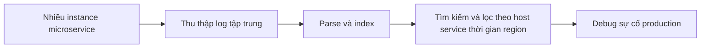

# 📜 Distributed Logging: Biến hàng triệu dòng log thành vũ khí debug

> Nguồn: `021-Distributed-Logging.txt` · [Udemy](https://ua.udemy.com/course/the-complete-microservices-event-driven-architecture/learn/lecture/38932350)

Chào mừng các bạn trở lại. Ở bài trước, chúng ta đã biết **ba trụ cột của observability** — distributed logging, metrics và distributed tracing — và cách chúng kết hợp để tìm ra nguồn gốc sự cố. Bài này mình sẽ đi sâu vào trụ cột đầu tiên: **distributed logging (ghi log phân tán)**. Chúng ta sẽ nhắc nhanh logging là gì, rồi tập trung vào những **best practice** quan trọng giúp log phát huy giá trị trong kiến trúc microservices.

---

### 🧾 Logging là gì và vì sao nó khó ở quy mô microservices?

**Logging** là một trong những cách **đơn giản nhất** để lập trình viên có được góc nhìn vào **trạng thái hiện tại của ứng dụng**:

* Một **log line** có thể đại diện cho một **sự kiện** của ứng dụng — như nhận một request mới.
* Hoặc một **hành động** — như thực hiện một câu truy vấn database, hay bắt đầu một tác vụ xử lý phức tạp.
* Logging cũng là cách để **ghi lại exception và lỗi** trong một method, kèm theo **bộ tham số đã dẫn tới vấn đề đó**. Thông tin này vô giá để debug, sửa lỗi, và **bổ sung test đủ để ngăn bug tái diễn trong tương lai**.

Vấn đề nằm ở quy mô. Trong kiến trúc microservices, chúng ta có thể có **hàng nghìn instance của các microservice khác nhau**, cùng nhau sản sinh **hàng triệu dòng log mỗi ngày**. Khi sự cố xảy ra, việc tìm và đọc từng file log một là **không thực tế**.

---

### 🗄️ Gom log về một hệ thống tập trung

Best practice đầu tiên — và là điều kiện tiên quyết — là **thu thập toàn bộ log về một hệ thống logging tập trung và có khả năng mở rộng cao (centralized, highly scalable)**. Hệ thống này phải:

* **Parse (phân tích cú pháp) và index** log để có thể **tìm kiếm dễ dàng** theo pattern hoặc theo văn bản.
* **Nhóm và lọc (group / filter)** theo các thuộc tính như **host, microservice, khoảng thời gian, region**.

Đây là nền tảng để mọi best practice phía sau phát huy tác dụng.

---

### 🧬 Cấu trúc log thống nhất và log level

**Về cấu trúc:** nên tuân theo một **structure/schema định trước** và **cùng một thuật ngữ (terminology)** cho các sự kiện — cả trong nội bộ một microservice lẫn giữa các microservice với nhau. Log line cần **dễ đọc với con người**, nhưng đồng thời **dễ đọc với máy** để có thể parse, nhóm và phân tích hiệu quả. Điều này cực kỳ quan trọng khi chúng ta đối mặt với sự cố ảnh hưởng người dùng và cần tìm ra gốc rễ **thật nhanh**. Một số ví dụ về cấu trúc log:

* **logfmt** — cấu trúc log dưới dạng **cặp key-value**.
* **JSON**.
* **XML**.

**Về mức độ nghiêm trọng:** mỗi log line nên được gán một **log level (mức log) hay severity (độ nghiêm trọng)**, tùy framework hoặc hệ thống đang dùng. Số lượng và tên mức có thể khác nhau, nhưng những mức **phổ biến nhất** là **trace, debug, info, warn, error và fatal**.

Log level thêm một **chiều dữ liệu** để chúng ta **cắt lát và lọc**, qua đó **giảm nhiễu và chống alert fatigue (mệt mỏi vì cảnh báo)**:

* **Exception** cần được ghi ở mức **error**; lỗi ảnh hưởng tới người dùng ghi ở mức **fatal**.
* Nhờ vậy, nếu bạn là **kỹ sư trực on-call** và nhận alert lúc nửa đêm, bạn có thể lọc chỉ **error và fatal**, tìm ra chính xác chuyện gì đã xảy ra và hành động đúng.
* Các công cụ tự động cũng có thể **định kỳ tìm và nhóm sự kiện theo mức độ nghiêm trọng**, rồi **alert cho chúng ta hoặc tạo ticket và tự gán cho người xử lý**.
* Những sự kiện **báo hiệu vấn đề tiềm ẩn** — như **thời gian xử lý request đi ra (outgoing request) quá cao**, hay **nhận request chứa giá trị bất thường** — phải được ghi ở mức **warn**. Nhờ đó ta lọc được mức này và **ngăn sự cố tương lai** bằng cách xử lý sớm.
* Khi là developer đang đào sâu vào một vấn đề rất phức tạp và cần theo dõi **mọi sự kiện** trên một instance cụ thể, chúng ta xem thông tin ở **tất cả các mức**, bao gồm cả những chi tiết **mịn nhất** được ghi ở mức **debug và trace**.

---

### 🔗 Correlation ID và ngữ cảnh đầy đủ

Best practice tiếp theo là dùng một **ID duy nhất — thường gọi là correlation ID (mã tương quan)** — cho mỗi **user request hoặc transaction**, và **thêm ID này vào từng log line** tương ứng với một sự kiện hay bước xử lý của request/transaction đó. Vì mỗi instance microservice thường xử lý **nhiều request đồng thời**, correlation ID giúp:

* **Tìm và lọc** đúng những sự kiện liên quan đến request đang điều tra.
* **Xem được trình tự sự kiện** của một request khi nó đi qua nhiều microservice.

Song song đó, hãy cung cấp **càng nhiều thông tin ngữ cảnh (contextual information) cho mỗi log line càng tốt**:

* Khi log một **error hoặc exception**, thêm **stack trace** để hiểu vì sao chương trình đi tới dòng code đó — cùng với **các tham số đã dẫn tới lỗi**.
* Nếu một **câu truy vấn database chạy quá lâu**, ghi lại **chính xác câu query** và **nội dung request đã kích hoạt nó** — giúp hiểu vì sao sự cố xảy ra và cần biện pháp gì để giảm thiểu.
* Một số **data point nên xuất hiện trong gần như mọi log line**: **tên service** đã phát ra log, **host name** nơi sự kiện xảy ra, **user ID** hoặc định danh khác cho biết ai khởi tạo thao tác, và tất nhiên là **timestamp** của sự kiện.

---

### ⚠️ Hai lưu ý sống còn: log đủ dùng và đừng log dữ liệu nhạy cảm

Có hai cân nhắc quan trọng đi kèm mọi best practice ở trên:

1. **Chỉ log thông tin thật sự cần thiết cho việc debug** — vì ở hệ thống quy mô lớn, **lưu trữ và xử lý log rất tốn kém**.
2. **Tuyệt đối không log thông tin nhạy cảm hoặc thông tin định danh cá nhân (PII)** — như **username, password, số an sinh xã hội, email, số thẻ tín dụng**, v.v.

Lý do rất rõ ràng: dù dữ liệu này đôi khi hữu ích khi troubleshooting, nó **tạo rủi ro pháp lý khổng lồ cho công ty nếu xảy ra breach bảo mật**. Nó cũng khiến việc **bảo mật, lưu trữ dữ liệu (data retention) và tuân thủ (compliance)** phức tạp hơn rất nhiều — và nói thẳng ra là **thiếu đạo đức**. *Không ai muốn một kỹ sư đang xử lý sự cố không liên quan trên production lại có quyền truy cập thông tin cá nhân của mình — đặc biệt khi họ không cần thông tin đó để sửa lỗi.*

---

### 🎯 Tự kiểm tra nhanh

**Câu 1:** Vì sao cần hệ thống logging tập trung trong microservices?

<b>Xem đáp án</b>

**Đáp án:** Vì hàng nghìn instance tạo ra hàng triệu dòng log mỗi ngày; không thể tìm và đọc từng file log một khi có sự cố.

Giải thích: Hệ thống tập trung cần parse, index, tìm kiếm theo pattern và lọc theo host, service, thời gian, region.

Tham chiếu: Mục Gom log về một hệ thống tập trung.

**Câu 2:** Lợi ích của việc gán log level cho từng dòng log là gì?

<b>Xem đáp án</b>

**Đáp án:** Thêm một chiều để lọc, giảm nhiễu và chống alert fatigue; ví dụ lọc error/fatal để xử lý sự cố nhanh.

Giải thích: Exception ghi ở mức error, lỗi ảnh hưởng người dùng ghi ở mức fatal; warn dành cho vấn đề tiềm ẩn; debug/trace cho chi tiết mịn nhất.

Tham chiếu: Mục Cấu trúc log thống nhất và log level.

**Câu 3:** Correlation ID giúp gì khi điều tra sự cố?

<b>Xem đáp án</b>

**Đáp án:** Giúp tìm và lọc đúng các sự kiện thuộc một request/transaction, và xem trình tự sự kiện của request đó xuyên nhiều microservice.

Giải thích: Mỗi instance xử lý nhiều request đồng thời nên cần ID duy nhất để tách bạch chúng.

Tham chiếu: Mục Correlation ID và ngữ cảnh đầy đủ.

**Câu 4:** Vì sao không nên ghi mọi thứ có thể ghi vào log?

<b>Xem đáp án</b>

**Đáp án:** Vì ở quy mô lớn, việc lưu trữ và xử lý log rất tốn kém; chỉ nên log thông tin thật sự cần cho debug.

Giải thích: Càng nhiều log không cần thiết, chi phí càng cao mà giá trị debug không tăng tương ứng.

Tham chiếu: Mục Hai lưu ý sống còn: log đủ dùng và đừng log dữ liệu nhạy cảm.

**Câu 5:** Vì sao không được log thông tin cá nhân như email hay số thẻ tín dụng?

<b>Xem đáp án</b>

**Đáp án:** Vì khi có breach bảo mật, công ty đối mặt rủi ro pháp lý rất lớn; đồng thời làm phức tạp bảo mật, retention và compliance, và là điều thiếu đạo đức.

Giải thích: Kỹ sư xử lý sự cố không liên quan không nên có quyền truy cập thông tin cá nhân của người dùng.

Tham chiếu: Mục Hai lưu ý sống còn: log đủ dùng và đừng log dữ liệu nhạy cảm.

---

Vậy là chúng ta đã đi hết trụ cột đầu tiên: **distributed logging** với những best practice có thể tạo khác biệt cực lớn khi debug sự cố production — từ **gom log tập trung, cấu trúc thống nhất, log level, correlation ID, ngữ cảnh đầy đủ**, cho tới **hai giới hạn về dữ liệu và chi phí**. Ở bài tiếp theo, chúng ta sẽ chuyển sang trụ cột thứ hai — **metrics** — và năm nhóm tín hiệu đáng theo dõi nhất. Hẹn gặp lại các bạn! 🚀
