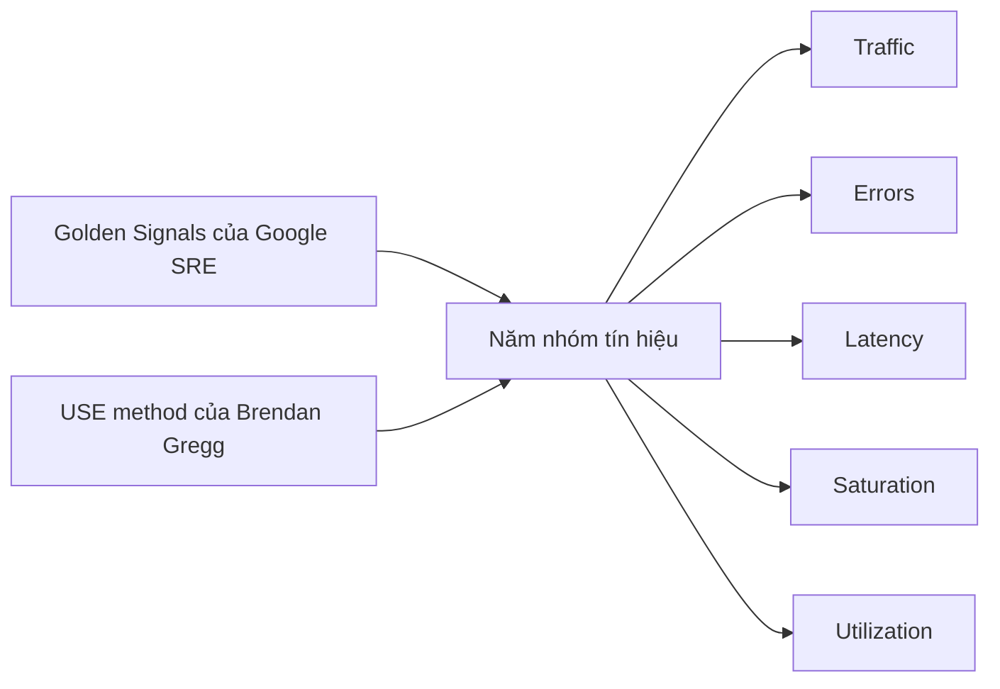

# 📊 Metrics: Năm nhóm tín hiệu đáng theo dõi nhất trong microservices

> Nguồn: `022-Metrics.txt` · [Udemy](https://ua.udemy.com/course/the-complete-microservices-event-driven-architecture/learn/lecture/38932358)

Chào mừng các bạn quay lại với chuỗi bài về **ba trụ cột của observability**. Sau **distributed logging**, chúng ta đến với trụ cột thứ hai: **metrics (số liệu đo lường)**. Trong bài này, mình sẽ giới thiệu metrics là gì và vì sao chúng cần thiết, chỉ ra **anti-pattern (mẫu sai) của việc thu thập quá nhiều metrics không cần thiết**, và cuối cùng là **năm nhóm tín hiệu** giúp đạt observability tối đa với độ phức tạp tối thiểu.

---

### 📈 Metrics — trụ cột dễ dùng nhất trong ba trụ cột

**Metrics** là những **tín hiệu đo lường được của phần mềm**, giúp chúng ta giám sát **sức khỏe và hiệu năng của hệ thống**. Một vài đặc điểm quan trọng:

* Metrics thường được **lấy mẫu đều đặn (regularly sampled)**, nên chúng ta thấy được **diễn biến liên tục** — thuận lợi để giám sát hệ thống và **phát hiện bất thường** khi chúng xảy ra.
* Chúng thường có **giá trị số**, nên rất dễ **định lượng** và **đặt alert** dựa trên giá trị trực tiếp hoặc giá trị dẫn xuất — đơn giản vì chúng chỉ là những con số.
* Trong cả ba trụ cột, metrics là loại **dễ thu thập, dễ trực quan hóa và dễ tổ chức thành dashboard nhất**.

Một dashboard có thể hiển thị **toàn bộ tín hiệu sống còn của một microservice**, hoặc **so sánh từng metric với giá trị lịch sử** trước một bản release hay một thay đổi quan trọng của hệ thống. Khi sự cố production cần được xử lý, dashboard là công cụ then chốt: thay vì phải tìm và đọc hàng trăm dòng log, chúng ta chỉ cần nhìn **một hoặc hai dashboard** là đã có manh mối về chuyện đang diễn ra.

---

### 🚫 Anti-pattern: thu thập mọi thứ có thể đo

Với vai trò team sở hữu một microservice, câu hỏi đáng đặt ra là: **nên đo, thu thập và giám sát những tín hiệu nào, và vì sao không gom hết tất cả?** Điều đầu tiên cần hiểu: **số lượng tín hiệu có thể thu thập là rất lớn** — ở mức **tài nguyên (resources)** có vô số tín hiệu hữu ích hoặc không tùy tình huống; ngoài ra ta có thể **instrument (cấy đo) vào ứng dụng** để đo bất cứ thứ gì, từ **số request nhận được mỗi phút** cho tới **số lần một đoạn logic quan trọng được thực thi**.

Tuy nhiên, **thu thập mọi thứ đo được là một anti-pattern lớn** vì: (1) **chi phí rất cao** — thu thập và lưu trữ quá nhiều tín hiệu từ mỗi server hay container rất tốn kém, đặc biệt với hệ thống lớn gồm hàng chục đến hàng trăm microservice; (2) **quá tải thông tin (information overload)** — kể cả chịu được chi phí lưu trữ, ta vẫn gặp vấn đề khác: giả sử nửa đêm nhận page rằng website đang không tải được hoặc rất chậm với phần lớn người dùng, biết bao dashboard và biết nhìn cái nào? Kể cả biết dashboard cần xem, **số lượng biểu đồ trên đó cũng không lọt vào màn hình**, nên rất khó phát hiện bất thường; và (3) **không phân biệt được triệu chứng với nguyên nhân** — dù có nhận ra một metric thay đổi, rất khó hiểu **cái nào là symptom (triệu chứng), cái nào là cause (nguyên nhân)**.

Vậy nên thay vì gom hết, hãy **thông minh trong việc chọn metric**. May mắn là chúng ta có thể tận dụng **nhiều thập kỷ kinh nghiệm** của các công ty từng vận hành hệ thống phân tán và microservices ở quy mô production, để tập trung vào **năm loại tín hiệu** cho nhiều thông tin nhất và ít nhiễu nhất. Năm nhóm này dựa trên hai nguồn kiến thức: **Golden Signals của Google SRE** — tập trung vào các metric hướng người dùng — và **USE method của Brendan Gregg** — tập trung nhiều hơn vào tài nguyên hệ thống.

| Tín hiệu | Đo điều gì | Ví dụ |
|---|---|---|
| Traffic | Lượng nhu cầu đặt lên hệ thống mỗi đơn vị thời gian | HTTP requests mỗi giây; event nhận vào và gửi tới consumer |
| Errors | Tỷ lệ lỗi và loại lỗi | Status code khác 200; event xử lý thất bại; transaction bị abort |
| Latency | Thời gian xử lý request | Phân phối độ trễ, p95 |
| Saturation | Mức độ quá tải / đầy của service hay tài nguyên | Queue tồn đọng, topic mua hàng phình to |
| Utilization | Mức độ bận của tài nguyên theo thời gian | CPU, memory, dung lượng disk |

---

### 🌐 Traffic và Errors — nhu cầu và sự cố

**Traffic** là **lượng nhu cầu đặt lên hệ thống trong một đơn vị thời gian**. Ví dụ:

* **Số HTTP request mỗi giây hoặc mỗi phút** với một microservice nhận traffic HTTP; **số query hoặc transaction mỗi giây/phút** với database và message broker.
* Với message broker, có thể đo **số event nhận vào** và **số event được giao cho consumer**.
* Trong trường hợp **một request tới microservice dẫn tới nhiều request đi ra**, nên đo **riêng số outgoing request và incoming request**. Lý do: các kết nối mở tới service khác **tiêu tốn tài nguyên hệ thống** và có thể **ảnh hưởng trực tiếp tới hiệu năng** của microservice.

**Errors** quan tâm tới **tỷ lệ lỗi và loại lỗi**:

* Nếu có thể, **error rate là tín hiệu tuyệt vời để đặt alert**, vì khi nó tăng vọt, người dùng **gần như đã bị ảnh hưởng**.
* Khi số exception tăng lên, ta có thể **không biểu diễn loại lỗi dưới dạng số** — thông tin đó để **logging** lo; nhưng nếu một service phụ thuộc trả về **HTTP status code khác 200**, ta dùng được nó như một metric rất hữu ích khi troubleshooting.
* Với các hệ thống nhạy cảm với độ trễ, ta thậm chí **đếm cả những response thành công là lỗi** nếu chúng vượt **ngưỡng latency đặt trước**.
* Với microservice hướng sự kiện: đo **tỷ lệ event xử lý thất bại** và **lý do thất bại** nếu phân loại được; với message broker: đo **số event giao cho khách hàng thất bại**.
* Với database: đo **số transaction bị abort, lỗi ổ đĩa**, v.v.

---

### ⏱️ Latency — đừng bao giờ chỉ nhìn con số trung bình

**Latency** là **thời gian một service xử lý request**. Nghe đơn giản, nhưng có vài điều cần lưu ý để đo cho đúng:

1. **Đừng chỉ nhìn latency trung bình — hãy xem toàn bộ phân phối.** Ví dụ: microservice nhận khoảng **1000 request mỗi phút**, **95% xử lý trong 50ms**, nhưng **5% mất tới 5000ms**. Latency trung bình mỗi phút rơi vào khoảng **300ms** — trông rất ổn với một hệ thống hướng người dùng. Nhưng nó **che mất sự thật rằng 5% người dùng phải chờ tới 5 giây** để trang web tải xong. Với **một triệu người dùng mỗi ngày**, thế là **50.000 người có trải nghiệm tệ đến mức có thể chuyển sang đối thủ và không bao giờ quay lại**. Nếu nhìn **percentile thứ 95 (p95)** theo từng phút thay vì trung bình, ta sẽ thấy ngay một phần đáng kể request mất thời gian bất hợp lý — dấu hiệu của **điểm nghẽn hiệu năng**.
2. **Tách latency của thao tác thành công và thất bại.** Trộn lẫn hai loại có thể cho **số liệu sai**. Ví dụ: nếu ta **fail nhanh** khi không xử lý được request, latency tổng có thể **trông đẹp hơn thực tế**; ngược lại, nếu **trả lỗi quá chậm**, ta có thể không nhận ra — nhất là khi lỗi hiếm gặp còn request thành công xử lý rất nhanh. Đo **riêng** latency của request thành công và thất bại giúp hiểu đúng **trải nghiệm của client trong cả hai tình huống**.

---

### 🧯 Saturation và Utilization — biết lúc nào hệ thống sắp đuối

**Saturation (độ bão hòa)** đo mức độ **quá tải hay đầy** của một service hoặc tài nguyên. Đây là metric rất quan trọng với mọi hệ thống **có queue (hàng đợi)** — dù là queue ngoài như message broker, queue nội bộ bên trong microservice, hay CPU:

* Nếu **quá nhiều thứ nằm trong queue**, đó là dấu hiệu hệ thống **không theo kịp nhu cầu hiện tại**. Ví dụ: **topic chứa đơn mua hàng trong message broker cứ phình to** → khả năng cao có **vấn đề khả năng mở rộng ở một service tiêu thụ event**.
* Ví dụ khác: **network queue của request đi tới database cứ tăng** → có thể **thiết bị lưu trữ không đủ nhanh, cần nâng cấp phần cứng**; hoặc nếu là **in-memory database**, có thể phải **shard (phân mảnh)** và phân tán dữ liệu ra nhiều instance database.
* Nếu **công việc tồn đọng bên trong một instance microservice** cứ lớn dần, một phần logic có thể **quá chậm**, và instance đó có thể sớm **crash vì lỗi out-of-memory**.
* Cuối cùng, nhìn thấy saturation còn **giải thích được** vì sao người dùng đột nhiên **chịu latency dài hơn** hoặc request từ service khác bị **timeout**.

**Utilization (độ sử dụng)** đo **mức độ bận của một tài nguyên cụ thể trong một khoảng thời gian**, thường áp dụng cho tài nguyên **có dung lượng giới hạn** như **CPU, memory, dung lượng disk**:

* Điểm quan trọng: trong phần lớn trường hợp, ta sẽ thấy **hiệu năng suy giảm trước khi chạm mức sử dụng 100%**. Vì vậy cần **đặt alert trước ngưỡng tới hạn** đó.
* Ví dụ: nếu **CPU utilization của các instance đang tăng và tiến gần 80%**, cần **scale out — thêm instance**; nếu để vượt 80%, chúng ta có thể bắt đầu gặp **latency cao hơn và các vấn đề khác**. Tương tự, nếu database **sắp hết dung lượng lưu trữ**, cần **thêm instance database** để theo kịp lượng dữ liệu tăng lên.
* Một lưu ý nữa: nên đo utilization với **độ chi tiết cao (high granularity)**, **không chỉ lấy trung bình qua vài phút** — nếu không, ta sẽ **bỏ lỡ những giai đoạn ngắn nhưng sử dụng rất cao**, vốn có thể do điểm nghẽn hiệu năng hoặc các điểm kém hiệu quả trong xử lý.

Để kết lại, **năm loại tín hiệu này không nhất thiết là duy nhất** cần thu thập. Tùy **logic nghiệp vụ** và đặc thù hệ thống hoặc microservice, chúng ta có thể thêm các metric khác để tăng observability. Nhưng năm nhóm trên là **phổ biến nhất, áp dụng cho mọi hệ thống**, và đem lại **giá trị cao nhất** khi theo dõi.

---

### 🎯 Tự kiểm tra nhanh

**Câu 1:** Vì sao metrics được xem là trụ cột dễ thu thập và trực quan hóa nhất?

<b>Xem đáp án</b>

**Đáp án:** Vì chúng thường là giá trị số, được lấy mẫu đều đặn nên dễ định lượng, đặt alert và tổ chức thành dashboard.

Giải thích: Nhờ giá trị số, ta so sánh được với lịch sử và phát hiện bất thường nhanh.

Tham chiếu: Mục Metrics — trụ cột dễ dùng nhất trong ba trụ cột.

**Câu 2:** Vì sao thu thập mọi tín hiệu đo được là anti-pattern?

<b>Xem đáp án</b>

**Đáp án:** Vì chi phí thu thập/lưu trữ rất lớn, gây quá tải thông tin khiến khó tìm bất thường, và khó phân biệt triệu chứng với nguyên nhân.

Giải thích: Càng nhiều metric, việc chọn đúng dashboard để nhìn trong lúc sự cố càng khó.

Tham chiếu: Mục Anti-pattern: thu thập mọi thứ có thể đo.

**Câu 3:** Vì sao không nên đánh giá latency chỉ bằng giá trị trung bình?

<b>Xem đáp án</b>

**Đáp án:** Vì trung bình có thể che mất một nhóm nhỏ request chịu độ trễ rất lớn; cần nhìn phân phối như p95.

Giải thích: Ví dụ 5% request mất 5000ms vẫn cho trung bình khoảng 300ms, trông ổn nhưng ảnh hưởng nghiêm trọng tới nhiều người dùng.

Tham chiếu: Mục Latency — đừng bao giờ chỉ nhìn con số trung bình.

**Câu 4:** Saturation giúp phát hiện vấn đề gì, cho ví dụ?

<b>Xem đáp án</b>

**Đáp án:** Phát hiện mức độ quá tải qua queue: ví dụ topic đơn mua hàng phình to cho thấy consumer không theo kịp, queue tới database tăng cho thấy storage chậm hoặc cần shard.

Giải thích: Nó cũng giải thích vì sao latency tăng hoặc request bị timeout, và cảnh báo nguy cơ out-of-memory.

Tham chiếu: Mục Saturation và Utilization — biết lúc nào hệ thống sắp đuối.

**Câu 5:** Vì sao cần đặt alert utilization trước mức 100%, và tại sao cần đo với độ chi tiết cao?

<b>Xem đáp án</b>

**Đáp án:** Vì hiệu năng thường suy giảm trước khi chạm 100%; đo thô theo trung bình vài phút sẽ bỏ lỡ các giai đoạn ngắn sử dụng rất cao.

Giải thích: Ví dụ CPU gần 80% là lúc cần scale out thêm instance trước khi latency tăng.

Tham chiếu: Mục Saturation và Utilization — biết lúc nào hệ thống sắp đuối.

---

Vậy là chúng ta đã nắm trụ cột thứ hai: **metrics** với **năm nhóm tín hiệu Traffic, Errors, Latency, Saturation, Utilization** — bộ khung giúp giám sát mọi hệ thống mà không rơi vào bẫy thu thập tràn lan. Nhớ kỹ hai điểm "ăn tiền": **nhìn phân phối thay vì trung bình**, và **tách latency của request thành công với thất bại**. Ở bài tiếp theo, chúng ta sẽ khép lại chuỗi observability bằng trụ cột thú vị nhất: **distributed tracing**. Hẹn gặp lại các bạn! 🚀
