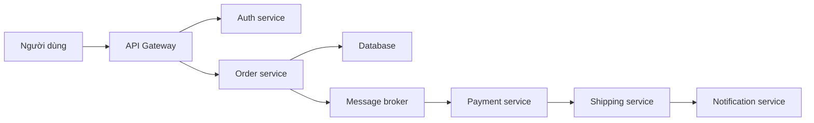
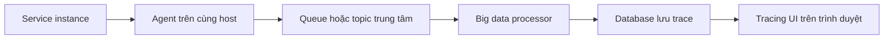

# 🕵️ Distributed Tracing: Lần theo dấu vết request xuyên hàng trăm microservices

> Nguồn: `023-Distributed-Tracing.txt` · [Udemy](https://ua.udemy.com/course/the-complete-microservices-event-driven-architecture/learn/lecture/38932354)

Chào mừng các bạn trở lại. Chúng ta đã đi qua **distributed logging** và **metrics**; giờ là lúc chạm tới trụ cột thứ ba của observability: **distributed tracing (truy vết phân tán)**. Các bạn có thể tự hỏi: đã có log và metrics rồi, sao còn cần thêm một phương pháp nữa? Bài này sẽ trả lời bằng **một câu chuyện production rất thật**, sau đó đi vào **cách hoạt động** và những **thách thức** khi triển khai tracing trong microservices và event-driven architecture.

---

### 🧩 Một câu chuyện production: email xác nhận biến mất

Hãy xét một giao dịch đặt hàng trong hệ thống **thương mại điện tử** dùng microservices và event-driven architecture:

1. Người dùng **đặt mua một sản phẩm**; request đi tới **API gateway**, nơi trò chuyện với **auth service** để đảm bảo người dùng đúng là chính họ và có quyền mua hàng.
2. Sau đó API gateway gửi **HTTP request** tới một instance của **order service** thông qua **load balancer**.
3. Order service **ghi đơn hàng vào database**, **phát một event** vào một **topic trong message broker**, và **trả lời người dùng**.
4. Tiếp theo là **một chuỗi dài event và request** đi qua nhiều microservice, dịch vụ bên thứ ba (third-party) cùng các topic của message broker.
5. Khi toàn bộ giao dịch hoàn tất, **notification service** gửi **push notification** và **email xác nhận** cho người dùng — email chứa biên lai thanh toán, mã đơn hàng, và URL để theo dõi đơn.

Rồi đột nhiên, một số người dùng phàn nàn **không bao giờ nhận được email xác nhận**; những người khác nói **có nhận, nhưng trễ hàng giờ, thậm chí một ngày**. Với ngần ấy microservice trao đổi request và message bất đồng bộ, **sự cố có thể nằm ở bất cứ đâu**. Vậy bắt đầu điều tra từ đâu — nhìn vào **dashboard metrics của từng microservice** trong toàn bộ luồng, hay đọc **hàng nghìn dòng log** của mọi microservice và message broker để tìm điểm bất thường?

Mọi thứ còn khó hơn vì mỗi microservice chạy thành **một nhóm instance trên nhiều máy khác nhau** sau load balancer hoặc message broker; bản thân **message broker phân tán**, **database cũng phân tán**, và trong luồng còn gọi cả **third-party API mà ta không có chút khả năng quan sát nào**. Chưa hết: hệ thống thật có thể có **hàng trăm microservice**, mỗi service đảm nhận một phần việc trong request flow hay transaction. Với kiến trúc phức tạp và **thay đổi liên tục** như vậy, **gần như không con người nào nhớ nổi** microservice nào tham gia xử lý một loại request và theo thứ tự nào.

---

### 🔍 Distributed tracing là gì và giúp được gì?

**Distributed tracing** là phương pháp **lần theo request khi chúng chảy qua toàn bộ hệ thống** — bắt đầu từ thiết bị của client, xuyên qua các backend service và database.

Trong quá trình truy vết, chúng ta **thu thập thông tin hiệu năng quan trọng về thời gian mà từng phần của hệ thống dành để xử lý** request. Nhờ đó, kỹ sư có thể:

* **Trực quan hóa toàn bộ luồng đi** và hiểu rõ **mọi thành phần tham gia** xử lý request, cùng **thời gian mỗi thành phần thực hiện công việc của mình**.

Điều này cực kỳ giá trị để **troubleshoot bug hoặc lỗi** dẫn tới hành vi sai, cũng như các **điểm nghẽn hiệu năng**. Cần nói rõ: tracing thường **không đủ để nói chính xác chuyện gì đang xảy ra**, nhưng đủ để **thu hẹp tìm kiếm về một component cụ thể** hoặc **một vấn đề giao tiếp giữa hai component**. Sau khi biết vấn đề nằm ở đâu, chúng ta dùng **hai trụ cột còn lại — logs và metrics — để debug sâu hơn**.

---

### 🧬 Cách hoạt động: Trace ID, Trace Context và Spans

| Thuật ngữ | Ý nghĩa |
|---|---|
| Trace ID | Mã duy nhất cho một request xuyên toàn hệ thống |
| Trace context | Object mang dữ liệu quan trọng của cả trace, được truyền tiếp qua HTTP header hoặc message header |
| Span | Đơn vị công việc logic trong trace, tổ chức theo quan hệ cha - con |
| Instrumentation | Việc cấy thư viện/SDK vào code để thu thập dữ liệu tracing |
| Sampling | Chỉ lấy mẫu một phần nhỏ request, ví dụ 1 trên 1000 |

1. Khi request đầu tiên được tạo ra, hệ thống **sinh một trace ID duy nhất** và đặt nó vào một object gọi là **trace context** — object chứa **dữ liệu then chốt về toàn bộ trace** khi request chảy qua các service; trace context được **propagate (lan truyền)** thường qua **HTTP header**, hoặc **message header** bên trong các event.
2. Nhưng chỉ truyền context qua các service là **chưa đủ** để instance thu thập dữ liệu tracing. Chúng ta cần **instrument (cấy đo)** chúng bằng một **thư viện/SDK tracing**. Các thư viện này có mặt ở **nhiều ngôn ngữ lập trình khác nhau**, nên kể cả hệ thống **polyglot (đa ngôn ngữ)** vẫn có thể có trace hoàn chỉnh.
3. Ngay khi instance nhận trace context, nó **thu thập dữ liệu cần thiết** và **truyền context tiếp cho service kế tiếp**. Cuối transaction, mỗi instance từng tham gia đều có phép đo và dữ liệu riêng — sau đó được **tổng hợp theo trace ID** để trực quan hóa toàn bộ giao dịch và thời gian từng phần.
4. Trace được chia thành các **đơn vị công việc logic gọi là spans**. Span có thể **thô (coarse grained)** — như việc một service xử lý request, hay một truy vấn database — hoặc được **developer tạo thủ công** bằng thư viện instrumentation, để từng đơn vị công việc trong một service được **trực quan hóa và đo riêng**. Nếu một phần logic **chậm bất thường**, ta điều tra nó như **điểm nghẽn tiềm năng**; nếu một span đáng lẽ phải có lại **thiếu**, có thể là **bug** cần debug sâu hơn.
5. Các phần việc liên quan được nối với nhau bằng **cấu trúc phân cấp cha - con (parent-child hierarchy)**: ví dụ thấy một service xử lý request chậm, ta **mở rộng span** đó để xem các span con và cháu — phát hiện **một câu truy vấn database chậm bất ngờ**, rồi điều tra tiếp bằng cách **tìm các log message cụ thể trong service đó**.

---

### 🚚 Dữ liệu trace được thu thập và tổng hợp thế nào?

Có nhiều giải pháp và nhà cung cấp với kiến trúc, cách triển khai khác nhau, nhưng **cách tiếp cận chung** gồm các bước:

1. **Dữ liệu trace được thu thập bên trong từng instance service**, rồi một **agent chạy như tiến trình riêng trên cùng host** với mỗi instance **kéo (pull)** dữ liệu đó.
2. Các agent **gửi dữ liệu tracing tới một queue hoặc topic trung tâm** trong message broker.
3. Một **big data processor** **phân tích, tổng hợp, đánh index và lưu trữ** toàn bộ dữ liệu từ nhiều service vào **database**; developer sau đó **truy vấn và trực quan hóa** dữ liệu qua **tracing UI trên trình duyệt**.

---

### ⚠️ Ba thách thức: instrumentation thủ công, chi phí và kích thước trace

1. **Phải instrument code thủ công.** Như đã nói, ta cần tự cấy instrumentation để thu thập dữ liệu. Phần lớn trường hợp **không tốn nhiều công**, nhưng đòi hỏi **phụ thuộc và nạp một thư viện nhất định**, **học cách dùng cho đúng**, và đôi khi **thêm instrumentation thủ công ở những chỗ cần thiết**. Nếu bỏ qua phần việc này, khi cần điều tra sự cố production, các span có thể **quá thô, thiếu độ chi tiết hoặc thiếu dữ liệu quan trọng**; ở trường hợp xấu nhất — dùng thư viện instrumentation sai cách — trace có thể **bị vỡ và trở nên vô dụng**.
2. **Chi phí.** Đây là thách thức nhiều tầng:
   * **Agent trên mỗi host microservice** tiêu tốn **CPU và memory** của chính nó; dữ liệu thu thập phải **truyền qua network**, cần thêm **băng thông**.
   * Phải vận hành một **big data pipeline với hạ tầng riêng** để xử lý tracing data từ các service — kèm **chi phí bảo trì**.
   * Nhưng thách thức lớn nhất là **chi phí lưu trữ trace trong database và giữ chúng ít nhất vài tuần**, để developer còn tìm được khi cần debug. Nếu mỗi ngày có **vài triệu request**, mỗi request đi qua **vài chục microservice**, khối lượng dữ liệu cần lưu là **cực lớn**. Để giữ chi phí lưu trữ và network trong tầm kiểm soát, hầu hết công ty dùng **sampling ở phía client** — đôi khi chỉ lấy **1 trace trong 1.000, thậm chí 10.000 request**. Điều này giảm chi phí, nhưng với tỷ lệ sampling cao như vậy, đôi khi **rất khó tìm được trace tái hiện đúng vấn đề** đang cần debug.
3. **Kích thước trace.** Một vấn đề nữa là **trace và lượng thông tin trong mỗi trace quá lớn**. Các triển khai microservices và event-driven thường gồm quá nhiều thành phần đến mức **một trace duy nhất to lớn tới mức con người khó nhìn nổi, chứ chưa nói tới sử dụng**. Theo **kinh nghiệm cá nhân của mình**, có những trace trong production lớn đến mức **tracing UI không thể load nổi**, khiến việc xem chúng là bất khả thi — và nhiều công ty cũng gặp vấn đề tương tự.

Bất chấp những thách thức đó, distributed tracing vẫn là **công cụ debug mạnh mẽ và thiết yếu** cho microservices và event-driven architecture. Nó thường được xem là thứ **khôi phục niềm tin nơi developer**: rằng nếu sự cố xảy ra trên production, họ **có công cụ để xử lý và tìm ra root cause**.

---

### 🎯 Tự kiểm tra nhanh

**Câu 1:** Vì sao chỉ dùng logs và metrics là chưa đủ để điều tra sự cố xuyên nhiều microservice?

<b>Xem đáp án</b>

**Đáp án:** Vì khó biết nên xem dashboard hay log của service nào trong hàng trăm service; tracing cho thấy toàn bộ luồng và thời gian từng thành phần nên thu hẹp được phạm vi.

Giải thích: Con người khó nhớ hết service nào tham gia vào một loại request và theo thứ tự nào.

Tham chiếu: Mục Một câu chuyện production: email xác nhận biến mất.

**Câu 2:** Trace ID và trace context khác nhau thế nào?

<b>Xem đáp án</b>

**Đáp án:** Trace ID là mã duy nhất của request; trace context là object chứa dữ liệu then chốt của cả trace và được lan truyền qua HTTP header hoặc message header.

Giải thích: Context giúp các service nối các phần việc của cùng một request lại với nhau.

Tham chiếu: Mục Cách hoạt động: Trace ID, Trace Context và Spans.

**Câu 3:** Span là gì và quan hệ cha - con có tác dụng gì?

<b>Xem đáp án</b>

**Đáp án:** Span là đơn vị công việc logic trong trace; quan hệ cha - con cho phép mở rộng một span chậm để tìm span con gây ra vấn đề.

Giải thích: Ví dụ mở span của service chậm để phát hiện một câu truy vấn database chậm bất thường.

Tham chiếu: Mục Cách hoạt động: Trace ID, Trace Context và Spans.

**Câu 4:** Thách thức lớn nhất về chi phí của distributed tracing là gì?

<b>Xem đáp án</b>

**Đáp án:** Lưu trữ trace trong database và giữ chúng ít nhất vài tuần; kèm theo là agent tiêu tốn CPU/memory, băng thông network và big data pipeline.

Giải thích: Vì thế nhiều công ty dùng sampling, đôi khi chỉ 1 trace trên 1.000 hoặc 10.000 request, khiến việc tìm trace tái hiện lỗi khó hơn.

Tham chiếu: Mục Ba thách thức: instrumentation thủ công, chi phí và kích thước trace.

**Câu 5:** Vì sao instrumentation sai cách có thể khiến tracing vô dụng?

<b>Xem đáp án</b>

**Đáp án:** Vì spans có thể quá thô, thiếu độ chi tiết hoặc thiếu dữ liệu quan trọng; nếu dùng thư viện sai, trace có thể bị vỡ hoàn toàn.

Giải thích: Instrumentation thủ công là phần việc bắt buộc, không thể bỏ qua nếu muốn trace hữu ích khi cần debug.

Tham chiếu: Mục Ba thách thức: instrumentation thủ công, chi phí và kích thước trace.

---

Vậy là chúng ta đã hoàn thành cả **ba trụ cột của observability**: logs, metrics và traces. Distributed tracing khép lại bức tranh với khả năng **lần theo request xuyên toàn hệ thống**, và dù đi kèm thách thức về công sức lẫn chi phí, nó chính là công cụ **khôi phục niềm tin** cho developer khi vận hành microservices — nơi sự cố chắc chắn sẽ xảy ra. *Đừng lo nếu các bạn chưa từng dùng tracing trong production thật — nắm chắc trace ID, trace context và span là các bạn đã có nền tảng vững để đi tiếp.* Ở những bài sau, chúng ta sẽ vận dụng bộ công cụ này vào các chủ đề vận hành và deployment nâng cao. Hẹn gặp lại các bạn! 🚀
