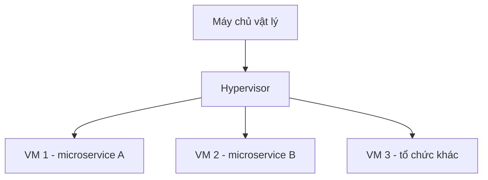

# ☁️ Cloud VM, Dedicated Host và Dedicated Instance: chọn nền tảng nào để chạy microservices?

> Nguồn: `024-Microservices-Deployment---Cloud-Virtual-Machine-Dedicated-H.txt` · [Udemy](https://ua.udemy.com/course/the-complete-microservices-event-driven-architecture/learn/lecture/38932426)

Chúng ta đã biết phát triển, thiết kế kiến trúc, kiểm thử và troubleshoot microservices trong production. Bước cuối cùng còn thiếu chính là **deploy và vận hành chúng**. Mở đầu section deployment, mình sẽ điểm qua các lựa chọn hạ tầng trên cloud — bắt đầu từ phương án phổ biến nhất: **cloud virtual machine**.

---

### 🖥️ Cloud VM: cách cloud chia sẻ một máy chủ vật lý

**Virtual machine (máy ảo)** là một môi trường cô lập, chạy bên trên một máy tính vật lý thật. Nó hành xử như một chiếc máy tính ảo với **hệ điều hành riêng** cùng các tài nguyên ảo: CPU, memory, network interface và storage.

* Các tài nguyên ảo này được **cấp phát, quản lý và ánh xạ** sang tài nguyên thật trên phần cứng bởi một lớp phần mềm gọi là **hypervisor**.
* Nhờ hypervisor, cloud provider chia mỗi máy chủ vật lý thành nhiều VM; lượng tài nguyên mỗi VM nhận được phụ thuộc vào **cách chúng ta cấu hình và mức giá phải trả**.

Mỗi VM có thể chạy **một instance khác của cùng microservice**, **một instance của microservice khác**, hoặc thậm chí **VM của một khách hàng khác** của cloud provider. Thuộc tính này gọi là **multi-tenancy (đa khách thuê)**.

Mặc định, khi thuê cloud VM, chúng ta **không kiểm soát** được ai khác đang chạy VM trên cùng host. Điều đó cho phép provider tận dụng phần cứng hiệu quả tối đa, từ đó đưa ra mức giá cạnh tranh — khiến cloud VM trở thành lựa chọn rất hấp dẫn để chạy microservices.

**Lợi ích chính** của cloud VM là giá cả **phải chăng và linh hoạt**. Mô hình tính tiền điển hình là **pay per use (trả theo mức dùng)**: chỉ trả cho VM đang thuê, trong đúng khoảng thời gian thuê. Đơn giá mỗi VM phụ thuộc vào CPU, memory và network bandwidth mà các bạn yêu cầu.

---

### ⚠️ Multi-tenancy: hai rủi ro đi kèm mức giá rẻ

**Thứ nhất, rủi ro bảo mật.** Về lý thuyết, hai VM trên cùng server **hoàn toàn cô lập** với nhau: nếu VM chạy database của tổ chức này bị xâm phạm, VM của tổ chức kia vẫn an toàn. Nhưng đây là thực tế — hypervisor do con người viết ra, và mọi cấu hình, bản vá bảo mật cũng do con người quản lý. Nên trên thực tế, hacker có thể chiếm được một VM **được bảo vệ kém** của tổ chức khác; và vì cloud vendor đã xếp VM của chúng ta lên **cùng host**, kẻ đó có thể xâm nhập hệ thống và đánh cắp dữ liệu của chúng ta.

* Cloud vendor và các công ty sở hữu hypervisor nỗ lực rất lớn để ngăn chuyện này, nên **xác suất xảy ra cực nhỏ**.
* Tuy nhiên, vì yêu cầu **compliance (tuân thủ)** của một số ngành, chúng ta có thể không được phép chấp nhận dù chỉ rủi ro nhỏ đó: **banking, healthcare, government hoặc national security**.

**Thứ hai, noisy neighbor (hàng xóm ồn ào).** Về lý thuyết, hypervisor phải cô lập và cấp phát chính xác từng tài nguyên phần cứng cho từng VM như đã cấu hình trước. Nhưng trên thực tế, **không phải tài nguyên nào cũng chia được chính xác**:

* Máy chủ 16 CPU core thì chia đều 8/8 rất dễ.
* Nhưng **network bandwidth của card mạng**, hay **quyền truy cập internal bus tới storage**, thì không thể phân chia chính xác.
* Nhiều tài nguyên vật lý khác cũng không thể tách rời — suy cho cùng, nó vẫn là **một máy chủ vật lý duy nhất**.
* Bản thân hypervisor cũng tiêu tốn một phần CPU và memory cho chính nó.

Chưa có nhiều dữ liệu cho thấy một workload rất nặng trên VM này ảnh hưởng đáng kể tới VM khác, nhưng **trên lý thuyết lẫn thực tế, ảnh hưởng đó vẫn tồn tại**. Vì vậy với các service **cực kỳ nhạy latency (độ trễ)** như **high-frequency trading, gaming hay video streaming**, multi-tenant không phải lựa chọn tốt nhất.

---

### 🔐 Single-tenant: dedicated instance và dedicated host

Đó là lý do chúng ta có phương án **single-tenant (một khách thuê)**: **dedicated hosts hoặc dedicated instances**.

* Chúng ta yêu cầu cloud provider chạy VM trên các server **dành riêng cho account của tổ chức mình**.
* Nghĩa là những tenant duy nhất trên host chỉ có thể là instance microservice — hoặc database — thuộc tổ chức chúng ta.
* Nếu ngành của các bạn không cho phép chia sẻ hạ tầng với công ty khác, đây là lựa chọn tuyệt vời, tất nhiên **đắt hơn một chút**.

Lý do provider thu thêm tiền rất dễ hiểu: họ **không thể phân bổ phần cứng hiệu quả** như kiểu multi-tenant.

Hơn nữa, một số provider còn cho phép **thuê hoặc reserve nguyên một host** cho riêng tổ chức:

* Chúng ta có quyền **truy cập trực tiếp tài nguyên phần cứng** của host.
* Điều này **loại bỏ hoàn toàn noisy neighbor** và **giảm overhead ảo hóa** của hypervisor.

Tất nhiên, nhược điểm chính là kiểu deployment này **đắt hơn rất, rất nhiều** so với cloud VM multi-tenant.

---

### 📊 Chốt lựa chọn: giá, bảo mật hay hiệu năng?

| Phương án | Chi phí | Bảo mật | Hiệu năng | Phù hợp khi |
|---|---|---|---|---|
| Cloud VM multi-tenant | Thấp nhất | Chia sẻ host — cần cân nhắc compliance | Có thể chịu ảnh hưởng noisy neighbor | Workload phổ thông, cần giá tốt |
| Dedicated instance | Cao hơn một chút | Chỉ VM của tổ chức mình trên cùng phần cứng | Tốt | Ngành bị ràng buộc về chia sẻ hạ tầng |
| Dedicated host | Đắt nhất | Cao | Loại bỏ noisy neighbor, giảm overhead ảo hóa | Service nhạy latency |

Tóm lại, các bạn hãy nhớ ba nấc thang này:

1. **Multi-tenant cloud VM** — giá tốt nhất, nhưng **không tối ưu** về bảo mật và hiệu năng.
2. **Dedicated instance** — thêm bảo mật, đắt hơn một chút, với cam kết chỉ VM của tổ chức mình chạy trên cùng phần cứng.
3. **Dedicated host** — hiệu năng tối ưu và loại bỏ noisy neighbor, cũng là lựa chọn **đắt nhất**.

*Đừng lo nếu các bạn chưa từng phải cân nhắc dedicated host — cứ ghi nhớ nguyên tắc: yêu cầu bảo mật, compliance và độ nhạy latency quyết định phương án, còn chi phí là biến số đi kèm.*

---

### 🎯 Tự kiểm tra nhanh

**Câu 1:** Hypervisor làm nhiệm vụ gì trong môi trường cloud VM?

<b>Xem đáp án</b>

**Đáp án:** Cấp phát, quản lý và ánh xạ tài nguyên ảo của VM sang tài nguyên thật trên phần cứng.

Giải thích: Nhờ hypervisor, một máy chủ vật lý có thể được chia thành nhiều VM với cấu hình tài nguyên khác nhau.

Tham chiếu: Mục Cloud VM: cách cloud chia sẻ một máy chủ vật lý.

**Câu 2:** Vì sao multi-tenancy giúp cloud VM có giá cạnh tranh?

<b>Xem đáp án</b>

**Đáp án:** Vì provider chia sẻ và tận dụng phần cứng rất hiệu quả giữa nhiều khách hàng, đồng thời tính tiền theo mức dùng.

Giải thích: Mô hình pay per use khiến chúng ta chỉ trả cho VM đang thuê theo đúng thời gian thuê.

Tham chiếu: Mục Cloud VM: cách cloud chia sẻ một máy chủ vật lý.

**Câu 3:** Vì sao noisy neighbor vẫn có thể xảy ra dù hypervisor cố gắng cô lập?

<b>Xem đáp án</b>

**Đáp án:** Vì không phải tài nguyên nào cũng chia chính xác được — network bandwidth, internal bus tới storage, các tài nguyên vật lý không tách rời, và bản thân hypervisor cũng tiêu tốn tài nguyên.

Giải thích: Máy chủ vẫn chỉ là một phần cứng vật lý duy nhất nên ảnh hưởng lẫn nhau khó loại bỏ hoàn toàn.

Tham chiếu: Mục Multi-tenancy: hai rủi ro đi kèm mức giá rẻ.

**Câu 4:** Dedicated instance giải quyết vấn đề gì và đánh đổi bằng gì?

<b>Xem đáp án</b>

**Đáp án:** Nó đảm bảo chỉ VM của tổ chức mình chạy trên cùng phần cứng, phù hợp ngành bị ràng buộc compliance; đổi lại giá cao hơn multi-tenant.

Giải thích: Provider tính thêm tiền vì không thể phân bổ phần cứng hiệu quả như kiểu multi-tenant.

Tham chiếu: Mục Single-tenant: dedicated instance và dedicated host.

**Câu 5:** Phương án nào loại bỏ noisy neighbor và cũng đắt nhất?

<b>Xem đáp án</b>

**Đáp án:** Dedicated host — thuê hoặc reserve nguyên một host, truy cập trực tiếp tài nguyên phần cứng.

Giải thích: Truy cập phần cứng trực tiếp giúp loại bỏ noisy neighbor và giảm overhead ảo hóa, nhưng chi phí cao nhất.

Tham chiếu: Mục Single-tenant: dedicated instance và dedicated host.

---

Chúng ta vừa có bức tranh rõ ràng về các lựa chọn hạ tầng truyền thống: **multi-tenant VM cho giá tốt, dedicated instance cho bảo mật, dedicated host cho hiệu năng tối ưu**. Ở bài tiếp theo, chúng ta sẽ khám phá một kiểu deployment mang tính event-driven hơn hẳn, nơi hạ tầng cũng "chạy theo sự kiện": **serverless với Function as a Service**. Hẹn gặp lại các bạn! 🚀
