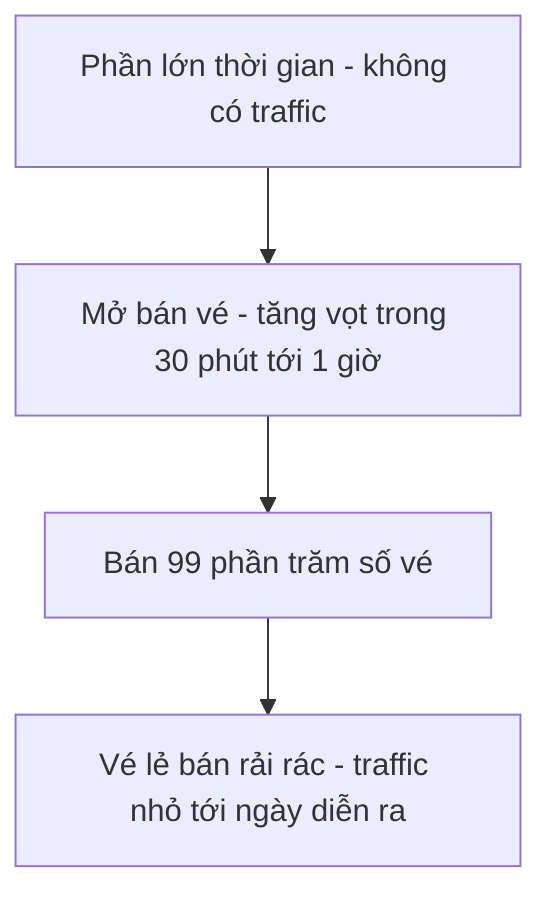
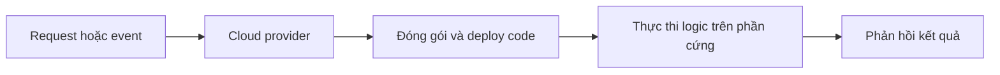

# ⚡ Function as a Service: deploy microservices theo từng sự kiện

> Nguồn: `025-Serverless-Deployment-for-Microservices-using-Function-as-a-.txt` · [Udemy](https://ua.udemy.com/course/the-complete-microservices-event-driven-architecture/learn/lecture/39276818)

Ở bài trước, chúng ta đã bàn về cloud VM và dedicated host — những lựa chọn hạ tầng khá truyền thống. Bài này mình giới thiệu một kiểu deployment mang tính **event-driven hơn hẳn**, không chỉ ở tầng phần mềm mà cả ở tầng hạ tầng: **Function as a Service (FaaS — hàm như một dịch vụ)**. Chúng ta sẽ bắt đầu từ hai bài toán thực tế, rồi mới tới lợi ích và trade-off.

---

### 🎬 Bài toán 1: microservice bán vé sự kiện trực tiếp

Giả sử chúng ta kinh doanh trong ngành giải trí, chủ yếu là **video streaming theo yêu cầu** — người dùng thuê hoặc mua phim, chương trình. Như một dịch vụ bổ sung, chúng ta hợp tác với các địa điểm biểu diễn để bán vé cho **sự kiện trực tiếp (live event)**.

* Có một microservice riêng chỉ xử lý **yêu cầu đặt vé** cho live event.
* Các sự kiện này chỉ diễn ra **không thường xuyên — tối đa mỗi tháng một lần**.
* Khi mở bán, phần lớn request dồn vào **30 phút đến 1 giờ**; trong khoảng đó chúng ta bán được **99% số vé**.
* Phần vé còn lại gồm vé rẻ ở vị trí không đẹp và vé rất tốt nhưng đắt, bán rải rác tới ngày diễn ra, nhưng **traffic không đáng kể**.

Điểm mấu chốt: microservice này **gần như không có traffic trong phần lớn thời gian**. Vậy mà nếu deploy trên cloud VM — hoặc thậm chí dedicated host — chúng ta vẫn **trả tiền thuê phần cứng trong suốt thời gian chết** đó.

Chưa hết, khi mở bán cho sự kiện mới, traffic **tăng vọt**, nên chúng ta còn phải **cấu hình và trả tiền cho load balancer**, rồi **duy trì autoscaling policy** cho microservice này — càng làm chi phí hạ tầng đội lên.

---

### 📊 Bài toán 2: báo cáo quảng cáo theo tháng hoặc quý

Bối cảnh thứ hai: chúng ta là một công ty quảng cáo số. Một trong các microservice cho phép khách hàng chạy **báo cáo tháng hoặc quý** về độ phủ (reach) và ROI của hoạt động quảng cáo.

* Báo cáo có thể được trigger trực tiếp bởi một admin của công ty quảng cáo, hoặc bởi một **cron job** chạy mỗi tháng/quý và tự động kích hoạt.
* Với **1000 khách hàng**, chúng ta cũng chỉ nhận khoảng **1000 request (event) mỗi tháng hoặc mỗi quý**.
* Chạy microservice 24/7 chỉ để phục vụ những event hiếm hoi như vậy là **không hiệu quả về chi phí**.

Và chi phí không chỉ nằm ở hạ tầng, mà còn ở **công sức phát triển**:

* Ngoài business logic, team sở hữu microservice còn phải maintain khá nhiều **boilerplate code** để xử lý HTTP request hoặc event từ nguồn trigger.
* Chúng ta còn phải maintain **script build, package và deploy** binary của microservice cùng toàn bộ dependencies lên cloud server.

Tất cả công sức đó, suy cho cùng, chỉ để phục vụ một lượng traffic rất nhỏ — những event hiếm khi xảy ra.

---

### ⚡ FaaS: giao hai thứ, nhận về sự tự động

**Function as a Service** là cloud offering cho phép chúng ta kiến trúc hệ thống theo **mô hình fully event-driven (hoàn toàn hướng sự kiện)**, không chỉ từ góc phần mềm mà cả từ **góc hạ tầng** — điều mà các kiểu deployment trước đây không có.

* Chúng ta chỉ cần cung cấp cho cloud vendor **hai thứ**: loại request/event muốn xử lý, và logic muốn thực thi khi event đó được trigger.
* Khi event xảy ra, provider sẽ **lấy code, đóng gói, deploy lên phần cứng vật lý và thực thi** để phản hồi request/event đó.
* Nếu traffic có tính mùa vụ — request dồn vào thời gian rất ngắn — provider cũng lo luôn **horizontal scalability (mở rộng ngang)**. Chúng ta **không cần duy trì autoscaling policy**, cũng **không cần cấu hình load balancer**.

**Mô hình tính tiền** xoay quanh sự kiện: dựa trên **số request** microservice nhận được, cộng với **thời gian và memory** cần thiết để xử lý mỗi request. Điểm đẹp nhất: **chừng nào request/event chưa tới, chúng ta chưa phải trả gì cả**.

Với những microservice phục vụ event hiếm, lợi ích rất rõ ràng:

1. Tiết kiệm đáng kể chi phí hạ tầng cho **seasonal workload** — hiếm khi chạy nhưng tăng vọt khi chạy.
2. Cloud provider gánh toàn bộ **operational overhead** của việc scale service.
3. Tiết kiệm **chi phí phát triển**: provider lo build, package và deploy microservice thay chúng ta.

---

### ⚖️ Trade-off: FaaS không miễn phí, chỉ là trả tiền theo cách khác

Như mọi thứ trong software engineering — đặc biệt là software architecture — luôn có trade-off:

* **Traffic thay đổi → chi phí có thể tăng mạnh.** Nếu ban đầu microservice phục vụ traffic thấp hoặc theo mùa, rồi request ngày càng nhiều, code chạy ngày càng thường xuyên; cộng thêm business logic phức tạp dần khiến mỗi request cần nhiều thời gian và memory hơn — dùng FaaS sẽ **đắt hơn cả cloud VM lẫn dedicated host**.
* **Hiệu năng kém dự đoán hơn.** FaaS không ổn định về performance như việc đặt business logic trong microservice mà chúng ta toàn quyền kiểm soát, nên **không phù hợp với workload nhạy latency**.
* **Bảo mật kém nhất.** Code của chúng ta chạy trong **môi trường multi-tenant**, và chúng ta còn **để lộ toàn bộ source code** cho cloud provider.

| Tiêu chí | Cloud VM / Dedicated host | Function as a Service |
|---|---|---|
| Trả tiền khi nhàn rỗi | Có, suốt thời gian thuê | Không — chỉ trả khi có request |
| Scaling và load balancer | Team tự cấu hình, tự duy trì | Provider xử lý tự động |
| Build, package, deploy | Team tự làm | Provider làm thay |
| Chi phí khi traffic tăng mạnh | Ổn định, dễ dự đoán hơn | Có thể tăng rất mạnh |
| Độ dự đoán hiệu năng | Cao hơn | Thấp hơn |
| Bảo mật | Tốt hơn | Kém nhất — multi-tenant, lộ source code |

Chốt lại: nếu dùng FaaS **đúng workload**, đây có thể là cách deploy **tiết kiệm chi phí nhất**. Nhưng nếu dùng sai workload, nó cũng có thể là lựa chọn **đắt nhất** — và về bảo mật lẫn hiệu năng, đây là phương án **kém tối ưu nhất** trong tất cả các kiểu deployment mà chúng ta đã học.

---

### 🎯 Tự kiểm tra nhanh

**Câu 1:** Vì sao chạy microservice bán vé trên cloud VM hoặc dedicated host lại tốn kém?

<b>Xem đáp án</b>

**Đáp án:** Vì microservice gần như không có traffic trong phần lớn thời gian nhưng vẫn phải trả tiền thuê phần cứng, cộng thêm chi phí load balancer và autoscaling cho giai đoạn cao điểm.

Giải thích: Traffic chỉ tăng vọt trong 30 phút đến 1 giờ khi mở bán, phần còn lại của tháng là thời gian chết.

Tham chiếu: Mục Bài toán 1: microservice bán vé sự kiện trực tiếp.

**Câu 2:** Với FaaS, chúng ta cần cung cấp cho cloud provider những gì?

<b>Xem đáp án</b>

**Đáp án:** Hai thứ: loại request/event muốn xử lý, và logic muốn thực thi khi event đó xảy ra.

Giải thích: Provider tự lo phần đóng gói, deploy và thực thi code khi event được trigger.

Tham chiếu: Mục FaaS: giao hai thứ, nhận về sự tự động.

**Câu 3:** FaaS tính tiền dựa trên những yếu tố nào?

<b>Xem đáp án</b>

**Đáp án:** Số request nhận được, cộng thời gian và memory cần để xử lý mỗi request.

Giải thích: Không có request/event nào thì không phải trả gì — đây là điểm hấp dẫn nhất của FaaS.

Tham chiếu: Mục FaaS: giao hai thứ, nhận về sự tự động.

**Câu 4:** Khi nào FaaS trở nên đắt hơn cả cloud VM và dedicated host?

<b>Xem đáp án</b>

**Đáp án:** Khi traffic tăng dần theo thời gian và business logic trở nên phức tạp hơn, khiến code chạy thường xuyên hơn với nhiều thời gian, memory hơn cho mỗi request.

Giải thích: Chi phí theo request và tài nguyên xử lý sẽ vượt qua chi phí thuê hạ tầng cố định.

Tham chiếu: Mục Trade-off: FaaS không miễn phí, chỉ là trả tiền theo cách khác.

**Câu 5:** Vì sao FaaS là kiểu deployment kém an toàn nhất?

<b>Xem đáp án</b>

**Đáp án:** Vì code chạy trong môi trường multi-tenant và chúng ta để lộ toàn bộ source code cho cloud provider.

Giải thích: Kèm theo đó, hiệu năng của FaaS cũng kém dự đoán hơn nên không phù hợp workload nhạy latency.

Tham chiếu: Mục Trade-off: FaaS không miễn phí, chỉ là trả tiền theo cách khác.

---

Vậy là chúng ta đã biết khi nào FaaS là "món hời" và khi nào nó phản tác dụng: **event hiếm, traffic mùa vụ — dùng FaaS; traffic đều đặn, logic nặng, cần latency ổn định — cân nhắc kỹ**. Ở bài tiếp theo, chúng ta sẽ đến với kiểu đóng gói và phân phối microservices phổ biến và "trending" nhất hiện nay: **containers**. Hẹn gặp lại các bạn! 🚀
