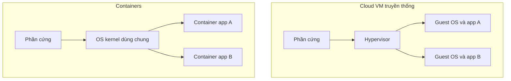

# 📦 Containers: đóng gói microservices để chạy từ dev tới production

> Nguồn: `026-Containers-for-Microservices-in-Dev-Testing-and-Production.txt` · [Udemy](https://ua.udemy.com/course/the-complete-microservices-event-driven-architecture/learn/lecture/38932396)

Trong bài này, chúng ta sẽ nói về **containers** — cách đóng gói và phân phối microservices ra production phổ biến và "trending" nhất hiện nay. Mình sẽ đi theo đúng mạch: vấn đề cần giải quyết là gì, containers giải quyết tốt hơn máy ảo ở điểm nào, và cuối cùng là thách thức còn lại khi chạy containers trong production.

---

### 🧩 Từ lỗi "parity" tới cái giá của máy ảo

Một vấn đề rất phổ biến ở các công ty là **thiếu parity (sự tương đồng) giữa môi trường development và production**.

Hãy tưởng tượng các bạn là developer của một team sở hữu microservice:

* Bạn dựng môi trường dev ở local với **database standalone chạy local** và cài toàn bộ dependencies **theo hệ điều hành của riêng bạn**.
* Trong khi đó, database phân tán ở production lại **cấu hình khác hẳn** database local; hệ điều hành ở production cũng **không giống** hệ điều hành trên laptop dev.
* Vị trí các file cấu hình và version của dependencies thì **hoàn toàn khác nhau**.

Kết quả: feature phát triển xong, test local **chạy ngon lành**, nhưng deploy lên production thì **vỡ** hoặc hành xử không như kỳ vọng.

Một giải pháp là phát triển và test microservice ngay trong một **máy ảo giống production** trên máy dev. Cách này giải quyết được bài toán parity, nhưng lại mang đến vấn đề mới — **overhead khổng lồ**:

* Host OS phải chạy thêm một lớp phần mềm gọi là **hypervisor type 2**.
* Hypervisor chạy như một chương trình bình thường trên host OS, nhưng bên trong nó vận hành **cả một hệ điều hành với kernel riêng** — kernel này quản lý application process của guest OS, file system, security, networking, memory... và dùng **device driver** để tương tác phần cứng ảo do hypervisor mô phỏng.

Chỉ để chạy **một instance microservice**, chúng ta đã phải gánh quá nhiều thứ không cần thiết. Và nếu muốn chạy, test sự tích hợp (integration) của vài microservices, chúng ta phải chạy **nhiều máy ảo, mỗi máy một bản hệ điều hành và một kernel riêng** — mọi thứ trở nên cực kỳ chậm và kém hiệu quả, khiến việc phát triển, kiểm thử vô cùng khó khăn.

---

### 📦 Containers: cô lập đúng thứ cần cô lập

Containers giải quyết bài toán trên bằng một nguyên tắc rất gọn: **chỉ cô lập những gì chúng ta thực sự muốn cô lập, và chia sẻ mọi thứ còn lại**.

Khi đóng gói microservice vào container, mỗi **container image** gồm **binary của microservice**, **command để chạy** nó và **toàn bộ dependencies** — trong sự cách ly hoàn toàn với mọi microservice khác. Khi chạy một hoặc nhiều instance của image đó:

* Mỗi container có **file system, network interface và runtime riêng, được cô lập**.
* Nhưng **OS kernel, driver và mọi thứ không cần cô lập thì dùng chung** giữa tất cả containers.

Nhờ vậy, overhead khi chạy vài chục container trên máy gần như không đáng kể — containers trở nên **hoàn hảo cho việc phát triển và test microservices**. Và lợi ích còn vươn xa hơn môi trường dev/test: chúng cũng chạy được trong **CI pipeline (continuous integration)**, nơi có thể dùng hệ điều hành và phần cứng **hoàn toàn khác** máy dev — vì **container image tách rời hoàn toàn khỏi OS và phần cứng**, tạo một lần rồi chạy trên bất kỳ phần cứng, hệ điều hành nào hỗ trợ container và **container runtime (phần mềm chạy container)**.

---

### 🚀 Từ dev tới production: build một lần, chạy mọi nơi

Với cách tiếp cận cũ bằng cloud VM, mỗi instance microservice được deploy trên **một VM riêng**, do cloud vendor schedule lên một trong các server của họ. Cách này có nhiều ưu điểm như chúng ta đã bàn, nhưng cũng có những nhược điểm lớn — rất giống vấn đề trong môi trường dev:

* Nếu hai instance microservice chạy trên cùng một server, **mỗi VM vẫn chạy một bản hệ điều hành riêng** — sự trùng lặp khiến chúng ta **mất một phần memory, CPU và storage quý giá**; còn việc **deploy và start mỗi VM có thể mất hàng phút** trước khi sẵn sàng nhận traffic.
* Đặc biệt là vấn đề **vendor lock-in và thiếu portability**: format của VM image có thể gắn với từng cloud vendor, và cả configuration mô tả loại VM muốn thuê cũng mang tính vendor-specific.

Hệ quả: nếu nhận được lời đề nghị hấp dẫn từ một cloud vendor khác và muốn migrate toàn bộ, chúng ta sẽ phải **tạo lại rất nhiều image**. Còn với môi trường **multi-cloud** (một phần service chạy trên cloud provider này, phần khác chạy trên provider khác) hoặc **hybrid cloud** (một phần chạy trên public cloud, phần khác trong private cloud để tăng bảo mật hoặc hiệu năng), cloud VM sẽ là **cơn ác mộng khi quản lý xuyên nhiều môi trường**.

Containers giải quyết tất cả: tạo container image **một lần**, rồi deploy lên **cloud VM phổ thông hoặc thậm chí dedicated host** — yêu cầu duy nhất là cài **container runtime** (phần mềm chạy containers). Tổng kết lợi ích của containers trong production:

1. **Portability tốt hơn giữa các môi trường** — build image một lần, dùng cho dev, QA staging và production, trên bất kỳ phần cứng hay hệ điều hành của cloud provider nào.
2. **Khởi động nhanh hơn** — containers thường chỉ mất vài mili-giây để deploy và chạy.
3. **Tiết kiệm chi phí hạ tầng** — thuê VM lớn hơn hoặc dedicated host rồi đặt containers của nhiều microservice lên đó, tận dụng chung OS kernel, thay vì thuê nhiều VM nhỏ và mất CPU, memory cho hệ điều hành; nhiều trường hợp chạy được **nhiều instance microservice hơn trên cùng lượng phần cứng**.

| Tiêu chí | Cloud VM | Container |
|---|---|---|
| Hệ điều hành cho mỗi instance | Mỗi VM một bản OS và kernel riêng | Dùng chung OS kernel của host |
| Thời gian khởi động | Có thể mất hàng phút | Thường chỉ vài mili-giây |
| Portability | Image và cấu hình mang tính vendor-specific | Tách rời OS và phần cứng, chạy mọi nơi có container runtime |
| Hiệu quả phần cứng | Kém hơn do trùng lặp OS | Tốt hơn — chạy nhiều instance hơn trên cùng phần cứng |

---

### ⚙️ Thách thức mới: gắn hai tầng abstraction

Trong môi trường dev và CI, containers đã phát huy tác dụng. Nhưng trước khi tận dụng triệt để containers trong production, chúng ta có **một bài toán mới cần giải**: hai tầng abstraction cần được "dán" lại với nhau.

**Tầng thứ nhất — cloud infrastructure abstraction:** các cloud VM hoặc host cần thuê và **autoscale theo traffic/load** của hệ thống, cùng các cloud managed service như **database, message broker, distributed logging**...

**Tầng thứ hai — container abstraction:**

* Hàng chục container image đại diện cho các microservice khác nhau; mỗi image cần được deploy thành **một nhóm container instance** trên hạ tầng.
* Cần cơ chế **discovery và kết nối** các container microservice với nhau và với các managed service qua network.
* Cần quản lý **scalability và availability** của từng nhóm container: thêm instance khi traffic tăng, bớt khi traffic giảm.
* Cần **tự động thay thế** container bị crash và **cập nhật toàn bộ container** của cùng microservice khi version mới release.

Làm thủ công tất cả những việc này cho hàng trăm, thậm chí hàng nghìn container instance — có thể nằm ở nhiều cloud region, thậm chí nhiều cloud provider — là **điều bất khả thi**. Và đó chính là lý do bài tiếp theo nói về **container orchestration**. *Đừng lo nếu các bạn thấy bài này nhiều khái niệm mới — tất cả sẽ khớp lại với nhau ở bài sau.*

---

### 🎯 Tự kiểm tra nhanh

**Câu 1:** "Parity giữa dev và production" nghĩa là gì và vì sao thiếu parity lại gây lỗi?

<b>Xem đáp án</b>

**Đáp án:** Là sự tương đồng giữa môi trường phát triển và môi trường production. Thiếu parity khiến code chạy tốt ở local nhưng vỡ hoặc hành xử khác khi deploy lên production.

Giải thích: Database, OS, vị trí config và version dependencies ở production thường khác hoàn toàn so với máy dev.

Tham chiếu: Mục Từ lỗi "parity" tới cái giá của máy ảo.

**Câu 2:** Vì sao chạy nhiều máy ảo để test microservices lại quá nặng?

<b>Xem đáp án</b>

**Đáp án:** Vì mỗi VM phải chạy cả một bản hệ điều hành với kernel riêng bên trong hypervisor, tạo overhead quá lớn nên mọi thứ cực chậm và kém hiệu quả.

Giải thích: Kernel của guest OS còn phải quản lý process, file system, security, networking, memory và dùng device driver cho phần cứng ảo.

Tham chiếu: Mục Từ lỗi "parity" tới cái giá của máy ảo.

**Câu 3:** Container image chứa những gì và chia sẻ những gì?

<b>Xem đáp án</b>

**Đáp án:** Chứa binary của microservice, command để chạy và toàn bộ dependencies; các container instance có file system, network interface, runtime riêng nhưng chia sẻ OS kernel, driver và mọi thứ không cần cô lập.

Giải thích: Cô lập đúng thứ cần cô lập giúp overhead chạy vài chục container gần như không đáng kể.

Tham chiếu: Mục Containers: cô lập đúng thứ cần cô lập.

**Câu 4:** Cloud VM trong production gây ra vấn đề portability gì?

<b>Xem đáp án</b>

**Đáp án:** Format của VM image và cả configuration mô tả loại VM đều có thể gắn với từng cloud vendor, nên migrate hay vận hành multi-cloud, hybrid cloud rất khó khăn.

Giải thích: Containers giải quyết bằng cách build image một lần và chỉ cần container runtime ở mọi môi trường.

Tham chiếu: Mục Từ dev tới production: build một lần, chạy mọi nơi.

**Câu 5:** Hai tầng abstraction nào cần được gắn với nhau trong production?

<b>Xem đáp án</b>

**Đáp án:** Tầng cloud infrastructure (VM/host cần thuê, autoscale, managed services) và tầng container (các container image, discovery, scalability, cập nhật version).

Giải thích: Làm thủ công cho hàng trăm, hàng nghìn container ở nhiều region là bất khả thi — đây là bài toán mà container orchestration sẽ giải quyết.

Tham chiếu: Mục Thách thức mới: gắn hai tầng abstraction.

---

Vậy là containers đã cho chúng ta **parity, portability, khởi động nhanh và chi phí hạ tầng thấp hơn** — nhưng đi kèm là bài toán quản lý hàng nghìn container mà không ai có thể xử lý thủ công. Ở bài tiếp theo, chúng ta sẽ gặp "bộ não" giải quyết bài toán đó: **container orchestration và Kubernetes**. Hẹn gặp lại các bạn! 🚀
