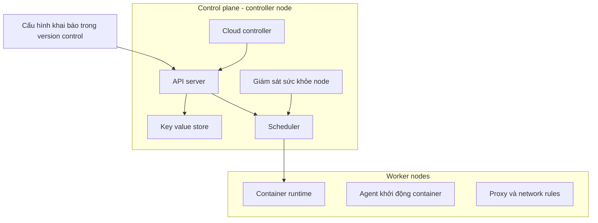
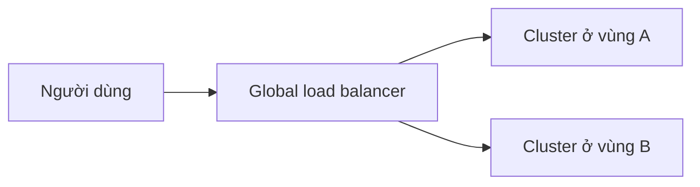

# ☸️ Container Orchestration và Kubernetes: bộ não vận hành microservices

> Nguồn: `027-Container-Orchestration-and-Kubernetes-for-Microservices-Arc.txt` · [Udemy](https://ua.udemy.com/course/the-complete-microservices-event-driven-architecture/learn/lecture/38932398)

Ở bài trước, chúng ta đã thấy containers mang lại parity, portability và hiệu quả sử dụng phần cứng tốt hơn — nhưng cũng để lại một thách thức lớn: **làm sao deploy, cấu hình và quản lý hàng nghìn container của hàng trăm microservice**, thậm chí xuyên nhiều cloud provider? Bài này, mình cùng các bạn sẽ giải quyết trọn vẹn bài toán đó bằng **container orchestration**, với Kubernetes làm kiến trúc đại diện.

---

### 🎼 Container orchestrator: "hệ điều hành" cho microservices

**Container orchestrator** là công cụ quản lý **toàn bộ vòng đời** của mọi container microservice trong hệ thống. Hãy hình dung nó như **một hệ điều hành — nhưng dành cho kiến trúc microservices được deploy dưới dạng containers**.

Các trách nhiệm của container orchestrator bao gồm:
1. **Tự động deploy** microservice mới, hoặc version mới của microservice, dưới dạng containers.
2. **Quản lý cấp phát tài nguyên** giữa các container hiện có, đảm bảo mỗi container nhận đúng lượng CPU, memory và storage để hoạt động.
3. **Giám sát sức khỏe (health)** của containers.
4. **Self-healing (tự chữa lành)** — tự động deploy container mới để duy trì số instance khỏe mạnh cho mỗi microservice.
5. **Automatic bin packing** — schedule containers theo cách hiệu quả, tối ưu hóa việc sử dụng phần cứng hiện có.
6. **Load balancing** giữa các container của cùng một microservice.
7. **Scale out/in** — thêm hoặc bớt container dựa trên traffic và mức sử dụng tài nguyên.
8. **Quản lý discovery và kết nối mạng** giữa các service, container và thế giới bên ngoài.

Nghe có vẻ nhiều, nhưng đây chính xác là những gì chúng ta phải làm thủ công — và bất khả thi — nếu không có orchestrator.

---

### 🏗️ Bên trong một cluster Kubernetes

Để minh họa cách orchestrator vận hành, mình dùng kiến trúc của **Kubernetes** — một trong những container orchestration tool phổ biến nhất ngành, nhưng không phải duy nhất. Lưu ý: đây **không phải khóa DevOps về Kubernetes**, nên mình sẽ lược bỏ những chi tiết phức tạp không cần thiết để giữ bức tranh tổng thể.

Một cluster orchestration điển hình có **control plane** chạy trên ít nhất một máy — gọi là **controller node**. Các VM hoặc server còn lại, nơi chạy container của microservices, gọi là **worker nodes**. **Controller node** chạy các process điều phối và quản lý cluster, bao gồm:

* **API process** — nhận lệnh từ chúng ta: thêm microservice mới, cập nhật version hay configuration của microservice hiện có...
* **Key-value store database** — lưu toàn bộ thông tin cấu hình và trạng thái hiện tại của cluster.
* **Scheduler** — giám sát tài nguyên của worker node và quyết định nơi đặt container mới.
* **Process giám sát sức khỏe node** — theo dõi worker node và những thay đổi trạng thái bên trong; nếu một node trở nên không khả dụng, nó phát hiện và đảm bảo scheduler **reschedule** các container sang worker node khác.
* **Cloud controller** — quản lý mọi logic đặc thù của cloud provider: xóa worker node không phản hồi, thêm cloud-managed load balancer và routing vào containers...

Mỗi **worker node** cũng chạy một bộ agent riêng để quản lý các container **chỉ trên node đó**:

* **Container runtime** — engine phần mềm chạy container trên từng host.
* **Agent** — giám sát và thực sự **khởi động container microservice** khi nhận lệnh phù hợp từ control plane.
* **Proxy** — duy trì một tập **network rules** để định tuyến request giữa container của các microservice khác nhau, đồng thời **cân bằng tải** giữa các container của cùng một microservice.

Nhìn lại, mỗi thành phần đảm nhận một mảnh ghép: control plane ra quyết định và giữ trạng thái, còn worker node thực thi và kết nối các container.

---

### 📦 Pod, sidecar và cấu hình khai báo

Đôi khi chúng ta cần chạy mỗi instance microservice kèm một **sidecar process** — có thể là agent logging, monitoring, hoặc một in-memory cache. Tuy nhiên, đặt nhiều process vào **một container** thường không phải thực hành tốt. Vì vậy, Kubernetes cho phép gộp nhiều container vào một đơn vị logic gọi là **pod**. **Pod là đơn vị runtime nhỏ nhất mà Kubernetes quản lý** — kể cả khi pod đó chỉ chứa duy nhất một container microservice.

Một điểm rất hay của Kubernetes là **cấu hình khai báo (declarative), human-readable**: mô tả toàn bộ kiến trúc microservices, configuration, container image sử dụng, và lượng CPU, memory, storage mỗi phần cần.

* Configuration còn chứa cả thông tin về các **service bên ngoài cluster** mà microservices kết nối tới: **cloud functions, database, object store, message broker**...
* Configuration này được lưu, duy trì và cập nhật trong **version control system — hệt như code**; khi có thay đổi, nó được gửi tới **API server** của control plane, và API server kích hoạt các cập nhật liên quan bên trong cluster.

Nói cách khác, hạ tầng của chúng ta được mô tả như một file cấu hình phiên bản hóa — điều này giúp việc vận hành minh bạch, có lịch sử và dễ kiểm soát hơn rất nhiều.

---

### 🌍 Quy mô lớn: nhiều controller, nhiều cluster và cái giá phức tạp

Trong một kiến trúc microservices điển hình, chúng ta có **hàng trăm worker node chạy hàng nghìn container** thuộc các microservice khác nhau. Để đạt availability cao hơn và theo kịp mọi thứ diễn ra trong cluster, control plane thường có **nhiều bản replica của controller node**.

Thậm chí, để availability cao hơn nữa, chúng ta có thể chạy **nhiều cluster** với cấu hình giống hoặc khác nhau, trên các cloud region — hoặc thậm chí cloud provider — khác nhau, rồi **route traffic bằng một global load balancer**. Việc routing có thể dựa trên các tiêu chí như **khoảng cách địa lý tới người dùng, mức tải hay tình trạng sức khỏe của từng cluster**.

Nhìn vào kiến trúc này, có thể thấy container orchestration **khá phức tạp để thiết lập và vận hành**: nó đòi hỏi chuyên môn của **DevOps hoặc site reliability engineer**, cùng tài nguyên riêng chỉ dành cho mục đích orchestration — ví dụ các controller instance. Tuy nhiên, như chúng ta đã học xuyên suốt khóa học, khoản đầu tư đó **hoàn toàn xứng đáng**, vì chi phí của nó được **amortize (phân bổ) trên toàn bộ các team và microservices** mà nó phục vụ. Chỉ cần quyết định chuyển sang microservices của chúng ta là đúng, lợi ích từ containers được quản lý bởi orchestrator sẽ **lớn hơn chi phí và độ phức tạp** của nó.

---

### 🎯 Tự kiểm tra nhanh

**Câu 1:** Container orchestrator được ví như gì và quản lý phạm vi nào?

<b>Xem đáp án</b>

**Đáp án:** Nó giống như một hệ điều hành dành cho microservices deploy dưới dạng container, quản lý toàn bộ vòng đời của mọi container microservice trong hệ thống.

Giải thích: Từ deploy, cấp phát tài nguyên, giám sát sức khỏe đến scaling và networking đều nằm dưới sự quản lý của orchestrator.

Tham chiếu: Mục Container orchestrator: "hệ điều hành" cho microservices.

**Câu 2:** Self-healing và automatic bin packing của orchestrator khác nhau thế nào?

<b>Xem đáp án</b>

**Đáp án:** Self-healing tự động deploy container mới để duy trì số instance khỏe mạnh; bin packing là schedule container hiệu quả để tối ưu sử dụng phần cứng hiện có.

Giải thích: Một bên đảm bảo sức khỏe và số lượng instance, một bên tối ưu vị trí đặt container trên hạ tầng.

Tham chiếu: Mục Container orchestrator: "hệ điều hành" cho microservices.

**Câu 3:** Control plane và worker node khác nhau ở vai trò gì?

<b>Xem đáp án</b>

**Đáp án:** Control plane chạy trên controller node, điều phối toàn cluster như API server, key-value store, scheduler, giám sát node và cloud controller; worker node là nơi chạy container microservice cùng các agent như container runtime, agent khởi động và proxy.

Giải thích: Controller node quản lý, worker node thực thi.

Tham chiếu: Mục Bên trong một cluster Kubernetes.

**Câu 4:** Vì sao Kubernetes dùng pod thay vì chỉ dùng container?

<b>Xem đáp án</b>

**Đáp án:** Vì đặt nhiều process trong một container thường không phải thực hành tốt, nên pod gộp nhiều container (ví dụ container chính và sidecar) thành một đơn vị runtime nhỏ nhất để quản lý.

Giải thích: Sidecar có thể là agent logging, monitoring hoặc in-memory cache.

Tham chiếu: Mục Pod, sidecar và cấu hình khai báo.

**Câu 5:** Người ta tăng availability của một hệ thống container orchestration bằng cách nào?

<b>Xem đáp án</b>

**Đáp án:** Chạy nhiều replica controller node trong control plane, và ở mức cao hơn là nhiều cluster trên các region hoặc provider khác nhau, route traffic bằng global load balancer.

Giải thích: Routing có thể dựa trên khoảng cách địa lý tới người dùng, mức tải hoặc tình trạng sức khỏe của từng cluster.

Tham chiếu: Mục Quy mô lớn: nhiều controller, nhiều cluster và cái giá phức tạp.

---

Vậy là hành trình của chúng ta đã đi trọn vẹn: từ **microservices, event-driven architecture**, qua phát triển, kiểm thử và troubleshooting, cho tới **deploy và vận hành trong production** với cloud VM, FaaS, containers và container orchestration. Các bạn giờ đã có đủ kiến thức và sự tự tin để migrate, phát triển, kiểm thử và vận hành thành công microservices trong production — nhưng hành trình học tập thì không dừng lại ở đây. Nếu chưa để lại đánh giá cho khóa học, các bạn hãy dành một chút thời gian nhé; và đừng quên ghé bài bonus để xem danh sách các khóa học cũng như nội dung khác của mình. Chúc các bạn may mắn và hẹn gặp lại trong một hành trình học tập tiếp theo! 🚀
